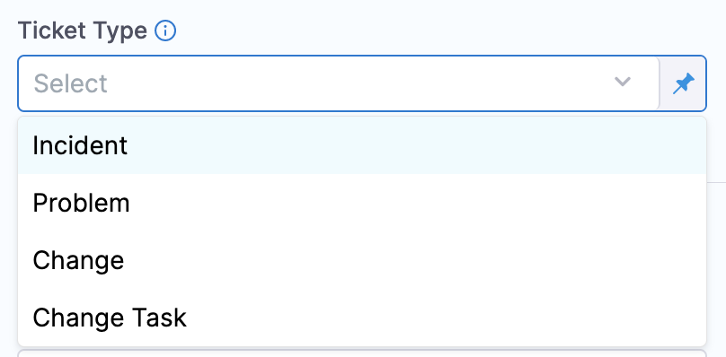

This topic describes how to create ServiceNow tickets in CD stages.

Harness provides the ability to create and manage [ServiceNow change requests](https://docs.servicenow.com/bundle/rome-it-service-management/page/product/change-management/concept/c_ITILChangeManagement.html), [incident tickets](https://docs.servicenow.com/bundle/rome-it-service-management/page/product/incident-management/concept/c_IncidentManagement.html), [change tasks](https://docs.servicenow.com/bundle/rome-it-service-management/page/product/change-management/concept/change-types.html), and [problem type](https://docs.servicenow.com/bundle/rome-it-service-management/page/product/problem-management/concept/c_ProblemManagement.html) from your pipeline step using the **ServiceNow Create** step.

You can add the Create ServiceNow step to a Harness CD stage or an Approval stage and do the following:

* Automatically create change requests in ServiceNow to track updates to your build, test, and production environments by adding a **ServiceNow Create** step in your pipeline.
* Automatically create and assign tickets in ServiceNow to triage and resolve incidents quickly in case of pipeline failures.

## Important notes

* You must add a Harness [ServiceNow connector](/docs/platform/Connectors/Ticketing-Systems/connect-to-service-now) before or during the Create ServiceNow step setup.
* You must install the Harness application before using templates to create ServiceNow tickets.​
* Make sure you have the following roles:
	+ `x_harne_harness_ap.integration_user_role​` to access supported APIs, view Harness support details and access Templates.
	+ `itil` for end-to-end integration with Harness platform.​
* While it's not a strict limitation, some users can forget that when you use a ServiceNow Create step, it creates a new, independent ServiceNow ticket every time it is run (as opposed to updating the same issue).  
* It is important to remember that you should only add ServiceNow Create to a stage if you want to create a new ServiceNow ticket on every run of the stage.
* The ServiceNow API only allows date time and time values in the UTC timezone only. Consequently, input for any datetime/time fields in Harness ServiceNow steps must be provided in UTC format irrespective of time zone settings in your ServiceNow account.  
  The timezone settings govern the display value of the settings not their actual value. The display values in the Harness UI depend on ServiceNow timezone settings.

### ServiceNow user roles

You can install the Harness app in your ServiceNow instance from the ServiceNow [store](https://store.servicenow.com/sn_appstore_store.do#!/store/application/de154a1e1b75851044cbdb58b04bcb11/1.0.1?referer=%2Fstore%2Fsearch%3Flistingtype%3Dallintegrations%25253Bancillary_app%25253Bcertified_apps%25253Bcontent%25253Bindustry_solution%25253Boem%25253Butility%25253Btemplate%26q%3Dharness&sl=sh). For more information, go to ServiceNow [Installation Guide](https://store.servicenow.com/appStoreAttachments.do?sys_id=1fc1632b872f4dd0970e2178cebb35ba).

## Add a ServiceNow Create step

1. In a Harness CD or Approval stage, in **Execution**, select **Add Step**.

2. Select **ServiceNow Create**. The ServiceNow Create settings appear.

3. In **Name**, enter a name that describes the step.

4. In **Timeout**, enter how long you want Harness to try to create the issue before failing (and initiating the stage or step [failure strategy](/docs/platform/Pipelines/define-a-failure-strategy-on-stages-and-steps)).
5. In **ServiceNow Connector**, create or select the [ServiceNow connector](/docs/platform/Connectors/Ticketing-Systems/connect-to-service-now) to use.
6. In **Ticket Type**, select a ServiceNow ticket type from the list.

## Configure fields

1. Select **Configure Fields** to select or add ServiceNow Fields to your ServiceNow ticket. This option enables you to access multiple custom fields from your ServiceNow integration.
2. In **Description**, add the ticket description.
3. In **Short Description**, enter a description of the ticket you are creating. This will be the title of the ticket.  
   You can use Harness variables in the **Short Description** and **Description** fields.
4. Click **Fields**. The **Add ServiceNow Fields** settings appear.

5. Select **Provide Field List** to add custom fields.
6. Enter **Key** for the field.
7. In **Value**, you can write static values, or variables, to these fields.  
   The properties are specified as key-value pairs, the name being the field name (not the label) in ServiceNow and a valid value.​
8. Select **Add**.

Once you are done, this is how the dialog looks:

## Create from template

Select **Create From Template** to create a ticket using an existing template.

In **Template Name**, you can either enter the name of an existing template or provide an expression.

If there are many templates with the same name, the most current one is used to create tickets. Select **Apply Changes**.

Your ServiceNow ticket is now added to your Pipeline.

## Normal and standard change requests

By default, Harness creates Normal Change requests, not Standard Change requests. If you want to create Standard or Emergency type ServiceNow Change request tickets, then do the following:

In **Fields**, select **Type**.

In **Type**, select **Normal** or **Emergency**.

## Custom table support

:::

Custom table support is now available in Harness' ServiceNow integration as part of the Ticket Type setting.

<docimage path={require('./static/bcbbdbca197e5323c43f669c0e22b23f1bccea47c48264685c59cd69491af1e8.png')} width="60%" height="60%" title="Click to view full size image" />

This feature is available in ServiceNow Create and Update steps.

Harness recommends that you only use a table extending task, or extend tables that indirectly extend the task. 

You can specify any custom table in Harness by typing the table name in the **Ticket Type** setting.

What is a table extending task?

In ServiceNow, a table extending task is a task that involves creating a new table by extending an existing table. When a table is extended, a new child table is created that inherits all the fields, relationships, and other attributes of the parent table. The child table can then be customized further to meet the specific needs of the organization.

Harness supports two use cases, and you should have sufficient permissions for each use case:
- **Standard use case**: you should have sufficient permissions on the custom table, such as basic create, read, and update permissions. Also, you should have any additional permissions requireed to update specific fields within that custom table, if required.
- **Template use case**: this use case is covered below.

For standard use cases, the custom table being used should allow access to this table via web services.

   <docimage path={require('./static/f435a9ea3265d0696da26c80efd5bf8c6c2ff329f7c1a667727d294ef15d8c84.png')} width="60%" height="60%" title="Click to view full size image" />

### Using custom table support with the template flow

This section describes how to use custom tables via the Harness ServiceNow app in the ServiceNow store.

:::notes

- Cross-scope privileges are required to be added for the ServiceNow user only when using custom tables with templates (via the Harness app on the ServiceNow store).
- The store app is only certified to be used with Incident, Problem, Change Request, and Change Task tables by the ServiceNow certification team.

:::

To use custom tables via the Harness ServiceNow app, do the following:

1. Add three (create, read, write) cross-scope privileges from the **harness-app** to the global scope with the target name as the table name (**u_st** in this example) and set the **Status** as **Allowed**.
   
   <docimage path={require('./static/7c4ff638b97d3452edca6e45cc4ff70fe64134dde21b56eedd3e7b7aa33575e6.png')} width="60%" height="60%" title="Click to view full size image" />

   
2. The ServiceNow user should be granted the read permission on the custom table at a minimum. In most cases, this is achieved with the **itil** role only.
3. The custom table being used should allow access to this table via web services.

   <docimage path={require('./static/f435a9ea3265d0696da26c80efd5bf8c6c2ff329f7c1a667727d294ef15d8c84.png')} width="60%" height="60%" title="Click to view full size image" />

## See also

* [Update ServiceNow tickets in CD stages](/docs/continuous-delivery/x-platform-cd-features/cd-steps/ticketing-systems/update-service-now-tickets-in-cd-stages)

