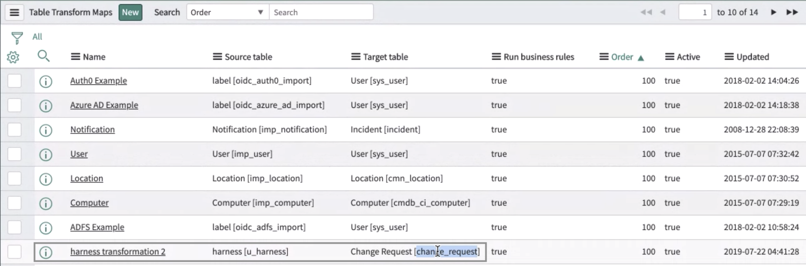
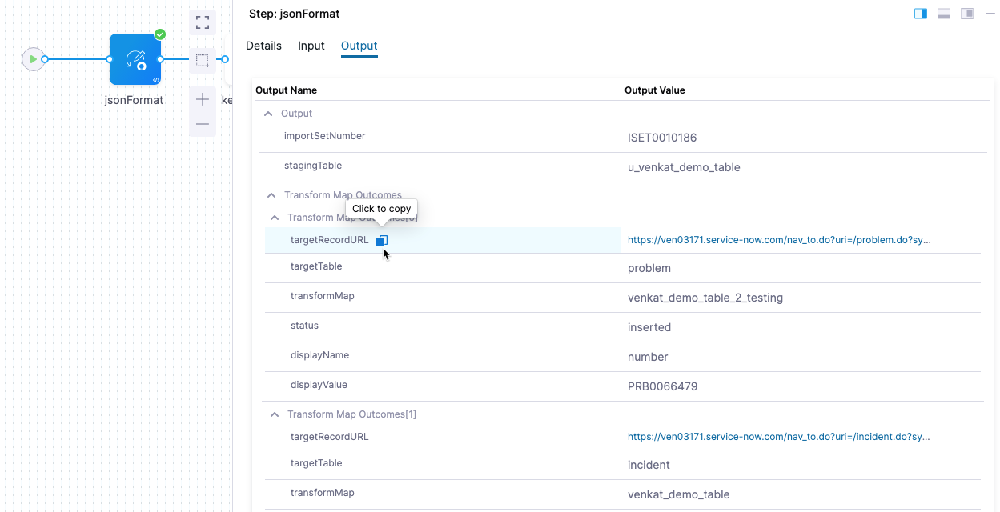

You can use the **ServiceNow Import Set** step in your CD, approval, or custom stages to import data to your instance using an import set table as a staging area.

:::note

You can also create and update tickets using the following Harness ServiceNow steps:

- [Create ServiceNow tickets in CD stages](/docs/continuous-delivery/x-platform-cd-features/cd-steps/ticketing-systems/create-service-now-tickets-in-cd-stages)
- [Update ServiceNow tickets in CD stages](/docs/continuous-delivery/x-platform-cd-features/cd-steps/ticketing-systems/update-service-now-tickets-in-cd-stages)

:::

## Import set summary

In ServiceNow, an import set is a staging table that contains a temporary copy of data to import into the platform. Import sets can be used to import data from a variety of sources, such as CSV files or JDBC-compliant databases. You can transform that data into a format that can be loaded into ServiceNow tables.

Import Sets are a useful tool for migrating data into ServiceNow, or for regularly importing data from external systems into the platform.

:::note

For more information on ServiceNow import sets, go to [Import Set - POST /now/import/{stagingTableName}](https://docs.servicenow.com/bundle/quebec-application-development/page/integrate/inbound-rest/concept/c_ImportSetAPI.html#import-POST) and [import sets key concepts](https://docs.servicenow.com/en-US/bundle/tokyo-platform-administration/page/administer/import-sets/concept/c_ImportSetsKeyConcepts.html) from ServiceNow.

:::

## Required ServiceNow roles

Here are the minimal permissions that the integration user must have for executing a ServiceNow import set step:

- import_transformer.
- role mapping to CRUD permissions on staging table.
- roles mapping to READ permissions for each of the target tables that have an existing transform map from the specified staging table to the target table. 
- (if required) permissions for fetching specific staging tables.
- permission to access table `sys_db_object`. This is optional because you can enter your own staging table instead of selecting prefetched values.

## Add a ServiceNow Import Set step

You can add a ServiceNow Import Set step anywhere in CD, approval, or custom stages where you need to import data using a staging table.

1. In a Harness CD, approval, or custom stage, in **Execution**, click **Add Step**, and then select **ServiceNow Import Set**.
2. Enter a name for the step.
3. Enter a timeout period for the step. Once the timeout expires, Harness will initiate the step or stage [failure strategy](/docs/platform/Pipelines/define-a-failure-strategy-on-stages-and-steps).
4. In **ServiceNow Connector**, select or create the [Harness ServiceNow connector](/docs/platform/Connectors/Ticketing-Systems/connect-to-service-now) to use.

## Select the stage table

The **Staging Table** setting specifies the staging table used to import data into ServiceNow. These intermediate table names extend the **Import Set Row** table in ServiceNow. 

1. In **Staging Table**, select or enter the staging table to use. The list is populated using the ServiceNow connector you added in **ServiceNow Connector**.


## Enter the JSON body

The **JSON Body** setting contains the JSON that this step will pass when it makes a call to ServiceNow's Import Set API. 

For example, to initiate a transformation using the `sys_import_state_comment` field of the selected staging table based on its transformation map, you would use something like this:

```
{"sys_import_state_comment":"my comment"}
```

You can also use Harness runtime inputs, variable expressions, and Harness secrets in the JSON of **JSON Body**. 

For example, you could create a stage variable named `importset` and then reference it in **JSON Body** as {"u_example":"<+stage.variables.importset>"}.

For details on the table requirements and naming, go to [import sets](https://docs.servicenow.com/en-US/bundle/tokyo-platform-administration/page/administer/import-sets/reference/import-sets-landing-page.html) from ServiceNow.

For details on creating a transform map, go to [create a transform map](https://docs.servicenow.com/bundle/tokyo-platform-administration/page/script/server-scripting/task/t_CreateATransformMap.html). 

## Advanced settings

In **Advanced**, you can use the following options:

* [Delegate Selector](https://developer.harness.io/docs/platform/delegates/manage-delegates/select-delegates-with-selectors/)
* [Conditional Execution](https://developer.harness.io/docs/platform/pipelines/w_pipeline-steps-reference/step-skip-condition-settings/)
* [Failure Strategy](https://developer.harness.io/docs/platform/pipelines/w_pipeline-steps-reference/step-failure-strategy-settings/)
* [Looping Strategy](https://developer.harness.io/docs/platform/pipelines/looping-strategies-matrix-repeat-and-parallelism/)
* [Policy Enforcement](https://developer.harness.io/docs/platform/Governance/Policy-as-code/harness-governance-overview)

## Review transform map outcomes

Within ServiceNow, **Transform Table Maps** determine how data is written from the staging table to existing target tables. Map rows determine whether the transformation creates or updates a ticket, and determines the ticket type.



You can view the outcomes of transform maps after the pipeline is run.

1. Click the **ServiceNow Import Set** in the executed pipeline.
2. Click the **Output** tab.

You can see the results in the **Transform Map Outcomes** table for each record.



To reference these results as expressions in other pipeline steps, click the copy button next to the **Output Name**. The result is expressions like these:

```
<+pipeline.stages.stage1.spec.execution.steps.step1.output.transformMapOutcomes[0].transformMap>
<+pipeline.stages.stage1.spec.execution.steps.step1.output.transformMapOutcomes[0].status>
<+pipeline.stages.stage1.spec.execution.steps.step1.output.transformMapOutcomes[1].transformMap>
<+pipeline.stages.stage1.spec.execution.steps.step1.output.transformMapOutcomes[1].status>
```

You can echo them in a subsequent step, such as a [Shell Script step](../cd-general-steps/using-shell-scripts.md).

## Important notes

It is advised to use custom fields instead of out of the box fields in transform maps, especially when an import set staging table has more than 1 associated transform map.
