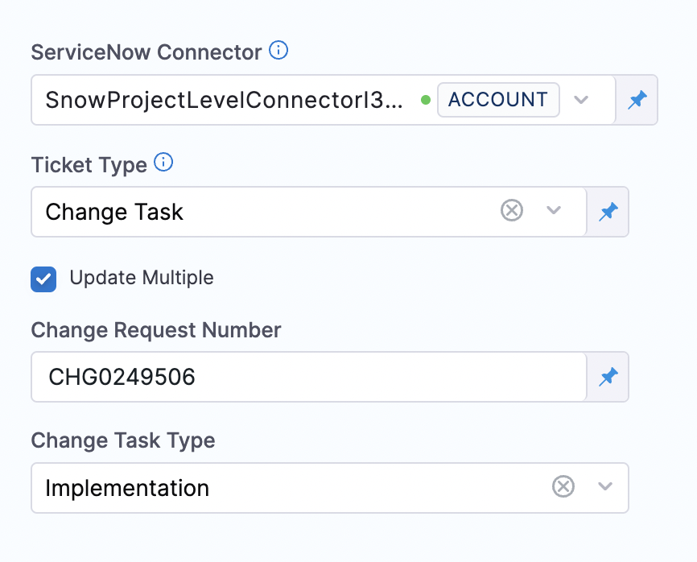
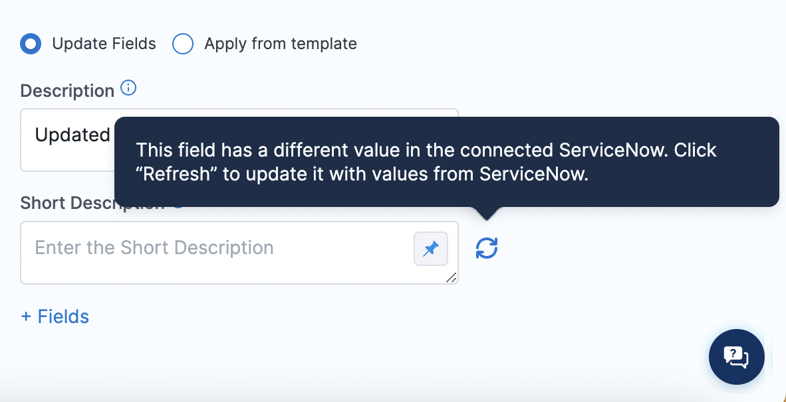
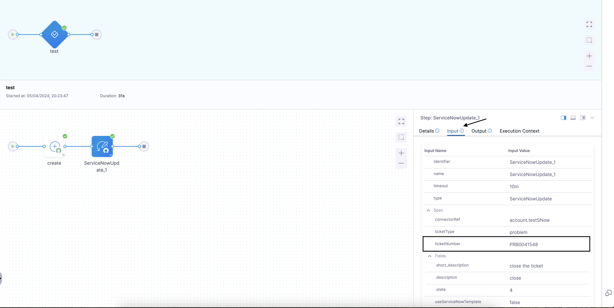

This topic describes how to update ServiceNow tickets in CD Stages.

Harness provides the ability to update [ServiceNow change requests](https://docs.servicenow.com/bundle/rome-it-service-management/page/product/change-management/concept/c_ITILChangeManagement.html), [incident tickets](https://docs.servicenow.com/bundle/rome-it-service-management/page/product/incident-management/concept/c_IncidentManagement.html), [change tasks](https://docs.servicenow.com/bundle/rome-it-service-management/page/product/change-management/concept/change-types.html), and [problem type](https://docs.servicenow.com/bundle/rome-it-service-management/page/product/problem-management/concept/c_ProblemManagement.html) from your Pipeline step using the **ServiceNow Update** step.

You can add the ServiceNow Update step to a Harness CD stage or an Approval stage and do the following:

* Automatically update change requests in ServiceNow to track updates to your build, test, and production environments by adding a **ServiceNow Update** step in your pipeline.
* Automatically assign tickets in ServiceNow to triage and resolve incidents quickly in case of Pipeline failures.

## Important notes

* You must add a Harness [ServiceNow connector](/docs/platform/connectors/ticketing-systems/connect-to-service-now) before or during the Update ServiceNow step setup.
* Make sure you have the following roles:
   + `itil` for end-to-end integration with Harness platform.​

## Important notes for using templates

* You must install the Integration for Harness Software Delivery Platform app in your ServiceNow instance from the [ServiceNow store](https://store.servicenow.com/sn_appstore_store.do#!/store/application/de154a1e1b75851044cbdb58b04bcb11/1.0.2?referer=%2Fstore%2Fsearch%3Flistingtype%3Dallintegrations%25253Bancillary_app%25253Bcertified_apps%25253Bcontent%25253Bindustry_solution%25253Boem%25253Butility%25253Btemplate%26q%3Dharness&sl=sh) before using templates to update ServiceNow tickets.
* Make sure you have the following roles:
	+ `x_harne_harness_ap.integration_user_role​` to access templates.
	+ `itil` for end-to-end integration with Harness platform.​​​
* Review [add ServiceNow approval stages and steps](/docs/platform/approvals/service-now-approvals).

### Required ServiceNow integration app for Harness templates

The Integration for Harness Software Delivery Platform app is required to update ServiceNow tickets using Harness templates. You can install the latest version of the Integration for Harness Software Delivery Platform app in your ServiceNow instance from the  [ServiceNow store](https://store.servicenow.com/sn_appstore_store.do#!/store/application/de154a1e1b75851044cbdb58b04bcb11/1.0.2?referer=%2Fstore%2Fsearch%3Flistingtype%3Dallintegrations%25253Bancillary_app%25253Bcertified_apps%25253Bcontent%25253Bindustry_solution%25253Boem%25253Butility%25253Btemplate%26q%3Dharness&sl=sh).

For more information, go to the [ServiceNow installation guide](https://store.servicenow.com/appStoreAttachments.do?sys_id=1fc1632b872f4dd0970e2178cebb35ba).


## Important note for using the ServiceNow API

The ServiceNow API only allows date time and time values in the UTC timezone. Consequently, input for any datetime/time fields in Harness ServiceNow steps must be provided in UTC format irrespective of time zone settings in your ServiceNow account.

The timezone settings govern the display value of the settings not their actual value. The display values in the Harness UI depend on ServiceNow timezone settings.

## Add a ServiceNow Update step

1. In a Harness CD or Approval stage, in **Execution**, select **Add Step**.
2. Select **ServiceNow Update**. The ServiceNow Update settings appear.
3. In **Name**, enter a name that describes the step.
4. In **Timeout**, enter how long you want Harness to try to create the issue before failing (and initiating the stage or step [failure strategy](/docs/platform/pipelines/failure-handling/define-a-failure-strategy-on-stages-and-steps)).
5. In **ServiceNow Connector**, create or select the [ServiceNow connector](/docs/platform/connectors/ticketing-systems/connect-to-service-now) to use.
6. In **Ticket Type**, select a ServiceNow ticket type from the list.

   

7. In **Ticket Number** enter the ServiceNow ticket number to update. You can enter fixed values, provide runtime input, or provide an expression for this field.

   

8. If you want to update multiple change tasks under a parent change request, select **Update Multiple**, and then do the following:

  - In **Change Request Number**, specify the change request whose tasks you want to update.

  - In **Change Task Type**, specify which task type you want to target. All tasks whose type matches your selection are updated. If you want all tasks under the parent to be updated regardless of their task type, leave this field blank.
   
     

  :::note 
  The **Update Multiple** option appears only if you select **Change Task** in the **Ticket Type** field. 

  This feature requires Harness Delegate version 80800 or later.
  :::

## Update fields

1. Select **Update Fields** to update specific ServiceNow fields in your ServiceNow ticket. This option enables you to access multiple custom fields from your ServiceNow integration. 

2. (Applicable only if the ticket number is a fixed value) Scan the list of fields for a refresh icon, and then click the icon next to each field to fetch the latest value from ServiceNow. Harness displays the refresh icon next to a field only if that field has been updated in ServiceNow. 

  :::note More information
  If the ticket number is a fixed value, and not a runtime value or expression, in addition to listing fields that have values, Harness does the following for you:
    * It includes values from ServiceNow in the fields. 
    * If the value of a field has changed in ServiceNow, Harness includes a refresh icon that you can select if you want the field to show the updated value. Harness does not automatically update the field with the latest value. 
    
    This feature is behind the feature flag `CDS_SERVICENOW_FETCH_FIELDS`. To enable the feature, contact [Harness Support](mailto:support@harness.io).
  :::
       

3. In **Description**, enter a detailed description of the ticket.

4. In **Short Description**, enter a summary of the ticket you are creating. This will be the title of the ticket.  
   You can use Harness variables in the **Short Description** and **Description** fields.

   

5. Select **Fields**. The **Add ServiceNow Fields** settings appear.

6. You can specify additional fields for the ticket by clicking **Provide Field List**. The properties are specified as key-value pairs, the name being the **field name** (not the label) in ServiceNow and a valid value.

## Use expressions in Ticket Number
In **Ticket Number**, you can use an expression or runtime input to reference the **Ticket Number** from another ``Service Now Create`` step. You can use this ticket number when you want to update or approve a particular ticket.

:::info note
 The ``Service now Create`` step must be before the ``Service Now Approval`` and ``Service Now Update``.
:::

Let's say you've set up a [Service Now](/docs/continuous-delivery/x-platform-cd-features/cd-steps/ticketing-systems/create-service-now-tickets-in-cd-stages.md) step in your process. Now, you want to use the Harness ``Service Now Approval`` step to approve the ticket, and once it's approved, you want to use the ``Service Now Update`` step to close it. You'll need to have the ticket number in both the Approval and Update steps. In this case, you can make things easier by using the expression type in the **Ticket Number** field for both the Update and Approval steps.


Consider this example YAML:

```yaml
  tags: {}
  stages:
    - stage:
        name: test
        identifier: test
        description: ""
        type: Approval
        spec:
          execution:
            steps:
              - step:
                  name: create
                  identifier: create
                  type: ServiceNowCreate
                  timeout: 5m
                  spec:
                    connectorRef: account.testSNow
                    ticketType: problem
                    fields:
                      - name: description
                        value: create ticket
                      - name: short_description
                        value: Try out expressions and update in the doc
                    createType: Normal
              - step:
                  type: ServiceNowUpdate
                  name: ServiceNowUpdate_1
                  identifier: ServiceNowUpdate_1
                  spec:
                    useServiceNowTemplate: false
                    connectorRef: account.testSNow
                    ticketType: problem
                    ticketNumber: <+execution.steps.create.ticket.ticketNumber>
                    fields:
                      - name: description
                        value: close
                      - name: short_description
                        value: close the ticket
                      - name: state
                        value: "4"
                  timeout: 10m
        tags: {}

```

When you run the pipeline and check the input of the ``ServiceNowUpdate_1`` step, you'll notice that the ticket number is retrieved from the expression ``<+execution.steps.create.ticket.ticketNumber>``, as depicted in the below screenshot.


## Apply from template

1. Select **Apply From Template** to update a ticket using an existing form template.
2. In **Template Name**, enter the name of an existing template or provide an expression.  
   All the fields corresponding to the Template are listed.
3. Select **Apply Changes**.

This option updates tickets with values as defined in the linked form template for the associated table. This is achieved via scripted APIs defined in the ServiceNow integration app for Harness templates.

## Custom table support

For details, go to **Custom table support** in [Create ServiceNow tickets in CD stages](/docs/continuous-delivery/x-platform-cd-features/cd-steps/ticketing-systems/create-service-now-tickets-in-cd-stages#custom-table-support).
