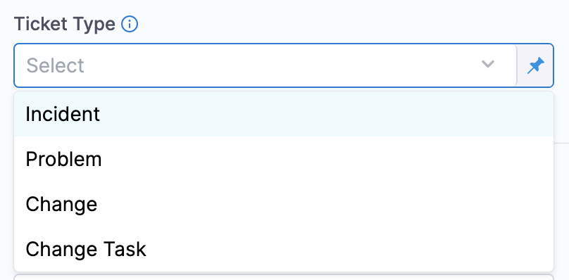
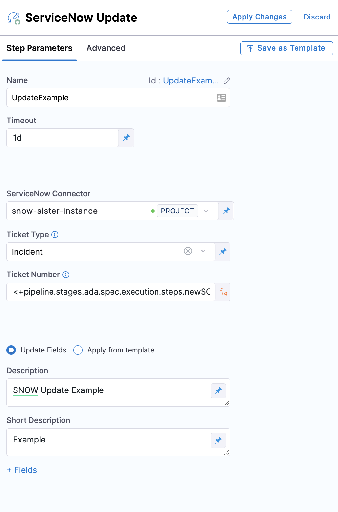

This topic describes how to update Service Now tickets in CD Stages.

Harness provides the ability to update [ServiceNow change requests](https://docs.servicenow.com/bundle/rome-it-service-management/page/product/change-management/concept/c_ITILChangeManagement.html) and [incident tickets](https://docs.servicenow.com/bundle/rome-it-service-management/page/product/incident-management/concept/c_IncidentManagement.html) from your Pipeline step using the **ServiceNow Update** step.

You can add the Create ServiceNow step to a Harness CD stage or an Approval stage and do the following:

* Automatically update change requests in ServiceNow to track updates to your build, test, and production environments by adding a **ServiceNow Create** step in your Pipeline.
* Automatically assign tickets in ServiceNow to triage and resolve incidents quickly in case of Pipeline failures.

## Important notes

* You must add a Harness [ServiceNow connector](/docs/platform/Connectors/Ticketing-Systems/connect-to-service-now) before or during the Create ServiceNow step setup.
* You must install the Harness application before using templates to create ServiceNow tickets.​
* Make sure you have the following roles:
	+ `x_harne_harness_ap.integration_user_role​` to access supported APIs, view Harness support details and access Templates.
	+ `itil` for end-to-end integration with Harness platform.​​​
* Review [add ServiceNow approval stages and steps](/docs/platform/Approvals/service-now-approvals).
* The ServiceNow API only allows date time and time values in the UTC timezone only. Consequently, input for any datetime/time fields in Harness ServiceNow steps must be provided in UTC format irrespective of time zone settings in your ServiceNow account.  
  The timezone settings govern the display value of the settings not their actual value. The display values in the Harness UI depend on ServiceNow timezone settings.

## ServiceNow user roles

You can install the Harness app in your ServiceNow instance from the ServiceNow [store](https://store.servicenow.com/sn_appstore_store.do#!/store/application/de154a1e1b75851044cbdb58b04bcb11/1.0.1?referer=%2Fstore%2Fsearch%3Flistingtype%3Dallintegrations%25253Bancillary_app%25253Bcertified_apps%25253Bcontent%25253Bindustry_solution%25253Boem%25253Butility%25253Btemplate%26q%3Dharness&sl=sh). For more information, see the ServiceNow [installation guide](https://store.servicenow.com/appStoreAttachments.do?sys_id=1fc1632b872f4dd0970e2178cebb35ba).

## Add a ServiceNow Update step

1. In a Harness CD or Approval stage, in **Execution**, select **Add Step**.
2. Select **ServiceNow Update**. The ServiceNow Update settings appear.
3. In **Name**, enter a name that describes the step.
4. In **Timeout**, enter how long you want Harness to try to create the issue before failing (and initiating the stage or step [failure strategy](/docs/platform/Pipelines/define-a-failure-strategy-on-stages-and-steps)).
5. In **ServiceNow Connector**, create or select the [ServiceNow connector](/docs/platform/Connectors/Ticketing-Systems/connect-to-service-now) to use.
6. In **Ticket Type**, select a ServiceNow ticket type from the list.

7. In **Ticket Number** enter the ServiceNow ticket number to update. You can enter fixed values, provide runtime input, or provide an expression for this field.

## Update fields

1. Select **Update Fields** to update specific ServiceNow fields in your ServiceNow ticket. This option enables you to access multiple custom fields from your ServiceNow integration.
2. In **Description**, enter a detailed description of the ticket.
3. In **Short Description**, enter a summary of the ticket you are creating. This will be the title of the ticket.  
   You can use Harness variables in the **Short Description** and **Description** fields.
4. Select **Fields**. The **Add ServiceNow Fields** settings appear.

5. You can specify additional fields for the ticket by clicking **Provide Field List**. The properties are specified as key-value pairs, the name being the **field name** (not the label) in ServiceNow and a valid value.

## Apply from template

1. Select **Apply From Template** to update a ticket using an existing template.
2. In **Template Name**, enter the name of an existing template or provide an expression.  
   All the fields corresponding to the Template are listed.
3. Select **Apply Changes**.

## Custom table support

For details, go to **Custom table support** in [Create ServiceNow tickets in CD stages](/docs/continuous-delivery/x-platform-cd-features/cd-steps/ticketing-systems/create-service-now-tickets-in-cd-stages#custom-table-support).
