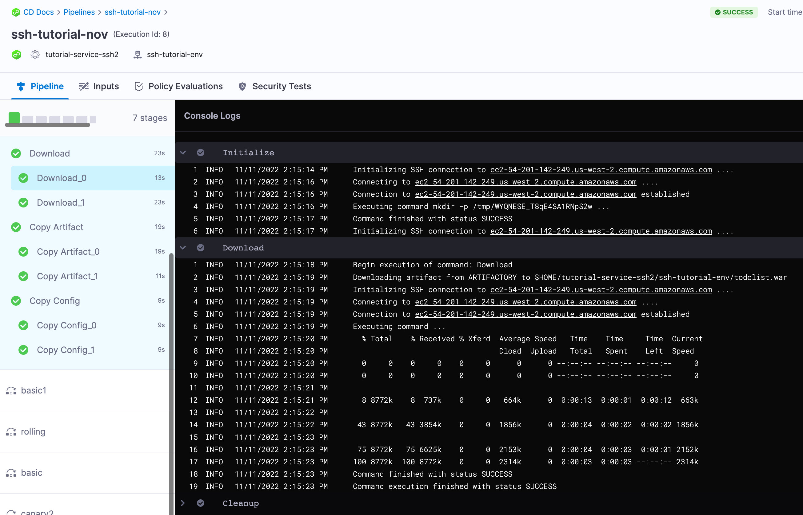

The Command step can be used in SSH and WinRM deployments to run commands on all target hosts.

You can run a script on all hosts, download the deployment artifact, or copy the artifact or config.

You can also use the Command step on deployment template deployments. Since a deployment template can be used on any host type, the Command step can only be run on the delegate.

The Command step mandates the use of a [repeat looping strategy](/docs/platform/pipelines/looping-strategies/looping-strategies-matrix-repeat-and-parallelism/#repeat-strategies) even if you want to deploy to a single server. 

## Command step summary

Let's review the details of the Command step.

### Deployment types

The Command step can be added to SSH, WinRM, and deployment template deployment types.


### SSH and WinRM

For SSH and WinRM, the Command step(s) is added automatically when you select the deployment strategy.

Also, the looping strategy needed to run the Command step on each target host is set automatically to **Repeat**.

:::info Note

The Command step only supports the **Repeat** looping strategy. This includes scenarios where you only want to deploy to a single server. 

:::

You can edit or add any automatically-added Command step.

For more information, go to:

* [Secure Shell (SSH) deployment tutorial](/docs/continuous-delivery/deploy-srv-diff-platforms/traditional/ssh-ng)
* [WinRM deployment tutorial](/docs/continuous-delivery/deploy-srv-diff-platforms/traditional/win-rm-tutorial)

### Deployment templates

For deployment templates, you can add a Command step to the template itself or anywhere in the execution.

Since a deployment template can be used on any host type, the Command step can only be run on the delegate. You must use the **Run on Delegate** option in the step.

To run the Command step on all the fetched hosts, you must put the Command step after the **Fetch Instances** step and use the repeat looping strategy and expression `<+stage.output.hosts>`:

```yaml
repeat:  
  items: <+stage.output.hosts>
```


If you want to deploy to a single server, you can: 

Specify your host explicitly:
```yaml
repeat:
  items: ["0.0.0.0"]
```

Or with runtime values:
```yaml
repeat:
  items: <+pipeline.variables.test123>.split(",")
```

For the download artifact and copy the artifact/config commands, you do not need the looping strategy. These commands should be run once on the delegate. These commands will download the artifact and copy the artifact/config to the delegate only, not the target hosts.

For a script command, you might want to run the script for each instance that was output from the Fetch Instance step. In this case, using the looping strategy.

### Command types

The following command types are supported:

* Download artifact
* Copy artifact or config
* Script

These are discussed in detail below.

### Artifact metadata only

Harness services allows you to identify artifacts using their metadata. At deployment runtime, Harness uses the metadata to copy or download the artifact to the target hosts/containers.

### Copy vs download

Let's review the differences between the copy artifact/config and download commands.

- **Download:** At deployment runtime, the Harness Delegate executes commands on the target host(s) to download the artifact directly to the target host(s).
  The delegate must have access to the target host(s) and the target host(s) must have network connectivity to the artifact server.
- **Copy:** During deployment runtime, Harness uses the metadata to download the artifact to the Harness Delegate. The delegate then copies the artifact to the target host(s).

The delegate must have network connectivity to the artifact server and target hosts.

Here is the difference in how Harness performs a copy and download.


## Add the Command step

The Command step can be added to SSH, WinRM, and deployment template deployment types.

1. In the stage **Execution**, select **Add Step**.
2. Select **Command**.
3. In **Name**, enter a name for the command.
4. In **Timeout**, enter how long Harness should wait before failing this step and initiating the [failure strategy](/docs/platform/pipelines/failure-handling/define-a-failure-strategy-on-stages-and-steps).
5. In **Run the following commands**, select **Add Command**.

   

6. Name the command and then select the **Command Type**.

The settings for the different command types are described below.

## Download an artifact

The deployment artifact for the stage is set in the Service of the stage.

Using the **Download** command type, you can download the deployment artifact onto the target hosts of the deployment.


You can set where you want to download the artifact in **Destination Path**.

For SSH or WinRM deployments, the path `$HOME/<+service.name>/<+env.name>` is added automatically when you select the execution strategy for the stage.

For example, a destination path for a stage that deploys **todolist.war** using a service named **tutorial-service-ssh2** to an environment named **ssh-tutorial-env** will look like this:

`$HOME/tutorial-service-ssh2/ssh-tutorial-env/todolist.war`

:::note

Always use `$` in the beginning of the path when you reference an environment variables in a Command step.

:::

You can use any path on the target hosts you want. Harness will not create the path if it does not exist.

Here's an example of the results of a download command:




:::note

Downloading artifact prepares the script to run on host instances using `curl`. In case of `Bash` and `Invoke-WebRequest` for `PowerShell`, the configured artifact file path must not contain any spaces. 

:::

**Deployment Templates:** to run the download command on the target hosts, add the command after the Fetch Instances step. Go to [looping strategy and target hosts](#looping-strategy-and-target-hosts) below for more information

## Download artifacts with a proxy

In order to support the download artifacts by using the proxy settings on remote hosts, the follow environment variables needs to be set on the target machine (host).

- `HARNESS_ENV_PROXY`: boolean value for whether or not the proxy is used.
- `HTTP_PROXY`: the proxy URL.


<DocImage path={require('./static/084f850ec904e0510100abb6e53f51389109c0d143dd4da1be73cdc5879f1158.png')} width="60%" height="60%" title="Click to view full size image" />

In Harness, the artifact should be added to the Harness service and the **Download Artifact** command type in the Command step. 

The **Destination Path** should be set to the location where the artifacts will be downloaded on the target machine. The destination path should exist on the target machine.

<DocImage path={require('./static/3bed823e82a32864c979d6397aaaa4f05f3b4328a26fb5374c5b10fbfb001019.png')} width="60%" height="60%" title="Click to view full size image" />

While the pipeline is running, you will see `Using HTTP_PROXY environment variable` log message for the **Download Artifact** command type. This message indicates that the proxy is used on the target machine.

<DocImage path={require('./static/7d8bcd481e413b9371ed9f9b5970fda32d1ac556dfa134cebffd6532e8bd3707.png')} width="60%" height="60%" title="Click to view full size image" />


## Copy an artifact or config

The deployment artifact for the stage is set in the service definition **Artifacts** section.

Using the **Copy** command type, you can copy the deployment artifact onto the target hosts of the deployment.

The deployment config file(s) for the stage is set in the service definition **Config Files** section.


1. In **Select file type to copy**, select **Artifact** or **Config**.


You can set where you want to download the artifact in **Destination Path**.

For SSH or WinRM deployments, the path `$HOME/<+service.name>/<+env.name>` is added automatically when you select the execution strategy for the stage.

For example, a destination path for a stage that deploys **todolist.war** using a service named **tutorial-service-ssh2** to an environment named **ssh-tutorial-env** will look like this:

`$HOME/tutorial-service-ssh2/ssh-tutorial-env/todolist.war`

You can use any path on the target hosts you want. If the parent directory of the path exists, then the sub-directory will be created. However, if the parent directory does not exist, the command will fail. 

For example, if the path given was `/parent-dir/sub-dir`, then it would create `/sub-dir` if `/parent-dir` existed but would fail if `/parent-dir` did not exist. 

Here's an example of the results of a copy artifact command:


Here's an example of the results of a copy config command:


**Deployment Templates:** to run the download command on the target hosts, add the command after the Fetch Instances step. Go to [looping strategy and target hosts](#looping-strategy-and-target-hosts) below for more information.

## Use a script

You can run a script on all of the target hosts. This is the same as the [shell script](/docs/continuous-delivery/x-platform-cd-features/cd-steps/utilities/shell-script-step) step.

1. In **Working Directory**, enter the working directory on the target host(s) from which the Harness Delegate will run the script, such as **/tmp** on Linux and **%TEMP%** on Windows. By default, if **Working Directory** is left empty, the script is executed in the home directory.
2. In **Select script location**, select [Harness File Store](/docs/continuous-delivery/x-platform-cd-features/services/add-inline-manifests-using-file-store) or **Inline**.
3. In **Command**, enter your script. For example, this script echoes artifact information using Harness expressions:

	```
	echo "artifacts.primary.tag" <+artifacts.primary.tag>  
	echo "artifacts.primary.tagRegex" <+artifacts.primary.tagRegex>  
	echo "artifacts.primary.identifier" <+artifacts.primary.identifier>  
	echo "artifacts.primary.type" <+artifacts.primary.type>  
	echo "artifacts.primary.primaryArtifact" <+artifacts.primary.primaryArtifact>  
	echo "artifacts.primary.image" <+artifacts.primary.image>  
	echo "artifacts.primary.imagePullSecret" <+artifacts.primary.imagePullSecret>  
	echo "artifacts.primary.label" <+artifacts.primary.label>  
	echo "artifacts.primary.connectorRef" <+artifacts.primary.connectorRef>  
	echo "artifacts.primary.imagePath" <+artifacts.primary.imagePath>
	```

	Here's an example of an executed script command:

	
4. Use **Files and Patterns** to tail files and use the results in your script. For example, check logs and see if a process started successfully and, if so, exit the script.  
You specify the file to tail, such as `auth.log`, and the pattern to search (grep filter), such as `198.51.100.1` and then in your script you perform an action when the tail output is matched.
5. For **File to Tail**, enter the name of a file in the Working Directory to tail, such as a log file.
6. For **Pattern to search**, enter the pattern to search for in the file. Harness uses grep on the pattern.
7. Use **Deployment Templates** to run the download command on the target hosts, add the command after the Fetch Instances step. Go to [looping strategy and target hosts](#looping-strategy-and-target-hosts) below for more information.

### Notes on working directory

import WorkingDir from '/docs/continuous-delivery/shared/working-dir.md';

<WorkingDir name="WorkingDir" />

## Input variables

While you can declare a variable in your command script using a Harness expression or string for its value, using input variables provides some additional benefits:

* You can more easily identify and manage the Harness expressions used in your script.
* You can template your script.

You can declare the variable using **Name** and **Value** in **Script Input Variables** and then reference the variable in the script just as you would any other variable: `$var_name`.

You can also use expressions in **Value**. For example, if you have an output variable from a previous Shell Script step, you can copy it from the executed step **Outputs**.

In **Script Input Variables**, you simply select **Expression** and paste the expression in **Value**.

In your script, you declare the variable using the **Name** value.

At deployment runtime, Harness will evaluate the expression and the variable will contain its output.

## Output variables

Output Variables have a maximum size of 512KB. To export variables from the script to other steps in the stage, you use the **Script Output Variables** option.

Let's look at an example of a script with the variable **name**:


```
name=123
```

The `name` variable cannot be used outside the script unless you use **Script Output Variables**.

You do not need to use `export` for the variables to use them with **Script Output Variables**. You can simply declare them, like `name="123"`. Export is for using the variables in child processes within the script.In **Script Output Variables**, in **Value**, you enter the name of the script variable you want to output (`name`).

In **Name**, enter a name to use in other steps that will reference this variable. This is the output variable name that will be used in a Harness expression for referencing the output variable.

The format to reference the output variable can be one of the following:

* Within the stage:
	+ Referencing the step output:
		- `<+steps.STEP_ID.output.outputVariables.OUTPUT_VARIABLE_NAME>`.
	+ Referencing the step output execution:
		- `<+execution.steps.STEP_ID.output.outputVariables.OUTPUT_VARIABLE_NAME>`
* Anywhere in the pipeline:
	+ `<+pipeline.stages.STAGE_ID.spec.execution.steps.STEP_ID.output.outputVariables.OUTPUT_VARIABLE_NAME>`

For example, it could be `<+steps.Deploy_0.output.outputVariables.newname>`.

### Output variable notes

- **Secret output variables:** Harness supports String and Secret output variables in the Command step. Secret output variables are masked in console logs and in step outputs.
- **Rollback output variables:** If output variables are configured on a Command step in the stage **Rollback** section, those output variables are used during stage rollback only. 


## Run on delegate

Use this option to run the command on the delegate instead of the target hosts.

Download and copy commands aren't typically run on the delegate, but a script is not uncommon.

If you do run the step on the delegate, ensure the **Destination Path** exists on the delegate. 

### Deployment templates

For deployment templates, use **Run on Delegate**.

Since a deployment template can be used on any host type, the Command step can only be run on the delegate. You must use the **Run on Delegate** option in the step.

## Looping strategy and target hosts

To run the Command step on all the target hosts, you must use the repeat [looping strategy](/docs/platform/pipelines/looping-strategies/looping-strategies-matrix-repeat-and-parallelism) and expression `<+stage.output.hosts>`:


```yaml
repeat:  
  items: <+stage.output.hosts>
```


If you want to deploy to a single server, you can: 

Specify your host explicitly:
```yaml
repeat:
  items: ["0.0.0.0"]
```

Or with runtime values:
```yaml
repeat:
  items: <+pipeline.variables.test123>.split(",")
```

When you run the pipeline, you will see the Command step run on each host. For example, here is an SSH deployment where download, copy artifact, and copy config Command steps are run using the looping strategy:


The suffix \`_N` is used to identify each host.

### Deployment templates

Since a deployment template can be used on any host type, the Command step can only be run on the delegate. You must use the **Run on Delegate** option in the step.

Consequently, there is no reason to use a looping strategy when using the Command step with deployment templates.

## Copy and download artifact provider support

The following table lists the providers supported by the copy and download commands in a Command step.

Legend:

* Y: Yes
* N: No
* N/A: Not Applicable

:::note

The WinRM deployment type supports Download Artifact only. You cannot use the **Copy** command type with **Artifact** in WinRM deployments.

:::


| **Provider** | **Repository/Package Types** | **Download Artifact (WinRM or SSH deployment types only)** | **Copy Artifact SSH deployment type only)** |
| --- | --- | --- | --- |
| AWS S3 | All | Y | Y |
| Artifactory (JFrog) | Non-Docker | Y | Y |
|  | Docker | N/A | N/A |
| SMB | IIS related | Y | N/A |
| SFTP | IIS related | Y | N/A |
| Jenkins | All | Y | Y |
| Docker Registry | Docker | N/A | N/A |
| AWS ECR | Docker | N/A | N/A |
| Google Cloud Storage | All | N/A | N/A |
| Google Container Registry | Docker | N/A | N/A |
| Nexus 2.x/ 3.x | Maven 2.0 | Y | Y |
|  | NPM | Y | Y |
|  | NuGet | Y | Y |
|  | Docker | N/A | N/A |
| Nexus 2.x/ 3.x | Maven 2.0 | Y | Y |
|  | NPM | Y | Y |
|  | NuGet | Y | Y |
|  | Docker | N/A | N/A |
| Azure Artifacts | Maven 2.0, NuGet | Y | Y |
| Custom Repository | All | N/A | N (use the Exec script to use the metadata to copy artifact to target host) |

## Use case: Send emails from a server with an attachment

1. Install `postfix` on the target host using the following command:  
   
   ```BASH
   $ sudo apt-get install postfix mailutils libsasl2-2 ca-certificates libsasl2-modules
   ```
2. Create a deployment stage with an SSH type service and infrastructure definition.
3. Add a Command step under the **Executions** tab.
4. In **Step Parameters**, enter a name and timeout duration. 
5. In **Run the following commands**, select **Add Command**.
   * Enter a command name.
   * Set the **Command Type** to **Script**.
   * Enter the **Working Directory** path where the attachment resides. The path can be a fixed value, runtime input, or an expression.
   * In **Select script location**, select **Inline**.
   * In **Script Type**, select **Bash** and enter the following command: 
     
     ```BASH
     sudo tee -a /etc/postfix/main.cf > /dev/null <<EOT
     relayhost = [smtp.gmail.com]:587
     smtp_sasl_auth_enable = yes
     smtp_sasl_password_maps = hash:/etc/postfix/sasl_passwd
     smtp_sasl_security_options = 
     smtp_tls_CAfile = /etc/ssl/certs/ca-certificates.crt
     smtp_use_tls = yes
     EOT
     sudo chmod 600 /etc/postfix/sasl_passwd
     sudo postmap /etc/postfix/sasl_passwd
     sudo systemctl restart postfix.service
     echo "This is the body of an encrypted email" | mail -A hello.jar -s "log file"  johndoe@xyz.io
     ```
     
     The `relayhost` host configuration in the above command can be any SMTP port and server.
     
     You can define the body of the message with an echo statement like this, `echo "This is the body of an encrypted email" | mail -A hello.jar -s "log file"  johndoe@xyz.io`. You can provide harness expressions to resolve the body of the message. The email address can be provided as a user's email or a Distribution List email. 

     The `mail -A hello.jar` will send the JAR on the host as an attachment. The `-s` command will provide the subject of the email. The email address is the last argument in the mail command.

     For more information on sending emails with `postfix`, go to [AskUbuntu solution](https://askubuntu.com/questions/1332219/send-email-via-gmail-without-other-mail-server-with-postfix/1332322#1332322).

   * Select **Add**.
6. Select **Apply Changes**.
7. **Run** the pipeline. 
   
   

<details>
<summary>Sample pipeline YAML</summary>

```YAML
pipeline:
  name: EmailSSHPipeline
  identifier: EmailSSHPipeline
  projectIdentifier: default
  orgIdentifier: default
  tags: {}
  stages:
    - stage:
        name: stg
        identifier: stg
        description: ""
        type: Deployment
        spec:
          deploymentType: Ssh
          service:
            serviceRef: ArtifactiryService
          environment:
            environmentRef: qa
            deployToAll: false
            infrastructureDefinitions:
              - identifier: pdcinfra
          execution:
            steps:
              - step:
                  type: Command
                  name: Email User
                  identifier: Command_1
                  spec:
                    onDelegate: false
                    environmentVariables: []
                    outputVariables: []
                    commandUnits:
                      - identifier: test
                        name: Email Attachment
                        type: Script
                        spec:
                          workingDirectory: /home/ubuntu
                          shell: Bash
                          source:
                            type: Inline
                            spec:
                              script: |-
                                sudo tee -a /etc/postfix/main.cf > /dev/null <<EOT
                                relayhost = [smtp.gmail.com]:587
                                smtp_sasl_auth_enable = yes
                                smtp_sasl_password_maps = hash:/etc/postfix/sasl_passwd
                                smtp_sasl_security_options = 
                                smtp_tls_CAfile = /etc/ssl/certs/ca-certificates.crt
                                smtp_use_tls = yes
                                EOT
                                sudo chmod 600 /etc/postfix/sasl_passwd
                                sudo postmap /etc/postfix/sasl_passwd
                                sudo systemctl restart postfix.service
                                echo "This is the body of an encrypted email" | mail -A hello.jar -s "log file"  johndoe@xyz.io
                  timeout: 10m
                  strategy:
                    repeat:
                      items: <+stage.output.hosts>
            rollbackSteps:
              - step:
                  name: Rollback
                  identifier: Rollback
                  timeout: 10m
                  strategy:
                    repeat:
                      items: <+stage.output.hosts>
                  template:
                    templateRef: account.Default_Install_War_Bash
                    templateInputs:
                      type: Command
                      spec:
                        environmentVariables:
                          - name: DestinationDirectory
                            type: String
                            value: $HOME/<+service.name>/<+env.name>
        tags: {}
        failureStrategies:
          - onFailure:
              errors:
                - AllErrors
              action:
                type: StageRollback

```

</details>


