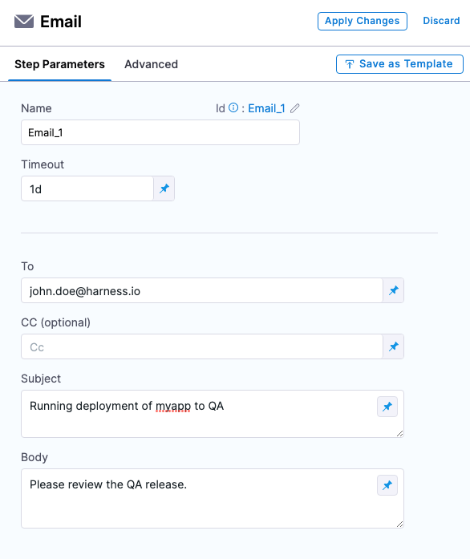

This topic describes the settings for the Email step available in Continuous Delivery (CD) and custom stages.


The Email step lets you easily send emails to users and teams during a pipeline execution.

  

The Email step has the following features:

- Send emails during pipeline executions.
- You can use the Harness SMTP Server included with your Harness account.
- Use your own SMTP server by adding it to Harness. For more information, go to [add SMTP configuration](https://developer.harness.io/docs/platform/notifications/add-smtp-configuration).
- You can use this step as a [step template](https://developer.harness.io/docs/platform/Templates/run-step-template-quickstart) or as part of a [stage template](https://developer.harness.io/docs/platform/Templates/add-a-stage-template). 
- You can manage this step's configuration via [Harness Git Experience](https://developer.harness.io/docs/platform/git-experience/git-experience-overview).
- You can send emails to Harness users and users outside of Harness using the SMTP server in your Harness

## Visual summary

<!-- Video:
https://harness-1.wistia.com/medias/w5ztte829n-->
<docvideo src="https://harness-1.wistia.com/medias/w5ztte829n" />


## YAML example

```YAML
           steps:
              - step:
                  type: Email
                  name: Update Status
                  identifier: Update_Status
                  spec:
                    to: rohan.gupta@harness.io 
                    cc: srinivas@harness.io
                    subject: Deployment Status
                    body: "Pipeline: <+pipeline.name> is complete. Harness deployed service <+service.name> into environment <+env.name>"
                  timeout: 10m
```

## To

The email address(es) where you want this Harness pipeline to send an email. 

This setting can use be a comma-separated string of addresses. For example, `john.doe@harness.io, bill.smith@harness.io`.

You can set **To** as a runtime input.
  
You can pass in the email as a Harness expression, such as `<+pipeline.triggeredBy>`.

For more information on runtime inputs and expressions, go to [fixed values, runtime inputs, and expressions](https://developer.harness.io/docs/platform/references/runtime-inputs).

## CC
 
You can add email addresses to the **CC** section to carbon copy addresses on the email that will be sent with the pipeline execution.

## Subject

You can provide a subject for the email. 

This subject can be a fixed string (for example, `Prod Deployment Notification`), a string with expressions (for example, `<+env.name> Deployment Notification`), or a runtime input.

For more information on runtime inputs and expressions, go to [fixed values, runtime inputs, and expressions](https://developer.harness.io/docs/platform/references/runtime-inputs).

## Body

The **Body** is a string field. You can enter in text and Harness expressions. Harness will resolve the expressions before sending the email.

You can use HTML formatting in **Body**.

For more information on runtime inputs and expressions, go to [fixed values, runtime inputs, and expressions](https://developer.harness.io/docs/platform/references/runtime-inputs).

## Sending emails to non-Harness users

By default, the Email step can only send emails to Harness users.

To send emails to non-Harness users, you must configure your own SMTP server and enable the **Enable Emails to be sent to non-Harness Users** default setting.

:::note Notes

- The Harness internal SMTP server included in your account is not used to email non-Harness users.  
- Only users belonging to a user group with the **Default Setting** permission set to **Edit** can configure the **Enable Emails to be sent to non-Harness Users** default setting.

:::

To send emails to non-Harness users, do the following:

1. Add your own SMTP server. For details, go to [Add SMTP configuration](https://developer.harness.io/docs/platform/notifications/add-smtp-configuration/).
2. In **Default Settings** (at the account, organization, or project level), select **Continuous Deployment**, and then set **Enable Emails to be sent to non-Harness Users** to **true**.
  
  <docimage path={require('./static/de6a52a680b74f1dd5535a5e2fed34ef8ed9be4f2af244a29636a0c497cda016.png')} width="60%" height="60%" title="Click to view full size image" />  


Enable **Allow Overrides** to allow a project to override the setting of its org, or an org to override its account setting.


## Advanced settings

In **Advanced**, you can use the following options:

* [Delegate Selector](https://developer.harness.io/docs/platform/delegates/manage-delegates/select-delegates-with-selectors)
* [Conditional Execution](https://developer.harness.io/docs/platform/pipelines/w_pipeline-steps-reference/step-skip-condition-settings)
* [Failure Strategy](https://developer.harness.io/docs/platform/pipelines/w_pipeline-steps-reference/step-failure-strategy-settings)
* [Looping Strategy](https://developer.harness.io/docs/platform/pipelines/looping-strategies-matrix-repeat-and-parallelism)
* [Policy Enforcement](https://developer.harness.io/docs/platform/Governance/Policy-as-code/harness-governance-overview)

## Options

You can send emails using your own SMTP Server. For more information, go to [add SMTP configuration](https://developer.harness.io/docs/platform/notifications/add-smtp-configuration).

## Email delivery failures

Currently, Harness is unable to check whether the emails sent using the Email step are delivered successfully. 

If you are encountering issues with email delivery, please open a Harness support ticket. 

If you are using a custom email provider (as described in [Add SMTP configuration](https://developer.harness.io/docs/platform/notifications/add-smtp-configuration/)) Harness will not have access to your emails. Please check your email provider and server log to determine the cause of the error.

