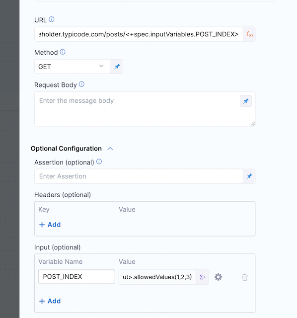
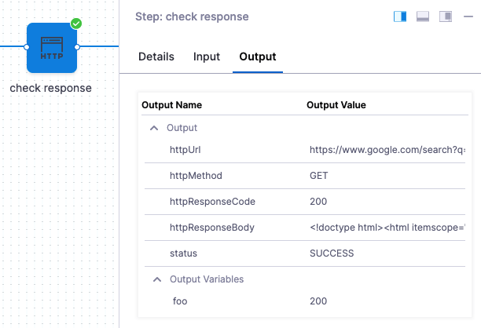
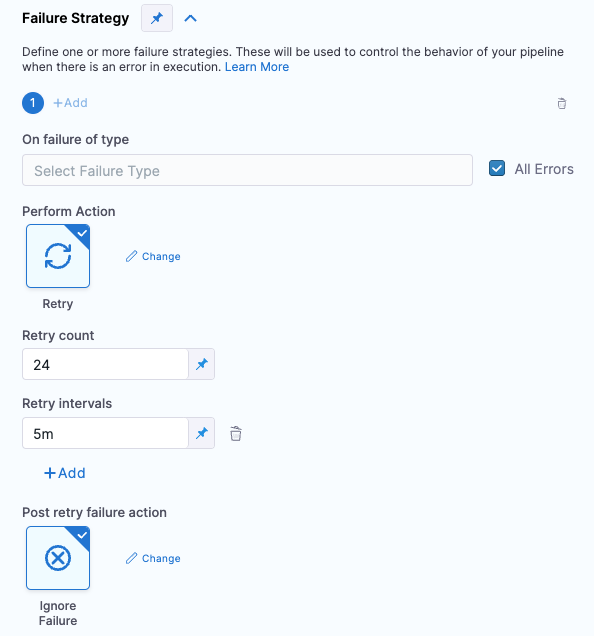
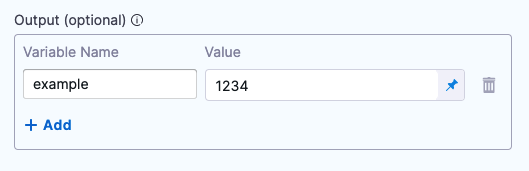
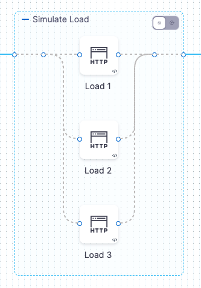

This topic describes the settings for the HTTP step.

You can use the HTTP step to run HTTP methods containing URLs, methods, headers, assertions, and variables.

## Step settings

The following sections cover the step settings.

### Name

The name of the step. You'll use this name when you reference the step settings.

For example, if the step name is HTTP and you want to reference the URL entered in its **URL** setting, use:

`<+pipeline.stages.tooltips.spec.execution.steps.HTTP.spec.url>`

### Timeout

The timeout for the step. Use:

* `w` for weeks
* `d` for days
* `h` for hours
* `m` for minutes
* `s` for seconds
* `ms` for milliseconds

The maximum is `53w`.

Timeouts can be set at the pipeline level also.

### URL

The URL for the HTTP call.

### Method

The [HTTP method](https://restfulapi.net/http-methods/#summary) to use in the step.

### Request body

The message body of the HTTP message.

### Assertion

Assertion is used to validate the incoming response. For example, if you wanted to check the health of an HTTP connection, use the assertion `<+httpResponseCode> == 200`.

The expression `<+httpResponseCode> == 200` will evaluate to true if the HTTP call returns a 200 code.

Expressions can use the following aliases to refer to the HTTP responses, URL, and method.

* `<+httpResponseCode>`
* `<+httpResponseBody>`

### Headers

Enter the media type for the message. For example, if you are using the GET method, the headers are used to specify the GET response body message type.

In **Key**, enter `Token`

In **Value**, enter `<+secrets.getValue("aws-playground_AWS_secret_key")>`

Another method:

* **Key**: `variable:`
* **Value**: `var1,var2:var3`

You can copy the key and paste it in the HTTP step **Header** setting. For more information, go to [Manage API keys](/docs/platform/Resource-Development/APIs/add-and-manage-api-keys).

### Input variables

Create input variables that can be used by other fields within the step. The **Value** setting can contain fixed values, expressions, or runtime inputs.

These variables can be used by other fields like URLs by using the following expressions: 

```<+spec.inputVariables.variable_name>``` or ```<+step.spec.inputVariables.variable_name>```



### Output variables

Create output variables to be used by other steps in the stage. The **Value** setting can contain any HTTP step input, output, or response information.

You can also use ​JSON and XML functors in the values for the output variable. For example, `<+json.select("data.attributes.version_pins.mvn-service://new-construction-api", httpResponseBody)>`.

You can use pipeline variables along with `httpResponseBody` and `httpResponseCode`.

Here are some examples:

`<+json.object(httpResponseBody).title>`

`<+json.select(<+pipeline.variables.title>, httpResponseBody)>`

To concatenate strings within the JSON functor:

`<+json.select(<+ <+pipeline.variables.user> + <+pipeline.variables.id>>,httpResponseBody)>` or `<+json.select("user".concat(<+pipeline.variables.id>),httpResponseBody)>`

For more information, go to [JSON and XML functors](/docs/continuous-delivery/x-platform-cd-features/cd-steps/utilities/json-and-xml-functors).

### Advanced step settings

In **Advanced**, you can use the following options:

* [Delegate Selector](https://developer.harness.io/docs/platform/delegates/manage-delegates/select-delegates-with-selectors/)
* [Conditional Execution](https://developer.harness.io/docs/platform/pipelines/w_pipeline-steps-reference/step-skip-condition-settings/)
* [Failure Strategy](https://developer.harness.io/docs/platform/pipelines/w_pipeline-steps-reference/step-failure-strategy-settings/)
* [Looping Strategy](https://developer.harness.io/docs/platform/pipelines/looping-strategies-matrix-repeat-and-parallelism/)
* [Policy Enforcement](https://developer.harness.io/docs/platform/Governance/Policy-as-code/harness-governance-overview)

## Step execution inputs and outputs

Once you execute your pipeline, the step displays its inputs and outputs and their values.



You can reference these anywhere in your pipeline.

### Inputs

In the following examples, the Id of the HTTP step is `HTTP`.

| **Input Name** | **Input Reference Example** | **Input Value Example** |
| --- | --- | --- |
| identifier | `<+pipeline.stages.HTTP.spec.execution.steps.check_response.identifier>` | `check\_response` |
| name | `<+pipeline.stages.HTTP.spec.execution.steps.check_response.name>` | `check response` |
| timeout | `<+pipeline.stages.HTTP.spec.execution.steps.check_response.timeout>` | `10s` |
| type | `<+pipeline.stages.HTTP.spec.execution.steps.check_response.type>` | `Http` |
| url | `<+pipeline.stages.HTTP.spec.execution.steps.check_response.spec.url>` | `https://www.google.com/search?q=` |
| method | `<+pipeline.stages.HTTP.spec.execution.steps.check_response.spec.method>` | `GET` |
| requestBody | `<+pipeline.stages.HTTP.spec.execution.steps.check_response.spec.requestBody>` | `current+date` |
| assertion | `<+pipeline.stages.HTTP.spec.execution.steps.check_response.spec.assertion>` | `<+httpResponseCode> == 200` |

### Outputs

In the following examples, the Id of the HTTP step is `HTTP`.

| **Output** | **Output Reference Example** | **Output Value Example** |
| --- | --- | --- |
| httpUrl | `<+pipeline.stages.HTTP.spec.execution.steps.HTTP.output.httpUrl>` | `https://www.google.com/search?q=` |
| httpMethod | `<+pipeline.stages.HTTP.spec.execution.steps.HTTP.output.httpMethod>` | `GET` |
| httpResponseCode | `<+pipeline.stages.HTTP.spec.execution.steps.HTTP.output.httpResponseCode>` | `200` |
| httpResponseBody | `<+pipeline.stages.HTTP.spec.execution.steps.HTTP.output.httpResponseBody>` | `Hello` |
| status | `<+pipeline.stages.HTTP.spec.execution.steps.HTTP.output.status>` | `SUCCESS` |


## Delegate proxy

HTTP step supports delegate proxy settings by default. For more information, go to [delegate proxy settings](https://developer.harness.io/docs/platform/Delegates/manage-delegates/configure-delegate-proxy-settings).

## Header capability check

When Harness runs an HTTP step and connects to a service, it checks to make sure that an HTTP connection can be established.

Some services require HTTP headers to be included in connections. Without the headers, the HTTP connections fail and simple HTTP verification cannot be performed.

Harness performs an HTTP capability check with the headers included on the target service.

If the target host server require headers and you do not include headers in the **Headers** setting of the HTTP step, the Harness delegate will fail the deployment with the error `No eligible delegates could perform this task` (`error 400`).

Add the required headers in **Headers** and run the deployment. Adding the headers will prevent the `400` error.

Harness secrets are not used during capability checks. They are used in actual steps only. If you have a step configured with URLs and multiple headers like:

`x-api-key : <+secret.getValue('apikey')>`   
`content-type : application/json`

During a capability check, the non-secret headers are used as is but the secret headers are masked. Harness makes the HTTP request with the URL and headers as follows:

`x-api-key:<<<api_key>>>`  
`content-type:application/json`

This results in a `401 Unauthorized` response due to an incorrect api key. However, the capability check will be successful and the task will be assigned to the Harness delegate. 

:::info
Using `<<<and>>>` in HTTP requests might result in bad requests on the server side. In such cases, follow these workarounds.

* Use FF `CDS_NOT_USE_HEADERS_FOR_HTTP_CAPABILTY` to not use headers for capability checks.
* Use Shell script to run cURL command and manually process the response. 

:::

Capability checks are basic accessibility checks and do not follow multiple redirects. Hence, Harness returns from the first `302 Found` response during capability checks. 

## HTTP polling

The HTTP step supports polling. When you create the HTTP step for polling, the client requests the resource at regular intervals. 

To configure polling in the HTTP step: 

1. In the step, go to **Step Parameters** > **Optional Configuration**, and enter the following details: 
    * **Assertion (optional)**: Enter the expression to validate the incoming response. You can use the following aliases to refer to the HTTP responses, URL, and method:
        * `<+httpsResponseCode>`
        * `<+httpUrl>`
        * `<+httpMethod>`
        * `<+httpResponseBody>`
    * **Headers (optional)**: Enter the key and value for the headers in the message. 
      
      For example, in **Key**, enter the token, in **Value**, enter secret references such as `<+secrets.getValue("aws-playground_AWS_secret_key")>`.
    * **Output (optional)**: Create the output steps to be used by other steps in the stage. 
      
      The **Value** setting can contain any HTTP step input, output, or response information. You can also use JSON and XML functors in the value.
2. In **Advanced** > **Failure Strategy**, do the following: 
    * In **On failure of type**, select **All Errors**.
    * In **Perform Action**, select **Retry**.
    * In **Retry count**, enter the number of times you want the HTTP step to retry reaching the resource.
    * In **Retry intervals**, specify the gap between two successive connection retries.
    * In **Post retry failure action**, select **Ignore Failure**.
    
    

The HTTP step retries polling and ignores all errors until the condition mentioned in the assertion section is met.

## Using HTTP requests in CD pipelines

This section provides examples on how to use the HTTP step.

You can use the HTTP step to run HTTP methods containing URLs, methods, headers, assertions, and variables. It helps you avoid having script cURL commands for simple REST calls.

The most common use of the HTTP step is to run a health check post-deployment. For example, make sure that an HTTP or IP endpoint, such as a load balancer, is properly exposed.

Other common uses are:

* Making a call to a third-party system to gather deployment information, such as a Nexus IQ scan.
* Open Policy Agent (OPA) policy agent call.
* General HTTP testing calls to the deployed application.

Go to [Harness REST API quickstart](/docs/platform/Resource-Development/APIs/api-quickstart) for more information.

### Add the HTTP step

You can add the HTTP step to any CD Pipeline stage independent of deployment strategy.

1. In your Harness pipeline stage, in **Execution**, select **Add Step**.
2. Select **HTTP**. The HTTP step appears.


### Name and Timeout

1. Enter a name for the step.  
   
   Harness automatically creates an **Id**. You'll use this Id to reference this step's settings in other steps.

   For example, if the stage name is **dev** and the step Id is **HTTP** and you want to reference the URL entered in its **URL** setting, you'd use:

   `<+pipeline.stages.dev.spec.execution.steps.HTTP.spec.url>`

2. In **Timeout**, enter a timeout for this step.You can use:

   * `w` for weeks
   * `d` for days
   * `h` for hours
   * `m` for minutes
   * `s` for seconds
   * `ms` for milliseconds

   The maximum is `53w`.Timeouts are set at the Pipeline level also.

### URL for HTTP call

In **URL**, enter a URL for the call. It must include the `http://` scheme.

For more information on runtime inputs and expressions, go to [Fixed values runtime inputs and expressions](https://developer.harness.io/docs/platform/references/runtime-inputs/)..

You can use [Harness variables](/docs/platform/Variables-and-Expressions/harness-variables) too. For example, if the Service name matches the domain name of the HTTP address, you can use `http://<+service.name>/...`.

Before handing the execution of the HTTP step to a Harness Delegate, Harness performs a capability check on the URL to ensure that a non-400 response code is returned.

### Character encoding

:::note

Currently, character encoding is behind the feature flag `CDS_ENCODE_HTTP_STEP_URL`. Contact [Harness Support](mailto:support@harness.io) to enable the feature.

:::

By default, Harness validates the URL you enter to ensure it is not an invalid URL (or a URL with invalid characters) before it sends the request to the URL.

Harness can allow URLs with invalid characters such as a blank space, `^`, `{`, `}` and URL encode them before sending the request. 

<!-- ### Using secrets in the HTTP step URL

In some cases, you might want to use a [Harness text secret](/docs/platform/Secrets/add-use-text-secrets) in the **URL** setting. For example, `https://www.google.com/<+secrets.getValue("xyz")>`.

It's important to know how Harness uses the secret when evaluating the URL.

Harness does not use the actual secret value, but rather it uses the secret Id. So, if you have a secret with the Id `xyz` and the value `gmail`, Harness will perform the capability check using `https://www.google.com/<<xyz>>`. This will fail the capability check.

If you use a Harness text secret for the entire URL, the capability check will fail. -->

### HTTP method

In HTTP Method, select the method for the call.

Harness supports the following [HTTP methods](https://restfulapi.net/http-methods/#summary):

* GET
* POST
* PUT
* DELETE
* HEAD
* OPTIONS

### Request Body

In Request **Body**, enter the body of the HTTP payload to send to the URL.

You can use a **Fixed Value**, **Runtime Input**, or **Expression**.

You can use [Harness variables](/docs/platform/Variables-and-Expressions/harness-variables) too. For example, if the Service name matches the domain name of the HTTP address, you can use `http://<+service.name>/...`.

Before handing the execution of the HTTP step to a Harness Delegate, Harness performs a capability check on the URL to ensure that a non-400 response code is returned.

### Assertion

The assertion is used to validate the incoming response. For example, if you wanted to check the health of an HTTP connection, you could use the assertion `<+httpResponseCode> == 200`.

The expression `<+httpResponseCode> == 200` will evaluate to true if the HTTP call returns a 200 code.

Expressions can use the following aliases to refer to the HTTP responses, URL, and method:

* `<+httpResponseCode>`
* `<+httpUrl>`
* `<+httpMethod>`
* `<+httpResponseBody>`

You can use a Fixed Value, Runtime Input, or Expression.

You can use [Harness variables](/docs/platform/Variables-and-Expressions/harness-variables) too.

### Headers

Headers are `key:value` pairs. For example:

* `Content-Type: application/json`
* `Content-Type: text/html`

You can use a Fixed Value, Runtime Input, or Expression.

You can use [Harness variables](/docs/platform/Variables-and-Expressions/harness-variables) too.

You can reference [Harness secrets](/docs/platform/Secrets/add-use-text-secrets) in the **Value** setting too.

For example, in **Key**, enter `Token`.

In **Value**, enter `<+secrets.getValue("aws-playground_AWS_secret_key")>`.

### Output variables

You can create output variables and reference them in other steps in the stage. The **Value** setting can contain any HTTP step input, output, or response information.

To reference the value of the output variable in another step using its fully-qualified name (FQN).

For example, here's a variable `example` with the value `1234`. The step name is `GET`.



Save the step and then click **Variables**.

1. In the **Variables** drawer, copy the **example** variable.
2. In another step, like a **Shell Script** step, paste the FQN.

The FQN will resolve to the variable value at execution runtime.

You can also use ​JSON and XML functors in the values for the output variable. For example, `<+json.select("data.attributes.version_pins.mvn-service://new-construction-api", httpResponseBody)>`.

See [JSON and XML functors](/docs/continuous-delivery/x-platform-cd-features/cd-steps/utilities/json-and-xml-functors).

## Simulate load by running steps in parallel

You can use multiple HTTP steps in parallel to simulate load.

Create a step group and add multiple HTTP steps with the same URL pointing to your service.



The steps are executed in parallel and simulate load.

You can add multiple steps to the group quickly using YAML. Just paste additional steps into the Step Group. Be sure to rename each step. Here's an example:


```yaml
...  
- stepGroup:  
  name: Simulate Load  
  identifier: Simulate_Load  
  steps:  
      - parallel:  
            - step:  
                  type: Http  
                  name: Load 1  
                  identifier: Load_1  
                  spec:  
                      url: http://example.com  
                      method: GET  
                      headers: []  
                      outputVariables: []  
                  timeout: 10s  
            - step:  
                  type: Http  
                  name: Load 2  
                  identifier: Load_2  
                  spec:  
                      url: http://example.com  
                      method: GET  
                      headers: []  
                      outputVariables: []  
                  timeout: 10s  
            - step:  
                  type: Http  
                  name: Load 3  
                  identifier: Load_3  
                  spec:  
                      url: http://example.com  
                      method: GET  
                      headers: []  
                      outputVariables: []  
                  timeout: 10s  
  failureStrategies: []  
  spec: {}  
...
```

## See also

* [Shell Script step](/docs/continuous-delivery/x-platform-cd-features/cd-steps/utilities/shell-script-step)
* [JSON and XML functors](/docs/continuous-delivery/x-platform-cd-features/cd-steps/utilities/json-and-xml-functors)

