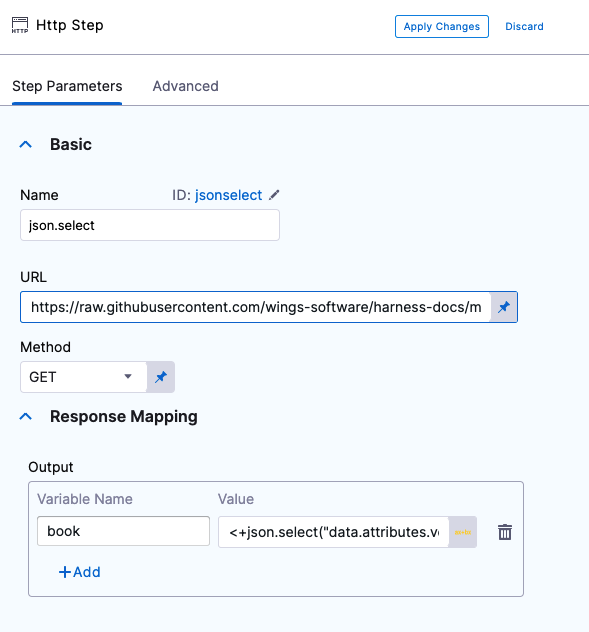
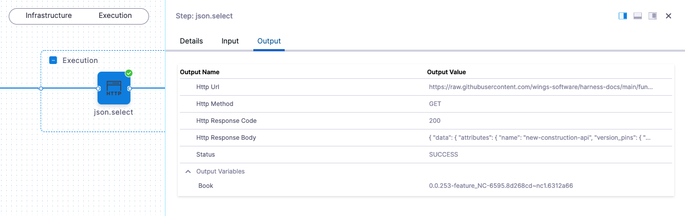
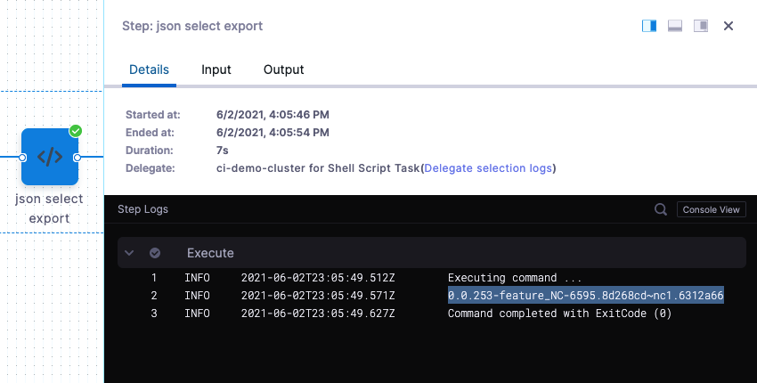
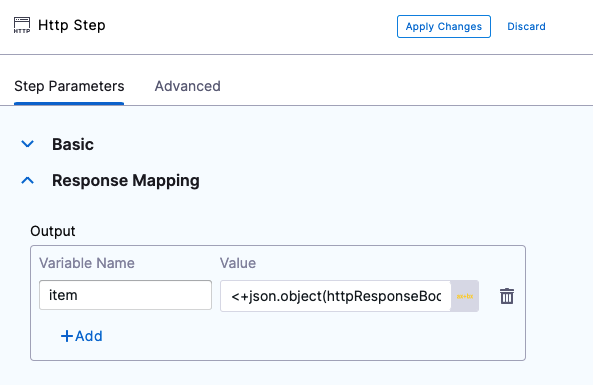
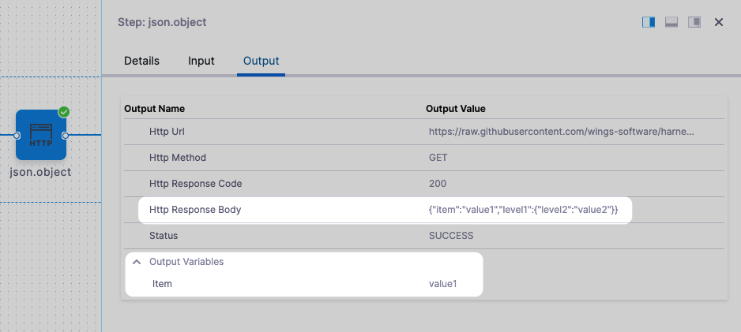
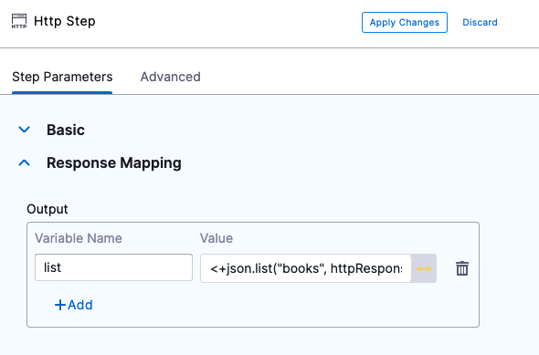
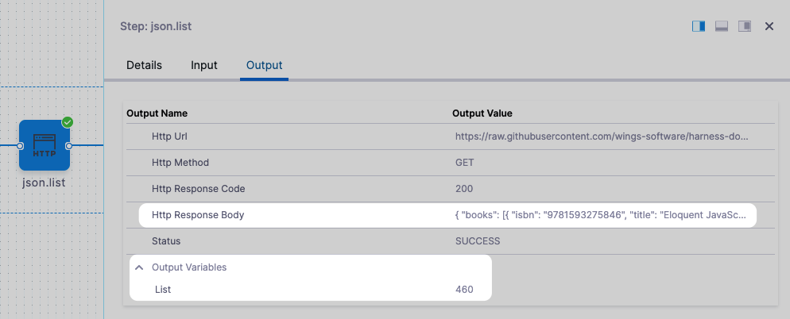
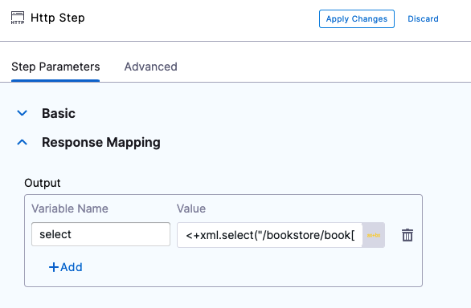
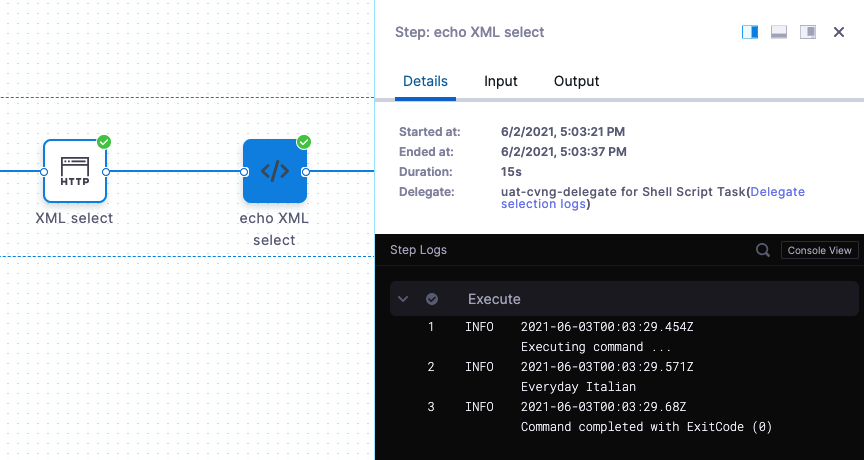

This topic describes how to use JSON and XML functors to select contents from JSON and XML sources.

These functors reduce the amount of shell scripting needed to pull JSON and XML information into your Harness Pipeline steps.


## JSON Functor

The JSON functor uses the JSON library [JsonPath](https://github.com/json-path/JsonPath). The JSON functor methods are described below.

### select()

* **Syntax:** `select(string, string)`
* **Description:** Select attribute values using a path.
* **Parameters:** literal string, string (typically, the second string is `httpResponseBody`). This is a path to identify the desired JSON attribute value from a JSON response.

**Example:**

Here is the JSON array that we want to select a value from:


```json
{  
  "data": {  
    "attributes": {  
      "name": "new-construction-api",  
      "version_pins": {  
        "mvn-service://new-construction-api": "0.0.253-feature_NC-6595.8d268cd~nc1.6312a66"  
      }  
    }  
  }  
}
```

You can find this example at <https://raw.githubusercontent.com/wings-software/harness-docs/main/functors/select.json>.

To select the value `0.0.253-feature_NC-6595.8d268cd~nc1.6312a66`, you would use `select()` to specify the path to the value, like this:


```json
<+json.select("data.attributes.version_pins.mvn-service://new-construction-api", httpResponseBody)>
```

The `httpResponseBody` argument is used to indicate that we want to select the path *within* the HTTP response body. `httpResponseBody` is propagated from the HTTP request.

A common use of `select()` is in an HTTP step.

For example, the following HTTP step uses a variable named **book** and the `select()` method in **Value** to obtain the value `0.0.253-feature_NC-6595.8d268cd~nc1.6312a66` from the HTTP response payload at the URL specified in **URL**.



When this HTTP step is executed, in its **Output** tab, you can see the HTTP response in **HTTP Response Body** and the selection in the **Output Variables**:



You can also use a Shell Script step to echo the book output like this:


```bash
echo <+pipeline.stages.Functors.spec.execution.steps.jsonselect.output.outputVariables.book>
```

When the Pipeline is executed, the value of **book** is output:



### object()

* **Syntax:** `object(string)`
* **Description:** Selects objects from a JSON collection.
* **Parameters:** string. This is a JSON key used to identify the desired JSON attribute value from a JSON response. Typically, `httpResponseBody`.

**Example:**

Here is the JSON we will query:


```json
{"item":"value1","level1":{"level2":"value2"}}
```
You can find this example at <https://raw.githubusercontent.com/wings-software/harness-docs/main/functors/object.json>.

Here is the query using the `object()` method to select `value1`:


```bash
<+json.object(httpResponseBody).item>
```
We can add the `object()` method to an HTTP step and output it:



When this HTTP step is executed, in its **Output** tab, you can see the HTTP response in **HTTP Response Body** and the object in the **Output Variables**:



### list()

* **Syntax:** `list(string, string)`
* **Description:** Returns list object.
* **Parameters:** literal string, string (typically, `httpResponseBody`). Using the `list().get()` method returns items from the list.

**Example:**

Here is the JSON we will query:


```json
{  
  "books": [{  
      "isbn": "9781593275846",  
      "title": "Eloquent JavaScript, Second Edition",  
      "subtitle": "A Modern Introduction to Programming",  
      "author": "Marijn Haverbeke",  
      "published": "2014-12-14T00:00:00.000Z",  
      "publisher": "No Starch Press",  
      "pages": "472",  
      "description": "JavaScript lies at the heart of almost every modern web application, from social apps to the newest browser-based games. Though simple for beginners to pick up and play with, JavaScript is a flexible, complex language that you can use to build full-scale applications."  
    },  
    {  
      "isbn": "9781449331818",  
      "title": "Learning JavaScript Design Patterns",  
      "subtitle": "A JavaScript and jQuery Developer's Guide",  
      "author": "Addy Osmani",  
      "published": "2012-07-01T00:00:00.000Z",  
      "publisher": "O'Reilly Media",  
      "pages": "254",  
      "description": "With Learning JavaScript Design Patterns, you'll learn how to write beautiful, structured, and maintainable JavaScript by applying classical and modern design patterns to the language. If you want to keep your code efficient, more manageable, and up-to-date with the latest best practices, this book is for you."  
    },  
    {  
      "isbn": "9781449365035",  
      "title": "Speaking JavaScript",  
      "subtitle": "An In-Depth Guide for Programmers",  
      "author": "Axel Rauschmayer",  
      "published": "2014-02-01T00:00:00.000Z",  
      "publisher": "O'Reilly Media",  
      "pages": "460",  
      "description": "Like it or not, JavaScript is everywhere these days-from browser to server to mobile-and now you, too, need to learn the language or dive deeper than you have. This concise book guides you into and through JavaScript, written by a veteran programmer who once found himself in the same position."  
    },  
    {  
      "isbn": "9781491950296",  
      "title": "Programming JavaScript Applications",  
      "subtitle": "Robust Web Architecture with Node, HTML5, and Modern JS Libraries",  
      "author": "Eric Elliott",  
      "published": "2014-07-01T00:00:00.000Z",  
      "publisher": "O'Reilly Media",  
      "pages": "254",  
      "description": "Take advantage of JavaScript's power to build robust web-scale or enterprise applications that are easy to extend and maintain. By applying the design patterns outlined in this practical book, experienced JavaScript developers will learn how to write flexible and resilient code that's easier-yes, easier-to work with as your code base grows."  
    }  
  ]  
}
```
You can find this example at <https://raw.githubusercontent.com/wings-software/harness-docs/main/functors/books.json>.

Here is the query using the `list()` method to select `pages` from the 3rd book:


```json
<+json.list("books", httpResponseBody).get(2).pages>
```
Since the JSON array starts at 0, `get(2)` returns `pages` from the third list item (`"pages": "460"`).

We can add the `list()` method to an HTTP step and output it using the variable **list**:



When this HTTP step is executed, in its **Output** tab, you can see the HTTP response in **HTTP Response Body** and the list item in the **Output Variables**:



### format()

* **Syntax:** `format(object)`
* **Description:** Format the array passed as the string value in JSON format.
* **Parameters:** object. Typically, this is the response from the HTTP response body (`httpResponseBody`). The `httpResponseBody` argument is used to indicate that we want to select the path within the HTTP response body. `httpResponseBody` is propagated from the HTTP request.

**Example:**

We add an HTTP step to obtain the `httpResponseBody` and then reference that in a subsequent Shell Script step.

We are using the example at <https://raw.githubusercontent.com/wings-software/harness-docs/main/functors/select.json>.

If we simply rendered the `httpResponseBody`, we would get:


```json
{data:{attributes:name:new-construction-api}} {data:{attributes:version_pins:{mvn-service://new-construction-api:0.0.253-feature_NC-6595.8d268cd~nc1.6312a66}}}
```
If we render it using `<+json.format(<+pipeline.stages.Functors.spec.execution.steps.jsonformat1.output.httpResponseBody>)>` we get a JSON formatted string:


```json
{\n  "data": {\n    "attributes": {\n      "name": "new-construction-api",\n      "version_pins": {\n        "mvn-service://new-construction-api": "0.0.253-feature_NC-6595.8d268cd~nc1.6312a66"\n      }\n    }\n  }\n}\n
```

:::important

1. JSON accepts the control sequence `\n` as strings. To format JSON, use `jq` to prettify the JSON.

2. Conditional expressions within double quotes are considered strings.
   
   So, `"<+json.select("fields.status.name", httpResponseBody)>"=="In Progress"` is treated as string comparison and will not work.
   
   Use `<+json.select("fields.status.name", httpResponseBody)>=="In Progress"` instead.
   
   The keyword null, too, shouldn't be enclosed in quotes during comparison. 
   
   Here's an example of a null comparison:
   `<+json.object(httpResponseBody).fields.parent>!=null`

:::

## XML Functor

The [XPath](https://developer.mozilla.org/en-US/docs/Web/XPath) functor has one method: `xml.select()`.

### select()

* **Syntax:** `xml.select(string, string)`
* **Description:** Returns XML file.
* **Parameters:** String using an XPath expression and XML file, and a string for `httpResponseBody`.

**Example:**

Here is the contents of the XML file we will query:


```xml
<?xml version="1.0"?>  
<bookstore>  
  <book category="cooking">  
    <title lang="en">Everyday Italian</title>  
    <author>Giada De Laurentiis</author>  
    <year>2005</year>  
    <price>30.00</price>  
  </book>  
  <book category="children">  
    <title lang="en">Harry Potter</title>  
    <author>J K. Rowling</author>  
    <year>2005</year>  
    <price>29.99</price>  
  </book>  
  <book category="web">  
    <title lang="en">XQuery Kick Start</title>  
    <author>James McGovern</author>  
    <author>Per Bothner</author>  
    <author>Kurt Cagle</author>  
    <author>James Linn</author>  
    <author>Vaidyanathan Nagarajan</author>  
    <year>2003</year>  
    <price>49.99</price>  
  </book>  
  <book category="web" cover="paperback">  
    <title lang="en">Learning XML</title>  
    <author>Erik T. Ray</author>  
    <year>2003</year>  
    <price>39.95</price>  
  </book>  
</bookstore>
```

We are using the example at <https://raw.githubusercontent.com/wings-software/harness-docs/main/functors/books.xml>.

Here is the query using the `xml.select()` method to select the title from the first book:


```bash
<+xml.select("/bookstore/book[1]/title", httpResponseBody)>
```
We can add the `xml.select()` method to an HTTP step and output it using **Response Mapping**:



Next, we reference the output variable **select** in a Shell Script step:


```bash
echo <+pipeline.stages.Functors.spec.execution.steps.XML_select.output.outputVariables.select>
```
When the Workflow is deployed, the result is:


```bash
Executing command ...  
  
Everyday Italian  
  
Command completed with ExitCode (0)
```

You can also see the entire XML file in the deployment **Details** section:



## YAML Pipeline Example

Here's the YAML for a Pipeline that demonstrates all of the functors.

Functors Pipeline YAML:

```yaml
pipeline:  
    name: Functors  
    identifier: Functors  
    projectIdentifier: CD_Quickstart  
    orgIdentifier: default  
    tags: {}  
    stages:  
        - stage:  
              name: Functors  
              identifier: Functors  
              description: ""  
              type: Deployment  
              spec:  
                  serviceConfig:  
                      serviceDefinition:  
                          type: Kubernetes  
                          spec:  
                              manifestOverrideSets: []  
                              manifests: []  
                              artifacts:  
                                  sidecars: []  
                      serviceRef: nginx  
                  infrastructure:  
                      environmentRef: quickstart  
                      infrastructureDefinition:  
                          type: KubernetesDirect  
                          spec:  
                              connectorRef: account.k8s_cluster  
                              namespace: default  
                              releaseName: docs  
                      allowSimultaneousDeployments: false  
                      infrastructureKey: ""  
                  execution:  
                      steps:  
                          - step:  
                                type: Http  
                                name: json.select  
                                identifier: jsonselect  
                                timeout: 40s  
                                spec:  
                                    url: https://raw.githubusercontent.com/wings-software/harness-docs/main/functors/select.json  
                                    method: GET  
                                    headers: []  
                                    outputVariables:  
                                        - name: book  
                                          value: <+json.select("data.attributes.version_pins.mvn-service://new-construction-api", httpResponseBody)>  
                                          type: String  
                          - step:  
                                type: ShellScript  
                                name: json select export  
                                identifier: json_select_export  
                                timeout: 40s  
                                spec:  
                                    shell: Bash  
                                    onDelegate: true  
                                    source:  
                                        type: Inline  
                                        spec:  
                                            script: echo <+pipeline.stages.Functors.spec.execution.steps.jsonselect.output.outputVariables.book>  
                                    environmentVariables: []  
                                    outputVariables: []  
                                    executionTarget: {}  
                          - step:  
                                type: Http  
                                name: json.object  
                                identifier: jsonobject  
                                timeout: 40s  
                                spec:  
                                    url: https://raw.githubusercontent.com/wings-software/harness-docs/main/functors/object.json  
                                    method: GET  
                                    headers: []  
                                    outputVariables:  
                                        - name: item  
                                          value: <+json.object(httpResponseBody).item>  
                                          type: String  
                          - step:  
                                type: Http  
                                name: json.list  
                                identifier: jsonlist  
                                timeout: 40s  
                                spec:  
                                    url: https://raw.githubusercontent.com/wings-software/harness-docs/main/functors/books.json  
                                    method: GET  
                                    headers: []  
                                    outputVariables:  
                                        - name: list  
                                          value: <+json.list("books", httpResponseBody).get(2).pages>  
                                          type: String  
                          - step:  
                                type: Http  
                                name: jsonformat1  
                                identifier: jsonformat1  
                                timeout: 10s  
                                spec:  
                                    url: https://raw.githubusercontent.com/wings-software/harness-docs/main/functors/select.json  
                                    method: GET  
                                    headers: []  
                                    outputVariables: []  
                          - step:  
                                type: ShellScript  
                                name: jsonformatecho  
                                identifier: jsonformatecho  
                                timeout: 10m  
                                spec:  
                                    shell: Bash  
                                    onDelegate: true  
                                    source:  
                                        type: Inline  
                                        spec:  
                                            script: echo <+json.format(<+pipeline.stages.Functors.spec.execution.steps.jsonformat1.output.httpResponseBody>)>  
                                    environmentVariables: []  
                                    outputVariables: []  
                                    executionTarget: {}  
                          - step:  
                                type: Http  
                                name: XML select  
                                identifier: XML_select  
                                timeout: 10s  
                                spec:  
                                    url: https://raw.githubusercontent.com/wings-software/harness-docs/main/functors/books.xml  
                                    method: GET  
                                    headers: []  
                                    outputVariables:  
                                        - name: select  
                                          value: <+xml.select("/bookstore/book[1]/title", httpResponseBody)>  
                                          type: String  
                          - step:  
                                type: ShellScript  
                                name: echo XML select  
                                identifier: echo_XML_select  
                                timeout: 10m  
                                spec:  
                                    shell: Bash  
                                    onDelegate: true  
                                    source:  
                                        type: Inline  
                                        spec:  
                                            script: echo <+pipeline.stages.Functors.spec.execution.steps.XML_select.output.outputVariables.select>  
                                    environmentVariables: []  
                                    outputVariables: []  
                                    executionTarget: {}  
                      rollbackSteps: []  
              tags: {}  
              failureStrategies:  
                  - onFailure:  
                        errors:  
                            - AnyOther  
                        action:  
                            type: StageRollback  
              when:  
                  pipelineStatus: Success  

```
