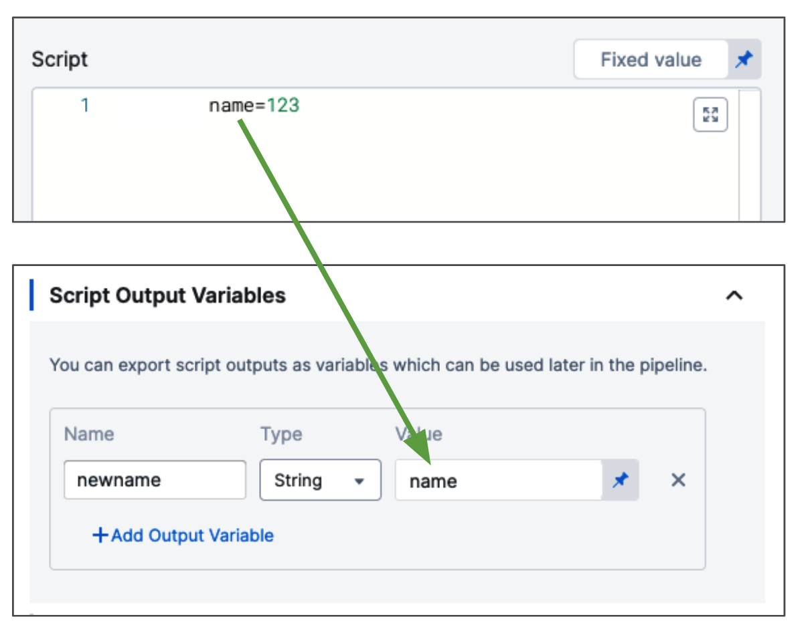
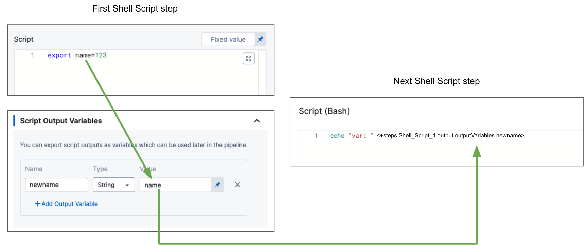
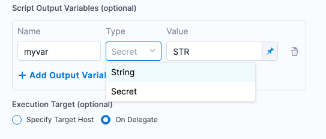

This topic provides settings and permissions for the Shell Script CD step.

## Important notes

Please review the following notes before using the step.

### General notes

* Shell Script step names cannot contain dots. This is true for names entered in the Pipeline Studio UI or YAML.
* Shell Script step Output Variables have a maximum size of 512KB.

### Shell scripts and security

Harness assumes that you trust your Harness users to add safe scripts to your Shell Script steps.

Ensure that users adding scripts, as well as executing deployments that run the scripts, are trusted.

### Reserved keywords

The word `var` is a reserved word for input and output Variable names in the Shell Script step.

If you must use `var`, you can use single quotes and `get()` when referencing the published output variable.

### Reserved symbols

**PowerShell**
* `|` `^` `&` `<` `>` `%` are reserved symbols in PowerShell and in case those are being used as a value of a Harness secret, please make sure it is escaped using `^` symbol.

Instead of using `<+test.var>` use `<+test.get('var')>`.

### Stopping scripts after failures

The shell script command will continue to process through the script even if a script step fails. To prevent this, you can simply include instructions to stop on failure in your script. For example:

* `set -e` - Exit immediately when a command fails.
* `set -o pipefail` - Sets the exit code of a pipeline to that of the rightmost command to exit with a non-zero status, or to a zero status if all commands of the pipeline exit successfully.
* `set -u` - Treat unset variables as an error and exit immediately.

For more information, go to [writing robust Bash shell scripts](https://www.davidpashley.com/articles/writing-robust-shell-scripts/).

### Published variables not available

This error happens when you are publishing output via the **Script Output Variables** setting and your Shell Script step exits early from its script.

There are many errors that can result from this situation. For example, you might see an error such as:

```bash
FileNotFoundException inside shell script execution task
```

If you exit from the script (`exit 0`), values for the context cannot be read.

As a result of exiting the script, if you use output variables, Harness does not populate the output variables because the step has exited.

Instead, if you publish output variables in your shell script command, structure your script with `if...else` blocks to ensure it always runs to the end of the script.

### Using secrets in scripts

You can use Harness secrets in your Shell Script steps.

For more information, go to [add text secrets](/docs/platform/secrets/add-use-text-secrets).

There are two ways to use secret variables in scripts:
* Secret type variables can be used like any other variable with the secret variable identifier being passed to the `value` attribute or field.
* You can use `<+secrets.getValue("secret_Id")>` to refer to the secret `value` attribute or field, and select the type of variable as String. This formats the variable in string format and contains the value of the secret variable.

Below is an example of using secret variables in the Shell Script step where `temp_secret` is a secret variable and we try to access it.

```yaml
pipeline:
  stages:
    - stage:
        identifier: tmpStg
        type: Custom
        spec:
          execution:
            steps:
              - step:
                  type: ShellScript
                  identifier: tmpScript
                  spec:
                    shell: Bash
                    onDelegate: true
                    source:
                      type: Inline
                      spec:
                        script: |-
                          echo <+pipeline.stages.tmpStg.spec.execution.steps.tmpScript.spec.environmentVariables.secret_1>
                          echo <+pipeline.stages.tmpStg.spec.execution.steps.tmpScript.spec.environmentVariables.secret_2>
                    environmentVariables:
                      - name: secret_1
                        type: Secret
                        value: temp_secret
                      - name: secret_2
                        type: String
                        value: <+secrets.getValue("temp_secret")>
                    outputVariables: []
```

The output for this step would look like this:
```console
Executing command ...
**************
**************
Command completed with ExitCode (0)
```

Secret variable usage is explained later in the documentation in detail.

### Escaping characters

Escape characters are used to remove special meaning from a single character. Escaping tells shell to interpret characters literally. 

You can selectively escape characters when using shell scripts by using the following syntax: 

`shell.escapeChars(<input string>, <string of characters to be escaped>)`

For example, the output for `shell.escapeChars("hello", "ho")` is `"\hell\o"`.

### Realtime logging 

Sometimes, depending on the type of the script, the log lines appear at the end of the execution, and might not be realtime. This happens if the script doesn't flush logs in `stdout` at the correct time.

For example, a Python script with `print("..")` might show delayed logs. 

To fix this, use: 

```
print("...", flush=True)
```
 
or 
 
```
import functools
print = functools.partial(print, flush=True)
```

You might have to make similar changes to your script depending on its contents.

:::note
The color codes that Harness uses for shell script logs is aligned with the I/O stream from the executed command. Typically, stdout is used for logging successful commands, with its logs color-coded to represent informational data. Conversely, stderr is generally used for error logging, with logs color-coded accordingly. However, note that some commands also output successful executions to stderr, and that Harness cannot control this variance in I/O stream usage.
:::


### Shell Script steps and failures

A failed Shell Script step does not prevent a stage deployment from succeeding.

The Shell Script step succeeds or fails based on the exit value of the script. A failed command in a script does not fail the script, unless you call `set -e` at the top.

## Shell Script step overview

With the Shell Script step, you can execute scripts in the shell session of the stage in the following ways:

* Execute scripts on the host running a Harness Delegate. You can use delegate selectors to identify which Harness Delegate to use.
* Execute scripts on a remote target host in the deployment infrastructure definition.

When executing a script, you can also **dynamically capture** the execution output from the script, providing runtime variables based on the script execution context, and export those to another step in the same stage or another stage in the same pipeline.

For example, you could use the Shell Script step to capture instance IDs from the deployment environment and then pass those IDs downstream to future steps or stages in the same pipeline.

If you do not publish the output variables, you can still identify which ones you want to be displayed in the deployment details and logs.The Shell Script step uses Bash and PowerShell. This might cause an issue if your target operating system uses a different shell. For example, bash uses printenv while KornShell (ksh) has setenv. For other shells, like ksh, create command aliases.

### What information is available to capture?

Any information in the particular shell session of the stage can be set, captured, and exported using one or more Shell Script steps in that stage. In addition, you can set and capture information available using the built-in Harness variables. For more information, go to [built-in variables list](/docs/platform/variables-and-expressions/harness-variables/).

## Step Settings

The following sections cover the step settings.

### Name

The name of the step.

### Script Type

Select **Bash** or **Powershell**.

When the script in the Shell Script step is run, Harness executes the script on the target host's or Delegate's operating system. Consequently, the behavior of the script depends on their system settings.

If you select **Bash**, Harness will use `sh` because it is standardized and portable across POSIX systems.

To support different host systems, or to explicit set the **Bash** option to use bash, you should begin your script with a shebang line that identifies the shell language, such as `#!/bin/sh` (shell), `#!/bin/bash` (bash), or `#!/bin/dash` (dash). 

For more information, go to the [Bash manual](https://www.gnu.org/software/bash/manual/html_node/index.html#SEC_Contents) from the GNU project.

In case of PowerShell, if the script executes on Delegate it requires the powershell binary to be installed as it is not shipped with delegate tools, see the [Install PowerShell](https://learn.microsoft.com/en-us/powershell/scripting/install/installing-powershell-on-linux?view=powershell-7.3) for installation instructions.

### Script

The Bash or Powershell script.

### Script Location

**Inline** - The user can define the script inline the step yaml. This means the script body will be defined directly as part of the step.

```YAML
              - step:
                  type: ShellScript
                  name: Echo Welcome Message
                  identifier: shell_ID
                  spec:
                    shell: Bash
                    onDelegate: true
                    source:
                      type: Inline
                      spec:
                        script: echo "Hello"
                    environmentVariables: []
                    outputVariables: []
                  timeout: 10m
```

**Harness File Store** - User can reference the Shell Script from the Harness File Store. Harness will fetch the script from the file store and execute it. The Shell script YAML will show a reference via the file path in the File Store to the shell script. The Script needs to be as file usage type: `script`. The script extension supported is `.sh` for bash. For the shell type, powershell, Harness supports `.ps1`  file extensions in the file store.

```YAML
              - step:
                  type: ShellScript
                  name: Echo Welcome Message
                  identifier: shell_ID
                  spec:
                    shell: Bash
                    onDelegate: true
                    source:
                      type: Harness
                      spec:
                        file: /message.sh
                    environmentVariables: []
                    outputVariables: []
                  timeout: 10m
```

### Script input variables

While you can simply declare a variable in your script using a Harness expression or string for its value, using Input Variables provides some additional benefits:

* You can more easily identify and manage the Harness expressions used in your script.
* You can template your script.

### Script output variables

To export variables from the script to other steps in the stage, you use the **Script Output Variables** option.

:::note
Variables of type Secret must have a non-empty value. Additionally, Shell Script step output variables have a maximum size of 512KB.
:::

### Include Infrastructure Selectors

When the deployment type is **Kubernetes**, and the **Include Infrastructure Selectors** setting is selected, the delegate used to run the Shell Script step is selected using the delegate selectors defined for the **Infrastructure** selected in the stage's **Environment**. The same delegate is used to execute the Shell Script step and Infrastructure Definition connection.

This option ensures that the Shell Script step runs on a delegate that has access to the Kubernetes infrastructure defined in the Infrastructure Definition connector.

If you use a delegate selector in the Shell Script step, the selector is overwritten by the Infrastructure Definition selector(s).

When the **Include Infrastructure Selectors** setting is _not_ selected (or the option is not present because the step is not in a Kubernetes deployment), Harness performs round robin delegate selection to select a delegate to run the step. There is no guarantee that the same delegate will be used for the Infrastructure Definition and Shell Script step.

Here are some important notes about the **Include Infrastructure Selectors** setting:

- The **Include Infrastructure Selectors** setting is only available when you are adding the Shell Script step to a _Kubernetes_ deployment.
- The **Include Infrastructure Selectors** setting is not available in the Shell Script step template. If you add a Shell Script step to a Kubernetes stage template, the **Include Infrastructure Selectors** setting is visible in the Shell Script step in that stage template.


When **Include Infrastructure Selectors** is enabled, you will see the `includeInfraSelectors: true` option in the step YAML:

```yaml

              - step:
                  type: ShellScript
                  name: ShellScript_1
                  identifier: ShellScript_1
                  spec:
                    shell: Bash
                    onDelegate: true
                    source:
                      type: Inline
                      spec:
                        script: echo hello!
                    environmentVariables: []
                    outputVariables: []
                    includeInfraSelectors: true
                  timeout: 10m
```

### Execution target

You can specify where to run the script **Target Host** or **On Delegate**.

If you select **On Delegate**, the script is executed on whichever Delegate runs the step. You can use **Delegate Selector** in **Advanced** to pick the Delegate(s) if needed.
If you select a target host, your choice of **Delegate Selector** determines which delegate connects to the target host. Therefore, if only some of the delegates have access to the target host, exercise care when specifying the delegate selector so that the correct delegate is selected.

Go to [select delegates with selectors](/docs/platform/delegates/manage-delegates/select-delegates-with-selectors) for more information.

If you select **Target Host**, depending on the script type, enter the following:

**Bash**
* **Target Host:** enter the IP address or hostname of the remote host where you want to execute the script. The target host must be in the **Infrastructure Definition** selected when you defined the stage **Infrastructure**, and the Harness Delegate must have network access to the target host. You can also enter the variable `<+instance.name>` and the script will execute on whichever target host is used during deployment.
* **SSH Connection Attribute:** select the execution credentials to use for the shell session. For information on setting up execution credentials, go to [add SSH keys](/docs/platform/secrets/add-use-ssh-secrets).
* **Working Directory** provide the working directory for the script to be executed, keep in mind that the directory path should be present on the host.

**PowerShell**
* **Target Host:** enter the IP address or hostname of the remote host where you want to execute the script. The target host must be in the **Infrastructure Definition** selected when you defined the stage **Infrastructure**, and the Harness Delegate must have network access to the target host. You can also enter the variable `<+instance.name>` and the script will execute on whichever target host is used during deployment.
* **WinRM Credential:** select the WinRM credentials to use for the PowerShell session. For information on setting up WinRM credentials, go to [add WinRM credential](/docs/platform/secrets/add-winrm-keys).
* **Working Directory:** provide the working directory for the script to be executed. Keep in mind that the directory path should be present on the host.
  
### Notes on working directory

import WorkingDir from '/docs/continuous-delivery/shared/working-dir.md';

<WorkingDir name="WorkingDir" />

### Advanced step settings

In **Advanced**, you can use the following options:

* [Delegate Selector](/docs/platform/delegates/manage-delegates/select-delegates-with-selectors)
* [Conditional Execution](/docs/platform/pipelines/step-skip-condition-settings)
* [Failure Strategy](/docs/platform/pipelines/failure-handling/define-a-failure-strategy-on-stages-and-steps)
* [Looping Strategy](/docs/platform/pipelines/looping-strategies/looping-strategies-matrix-repeat-and-parallelism)
* [Policy Enforcement](/docs/platform/governance/policy-as-code/harness-governance-overview)


## Using shell scripts in CD stages

This section provides a simple demonstration of how to create a script in a Shell Script step, publish its output in a variable, and use the published variable in a subsequent step.


### Add your script

When the script in the Shell Script step is run, Harness executes the script on the target host's or Delegate's operating system. Consequently, the behavior of the script depends on their system settings.

If you select **Bash**, Harness will use `sh` because it is standardized and portable across POSIX systems.

To support different host systems, or to explicit set the **Bash** option to use bash, you should begin your script with a shebang line that identifies the shell language, such as `#!/bin/sh` (shell), `#!/bin/bash` (bash), or `#!/bin/dash` (dash). For more information, go to the [Bash manual](https://www.gnu.org/software/bash/manual/html_node/index.html#SEC_Contents) from the GNU project.

To capture the shell script output in a variable, do the following:

1. In the stage, in **Execution**, click **Add Step**.
2. Select **Shell Script**.
3. Enter a name for the step. An Id is generated. This Id identifies the step and is used in variable expressions. For example, if the Id is **Shell Script**, the expression might be `<+execution.steps.Shell_Script.output.outputVariables.myvar>`.
4. In **Script**, enter a bash script. For example, the variable names `BUILD_NO`and `LANG`:
  
  ```bash
  BUILD_NO="345"  
  LANG="en-us" 
  ```

You don't need to use `export` for the variables to use them with **Script Output Variables**. You can simply declare them, like `BUILD_NO="345"`. Export is for using the variables in child processes within the script.You must use quotes around the value because environment variables are Strings.

### Using Harness expressions in your scripts

If you need quotes around the [Harness variable expressions](/docs/platform/variables-and-expressions/harness-variables) in your script, use single quotes, like this:

`export EVENT_PAYLOAD='<+trigger.eventPayload>'` 

If you use [Harness variable expressions](/docs/platform/variables-and-expressions/harness-variables) in comments in your script, Harness will still try to evaluate and render the variable expressions. Don't use variable expressions that Harness cannot evaluate.

### Specify input variables

While you can simply declare a variable in your script using a Harness expression or string for its value, using Input Variables provides some additional benefits:

* You can more easily identify and manage the Harness expressions used in your script.
* You can template your script.

You can declare the variable using **Name** and **Value** in **Script Input Variables** and then reference the variable in the script just as you would any other variable: `$var_name`.

You can also use expressions in **Value**. For example, if you have an Output Variable from a previous Shell Script step, you can copy it from the executed step **Outputs**.

1. In **Script Input Variables**, you simply select **Expression** and paste the expression in **Value**:
   
   
2. In the Script, you declare the variable using the **Name** value (in this example, `foo`).
   
   

At deployment runtime, Harness evaluates the expression and the variable contains its output.

<details>
<summary>Example: Resolving Input Variables in Shell Script</summary>

This example demonstrates how to define and resolve input variables in a Harness pipeline.

1. Pipeline Variable:
  - A pipeline variable named **Environment_name** is defined with the value `Stage_env`.
2. Script Input Variables:
  - A variable named **Infrastructure_name** is defined with the value `Kubernetes_infra`.
  - An edge case variable named **custom_url_with_backslash** is defined with the value `harness.io\`, which includes a backslash.

Resolving Variables in Shell Script

1. Pipeline Variable:
  - Use the expression `<+pipeline.variables.Environment_name>` to resolve pipeline variables.

2. Script Input Variables:
  - For Infrastructure_name, use `<+execution.steps.ShellScript_1.spec.environmentVariables.Infrastructure_name>`.
  - For custom_url_with_backslash, use the expression in single quotes `'<+execution.steps.ShellScript_1.spec.environmentVariables.custom_url_with_backslash>'` to handle the backslash correctly. If single quotes are omitted, the backslash is removed during evaluation.

Example YAML Configuration
```yaml
pipeline:
  name: YOUR_PIPELINE_NAME
  identifier: YOUR_PIPELINE_IDENTIFIER
  projectIdentifier: YOUR_PROJECT_IDENTIFIER
  orgIdentifier: YOUR_ORG_IDENTIFIER
  tags: {}
  stages:
    - stage:
        name: Resolve input variables
        identifier: Resolve_input_variables
        description: ""
        type: Custom
        spec:
          execution:
            steps:
              - step:
                  type: ShellScript
                  name: ShellScript_1
                  identifier: ShellScript_1
                  spec:
                    shell: Bash
                    executionTarget: {}
                    source:
                      type: Inline
                      spec:
                        script: |+
                          echo "Displaying input variables"

                          # Printing the first variable defined as pipeline variable
                          echo "Environment_name = <+pipeline.variables.Environment_name>"

                          # Printing the second variable defined as Script Input Variables
                          echo "Infrastructure_name = <+execution.steps.ShellScript_1.spec.environmentVariables.Infrastructure_name>"

                          # Printing the third variable defined as Script Input Variables

                          echo "Use double quotes to safely handle the Harness placeholder and escape the backslash"

                          echo "custom_url_with_backslash = '<+execution.steps.ShellScript_1.spec.environmentVariables.custom_url_with_backslash>'"

                          # Printing the expression without quotes removes the backslash
                          echo "Removing quotes to remove the backslash"
                          echo "custom_url_with_backslash = "<+execution.steps.ShellScript_1.spec.environmentVariables.custom_url_with_backslash>

                    environmentVariables:
                      - name: Infrastructure_name
                        type: String
                        value: Kubernetes_infra
                      - name: custom_url_with_backslash
                        type: String
                        value: harness.io\
                    outputVariables: []
                    delegateSelectors:
                      - helm-delegate-2-vishal
                  timeout: 10m
        tags: {}
  variables:
    - name: Environment_name
      type: String
      description: ""
      required: true
      value: Stage_env
```

Here is how the output would look like:

 

</details>

### Specify output variables

Shell Script step Output Variables have a maximum size of 512KB. To export variables from the script to other steps in the stage, you use the **Script Output Variables** option.

Let's look at a simple example of a script with the variable **name**:

```bash
name=123
```

The `name` variable cannot be used outside the script unless you use **Script Output Variables**.

You do not need to use `export` for the variables to use them with **Script Output Variables**. You can simply declare them, like `name="123"`. Export is for using the variables in child processes within the script.In **Script Output Variables**, in **Value**, you enter the name of the script variable you want to output (`name`).

1. In **Name**, enter a name to use in other steps that will reference this variable. This is the output variable name that will be used in a Harness expression for referencing the output variable.



The format to reference the output variable can be one of the following:

* Within the stage:
	+ `<+execution.steps.[step_id].output.outputVariables.[output_variable_name]>`
* Anywhere in the pipeline:
	+ `<+pipeline.stages.[stage_Id].spec.execution.steps.[step_Id].output.outputVariables.[output_variable_name]>`
* When step is inside a step group:
	+ `<+pipeline.stages.[stage_Id].spec.execution.steps.[step_group_Id].steps.stepId.build.[output_variable_name]`  

For example, you could reference the output variable `newname` like this:

```
echo "anywhere in the pipeline: " <+pipeline.stages.Shell_Script_stage.spec.execution.steps.ShellScript_1.output.outputVariables.newname>
echo "anywhere in the stage: " <+execution.steps.ShellScript_1.output.outputVariables.newname>
```

Here's an example showing how the **Script Output Variables** references the exported variable, and how you reference the output variable name to get that value:

<!--  -->

<DocImage path={require('./static/61423f07740b1d9d685c23b8b119ab9f01514473adc50e043c16f699aee3c010.png')} />


So now the result of `<+execution.steps.ShellScript_1.output.outputVariables.newname>` is `123`.

To find the expression to reference your output variables, find the step in the Pipeline execution, and click its **Output** tab.


:::note

If you exit from the script (`exit 0`), Harness does not populate the output variables because the step has exited.

:::

### Output variables as secrets

You can select String or Secret for your output variable.



When you select Secret and reference the output variable later in the Pipeline, Harness will automatically sanitize the resolved secret value in the logs.

Let's look at an example. First, you add the output variable as a Secret:


Next, you reference that output variable as a secret, like this:


```
echo "my secret: " <+execution.steps.CreateScript.output.outputVariables.myvar>
```
When you run the Pipeline, the resolved output variable expression is sanitized:


:::note
Variables of type Secret must have a non-empty value.
:::

### Scoping output variables using aliases

To prevent variable name conflicts, you can use **Publish Variable Names (Alias)** to scope output variables to different entities.

1. First, use **Script Output Variables** to export the variables.
2. In **Publish Variable Names (Alias)**, enter an alias to use to reference the exported output variables.
3. In **Scope**, select the scope for the exported output variable.

You can scope output variables to the following entities:

- **Step group**: 
  - The output variable must be used in the same step group, including nested child step groups.
  - The format for referencing an exported step group output variable using its alias is:  

    ```
    <+exportedVariables.getValue("stepGroup.ALIAS_NAME.OUTPUT_VARIABLE_NAME")>
    ```

- **Stage**: 
  - The output variable can be used anywhere in the same stage, including step groups in the same stage. It cannot be used outside of the same stage.
  - The format for referencing an exported stage output variable using its alias is:  

    ```
    <+exportedVariables.getValue("stage.ALIAS_NAME.OUTPUT_VARIABLE_NAME")>
    ```
    
- **Pipeline**: 
  - The output variable can be used anywhere in the same pipeline but not in a [chained pipeline](/docs/platform/pipelines/pipeline-chaining). 
  - The format for referencing an exported pipeline output variable using its alias is:  

    ```
    <+exportedVariables.getValue("pipeline.ALIAS_NAME.OUTPUT_VARIABLE_NAME")>
    ```

To reference a map of exported output variables you can simply reference the alias in the format `<+exportedVariables.getValue("SCOPE.ALIAS_NAME")>`, like `<+exportedVariables.getValue("stepGroup.info")>`.


Important notes:
- Exported variables are immutable.
- Variables cannot be exported in looping strategies.
- Exported variables are not supported in pipeline chaining.
- All output variables are exported. You cannot select a subset.

Here is a pipeline YAML example of output variables exported and referenced within the step group scope. You can copy and paste it into your Harness project to experiment with the feature.

<details>
<summary>Step group scope pipeline example</summary>

```yaml
pipeline:
  projectIdentifier: myproject
  orgIdentifier: default
  tags: {}
  stages:
    - stage:
        identifier: testSimple
        type: Custom
        name: testSimple
        description: ""
        spec:
          execution:
            steps:
              - stepGroup:
                  identifier: stepGroup1
                  name: stepGroup1
                  steps:
                    - step:
                        identifier: ShellScript_1
                        type: ShellScript
                        name: ShellScript_1
                        spec:
                          shell: Bash
                          onDelegate: true
                          source:
                            type: Inline
                            spec:
                              script: |-
                                var1="val1"
                                var2="val2"
                          environmentVariables: []
                          outputVariables:
                            - name: var1
                              type: String
                              value: var1
                            - name: var2
                              type: String
                              value: var2
                          outputAlias:
                            key: info
                            scope: StepGroup
                        timeout: 10m
                    - step:
                        type: ShellScript
                        name: outputs
                        identifier: outputs
                        spec:
                          shell: Bash
                          onDelegate: true
                          source:
                            type: Inline
                            spec:
                              script: |-
                                echo "reference using aliases:"

                                echo "var1:" <+exportedVariables.getValue("stepGroup.info.var1")>
                                echo "var2:" <+exportedVariables.getValue("stepGroup.info.var2")>
                                echo "var map:" <+exportedVariables.getValue("stepGroup.info")>

                                echo "reference using standard output exp:"

                                echo "var1:" <+pipeline.stages.testSimple.spec.execution.steps.stepGroup1.steps.ShellScript_1.output.outputVariables.var1>
                                echo "var2:" <+pipeline.stages.testSimple.spec.execution.steps.stepGroup1.steps.ShellScript_1.output.outputVariables.var2>
                          environmentVariables: []
                          outputVariables: []
                        timeout: 10m
        tags: {}
  identifier: StepGroupExport
  name: StepGroupExport

```
</details>


### Harness expressions in variables

You can use Harness variable expressions in your scripts and in the **Script Input Variables** and **Script Output Variables**.

For **Script Input Variables** and **Script Output Variables**, you simply select **Expression**, and then paste in the Harness variable expression.


### Specify where to run the script

1. In **Execution Target**, select **Specify on** **Target Host** or **On Delegate**.

If you select **On Delegate**, the script is executed on whichever Delegate runs the step. You can use **Delegate Selector** in **Advanced** to pick the Delegate(s) if needed.

See [select delegates with selectors](/docs/platform/delegates/manage-delegates/select-delegates-with-selectors).

If you select **Target Host**, enter the following:

* **Target Host:** enter the IP address or hostname of the remote host where you want to execute the script. The target host must be in the **Infrastructure Definition** selected when you created the workflow, and the Harness Delegate must have network access to the target host. You can also enter the variable `<+instance.name>` and the script will execute on whichever target host is used during deployment.
* **SSH Connection Attribute:** select the execution credentials to use for the shell session. For information on setting up execution credentials, go to [add SSH keys](/docs/platform/secrets/add-use-ssh-secrets).

### Running scripts with a delegate on the target cluster
If your deployment type is Kubernetes and you want to use a Delegate installed on the target cluster, select **Include Infrastructure Selectors**. This option forces the shell script to run on a delegate that matches the selectors specified by the Kubernetes connector in the infrastructure definition.


## Use cases

Typically, the primary deployment operations are handled by the default Harness deployment steps, such as the [Kubernetes Rollout step](/docs/continuous-delivery/deploy-srv-diff-platforms/kubernetes/cd-k8s-ref/kubernetes-rollout-step).

The Shell Script step can be used for secondary options. There are several secondary scripts that DevOps teams commonly run in a Kubernetes container as part of a CD pipeline. These scripts can be used to perform various tasks such as configuration, data migration, database schema updates, and more.

<details>
<summary>Common secondary script examples</summary>

Some common secondary scripts that are run in a Kubernetes container as part of CD are:

- Database migrations. Update the database schema and apply any necessary data migrations.
- Configuration updates. Update the configuration of the application or service being deployed.
- Health checks. Perform health checks on the application or service being deployed, ensuring that it is running correctly and responding to requests.
- Load testing. Perform load testing on the application or service, ensuring that it can handle the expected traffic and load.
- Monitoring setup. Set up monitoring and logging for the application or service, so that any issues can be quickly detected and addressed.
- Smoke tests. Perform simple tests to confirm that the application or service is running correctly after deployment.
- Cleanup. Clean up any resources or files that were created during the deployment process.

These secondary scripts are usually run as part of the CD pipeline, either as part of the build process or as separate jobs. They can be written in a variety of scripting languages. In many cases, these scripts are run in containers within the Kubernetes cluster, so that the necessary dependencies and tools are available.

</details>

### Mobile Device Management (MDM)/User Experience Management (UEM)

Harness supports MDM/UEM through interaction using MDM/UEM APIs.

You can leverage the Shell Script step to call the MDM/UEM APIs from Harness.

Here are some example scripts for MDM and UEM that you might use as part of a DevOps continuous delivery pipeline:

<details>
<summary>MDM script example</summary>

This script sets some variables for the MDM server URL, the MDM username and password, and the configuration file to install. It then uses the curl command to send the configuration file to the MDM server and install it on devices. Finally, it checks for errors and reports success or failure.

```bash
# This script deploys a new Mobile Device Management (MDM) configuration to devices

# Set variables
MDM_SERVER="https://your-mdm-server.com"
MDM_USERNAME="your-mdm-username"
MDM_PASSWORD="your-mdm-password"
MDM_CONFIG_FILE="your-mdm-config-file.plist"

# Install the MDM configuration on devices
curl --request POST \
     --user "$MDM_USERNAME:$MDM_PASSWORD" \
     --header "Content-Type: application/xml" \
     --data-binary "@$MDM_CONFIG_FILE" \
     "$MDM_SERVER/devicemanagement/api/mdm/profiles"

# Check for errors
if [ $? -eq 0 ]; then
  echo "MDM configuration installed successfully."
else
  echo "ERROR: MDM configuration failed to install."
fi
```
</details>

<details>
<summary>UEM script example</summary>

This script sets similar variables for the UEM server URL, username, password, and configuration file to install. It then uses curl to send the configuration file to the UEM server and install it on endpoints. Finally, it checks for errors and reports success or failure.

```bash
# This script deploys a new Unified Endpoint Management (UEM) configuration to endpoints

# Set variables
UEM_SERVER="https://your-uem-server.com"
UEM_USERNAME="your-uem-username"
UEM_PASSWORD="your-uem-password"
UEM_CONFIG_FILE="your-uem-config-file.json"

# Install the UEM configuration on endpoints
curl --request POST \
     --user "$UEM_USERNAME:$UEM_PASSWORD" \
     --header "Content-Type: application/json" \
     --data-binary "@$UEM_CONFIG_FILE" \
     "$UEM_SERVER/api/config"

# Check for errors
if [ $? -eq 0 ]; then
  echo "UEM configuration installed successfully."
else
  echo "ERROR: UEM configuration failed to install."
fi

```

</details>


Note that these scripts are just examples and may need to be modified to fit your specific use case. You may also want to include additional steps in your pipeline, such as testing and verification, before deploying MDM or UEM configurations to production devices.

### Edge and IoT deployments

You can use Harness continuous delivery to automate the process of deploying new versions of applications and services to edge and IoT devices, reducing the risk of human error, minimizing downtime, and improving the security of your IoT ecosystem.


<details>
<summary>Edge script example</summary>

You can use the following script to deploy a new version of an application to an edge device. The script assumes that the device is already set up with the necessary dependencies, and that it is accessible via SSH.

```bash
# Define variables
APP_NAME="my-app"
REMOTE_HOST="my-edge-device"
REMOTE_USER="root"
REMOTE_DIR="/opt/$APP_NAME"

# Copy the new version of the application to the remote host
scp -r ./build $REMOTE_USER@$REMOTE_HOST:$REMOTE_DIR

# Restart the application on the remote host
ssh $REMOTE_USER@$REMOTE_HOST "systemctl restart $APP_NAME.service"
```
</details>


<details>
<summary>IoT script example</summary>

You can use the following script to deploy a new version of an IoT device firmware. The script assumes that the device is connected to the network and can be accessed via SSH.

```bash
# Define variables
DEVICE_IP="192.168.1.100"
DEVICE_USER="pi"
DEVICE_PASS="raspberry"
FIRMWARE_FILE="firmware-v2.0.bin"

# Copy the new firmware to the device
sshpass -p $DEVICE_PASS scp $FIRMWARE_FILE $DEVICE_USER@$DEVICE_IP:/home/$DEVICE_USER/

# Install the new firmware on the device
sshpass -p $DEVICE_PASS ssh $DEVICE_USER@$DEVICE_IP "sudo flashrom -w /home/$DEVICE_USER/$FIRMWARE_FILE"
```

</details>

### Running Kubernetes Commands in the Shell Script

You can run Kubernetes commands (kubectl) in a Shell script step. The step doesn't require you to provide an infrastructure. All that is required is a Harness Kubernetes delegate installed on a target cluster with the correct permissions.

Example script:

```
export KUBECONFIG=${HARNESS_KUBE_CONFIG_PATH}  
kubectl scale deploy -n <+infra.namespace> $(kubectl get deploy -n <+infra.namespace> -o jsonpath='{.items[?(@.spec.selector.matchLabels.harness\.io/color=="'$(kubectl get service/<+pipeline.stages.nginx.spec.execution.steps.stageDeployment.output.stageServiceName> -n <+infra.namespace> -o jsonpath='{.spec.selector.harness\.io/color}')'")].metadata.name}') --replicas=0
```

:::info note
You need not export ``KUBECONFIG` to your shell script if you've already installed delegate on the target cluster.
:::

The step might look like this:

```
              - step:
                  type: ShellScript
                  name: Kubectl scale blue green
                  identifier: Kubectl_scale_blue_green
                  spec:
                    shell: Bash
                    onDelegate: true
                    source:
                      type: Inline
                      spec:
                        script: |-
                          export KUBECONFIG=${HARNESS_KUBE_CONFIG_PATH}  
                          kubectl scale deploy -n <+infra.namespace> $(kubectl get deploy -n <+infra.namespace> -o jsonpath='{.items[?(@.spec.selector.matchLabels.harness\.io/color=="'$(kubectl get service/<+pipeline.stages.nginx.spec.execution.steps.stageDeployment.output.stageServiceName> -n <+infra.namespace> -o jsonpath='{.spec.selector.harness\.io/color}')'")].metadata.name}') --replicas=0
                    environmentVariables: []
                    outputVariables: []
                  timeout: 10m
```

The `export KUBECONFIG=${HARNESS_KUBE_CONFIG_PATH}` line will get the `kubeconfig` from the Harness Delegate that is installed on the Kubernetes cluster.

