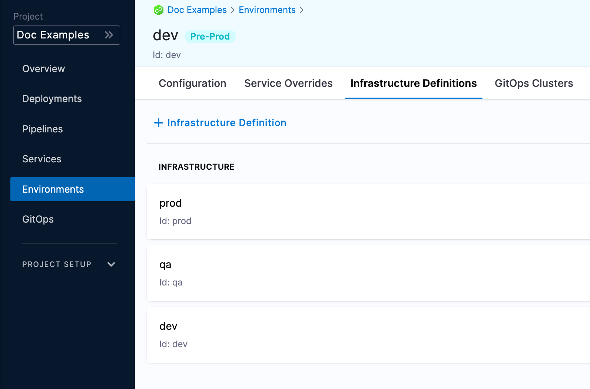

Infrastructure definitions represent an environment's infrastructures physically. They are the actual clusters, hosts, namespaces, etc, where you are deploying a service.

An environment can have multiple **Infrastructure Definitions**. 

When you select an environment in a stage, you can select the **Infrastructure Definition** to use for that stage.

