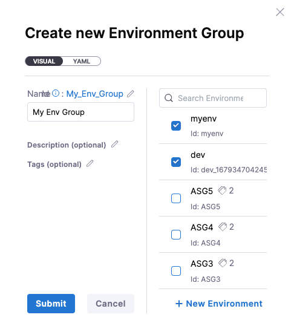

Environment groups are simple a way to group environments so you can assign permissions to multiple environments in a role.

1. From your project, select **Environments**.
2. Select **Environment Groups** on the top of the page.
3. Select **New Environment Group**.
   


4. Enter a name for the environment group, and select the environments you want to add to this group. You can also select **New Environment** to create a new environment and add it to this group. 

:::note

You can only add environments in the same scope (Harness project, org, account) as the environment group. For example, if the environment group is configured at the project level, only environments in the project level can be configured for the group.

:::



Here is a sample environment group YAML.

```
environmentGroup:
  name: My Env Group
  identifier: My_Env_Group
  description: ""
  tags: {}
  orgIdentifier: default
  projectIdentifier: CD_Docs
  envIdentifiers:
    - myenv
    - dev_1679347042451
```

5. Select **Submit**.


## Using environment groups

Environment groups can only be used in multi environment and infrastructure based deployments. By default, Harness will loop through each environment in the environment group and deploy. You can specify whether you want to deploy to one environment or all the environments in the group.

## Referencing environment groups

You can reference which environment group was selected using as an expression. It can be captured as an output from the infrastructure step in the pipeline.

- Environment group name: `<+pipeline.stages.[STAGE_ID].spec.infrastructure.output.environment.envGroupName>`.

- Environment group Id: `<+pipeline.stages.[STAGE_ID].spec.infrastructure.output.environment.envGroupRef>`.

