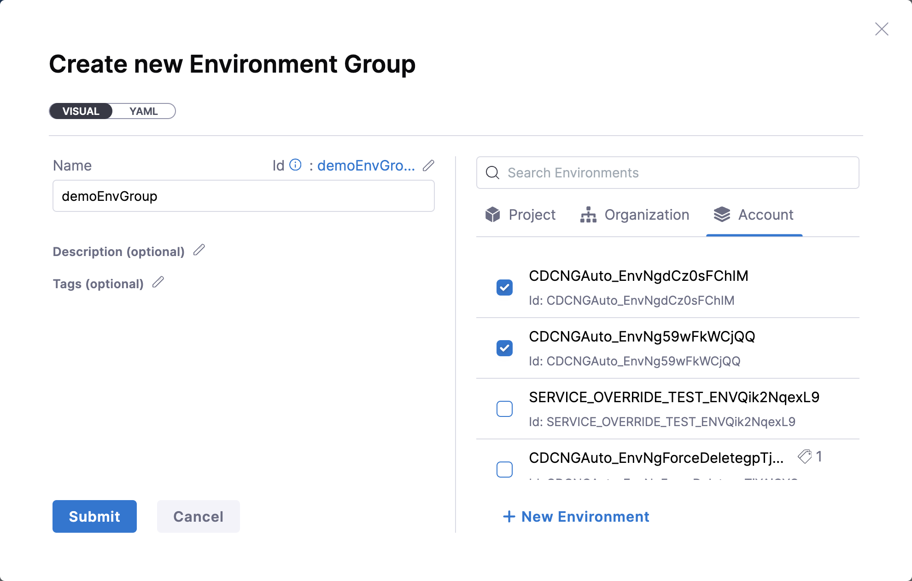
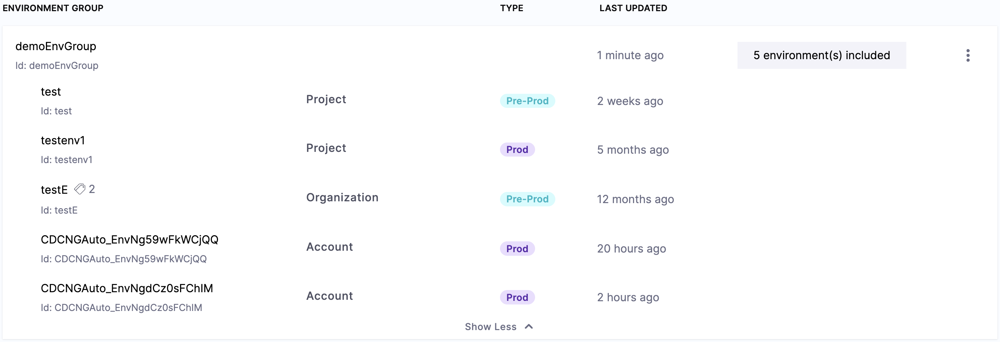

Environment groups are simple a way to group environments so you can assign permissions to multiple environments in a role.

1. From your Project Settings, select **Environments**.
2. Select **Environment Groups** on the top-right corner of the page.
3. Select **New Environment Group**.
   


4. Enter a name for the environment group, and select the environments you want to add to this group. You can also select **New Environment** to create a new environment and add it to this group. 

:::note

You can only add environments in the same scope (Harness project, org, account) as the environment group. For example, if the environment group is configured at the project level, only environments in the project level can be configured for the group.

:::


5. Click **Submit**.

Here is a sample environment group YAML.

```
environmentGroup:
  name: My Env Group
  identifier: My_Env_Group
  description: ""
  tags: {}
  orgIdentifier: default
  projectIdentifier: CD_Docs
  envIdentifiers:
    - myenv
    - dev_1679347042451
```


## Cross Scope Environment Groups

You can also add environments created at the Project and Organization levels to the environment groups.

:::note
Currently, the Cross Scope Environment Groups feature is behind the feature flag `CDS_CROSS_SCOPED_ENV_GROUPS`. Contact [Harness Support](mailto:support@harness.io) to enable the feature.
:::

1. From your Project Settings, select **Environments**.
2. Select **Environment Groups** at the top-right corner of the page.
3. Click **New Environment Group**.
4. Enter a name for the environment group. All the environments created at the **Project**, **Organization**, and **Account** levels will be displayed under the respective tabs. Select the environments needed in your environment group and click **Submit**.



Once the Environment group is created, you can see all the environments along with their scopes listed.



Below is an example of the YAML for an environment group:

```yaml
environmentGroup:
  name: demoEnvGroup
  identifier: demoEnvGroup
  description: ""
  tags: {}
  orgIdentifier: default
  projectIdentifier: CD_Docs
  envIdentifiers:
    - test
    - testenv1
    - org.testE
    - account.CDCNGAuto_EnvNg59wFkWCjQQ
    - account.CDCNGAuto_EnvNgdCz0sFChIM
```

Under `envIdentifiers`,
- The environments associated with the **Project** level do not have a prefix.
- The environments associated with the **Organization level** are prefixed with `org.`
- The environments associated with the Account level are prefixed with `account.`

## Using environment groups

Environment groups can only be used in multi environment and infrastructure based deployments. By default, Harness will loop through each environment in the environment group and deploy. You can specify whether you want to deploy to one environment or all the environments in the group.

## Referencing environment groups

You can reference which environment group was selected using as an expression. It can be captured as an output from the infrastructure step in the pipeline.

- Environment group name: `<+pipeline.stages.[STAGE_ID].spec.infrastructure.output.environment.envGroupName>`.

- Environment group Id: `<+pipeline.stages.[STAGE_ID].spec.infrastructure.output.environment.envGroupRef>`.

## Limitations

- You cannot pass environment group in the studio as an expression
   - Harness team is looking to solve:
      -  How to handle infrastructures that have runtime input parameters when the expression is referenced?
      -  How to deploy to a subset of those environments in the environment group?
      -  How do we propagate the environment group as an expression to the following stage?
     
     

