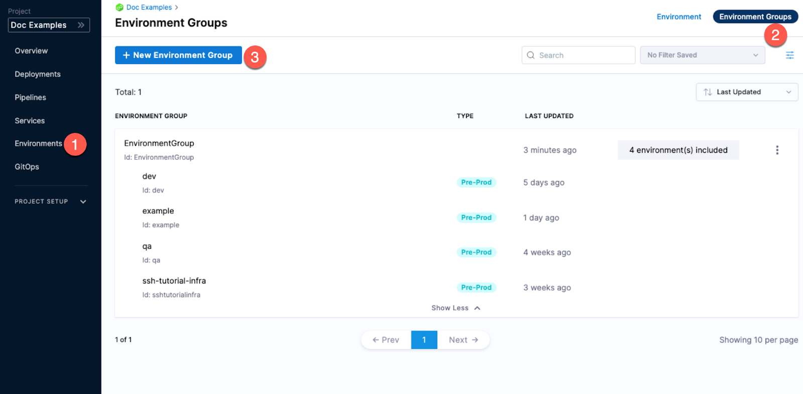

Environment groups are simple a way to group environments so you can assign permissions to multiple environments in a role.

1. From your project, select **Environments**.
2. Select **Environment Groups** on the top of the page.
3. Select **New Environment Group**.
   


4. Enter a name for the environment group, and select the environments you want to add to this group. You can also create **New Environment** and add it to this group. 

*Note: Users can only select environments in the same scope of the environment group to be considered for the group. This means if the environment group is configured at the project level, only environments in the project level can be configured for the group. Same with Organization and Account. The environments must be at the same level (scope) as the configured group.*


Here is a sample environment group YAML.

```
environmentGroup:
  name: My Env Group
  identifier: My_Env_Group
  description: ""
  tags: {}
  orgIdentifier: default
  projectIdentifier: CD_Docs
  envIdentifiers:
    - myenv
    - dev_1679347042451
```

5. Select **Submit**.


## Using Environment Groups

Environment Groups can only be used in Multi Environment and Infrastructure based deployments. By default, Harness will loop through each environment in the Environment group and deploy. User's can specify whether they want to deploy to one environment or all the environments in thr group.

## Referencing Environment Groups

User's can reference the Environment Group selected as an expression. It can be captured as an output from the infrastructure step in the pipeline.

**Name**
`<+pipeline.stages.[YOUR_STAGE_ID].spec.infrastructure.output.environment.envGroupName>`

**Identifier**
`<+pipeline.stages.[YOUR_STAGE_ID].spec.infrastructure.output.environment.envGroupRef>`

