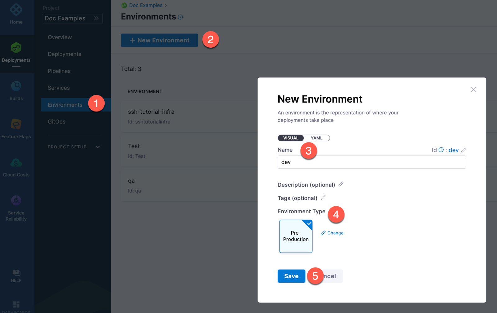
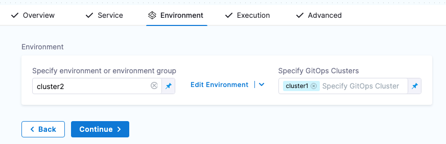

Environments represent your deployment targets (QA, Prod, etc). Each environment contains one or more **Infrastructure Definitions** that list your target clusters, hosts, namespaces, etc.

## Create an environment

You can create environments from: 
* Within a pipeline
* Outside a pipeline 
* An account
* An Organization

```mdx-code-block
import Tabs from '@theme/Tabs';
import TabItem from '@theme/TabItem';
```
```mdx-code-block
<Tabs>
  <TabItem value="Within a pipeline" label="Within a pipeline">
```
To create an environment from inside of a pipeline, select **New Environment** in the **Infrastructure** tab of a new CD stage.


```mdx-code-block
  </TabItem>
  <TabItem value="Outside a pipeline" label="Outside a pipeline">
```
To create an Environment from outside of a pipeline, you use **Environments** in the navigation pane.



```mdx-code-block
  </TabItem>
  <TabItem value="From organization or account" label="From organization or account">
```

You can create an environment and provide infrastructure definitions at an account or organization level from the Harness UI, using APIs or Terraform.

```mdx-code-block
import Tabs2 from '@theme/Tabs';
import TabItem2 from '@theme/TabItem';
```
```mdx-code-block
<Tabs2>
  <TabItem2 value="Pipeline Studio" label="Pipeline Studio">
```

To create an environment at an account or organization level, go to **Organization Resources** **>Environments**. 


Expand the section below to see a sample account level environment YAML.

<details>
   <summary>Account level environment YAML</summary>

```
environment:
  name: dev
  identifier: dev
  description: account wide dev environment
  tags:
    status: non-regulated
  type: PreProduction
  variables:
    - name: port
      type: String
      value: "8080"
      description: ""
    - name: namespace
      type: String
      value: <+service.name>-dev
      description: "namespace environment variable"
```
</details>

Expand the section below to see a sample account level infrastructure definition YAML.

<details>
   <summary>Account level infrastructure definition YAML</summary>

```
infrastructureDefinition:
  name: dev-k8s
  identifier: dev
  description: development Kubernetes cluster
  tags: {}
  environmentRef: dev
  deploymentType: Kubernetes
  type: KubernetesDirect
  spec:
    connectorRef: account.Harness_Kubernetes_Cluster
    namespace: <+service.name>-dev
    releaseName: release-<+INFRA_KEY>
  allowSimultaneousDeployments: false
```
</details>

Expand the section below to see a sample organization level environment YAML.

<details>
   <summary>Organization level environment YAML</summary>

```
environment:
  name: prod
  identifier: prod
  description: production environment for the organization
  tags:
    status: regulated
  type: Production
  orgIdentifier: default
  variables:
    - name: namespace
      type: String
      value: <+service.name>-prod
      description: "namespace for prod environment"
    - name: port
      type: String
      value: "8080"
      description: "port for prod environment"
```
</details>

Expand the section below to see a sample organization level infrastructure definition YAML.

<details>
   <summary>Organization level infrastructure definition YAML</summary>

```
infrastructureDefinition:
  name: prod-k8s
  identifier: prodk8s
  description: production kubernetes cluster
  tags: {}
  orgIdentifier: default
  environmentRef: prod
  deploymentType: Kubernetes
  type: KubernetesDirect
  spec:
    connectorRef: account.Harness_Kubernetes_Cluster
    namespace: production
    releaseName: release-<+INFRA_KEY>
  allowSimultaneousDeployments: false
```
</details>

```mdx-code-block
  </TabItem2>
  <TabItem2 value="API" label="API">
```
For information about creating an environment API, go to [create an environment](https://apidocs.harness.io/tag/Environments#operation/createEnvironmentV2).

For information about creating infrastructure definition API, go to [create an infrastructure in an environment](https://apidocs.harness.io/tag/Infrastructures#operation/createInfrastructure).

The `orgIdentifier` and `projectIdentifier` field definitions are optional, and depend on where you want to create the environment. For example, if you create an environment at an account level, you will not need org or project identifiers in the post API call payload.

```mdx-code-block
  </TabItem2>
  <TabItem2 value="Terraform" label="Terraform">
```
For information about creating a Harness platform environment, go to [harness_platform_environment (Resource)](https://registry.terraform.io/providers/harness/harness/latest/docs/resources/platform_environment).

Expand the section below to see a sample platform environment in Terraform. 

<details>
   <summary>Harness platform environment</summary>

```
resource "harness_platform_environment" "example" {
  identifier = "identifier"
  name       = "name"
  org_id     = "org_id"
  project_id = "project_id"
  tags       = ["foo:bar", "baz"]
  type       = "PreProduction"

  ## ENVIRONMENT V2 Update
  ## The YAML is needed if you want to define the Environment Variables and Overrides for the environment
  ## Not Mandatory for Environment Creation nor Pipeline Usage

  yaml = <<-EOT
               environment:
         name: name
         identifier: identifier
         orgIdentifier: org_id
         projectIdentifier: project_id
         type: PreProduction
         tags:
           foo: bar
           baz: ""
         variables:
           - name: envVar1
             type: String
             value: v1
             description: ""
           - name: envVar2
             type: String
             value: v2
             description: ""
         overrides:
           manifests:
             - manifest:
                 identifier: manifestEnv
                 type: Values
                 spec:
                   store:
                     type: Git
                     spec:
                       connectorRef: <+input>
                       gitFetchType: Branch
                       paths:
                         - file1
                       repoName: <+input>
                       branch: master
           configFiles:
             - configFile:
                 identifier: configFileEnv
                 spec:
                   store:
                     type: Harness
                     spec:
                       files:
                         - account:/Add-ons/svcOverrideTest
                       secretFiles: []
      EOT
}
```
</details>

For information about creating a Harness platform infrastructure definition, go to [harness_platform_infrastructure (Resource)](https://registry.terraform.io/providers/harness/harness/latest/docs/resources/platform_infrastructure).

Expand the section below to see a sample platform infrastructure definition in Terraform.

<details>
   <summary>Harness platform infrastructure definition</summary>

```
resource "harness_platform_infrastructure" "example" {
  identifier      = "identifier"
  name            = "name"
  org_id          = "orgIdentifer"
  project_id      = "projectIdentifier"
  env_id          = "environmentIdentifier"
  type            = "KubernetesDirect"
  deployment_type = "Kubernetes"
  yaml            = <<-EOT
        infrastructureDefinition:
         name: name
         identifier: identifier
         description: ""
         tags:
           asda: ""
         orgIdentifier: orgIdentifer
         projectIdentifier: projectIdentifier
         environmentRef: environmentIdentifier
         deploymentType: Kubernetes
         type: KubernetesDirect
         spec:
          connectorRef: account.gfgf
          namespace: asdasdsa
          releaseName: release-<+INFRA_KEY>
          allowSimultaneousDeployments: false
      EOT
}
```
</details>

The `org_id` and `project_id` field definitions are optional, and depend on where you want to create the environment. For example, if you create an environment at an account level, you will not need org or project identifiers.

```mdx-code-block
  </TabItem2>    
</Tabs2>
```
```mdx-code-block
  </TabItem>    
</Tabs>
```

## Define the environment configuration

In the environment **Configuration**, you can manage the **Name**, **Description**, **Tags**, and **Environment Type** of the environment.


You can also set default manifests, specifications, config files, and variables to use whenever Harness deploys a service to this environment.

For example, a stage has a Kubernetes service with a manifest but whenever that service is deployed to the **QA** environment, the manifest in that environment's **Configuration** overwrites the namespace of with the manifest in the service with `QA`.

## Create service overrides

Service overrides are different from **Environment Configuration** in the following ways:

* Environment **Configuration**: applies to every service that is used with the environment.
* Environment **Service Overrides**: applies to specific services you select. Whenever that service is used with that environment, the **Service Override** is applied.


### Override priority

When you are using environment configuration and service override to override service settings, it's important to understand the priority of the overrides.

The priority from top to bottom is:

1. Environment service overrides
2. Environment configuration
3. Service settings


### Overriding values.yaml

You can specify values YAML files at the environment's **Service Overrides** and **Configuration**, and the service itself.

Here is an example of specifying it at the environment's **Configuration**:


When you have a values yaml file at two or more of the environment **Service Overrides**, **Environment Configuration**, and the service itself, Harness merges the files into a single values YAML for deployment. This merging is performed at pipeline execution runtime.

Overriding occurs when the higher priority setting has the same `name:value` pair as a lower priority setting.

Let's look at two examples.

### Merging values.yaml name:value pairs

An environment's **Service Overrides** values YAML has the name:value pair `servicePort: 80` but no `replicas` name:value.

A service's **Service Definition** has a values YAML with `replicas: 2` but no `servicePort` name:value.

At runtime, the two values YAML files are merged into one.

The `servicePort: 80` from the environment **Service Overrides** values YAML is merged with the **Service Definition**'s `replicas: 2` in the values YAML:


### Fully overriding values.yaml name:value pairs

An environment's **Service Overrides** values YAML has the name:value pairs `replicas: 2` and `servicePort: 80`. 

A service's **Service Definition** has a values YAML with `replicas: 4` and `servicePort: 8080`. 

At runtime, the name:value pairs from the environment **Service Overrides** values YAML fully override the service values YAML. The `replicas: 2` and `servicePort: 80` from the environment **Service Overrides** are used.


### Fully overriding config files and variables

Config files are a black box that can contain multiple formats and content, such as YAML, JSON, plain text, etc. Consequently, they cannot be overridden like Values YAML files.

Variables cannot be partially overridden either. They are completely replaced.

When you have **Config files** at two or more of the environment **Service Overrides**, **Configuration**, and the service itself, the standard override priority is applied.

When you have **Variables** with the same name at two or more of the environment **Service Overrides**, **Configuration**, and the service itself, the standard override priority is applied.

## Add infrastructure definitions

Infrastructure definitions represent an environment's infrastructures physically. They are the actual clusters, hosts, namespaces, etc, where you are deploying a service.

An environment can have multiple **Infrastructure Definitions**. 


When you select an environment in a stage, you can select the **Infrastructure Definition** to use for that stage.


## Propagating environments through multiple stages

:::info note

Currently, this feature is behind the feature flag `CDS_ENV_PROPAGATION`. Contact [Harness Support](mailto:support@harness.io) to enable the feature.

:::

When modeling multiple Deploy stages in a pipeline, you can propagate the environment and infrastructure definition selected in one stage to one or more subsequent stages. 

When you propagate an environment, the same infrastructure definition that was used in the parent stage is propagated to the child stage. You cannot propagate an environment and then select a different infrastructure definition.

:::info note

You can also propagate services between stages. For more information, go to [Propagate CD services](/docs/continuous-delivery/x-platform-cd-features/services/propagate-and-override-cd-services).

:::

### Important notes

- Propagation is only supported for Deploy stages. Custom stages do not have environments.
- You cannot propagate environments between different deployment types. For example, you cannot propagate a Kubernetes environment between a Kubernetes deployment stage and a Shell Script deployment stage.
- Environment propagation is not supported when using multiple environments in a single stage (multi environment deployments).
- Environment propagation is progressive. You can only propagate environments from stage to stage in a forward direction in your pipeline. For example, Stage 2 cannot propagate an environment from a subsequent Stage 3.
- In a pipeline's **Advanced Options**, in **Stage Execution Settings**, you can set up selective stage executions. This allows you to select which stages to deploy at runtime.
  - If you select a stage that uses a propagated environment (a child environment), that stage will not work. This is because the parent environment's settings must be resolved as part of the deployment. 
- When propagation is set up between a parent stage and child stage, moving the parent or child stage out of sequence resets any propagated settings to their defaults. If you do this, you are prompted to confirm. If you confirm, the stages are reset to their defaults.
  
    


### Propagate an environment

1. Open a pipeline that contains at least one Deploy stage.
2. Add a subsequent Deploy stage.
3. In **Service**, select a service for the stage, and then select **Continue**.
4. In **Environment**, select **Propagate Environment From**.
5. In **Propagate Environment From**, select the environment of a previous stage.
   
   The environment and infrastructure definition from the previous stage is now configured in this stage.

   <docimage path={require('./static/cf661bc9c2f43bd4e33babeedb3ed9002bfdf3722c5bb3bd2417fe92c6b1122b.png')} width="60%" height="60%" title="Click to view full size image" />  


## Define GitOps clusters

When you use Harness GitOps you can add GitOps clusters to an environment. 

To learn more about Harness GitOps, go to [Harness GitOps basics](/docs/continuous-delivery/gitops/harness-git-ops-basics). 

Next, when you create a pipeline, you can select the environment and the GitOps cluster(s) to use.



GitOps clusters are used in a PR pipeline. A PR pipeline creates and merges a Git PR on the `config.json` for a destination cluster as part of an ApplicationSet. The PR Pipeline runs, merges a change to the config.json, and a GitOps sync on the ApplicationSet is initiated.

GitOps Clusters are not used in standard CD pipelines. They're used when using GitOps only.


## Runtime inputs and expressions in environments

If you use runtime inputs in your environments, you will need to provide values for these when they run pipeline using these environments.

If you use expressions in your environments, Harness must be able to resolve these expressions when users run pipeline using these environments.

Select **Runtime input** for the environment.


When you run the pipeline, you can select the environment for their runtime inputs.


For more information on runtime inputs and expressions, go to [fixed values, runtime inputs, and expressions](/docs/platform/references/runtime-inputs/).