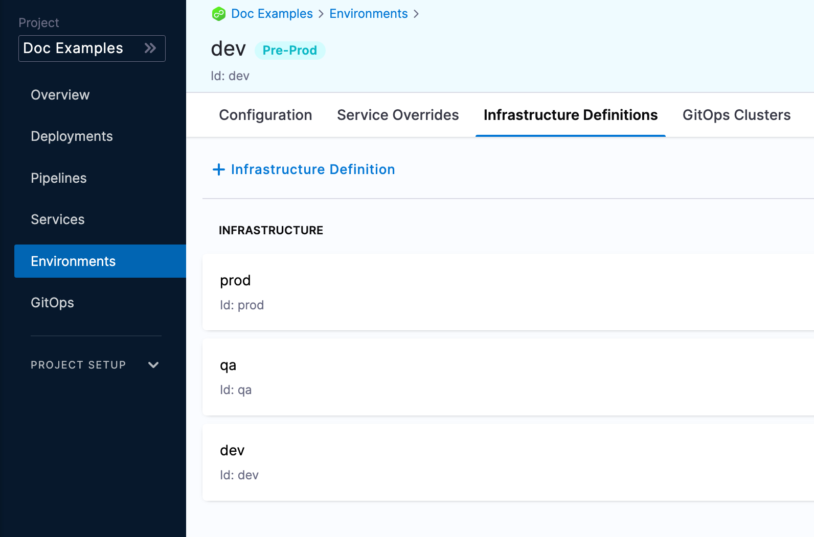
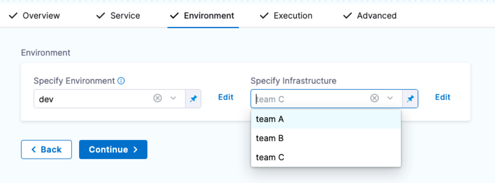
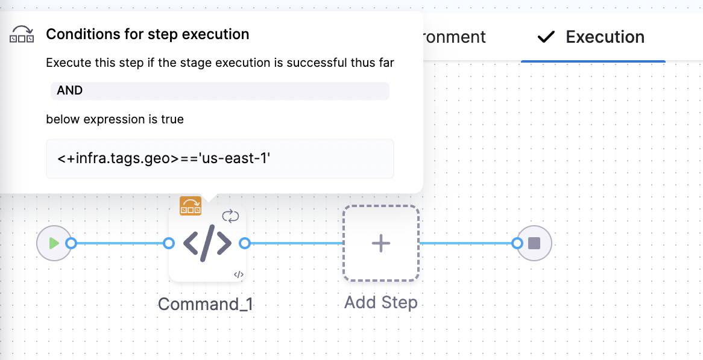

A Harness environment represents where you are deploying your application. You categorize each environment as prod or non-prod.

Environments represent your deployment targets (QA, Prod, etc). Each environment contains one or more **Infrastructure Definitions** that list your target clusters, hosts, namespaces, etc.

Each infrastructure definition in an environment defines the specific VM, Kubernetes cluster, or target infrastructure where you plan to deploy your application. An environment can contain multiple infrastructure definitions. When you select an environment in a pipeline, you can pick which infrastructure definition to use.

The service configuration overrides allows you to override service properties when a service is deployed into a specific environment.

Environment variables are global variables for that environment. You can leverage those in their pipelines, manifests, etc.

For example, you might have an environment that is prod, and within prod you have 5 infrastructure definitions representing the 5 Kubernetes clusters associated with the production environment.

## Creating environments

You can create environments from:

- An Account
- An Organization
- Within a pipeline
- Outside a pipeline

When you create an environment in a pipeline, it's automatically added to **Environments**. You can add the same environment to as many pipelines as you need.

For more information, go to [create environments](/docs/continuous-delivery/x-platform-cd-features/environments/create-environments).

### Creating environments at an account or organization level

You can create an environment and provide infrastructure definitions at an account or organization level from the Harness UI, using APIs or Terraform.

import Tabs from '@theme/Tabs';
import TabItem from '@theme/TabItem';

<Tabs>
  <TabItem value="Pipeline Studio" label="Pipeline Studio">

To create an environment at an account or organization level, go to **Organization Resources** **>Environments**.


Expand the section below to see a sample account level environment YAML.

<details>
<summary>Account level environment YAML</summary>

```yaml
environment:
  name: dev
  identifier: dev
  description: account wide dev environment
  tags:
    status: non-regulated
  type: PreProduction
  variables:
    - name: port
      type: String
      value: "8080"
      description: ""
    - name: namespace
      type: String
      value: <+service.name>-dev
      description: "namespace environment variable"
```

</details>

Expand the section below to see a sample account level infrastructure definition YAML.

<details>
<summary>Account level infrastructure definition YAML</summary>

```yaml
infrastructureDefinition:
  name: dev-k8s
  identifier: dev
  description: development Kubernetes cluster
  tags: {}
  environmentRef: dev
  deploymentType: Kubernetes
  type: KubernetesDirect
  spec:
    connectorRef: account.Harness_Kubernetes_Cluster
    namespace: <+service.name>-dev
    releaseName: release-<+INFRA_KEY_SHORT_ID>
  allowSimultaneousDeployments: false
```

</details>

Expand the section below to see a sample organization level environment YAML.

<details>
<summary>Organization level environment YAML</summary>

```yaml
environment:
  name: prod
  identifier: prod
  description: production environment for the organization
  tags:
    status: regulated
  type: Production
  orgIdentifier: default
  variables:
    - name: namespace
      type: String
      value: <+service.name>-prod
      description: "namespace for prod environment"
    - name: port
      type: String
      value: "8080"
      description: "port for prod environment"
```

</details>

Expand the section below to see a sample organization level infrastructure definition YAML.

<details>
<summary>Organization level infrastructure definition YAML</summary>

```yaml
infrastructureDefinition:
  name: prod-k8s
  identifier: prodk8s
  description: production kubernetes cluster
  tags: {}
  orgIdentifier: default
  environmentRef: prod
  deploymentType: Kubernetes
  type: KubernetesDirect
  spec:
    connectorRef: account.Harness_Kubernetes_Cluster
    namespace: production
    releaseName: release-<+INFRA_KEY_SHORT_ID>
  allowSimultaneousDeployments: false
```

</details>

  </TabItem>
  <TabItem value="API" label="API">

For information about creating an environment API, go to [create an environment](https://apidocs.harness.io/tag/Environments#operation/createEnvironmentV2).

For information about creating infrastructure definition API, go to [create an infrastructure in an environment](https://apidocs.harness.io/tag/Infrastructures#operation/createInfrastructure).

The `orgIdentifier` and `projectIdentifier` field definitions are optional, and depend on where you want to create the environment. For example, if you create an environment at an account level, you will not need org or project identifiers in the post API call payload.

  </TabItem>
  <TabItem value="Terraform" label="Terraform">

For information about creating a Harness platform environment, go to [harness_platform_environment (Resource)](https://registry.terraform.io/providers/harness/harness/latest/docs/resources/platform_environment).

Expand the section below to see a sample platform environment in Terraform.

<details>
<summary>Harness platform environment</summary>

```hcl
resource "harness_platform_environment" "example" {
  identifier = "identifier"
  name       = "name"
  org_id     = "org_id"
  project_id = "project_id"
  tags       = ["foo:bar", "baz"]
  type       = "PreProduction"

  ## ENVIRONMENT V2 Update
  ## The YAML is needed if you want to define the Environment Variables and Overrides for the environment
  ## Not Mandatory for Environment Creation nor Pipeline Usage

  yaml = <<-EOT
               environment:
         name: name
         identifier: identifier
         orgIdentifier: org_id
         projectIdentifier: project_id
         type: PreProduction
         tags:
           foo: bar
           baz: ""
         variables:
           - name: envVar1
             type: String
             value: v1
             description: ""
           - name: envVar2
             type: String
             value: v2
             description: ""
         overrides:
           manifests:
             - manifest:
                 identifier: manifestEnv
                 type: Values
                 spec:
                   store:
                     type: Git
                     spec:
                       connectorRef: <+input>
                       gitFetchType: Branch
                       paths:
                         - file1
                       repoName: <+input>
                       branch: master
           configFiles:
             - configFile:
                 identifier: configFileEnv
                 spec:
                   store:
                     type: Harness
                     spec:
                       files:
                         - account:/Add-ons/svcOverrideTest
                       secretFiles: []
      EOT
}
```

</details>

For information about creating a Harness platform infrastructure definition, go to [harness_platform_infrastructure (Resource)](https://registry.terraform.io/providers/harness/harness/latest/docs/resources/platform_infrastructure).

Expand the section below to see a sample platform infrastructure definition in Terraform.

<details>
<summary>Harness platform infrastructure definition</summary>

```hcl
resource "harness_platform_infrastructure" "example" {
  identifier      = "identifier"
  name            = "name"
  org_id          = "orgIdentifer"
  project_id      = "projectIdentifier"
  env_id          = "environmentIdentifier"
  type            = "KubernetesDirect"
  deployment_type = "Kubernetes"
  yaml            = <<-EOT
        infrastructureDefinition:
         name: name
         identifier: identifier
         description: ""
         tags:
           asda: ""
         orgIdentifier: orgIdentifer
         projectIdentifier: projectIdentifier
         environmentRef: environmentIdentifier
         deploymentType: Kubernetes
         type: KubernetesDirect
         spec:
          connectorRef: account.gfgf
          namespace: asdasdsa
          releaseName: release-<+INFRA_KEY_SHORT_ID>
          allowSimultaneousDeployments: false
      EOT
}
```

</details>

The `org_id` and `project_id` field definitions are optional, and depend on where you want to create the environment. For example, if you create an environment at an account level, you will not need org or project identifiers.

  </TabItem>
</Tabs>

### Creating environments inside a pipeline

To create an environment from inside of a pipeline, select **New Environment** in the **Infrastructure** tab of a new CD stage.


### Creating environments outside a pipeline

To create an Environment from outside of a pipeline, you use **Environments** in the navigation pane.


## Defining environment settings

After creating an environment, you can define all its settings:

* **Configuration:** the default environment configuration, including variables, manifests, specifications, and config files that will be used every time the environment is used in a stage.
* **Service Overrides:** override specific services. You select a service and define what will be overridden whenever that Service is deployed to this environment.
* **Infrastructure Definitions:** represent one or more environment infrastructures.
  * Infrastructure definitions are the actual clusters, hosts, etc., where Harness deploys a service. For example, you might have a QA environment with separate Kubernetes clusters (infrastructure definitions) for each service you want to test.
  * You can add multiple infrastructure definitions to a single environment and select an infrastructure definition when you add the environment to a stage.
* **GitOps Clusters:** adding Harness GitOps clusters to an environment lets you select them as the deployment target in stages. For more information on Harness GitOps, go to [Harness GitOps basics](/docs/continuous-delivery/gitops/get-started/harness-git-ops-basics).
* **Referenced by:** displays the list of pipelines using the infrastructure definitions in the environment.

### Configuration

In the environment **Configuration**, you can manage the **Name**, **Description**, **Tags**, and **Environment Type** of the environment.


You can also set default manifests, specifications, config files, and variables to use whenever Harness deploys a service to this environment.

For example, a stage has a Kubernetes service with a manifest but whenever that service is deployed to the **QA** environment, the manifest in that environment's **Configuration** overwrites the namespace of the manifest in the service with `QA`.

### Service overrides

Service overrides are different from **Environment Configuration** in the following ways:

- Environment **Configuration**: applies to every service that is used with the environment.
- Environment **Service Overrides**: applies to specific services you select. Whenever that service is used with that environment, the **Service Override** is applied.

:::note
Runtime inputs are not supported if you are trying to override services in multi-service and multi-environment set ups.
:::

#### Override priority

When you are using environment configuration and service override to override service settings, it's important to understand the priority of the overrides.

The priority from top to bottom is:

1. Environment service overrides
2. Environment configuration
3. Service settings


#### Override priority example

Suppose you have a pipeline that runs as follows:

- Deploys a service named `myService`, which has a variable `cpu` set to 1.
- Deploys `myService` to `myEnvironmentAlpha`, and then overrides the `myService` variable `cpu` value to 2.

In this case, the environment variable takes precedence, and overrides the service variable. When the pipeline runs, it uses the `cpu` value of 2.

Now, suppose you have another pipeline that deploys `myService` to `myEnvironmentKappa`, which has a service override that sets `cpu` to 4. In this case, the environment service override takes precedence over the environment configuration and the service setting. When the pipeline runs, it uses the `cpu` value of 4.

### Infrastructure definitions

Infrastructure definitions represent an environment's infrastructures physically. They are the actual clusters, hosts, namespaces, etc, where you are deploying a service.

An environment can have multiple **Infrastructure Definitions**.



When you select an environment in a stage, you can select the **Infrastructure Definition** to use for that stage.



:::info note
During pipeline execution, all infrastructure definitions are displayed, regardless of whether they are scoped to the selected service. Users are advised to manually ensure that only the appropriate infrastructure definitions are chosen for their services. This limitation is more prominent when services or environments are dynamically expressed, as scoping may not apply consistently.
:::

#### Infrastructure Tags

Tags can be attached to infrastructure definitions representing their characteristics. These tags can be key value pairs.


When you select the **Infrastructure Definition** for a stage, the attached tags can be accessed using their keys with the expression, `<+infra.tags.tag_key>`. This expression is available for use throughout the stage.

For example, skipping certain steps in pipeline based on the tags attached to the infrastructure.



:::note
You can now define allowed values in the Select Hosts settings under infrastructure. In the runtime view, a multi-select dropdown will be displayed, allowing users to choose from the predefined allowed values.
:::

## Values YAML overrides and merges

You can specify values YAML files at the environment's **Service Overrides** and **Configuration**, and the service itself.

Here is an example of specifying it at the environment's **Configuration**:


When you have a values yaml file at two or more of the environment **Service Overrides**, **Environment Configuration**, and the service itself, Harness merges the files into a single values YAML for deployment. This merging is performed at pipeline execution runtime.

Overriding occurs when the higher priority setting has the same `name:value` pair as a lower priority setting.

Let's look at two examples.

### Merging values YAML name:value pairs

An environment's **Service Overrides** values YAML has the name:value pair `servicePort: 80` but no `replicas` name:value.

A service's **Service Definition** has a values YAML with `replicas: 2` but no `servicePort` name:value.

At runtime, the two values YAML files are merged into one.

The `servicePort: 80` from the environment **Service Overrides** values YAML is merged with the **Service Definition**'s `replicas: 2` in the values YAML:


### Fully overriding values YAML name:value pairs

An environment's **Service Overrides** values YAML has the name:value pairs `replicas: 2` and `servicePort: 80`.

A service's **Service Definition** has a values YAML with `replicas: 4` and `servicePort: 8080`.

At runtime, the name:value pairs from the environment **Service Overrides** values YAML fully override the service values YAML. The `replicas: 2` and `servicePort: 80` from the environment **Service Overrides** are used.


## Config files and variables are completely overridden

Config files are a black box that can contain multiple formats and content, such as YAML, JSON, plain text, etc. Consequently, they cannot be overridden like Values YAML files.

Variables cannot be partially overridden either. They are completely replaced.

When you have **Config files** at two or more of the environment **Service Overrides**, **Configuration**, and the service itself, the standard override priority is applied.

When you have **Variables** with the same name at two or more of the environment **Service Overrides**, **Configuration**, and the service itself, the standard override priority is applied.

## GitOps Clusters

When you use Harness GitOps you can add GitOps clusters to an environment.

To learn more about Harness GitOps, go to [Harness GitOps Basics](/docs/continuous-delivery/gitops/get-started/harness-git-ops-basics.md).

You can select your environment (Deployments → Environments → Your Environment), then click the **GitOps Clusters** tab to view the list of GitOps clusters associated with an environment. Each row's **Cluster ID** and **Agent** name is a link that opens the corresponding Cluster or Agent detail page in a new tab:

- **Cluster ID**: Click to open the Cluster's detail page in a new tab.
- **Agent name**: Click to open the linked Agent's detail page in a new tab.

To add a cluster to this list:

1. Click **+ Select Cluster** at the top of the page.
2. In the **Select GitOps Clusters to add to Environment** popup, choose the scope tab—**Project**, **Organization**, or **Account**—to view clusters in that scope.
3. Select the desired GitOps cluster from the list.
4. Click **Apply Selected**. The selected cluster will now appear in the Environment's **GitOps Clusters** list.

<div align="center">
  <DocImage path={require('./static/gitops-cluster.png')} width="60%" height="60%" title="Click to view full size image" />
</div>

Next, when you create a pipeline, you can select the environment and the GitOps cluster(s) to use.


GitOps clusters are used in a PR pipeline. A PR pipeline creates and merges a Git PR on the `config.json` for a destination cluster as part of an ApplicationSet. The PR Pipeline runs, merges a change to the config.json, and a GitOps sync on the ApplicationSet is initiated.

GitOps Clusters are not used in standard CD pipelines. They're used when using GitOps only.

## Runtime inputs and expressions in environments

If you use runtime inputs in your environments, users will need to provide values for these when they run pipelines using these environments.

If you use expressions in your environments, Harness must be able to resolve these expressions when users run pipelines using these environments.

Select **Runtime input** for the environment.


When you run the pipeline, you can select the environment for runtime inputs.


For more information on runtime inputs and expressions, go to [Fixed Values, Runtime Inputs, and Expressions](/docs/platform/variables-and-expressions/runtime-inputs/).

## Environments RBAC

Go to [RBAC in Harness](/docs/platform/role-based-access-control/rbac-in-harness) for examples of RBAC use cases for environments.

### Access permission is needed to deploy to an environment

One of the most important advantages of environments is the ability to define roles that determines who can deploy them.

In order for a role to allow deployments using environments, the role must have the access permission enabled for environments.


The **View**, **Create**, **Edit**, **Delete**, and **Manage** permissions enable you to deploy an environment.

If a role does not have the **Access** permission for **Environments**, a user or user group assigned that role cannot deploy to any environment.

### Restrict access to specific environments for a user or user group

You can restrict a user or user group to using specific environments only.

If you want to restrict a user or user group to deploy to a specific environment only, do the following:

1. Create a resource group and select the environment.
2. Create a role and give the user or user group permissions. The **Access** permission is needed for deployments.
3. Assign the role and resource group to the user or user group.


## Environment groups

Environment groups are simply a way to group environments so you can assign permissions to multiple environments in a role.


