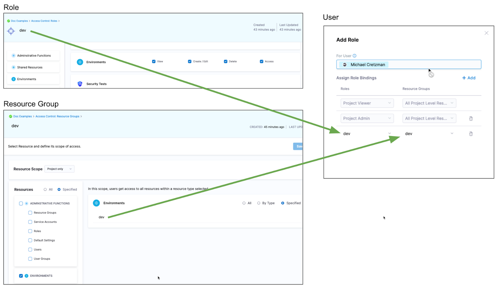

A Harness environment represents where you are deploying your application. You categorize each environment as prod or non-prod.

Each infrastructure definition in an environment defines the specific VM, Kubernetes cluster, or target infrastructure where you plan to deploy your application. An environment can contain multiple infrastructure definitions. When you select an environment in a pipeline, you can pick which infrastructure definition to use.

The service configuration overrides allows you to override service properties when a service is deployed into a specific environment.

Environment variables are global variables for that environment. You can leverage those in their pipelines, manifests, etc.

For example, you might have an environment that is prod, and within prod you have 5 infrastructure definitions representing the 5 Kubernetes clusters associated with the production environment.

## Creating environments

You can create environments in **Environments**, when you're building your pipelines, or at an account or organization levels. 

When you create an environment in a pipeline, it's automatically added to **Environments**. You can add the same environment to as many pipelines as you need. 

For more information, go to [create environments](/docs/continuous-delivery/x-platform-cd-features/environments/create-environments).

## Defining environment settings

After creating an environment, you can define all its settings.

* **Configuration:** the default environment configuration, including variables, manifests, specifications, and config files that will be used every time the environment is used in a stage.
* **Service Overrides:** override specific services. You select a service and define what will be overridden whenever that Service is deployed to this environment.
* **Infrastructure Definitions:** represent one or more environment infrastructures.
  * Infrastructure definitions are the actual clusters, hosts, etc., where Harness deploys a service. For example, you might have a QA environment with separate Kubernetes clusters (infrastructure definitions) for each service you want to test.
  * You can add multiple infrastructure definitions to a single environment and select an infrastructure definition when you add the environment to a stage.
* **GitOps Clusters:** adding Harness GitOps clusters to an environment lets you select them as the deployment target in stages. For more information on Harness GitOps, go to [Harness GitOps basics](/docs/continuous-delivery/gitops/harness-git-ops-basics).
* **Referenced by:** displays the list of pipelines using the infrastructure definitions in the environment. 

## Environments RBAC

Go to [RBAC in Harness](/docs/platform/role-based-access-control/rbac-in-harness) for examples of RBAC use cases for environments.

## Access permission to deploy to an environment

One of the most important advantages of environment is the ability to define roles that determines who can deploy them.

In order for a role to allow deployments using environment, the role must have the access permission enabled for environments.

The **View**, **Create**, **Edit**, **Delete**, and **Manage** permissions enable you to deploy a environment.

If a role does not have the **Access** permission for **Environments**, a user or user group assigned that role cannot deploy any environment.

## Restrict access to specific environments for a user or user group

You can restrict a user or user group to using specific environments only. The process is the same for services and environments. 

If you want to restrict a user or user group to deploy to a specific environment only, do the following:

1. Create a resource group and select the environment.
2. Create a role and give the user or user group permissions. The **Access** permission is needed for deployments.
3. Assign the role and resource group to the user or user group.

