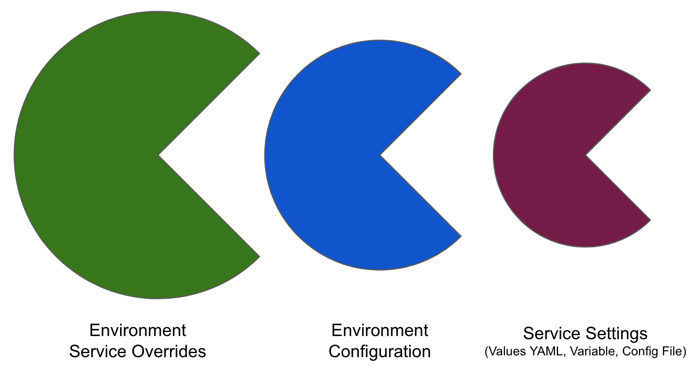

In DevOps, it is common to have multiple environments, such as development, testing, staging, and production. Each environment might require different configurations or settings for the same service. For example, in the development environment, a service may need to use a local database for testing, while in the production environment, it should use a high-availability database cluster.

To enable the same service to use different environment settings, DevOps teams can override service settings for each environment.

This topic explains what service settings can be overridden by environments.

## Limitations

* Runtime inputs are not supported if you are trying to override services in multi-service and multi-environment set ups.

## Override types

```mdx-code-block
import Tabs from '@theme/Tabs';
import TabItem from '@theme/TabItem';
```
```mdx-code-block
<Tabs>
  <TabItem value="Manifests" label="Manifests" default>
```

You can override the following manifest types.

<docimage path={require('./static/f3298b583d8308e026c05f7dd544195756bb080b43438c0a83ab389c97af794a.png')} width="60%" height="60%" title="Click to view full size image" />

- Values YAML
- OpenShift Param
- Kustomize
- Helm Repo
- Tanzu Application Service (TAS) manifest
- TAS vars
- TAS AutoScalar

### Notes

- Helm Repo:
  - You can only override Helm Repo for HTTP Helm, GCS, S3, and OCI store types. 
  - Unlike other overrides, you can only override the Harness connector used for Helm Repo. Consequently, when you override the Helm Repo for a service, you must select the same store type used in the service. So, if the service uses HTTP Helm as the store type, the environment override must also use HTTP Helm as the store type. If you select a different store type, Harness will throw an exception during execution.


```mdx-code-block
  </TabItem>
  <TabItem value="Values YAML" label="Values YAML">
```

You can specify values YAML files at the environment's **Service Overrides** and **Configuration**, and the service itself.

Here is an example of specifying it at the environment's **Configuration**:


When you have a values YAML file at two or more of the environment **Service Overrides**, **Environment Configuration**, and the service itself, Harness merges the files into a single values YAML for deployment. This merging is performed at pipeline execution runtime.

:::info limitation

You cannot check the parametrized values in the values YAML. However, you can view these values in the pipeline execution console view for any deployment type under the Initialize section, when referencing the values YAML in the corresponding manifest.


:::

Overriding occurs when the higher priority setting has the same `name:value` pair as a lower priority setting.

Let's look at two examples.

#### Merging values YAML name:value pairs

An environment's **Service Overrides** values YAML has the name:value pair `servicePort: 80` but no `replicas` name:value.

A service's **Service Definition** has a values YAML with `replicas: 2` but no `servicePort` name:value.

At runtime, the two values YAML files are merged into one.

The `servicePort: 80` from the environment **Service Overrides** values YAML is merged with the **Service Definition**'s `replicas: 2` in the values YAML:


#### Fully overriding values YAML name:value pairs

An environment's **Service Overrides** values YAML has the name:value pairs `replicas: 2` and `servicePort: 80`. 

A service's **Service Definition** has a values YAML with `replicas: 4` and `servicePort: 8080`. 

At runtime, the name:value pairs from the environment **Service Overrides** values YAML fully override the service values YAML. The `replicas: 2` and `servicePort: 80` from the environment **Service Overrides** are used.


```mdx-code-block
  </TabItem>
  <TabItem value="Config files and Variables" label="Config files and Variables">
```

Config files and variables are completely overridden.

Config files are a black box that can contain multiple formats and content, such as YAML, JSON, plain text, etc. Consequently, they cannot be overridden like values YAML files.

Variables cannot be partially overridden either. They are completely replaced.

When you have **Config files** at two or more of the environment **Service Overrides**, **Configuration**, and the service itself, the standard override priority is applied.

When you have **Variables** with the same name at two or more of the environment **Service Overrides**, **Configuration**, and the service itself, the standard override priority is applied.

```mdx-code-block
  </TabItem>
</Tabs>
```

## Override methods

In an environment, you can override one or more settings for **all services** that use the environment and you can override settings for **specific services** that use the environment.

```mdx-code-block
import Tabs1 from '@theme/Tabs';
import TabItem1 from '@theme/TabItem';
```

<Tabs1>
  <TabItem1 value="Override all services" label="Override all services" default>

In the environment **Configuration**, you can also set the default manifests, config files, and variables to use whenever Harness deploys a service to this environment.


For example, a stage has a Kubernetes service with a manifest but whenever that service is deployed to the **QA** environment, the manifest in that environment's **Configuration** overwrites the namespace of with the manifest in the service with `QA`.

```mdx-code-block
  </TabItem1>
  <TabItem1 value="Override specific services" label="Override specific services">
```

**Service Overrides** is different from **Configuration** in the following ways:

* Environment **Configuration**: applies to every service that is used with the environment.
* Environment **Service Overrides**: applies to specific services you select. Whenever that service is used with that environment, the **Service Override** is applied.

To override a specific service's setting, do the following:

1. In the environment, select **Service Overrides**.
2. Select **New configuration overrides**.
3. In **Add Override**, select the service.
4. In Override Type, select what type of setting you want to override.
5. Select **New Variable/Manifest/Config File Override**.
6. Override the setting.

```mdx-code-block
  </TabItem1>
</Tabs1>
```

## Override priority

When you are using environment configuration and service override to override service settings, it's important to understand the priority of the overrides.

The priority from top to bottom is:

1. Environment **Service Overrides**.
2. Environment **Configuration**.
3. Service settings.

