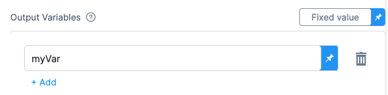

The Container step lets you run any Docker container in your Kubernetes cluster as part of your continuous deployment (CD) stage.

Harness orchestrates the container in your cluster as part of your Harness deployment. 

## Use cases

Typically, the primary deployment operations are handled by the default Harness deployment steps, such as the [Kubernetes Rollout step](/docs/continuous-delivery/deploy-srv-diff-platforms/kubernetes/cd-k8s-ref/kubernetes-rollout-step).

The Container step can be used for secondary options. There are several secondary scripts that DevOps teams commonly run in a Kubernetes container as part of a CD pipeline. These scripts can be used to perform various tasks such as configuration, data migration, database schema updates, and more. 

<details>
<summary>Common secondary script examples</summary>

Some common secondary scripts that are run in a Kubernetes container as part of CD are:

- Database migrations. Update the database schema and apply any necessary data migrations.
- Configuration updates. Update the configuration of the application or service being deployed.
- Health checks. Perform health checks on the application or service being deployed, ensuring that it is running correctly and responding to requests.
- Load testing. Perform load testing on the application or service, ensuring that it can handle the expected traffic and load.
- Monitoring setup. Set up monitoring and logging for the application or service, so that any issues can be quickly detected and addressed.
- Smoke tests. Perform simple tests to confirm that the application or service is running correctly after deployment.
- Cleanup. Clean up any resources or files that were created during the deployment process.

These secondary scripts are usually run as part of the CD pipeline, either as part of the build process or as separate jobs. They can be written in a variety of scripting languages. In many cases, these scripts are run in containers within the Kubernetes cluster, so that the necessary dependencies and tools are available.

</details>

### Mobile Device Management (MDM)/User Experience Management (UEM)

Harness supports MDM/UEM through interaction using MDM/UEM APIs.

You can leverage the Container step to call the MDM/UEM APIs from Harness.

Here are some example scripts for MDM and UEM that you might use as part of a DevOps continuous delivery pipeline:

<details>
<summary>MDM script example</summary>

This script sets some variables for the MDM server URL, the MDM username and password, and the configuration file to install. It then uses the curl command to send the configuration file to the MDM server and install it on devices. Finally, it checks for errors and reports success or failure.

```bash
# This script deploys a new Mobile Device Management (MDM) configuration to devices

# Set variables
MDM_SERVER="https://your-mdm-server.com"
MDM_USERNAME="your-mdm-username"
MDM_PASSWORD="your-mdm-password"
MDM_CONFIG_FILE="your-mdm-config-file.plist"

# Install the MDM configuration on devices
curl --request POST \
     --user "$MDM_USERNAME:$MDM_PASSWORD" \
     --header "Content-Type: application/xml" \
     --data-binary "@$MDM_CONFIG_FILE" \
     "$MDM_SERVER/devicemanagement/api/mdm/profiles"

# Check for errors
if [ $? -eq 0 ]; then
  echo "MDM configuration installed successfully."
else
  echo "ERROR: MDM configuration failed to install."
fi
```
</details>

<details>
<summary>UEM script example</summary>

This script sets similar variables for the UEM server URL, username, password, and configuration file to install. It then uses curl to send the configuration file to the UEM server and install it on endpoints. Finally, it checks for errors and reports success or failure.

```bash
# This script deploys a new Unified Endpoint Management (UEM) configuration to endpoints

# Set variables
UEM_SERVER="https://your-uem-server.com"
UEM_USERNAME="your-uem-username"
UEM_PASSWORD="your-uem-password"
UEM_CONFIG_FILE="your-uem-config-file.json"

# Install the UEM configuration on endpoints
curl --request POST \
     --user "$UEM_USERNAME:$UEM_PASSWORD" \
     --header "Content-Type: application/json" \
     --data-binary "@$UEM_CONFIG_FILE" \
     "$UEM_SERVER/api/config"

# Check for errors
if [ $? -eq 0 ]; then
  echo "UEM configuration installed successfully."
else
  echo "ERROR: UEM configuration failed to install."
fi

```

</details>


Note that these scripts are just examples and may need to be modified to fit your specific use case. You may also want to include additional steps in your pipeline, such as testing and verification, before deploying MDM or UEM configurations to production devices.

### Edge and IoT deployments

You can use Harness continuous delivery to automate the process of deploying new versions of applications and services to edge and IoT devices, reducing the risk of human error, minimizing downtime, and improving the security of your IoT ecosystem.


<details>
<summary>Edge script example</summary>

You can use the following script to deploy a new version of an application to an edge device. The script assumes that the device is already set up with the necessary dependencies, and that it is accessible via SSH.

```bash
# Define variables
APP_NAME="my-app"
REMOTE_HOST="my-edge-device"
REMOTE_USER="root"
REMOTE_DIR="/opt/$APP_NAME"

# Copy the new version of the application to the remote host
scp -r ./build $REMOTE_USER@$REMOTE_HOST:$REMOTE_DIR

# Restart the application on the remote host
ssh $REMOTE_USER@$REMOTE_HOST "systemctl restart $APP_NAME.service"
```
</details>


<details>
<summary>IoT script example</summary>

You can use the following script to deploy a new version of an IoT device firmware. The script assumes that the device is connected to the network and can be accessed via SSH.

```bash
# Define variables
DEVICE_IP="192.168.1.100"
DEVICE_USER="pi"
DEVICE_PASS="raspberry"
FIRMWARE_FILE="firmware-v2.0.bin"

# Copy the new firmware to the device
sshpass -p $DEVICE_PASS scp $FIRMWARE_FILE $DEVICE_USER@$DEVICE_IP:/home/$DEVICE_USER/

# Install the new firmware on the device
sshpass -p $DEVICE_PASS ssh $DEVICE_USER@$DEVICE_IP "sudo flashrom -w /home/$DEVICE_USER/$FIRMWARE_FILE"
```

</details>


## Important notes

Please review the following important notes.

### Infrastructure provider support

Currently, the Harness Container step supports Kubernetes infrastructures only.

### Registry support

Currently, Harness can fetch containers from the following registries:

- Docker Hub
- Google Container Registry
- AWS Elastic Container Registry
- Azure Container Registry
- Artifactory
- Nexus

## Add a Container step

You add the Container step in the CD stage **Execution** section. The Container step is supported in all the deployment strategies (rolling, blue green canary, custom). This step requires delegate version > 1.0.780xx.

```mdx-code-block
import Tabs from '@theme/Tabs';
import TabItem from '@theme/TabItem';
```
```mdx-code-block
<Tabs>
  <TabItem value="Visual" label="Visual" default>
```

1. In the CD stage **Execution** section, select **Add Step**, and then select **Container**.
2. Enter the following settings and select **Apply Changes**.

### Name

1. Enter a name for the step.

### Timeout

You can use:

- `w` for weeks.
- `d` for days.
- `h` for hours.
- `m` for minutes.
- `s` for seconds.
- `ms` for milliseconds.

The maximum is `53w`.

Timeouts can be set at the pipeline level also, in the pipeline **Advanced Options**.

### Container registry

1. Select or create a Harness connector that connects to the Docker registry where your container is hosted.
2. Ensure that the user account used in the connector has permission to fetch the container.

### Image

1. Enter the image and tag to use for this container, for example: `maven:3.6.3-jdk-8` or `curlimages/curl:7.73.0`.

If you are fetching the image from a provider that requires the Docker image's FQN (fully-qualified name), such as GCR or ECR, use the FQN here. 

Here are some examples:

- Docker Hub: `maven:3.6.3-jdk-8`
- GCR: `us.gcr.io/playground-123/my-image`
- ECR: `40000005317.dkr.ecr.us-east-1.amazonaws.com/todolist:0.2`

### Shell

1. Select the type of shell you want to run your script.


### Command

1. Enter the commands you want to run in the container.

You don't need to create a Kubernetes deployment and service for the container in your script, because Harness handles Kubernetes orchestration.

You also don't need to add `docker run` to your script.

Instead, add the contents of the script you want to execute.

For example, if you would normally run this:

```
docker run --rm -it -v $(pwd):/app -w /app maven:3.6.3-jdk-8 bash -c "..."
```

You can just enter what you would write in `...`.

### Connector

1. Select or create a Harness connector to connect to the cluster and namespace where you want to run the step.

### Namespace

1. Enter the namespace in the cluster where you want to run the step.

### Set container resources

1. Set the maximum resources limit values for the resources used by the container at runtime.

- **Limit Memory:** The maximum memory that the container can use. You may express memory as a plain integer or as a fixed-point number using the suffixes G or M. You may also use the power-of-two equivalents Gi and Mi.
- **Limit CPU:** The maximum number of cores that the container can use. CPU limits are measured in cpu units. Fractional requests are allowed; you can specify one hundred millicpu as 0.1 or 100m. 

For more information, go to [resource units in Kubernetes](https://kubernetes.io/docs/concepts/configuration/manage-resources-containers/#resource-units-in-kubernetes) from Kubernetes.

### Image pull policy

1. Select an option to set the pull policy for the image:

- **Always:** The kubelet queries the container image registry to resolve the name to an image digest every time the kubelet launches a container. If the kubelet encounters an exact digest cached locally, it uses its cached image; otherwise, the kubelet downloads (pulls) the image with the resolved digest, and uses that image to launch the container.
- **If Not Present:** The image is pulled only if it is not already present locally.
- **Never:** The image is assumed to exist locally. No attempt is made to pull the image.

### Output variables

Output variables are outputs that are defined and captured after the Container step execution.

Output variables expose environment variables for use by other steps/stages of the pipeline. You may reference the output variable of a step using the step Id and the name of the variable in output variables.

Let's look at a simple example.

1. In the Command in a step, export a new variable using the following syntax:

    ```
    export myVar=varValue
    ```

    
2. In a later Shell Script step, reference the output variable:

    ```
    echo <+steps.S1.output.outputVariables.myVar>
    ```
    
    The syntax for referencing output variables between steps in the same stage looks similar to the example below.

    ```
    <+[stepId].output.outputVariables.[varName]>
    ```

    The syntax for referencing output variables between steps in different stages looks similar to the example below.

    ```
    <+stages.[stageID].execution.steps.[stepId].output.outputVariables.[varName]>
    ```

### Environment variables

Environment variables may be injected into the container and used in the script in **Command**. 

When using these environment variables, make sure to enter a **Name** and **Value** for each variable.

You may also reference environment variables in the script by their name. For example, in Bash, this would be `$var_name` or `${var_name}`. In Windows PowerShell, the reference would be `$Env:varName`.

For **Value**, you may enter [fixed values, runtime inputs, and expressions](/docs/platform/references/runtime-inputs/).

For example, if you created the environment variables `DB_HOST`, `DB_URL`, and `DB_PASSWORD`, your script could reference them like this:

```bash
DB_URL=$DB_URL
user=$DB_HOST
password=$DB_PASSWORD
```

For example, you can set **Value** as an expression and reference the value of some other setting in the stage or pipeline.

```mdx-code-block
  </TabItem>
  <TabItem value="YAML" label="YAML">
```

1. In **Pipeline Studio**, select **YAML**
2. Paste the following YAML example and select **Save**:

```yaml
              - step:
                  type: Container
                  name: Test
                  identifier: Test
                  spec:
                    connectorRef: Docker_Hub_with_Pwd
                    image: maven:3.6.3-jdk-8
                    command: echo "Run some smoke tests"
                    shell: Sh
                    infrastructure:
                      type: KubernetesDirect
                      spec:
                        connectorRef: K8s_Cluster_1675446740237
                        namespace: default
                        resources:
                          limits:
                            cpu: "0.5"
                            memory: 500Mi
                    outputVariables: []
                    envVariables: {}
                  timeout: 1d
```

```mdx-code-block
  </TabItem>
</Tabs>
```

### Select the Operating System

Select the OS for the container.

### Volumes

This setting is the same as Kubernetes volumeMounts. Harness supports Host Path (hostPath), Empty Directory (emptyDir), and Persistent Volume Claim (persistentVolumeClaim).

### Service Account Name

Specify a Kubernetes service account for step containers to use when communicating with the Kubernetes API server. Leave blank to use the namespace's default service account.

### Automount Service Account Token

An application running inside a pod can access the Kubernetes API using automatically mounted service account credentials. See [Accessing the Cluster](https://kubernetes.io/docs/tasks/access-application-cluster/access-cluster/) to learn more.

To use a different service account, enter its name here.

### Labels

Enter any labels to apply to the pods.

### Annotations

Enter any annotations to apply to the pods.

### Privileged

The standard `privileged` property for Kubernetes `securityContext`.

When this setting is enabled, it grants the container elevated privileges within the underlying host environment. This means that the container has access to all Linux kernel capabilities and devices, similar to running processes outside the container. It effectively removes the isolation provided by the container runtime and can potentially pose security risks if not used carefully.

### Allow Privilege Escalation

The standard `allowPrivilegeEscalation` property for Kubernetes `securityContext`.

When this setting in enabled, it allows the container to gain additional privileges beyond those initially granted during container startup.

### Add Capabilities

The standard `add` setting for the `capabilities` property in the Kubernetes `securityContext`.

### Drop Capabilities

The standard `drop` setting for the `capabilities` property in the Kubernetes `securityContext`.

### Run as Non Root

Enable this setting to run the container as a non-root user.

### Read-only Root Filesystem

The standard `readOnlyRootFilesystem` setting for the `securityContext` property.

Enable this setting to ensure that the root filesystem of the container is mounted as read-only.

### Run as User

The standard `runAsUser` setting for the `securityContext` property.

Specify the user ID (UID) under which the container should run.

### Priority Class

The standard Kubernetes `PriorityClass`.

Enter a standard `priorityClassName` like `system-node-critical`.

### Node Selector

The standard Kubernetes `nodeSelector`.

Enter a key like `disktype` and and value like `ssd`.

### Tolerations

The standard Kubernetes `tolerations`. Use the settings to specify that a pod can tolerate (or ignore) the effects of node taints.

### Init Timeout

The standard Kubernetes `timeoutSeconds` for `initContainers`.

### Override Image Connector

By default, at pipeline runtime, Harness pulls certain images from public Docker Hub repos. These images are only used for backend processes. At runtime, the Harness Delegate makes an outbound connection to the public repo and pulls the images.

The Harness Container Image Registry is dedicated exclusively to Harness-supported images. 

You might want to override the default behavior and download your build images from this repo instead. To view the list of images in this registry, enter the following command.

```
curl -X  GET https://app.harness.io/registry/_catalog
```

Add or select a connector to use instead of the default connector uses for the Harness Container Image Registry.

For more information, go to [Connect to Harness container image registry Using Docker connector](https://developer.harness.io/docs/platform/connectors/artifact-repositories/connect-to-harness-container-image-registry-using-docker-connector/).

## Advanced settings

In **Advanced**, you can use the following options:

* [Delegate Selector](https://developer.harness.io/docs/platform/delegates/manage-delegates/select-delegates-with-selectors/)
* [Conditional Execution](https://developer.harness.io/docs/platform/pipelines/w_pipeline-steps-reference/step-skip-condition-settings/)
* [Failure Strategy](https://developer.harness.io/docs/platform/pipelines/w_pipeline-steps-reference/step-failure-strategy-settings/)
* [Looping Strategy](https://developer.harness.io/docs/platform/pipelines/looping-strategies-matrix-repeat-and-parallelism/)
* [Policy Enforcement](https://developer.harness.io/docs/platform/Governance/Policy-as-code/harness-governance-overview)
