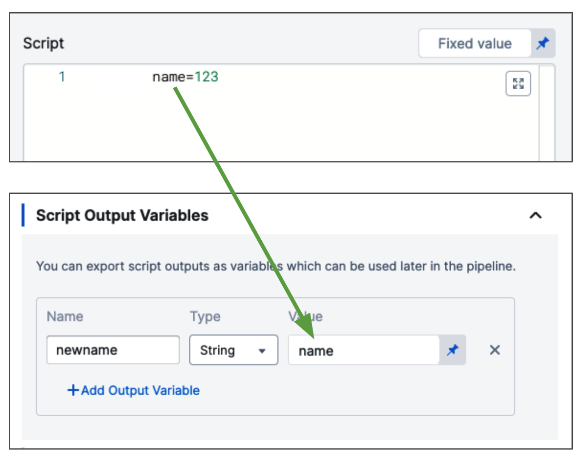
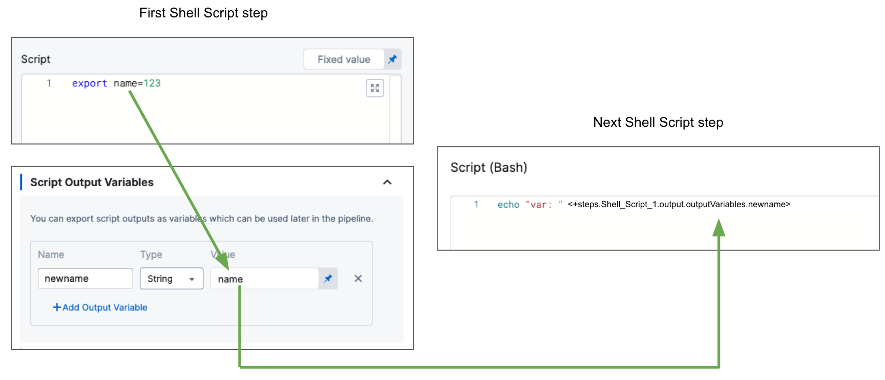
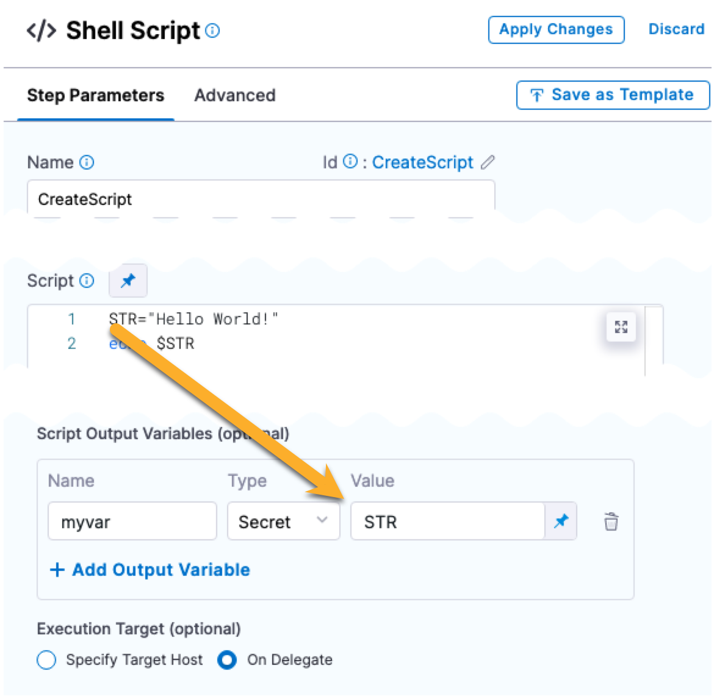
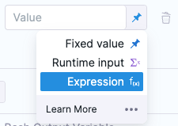

You can run shell scripts in a CD stage using the **Shell Script** step.

With the Shell Script step, you can execute scripts in the shell session of the stage in the following ways:

* Execute scripts on the host running a Harness delegate. You can use delegate selectors to identify which Harness delegate to use. Go to [Use delegate selectors](/docs/platform/2_Delegates/manage-delegates/select-delegates-with-selectors.md) for more information.
* Execute scripts on a remote target host in the deployment infrastructure definition.

This topic provides a simple demonstration of how to create a script in a Shell Script step, publish its output in a variable, and use the published variable in a subsequent step.

Go to [Shell Script step reference](/docs/continuous-delivery/x-platform-cd-features/cd-steps/utilities/shell-script-step) for more information.

## Use cases

Typically, the primary deployment operations are handled by the default Harness deployment steps, such as the [Kubernetes Rollout step](/docs/continuous-delivery/deploy-srv-diff-platforms/kubernetes/cd-k8s-ref/kubernetes-rollout-step).

The Shell Script step can be used for secondary options. There are several secondary scripts that DevOps teams commonly run in a Kubernetes container as part of a CD pipeline. These scripts can be used to perform various tasks such as configuration, data migration, database schema updates, and more. 

<details>
<summary>Common secondary script examples</summary>

Some common secondary scripts that are run in a Kubernetes container as part of CD are:

- Database migrations. Update the database schema and apply any necessary data migrations.
- Configuration updates. Update the configuration of the application or service being deployed.
- Health checks. Perform health checks on the application or service being deployed, ensuring that it is running correctly and responding to requests.
- Load testing. Perform load testing on the application or service, ensuring that it can handle the expected traffic and load.
- Monitoring setup. Set up monitoring and logging for the application or service, so that any issues can be quickly detected and addressed.
- Smoke tests. Perform simple tests to confirm that the application or service is running correctly after deployment.
- Cleanup. Clean up any resources or files that were created during the deployment process.

These secondary scripts are usually run as part of the CD pipeline, either as part of the build process or as separate jobs. They can be written in a variety of scripting languages. In many cases, these scripts are run in containers within the Kubernetes cluster, so that the necessary dependencies and tools are available.

</details>

### Mobile Device Management (MDM)/User Experience Management (UEM)

Harness supports MDM/UEM through interaction using MDM/UEM APIs.

You can leverage the Shell Script step to call the MDM/UEM APIs from Harness.

Here are some example scripts for MDM and UEM that you might use as part of a DevOps continuous delivery pipeline:

<details>
<summary>MDM script example</summary>

This script sets some variables for the MDM server URL, the MDM username and password, and the configuration file to install. It then uses the curl command to send the configuration file to the MDM server and install it on devices. Finally, it checks for errors and reports success or failure.

```bash
# This script deploys a new Mobile Device Management (MDM) configuration to devices

# Set variables
MDM_SERVER="https://your-mdm-server.com"
MDM_USERNAME="your-mdm-username"
MDM_PASSWORD="your-mdm-password"
MDM_CONFIG_FILE="your-mdm-config-file.plist"

# Install the MDM configuration on devices
curl --request POST \
     --user "$MDM_USERNAME:$MDM_PASSWORD" \
     --header "Content-Type: application/xml" \
     --data-binary "@$MDM_CONFIG_FILE" \
     "$MDM_SERVER/devicemanagement/api/mdm/profiles"

# Check for errors
if [ $? -eq 0 ]; then
  echo "MDM configuration installed successfully."
else
  echo "ERROR: MDM configuration failed to install."
fi
```
</details>

<details>
<summary>UEM script example</summary>

This script sets similar variables for the UEM server URL, username, password, and configuration file to install. It then uses curl to send the configuration file to the UEM server and install it on endpoints. Finally, it checks for errors and reports success or failure.

```bash
# This script deploys a new Unified Endpoint Management (UEM) configuration to endpoints

# Set variables
UEM_SERVER="https://your-uem-server.com"
UEM_USERNAME="your-uem-username"
UEM_PASSWORD="your-uem-password"
UEM_CONFIG_FILE="your-uem-config-file.json"

# Install the UEM configuration on endpoints
curl --request POST \
     --user "$UEM_USERNAME:$UEM_PASSWORD" \
     --header "Content-Type: application/json" \
     --data-binary "@$UEM_CONFIG_FILE" \
     "$UEM_SERVER/api/config"

# Check for errors
if [ $? -eq 0 ]; then
  echo "UEM configuration installed successfully."
else
  echo "ERROR: UEM configuration failed to install."
fi

```

</details>


Note that these scripts are just examples and may need to be modified to fit your specific use case. You may also want to include additional steps in your pipeline, such as testing and verification, before deploying MDM or UEM configurations to production devices.

### Edge and IoT deployments

You can use Harness continuous delivery to automate the process of deploying new versions of applications and services to edge and IoT devices, reducing the risk of human error, minimizing downtime, and improving the security of your IoT ecosystem.


<details>
<summary>Edge script example</summary>

You can use the following script to deploy a new version of an application to an edge device. The script assumes that the device is already set up with the necessary dependencies, and that it is accessible via SSH.

```bash
# Define variables
APP_NAME="my-app"
REMOTE_HOST="my-edge-device"
REMOTE_USER="root"
REMOTE_DIR="/opt/$APP_NAME"

# Copy the new version of the application to the remote host
scp -r ./build $REMOTE_USER@$REMOTE_HOST:$REMOTE_DIR

# Restart the application on the remote host
ssh $REMOTE_USER@$REMOTE_HOST "systemctl restart $APP_NAME.service"
```
</details>


<details>
<summary>IoT script example</summary>

You can use the following script to deploy a new version of an IoT device firmware. The script assumes that the device is connected to the network and can be accessed via SSH.

```bash
# Define variables
DEVICE_IP="192.168.1.100"
DEVICE_USER="pi"
DEVICE_PASS="raspberry"
FIRMWARE_FILE="firmware-v2.0.bin"

# Copy the new firmware to the device
sshpass -p $DEVICE_PASS scp $FIRMWARE_FILE $DEVICE_USER@$DEVICE_IP:/home/$DEVICE_USER/

# Install the new firmware on the device
sshpass -p $DEVICE_PASS ssh $DEVICE_USER@$DEVICE_IP "sudo flashrom -w /home/$DEVICE_USER/$FIRMWARE_FILE"
```

</details>


## Add your script

When the script in the Shell Script step is run, Harness executes the script on the target host's or Delegate's operating system. Consequently, the behavior of the script depends on their system settings.

For this reason, you might wish to begin your script with a shebang line that identifies the shell language, such as `#!/bin/sh` (shell), `#!/bin/bash` (bash), or `#!/bin/dash` (dash). For more information, see the [Bash manual](https://www.gnu.org/software/bash/manual/html_node/index.html#SEC_Contents) from the GNU project.

To capture the shell script output in a variable, do the following:

1. In the stage, in **Execution**, click **Add Step**.
2. Select **Shell Script**.
3. Enter a name for the step. An Id is generated. This Id identifies the step and is used in variable expressions. For example, if the Id is **Shell Script**, the expression might be `<+execution.steps.Shell_Script.output.outputVariables.myvar>`.
4. In **Script**, enter a bash script. For example, the variable names `BUILD_NO`and `LANG`:
  
  ```bash
  BUILD_NO="345"  
  LANG="en-us" 
  ```

You don't need to use `export` for the variables to use them with **Script Output Variables**. You can simply declare them, like `BUILD_NO="345"`. Export is for using the variables in child processes within the script.You must use quotes around the value because environment variables are Strings.

### Using Harness expressions in your scripts

If you need quotes around the [Harness variable expressions](/docs/platform/Variables-and-Expressions/harness-variables) in your script, use single quotes, like this:

`export EVENT_PAYLOAD='<+trigger.eventPayload>'` 

If you use [Harness variable expressions](/docs/platform/Variables-and-Expressions/harness-variables) in comments in your script, Harness will still try to evaluate and render the variable expressions. Don't use variable expressions that Harness cannot evaluate.

## Specify input variables

While you can simply declare a variable in your script using a Harness expression or string for its value, using Input Variables provides some additional benefits:

* You can more easily identify and manage the Harness expressions used in your script.
* You can template your script.

You can declare the variable using **Name** and **Value** in **Script Input Variables** and then reference the variable in the script just as you would any other variable: `$var_name`.

You can also use expressions in **Value**. For example, if you have an Output Variable from a previous Shell Script step, you can copy it from the executed step **Outputs**.

1. In **Script Input Variables**, you simply select **Expression** and paste the expression in **Value**:
   
   
2. In the Script, you declare the variable using the **Name** value (in this example, `foo`).
   
   

At deployment runtime, Harness evaluates the expression and the variable contains its output.

## Specify output variables

Shell Script step Output Variables have a maximum size of 512KB.To export variables from the script to other steps in the stage, you use the **Script Output Variables** option.

Let's look at a simple example of a script with the variable **name**:

```bash
name=123
```

The `name` variable cannot be used outside the script unless you use **Script Output Variables**.

You do not need to use `export` for the variables to use them with **Script Output Variables**. You can simply declare them, like `name="123"`. Export is for using the variables in child processes within the script.In **Script Output Variables**, in **Value**, you enter the name of the script variable you want to output (`name`).

1. In **Name**, enter a name to use in other steps that will reference this variable. This is the output variable name that will be used in a Harness expression for referencing the output variable.



The format to reference the output variable can be one of the following:

* Within the stage:
	+ `<+execution.steps.[step_id].output.outputVariables.[output_variable_name]>`
* Anywhere in the pipeline:
	+ `<+pipeline.stages.[stage_Id].spec.execution.steps.[step_Id].output.outputVariables.[output_variable_name]>`
* When step is inside a step group:
	+ `<+pipeline.stages.[stage_Id].spec.execution.steps.[step_group_Id].steps.stepId.build.[output_variable_name]`  

For example, you could reference the output variable `newname` like this:

```
echo "anywhere in the pipeline: " <+pipeline.stages.Shell_Script_stage.spec.execution.steps.ShellScript_1.output.outputVariables.newname>
echo "anywhere in the stage: " <+execution.steps.ShellScript_1.output.outputVariables.newname>
```

Here's an example showing how the **Script Output Variables** references the exported variable, and how you reference the output variable name to get that value:

<!--  -->

<docimage path={require('./static/61423f07740b1d9d685c23b8b119ab9f01514473adc50e043c16f699aee3c010.png')} />


So now the result of `<+execution.steps.ShellScript_1.output.outputVariables.newname>` is `123`.

To find the expression to reference your output variables, find the step in the Pipeline execution, and click its **Output** tab.


### Output variables as secrets

You can select String or Secret for your output variable.


When you select Secret and reference the output variable later in the Pipeline, Harness will automatically sanitize the resolved secret value in the logs.

Let's look at an example. First, you add the output variable as a Secret:



Next, you reference that output variable as a secret, like this:


```
echo "my secret: " <+execution.steps.CreateScript.output.outputVariables.myvar>
```
When you run the Pipeline, the resolved output variable expression is sanitized:


## Harness expressions in variables

You can use Harness variable expressions in your scripts and in the **Script Input Variables** and **Script Output Variables**.

For **Script Input Variables** and **Script Output Variables**, you simply select **Expression**, and then paste in the Harness variable expression.



## Specify where to run the script

1. In **Execution Target**, select **Specify on** **Target Host** or **On Delegate**.

In you select **On Delegate**, the script is executed on whichever Delegate runs the step. You can use **Delegate Selector** in **Advanced** to pick the Delegate(s) if needed.

See [select delegates with selectors](/docs/platform/Delegates/manage-delegates/select-delegates-with-selectors).

If you select **Target Host**, enter the following:

* **Target Host:** enter the IP address or hostname of the remote host where you want to execute the script. The target host must be in the **Infrastructure Definition** selected when you created the workflow, and the Harness Delegate must have network access to the target host. You can also enter the variable `<+instance.name>` and the script will execute on whichever target host is used during deployment.
* **SSH Connection Attribute:** select the execution credentials to use for the shell session. For information on setting up execution credentials, go to [add SSH keys](/docs/platform/Secrets/add-use-ssh-secrets).

## Advanced settings

Go to [Shell Script step reference](/docs/continuous-delivery/x-platform-cd-features/cd-steps/utilities/shell-script-step) for more information.

## Important notes

### Stopping scripts after failures

The shell script command will continue to process through the script even if a script step fails. To prevent this, you can simply include instructions to stop on failure in your script. For example:

* `set -e` - Exit immediately when a command fails.
* `set -o pipefail` - Sets the exit code of a pipeline to that of the rightmost command to exit with a non-zero status, or to a zero status if all commands of the pipeline exit successfully.
* `set -u` - Treat unset variables as an error and exit immediately.

For more information, go to [writing robust Bash shell scripts](https://www.davidpashley.com/articles/writing-robust-shell-scripts/).

### Published variables not available

This error happens when you are publishing output via the **Script Output Variables** setting and your Shell Script step exits early from its script.

There are many errors that can result from this situation. For example, you might see an error such as:

```bash
FileNotFoundException inside shell script execution task
```

If you exit from the script (`exit 0`), values for the context cannot be read.

Instead, if you publish output variables in your shell script command, structure your script with `if...else` blocks to ensure it always runs to the end of the script.

### Using secrets in scripts

You can use Harness secrets in your Shell Script steps.

For more information, go to [add text secrets](/docs/platform/Secrets/add-use-text-secrets).

Basically, you use `<+secrets.getValue("secret_Id")>` to refer to the secret.

### Shell scripts and security

Harness assumes that you trust your Harness users to add safe scripts to your Shell Script steps.

Please ensure that users adding scripts, as well as executing deployments that run the scripts, are trusted.

### Escaping characters

Escape characters are used to remove special meaning from a single character. Escaping tells shell to interpret characters literally. 

You can selectively escape characters when using shell scripts by using the following syntax: 

`shell.escapeChars(<input string>, <string of characters to be escaped>)`

For example, the output for `shell.escapeChars("hello", "ho")` is `"\hell\o"`.

### Realtime logging 

Sometimes, depending on the type of the script, the log lines appear at the end of the execution, and might not be realtime. This happens if the script doesn't flush logs in `stdout` at the correct time.

For example, a Python script with `print("..")` might show delayed logs. 

To fix this, use: 

```
print("...", flush=True)
```
 
or 
 
```
import functools
print = functools.partial(print, flush=True)
```

You might have to make similar changes to your script depending on its contents.
