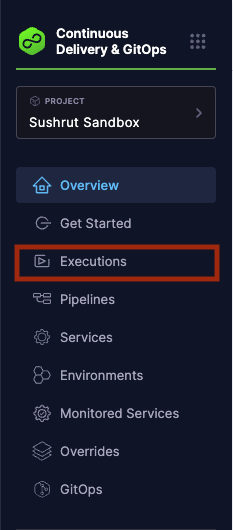
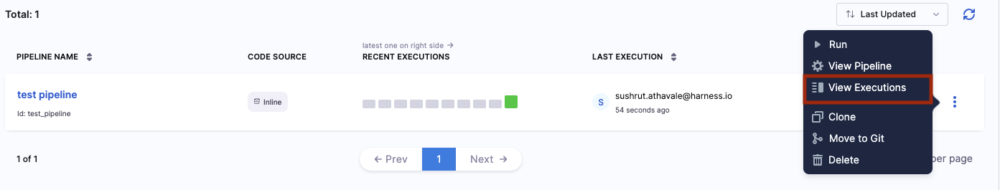
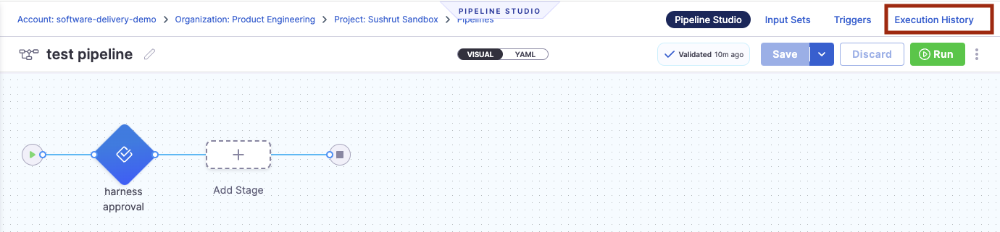
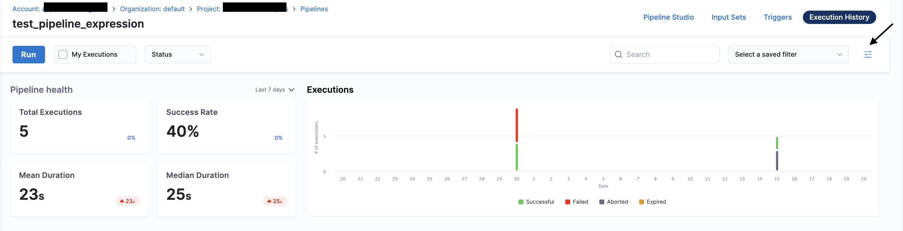
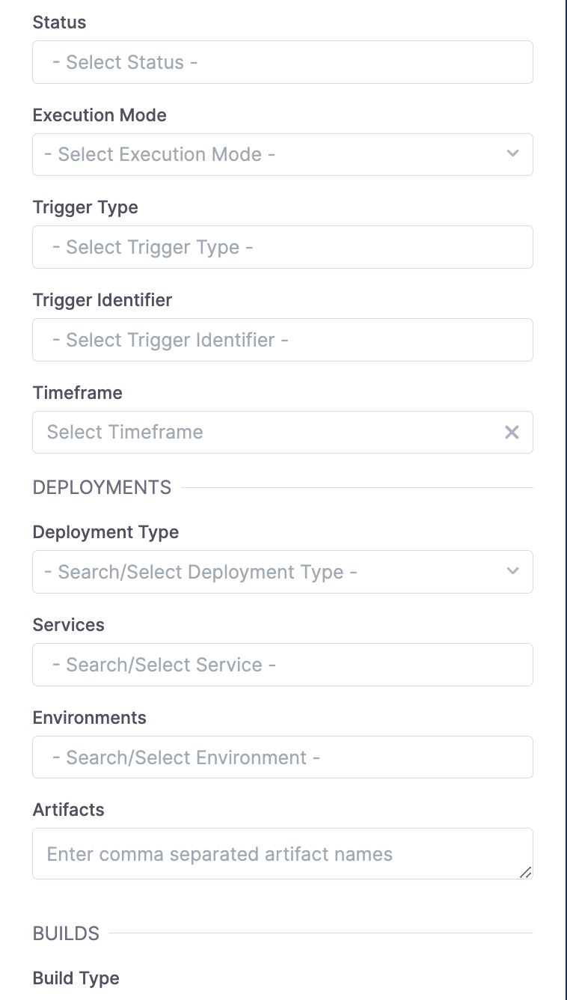
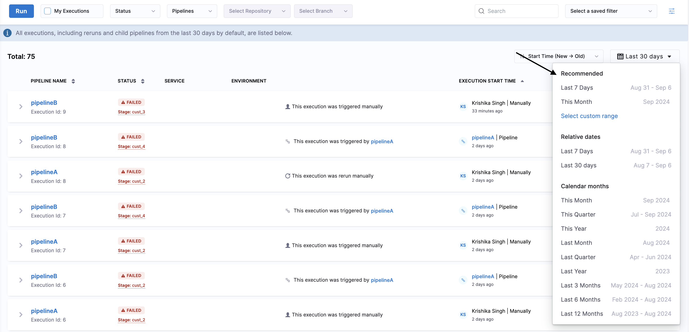
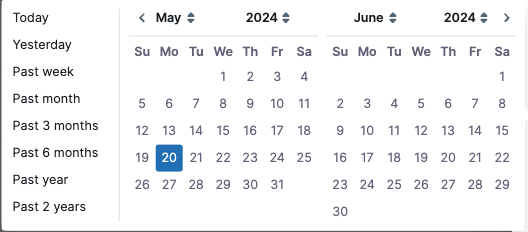
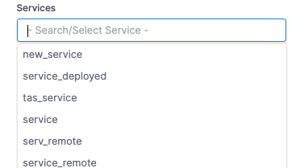

This topic describes how to navigate to the execution history of pipelines and what information is contained within.

## Where Can I Find Execution History?

You can find the execution history of your pipeline or all pipelines in a project in the following places in the Harness UI.

### Executions Tab

You can view the execution history of all pipelines for a given project in the **Executions** tab in the left navigation of the Harness UI:

### Pipelines Tab

You can view the execution history of all pipelines for a given project in the **Pipelines** tab also. 

In the Harness UI left navigation, select **Pipelines**. A list of pipelines created under the project appears. 

Select the more actions button on the right for the pipeline of your choice, and then select **View Executions**.

### Pipeline Studio

You can view the execution history of a specific pipeline using Pipeline Studio.

In the Harness UI left navigation, select **Pipelines**, and then select the pipeline for which you want to view the execution details. 

Select the **Execution History** option on the top right corner of the page to view the execution details.

## Execution Reference

Each pipeline execution displays the following information.

* **Pipeline Name**
    - The name of the pipeline and execution ID.
    - When expanded, this column also shows the name of each stage in the pipeline. 
* **Status**
    - Shows the status of the execution. The options are `SUCCESS`, `FAILED`, `ABORTED`, `EXPIRED`.
    - When expanded, this column shows the status of each stage as an emoji. You can hover over the emoji for more information.
* **Service**
    - Shows the services used in the pipeline. For pipelines with more than one service, a `+X` modifier will be displayed where `X` is the number of additional services. 
    - When expanded, this column shows the services used in each individual stage of the pipeline.
    - Hover over the service name to see the artifact attached to the service. 
* **Environment**
    - Shows the infrastructure used in the pipeline. For pipelines with more than one associated environment, a `+X` modifier will be displayed where `X` is the number of additional environments.
    - When expanded, this column shows the environment for each individual stage of the pipeline.
    - Hover over the environment name to see the infrastructure associated with the environment.
* **Trigger** (This column is unlabeled)
    - This column shows the origin of each execution.
* **Execution Start Time**
    - Shows the user, method, and start time of the execution.
* **More details** 
    The more details icon for each pipeline offers additional execution actions:
    - Add Execution Notes
    - View Execution
    - Edit Pipeline
    - [Retry Pipeline](/docs/platform/pipelines/failure-handling/resume-pipeline-deployments)
    - [Abort Pipeline](/docs/platform/pipelines/failure-handling/abort-pipeline)
    - [View Compiled YAML](/docs/platform/pipelines/executions-and-logs/view-and-compare-pipeline-executions/#view-compiled-yaml)
    - [Compare Pipeline](/docs/platform/pipelines/executions-and-logs/view-and-compare-pipeline-executions/#compare-executions)
    - [Download Logs](/docs/platform/pipelines/executions-and-logs/download-logs)

## Filter execution

You can filter pipeline executions using the filters in the **Execution History** or **Execution** tabs.

You can filter pipeline execution based on **Status**, **Execution Mode**, **Trigger Type**, **Trigger Identifier**, **Timeframe**, **Deployment Type**, **Services**, **Environments**, **Artifacts** or **Build Type**.

### Status

Filter pipeline execution based on Status of Pipeline Execution.

It includes:

- Aborted
- Aborted By Freeze
- Expired
- Failed
- Not Started 
- Paused
- Queueud
- Running
- Success
- Suspended
- Resource Waiting
- Async Waiting
- Skipped
- Task Waiting
- Timed Waiting
- Errored
- Ignore Failure
- Discontinuing
- Approval Rejected
- Intervention Waiting 
- Approval Waiting
- Pausing 
- Input Waiting
- Wait Step Running
- Queued License Limit Reached
- Queued Execution Concurrency Reached

### View Execution History 
By default, all executions, including re-runs and child pipelines from the last 30 days, will be listed in the execution view. If you want to view executions beyond 30 days, you can use the filter option available on the Execution page to select a custom time range.

:::note
Currently this feature is behing the Feature Flag `PIE_OPTIMIZE_EXECUTIONS_LIST_VIEW_TIME_RANGE`. Please contact [Harness support](mailto:support@harness.io) to enable this feature
:::

### Execution mode

Filter pipeline execution based on Execution mode:-

- **Default**: It shows the latest executions(of any retry) and normal execution(without retries) and rollbacks.
- **All**: It lists the old retries as well for the retried executions along with the default ones.
- **Rollback**: It only lists those executions which were executed in the rollback mode.

### Trigger type

Filter pipeline execution based on type of trigger.

It includes:

- MANUAL
- WEBHOOK
- WEBHOOK_CUSTOM
- SCHEDULE_CRON
- ARTIFACT
- MANIFEST

### Trigger identifier

You can mention trigger identifiers to filter pipeline execution triggered by a particular trigger.

### Timeframe

Filter pipeline execution based on time.

### Deployment type

Filter pipeline execution based on the deployment type used in the pipeline.

It includes:

- Kubernetes
- Native Helm
- SSH
- WinRM
- Serverless Lambda
- Azure Web Apps
- Deployment Templates 
- Amazon ECS
- Spot Elasticgroup
- Tanzu Application Service
- AWS Lambda
- AWS Sam

### Services

You can filter the pipeline execution based on deployed services. Select your services from the drop-down list.

### Environments

You can filter pipeline execution based on the environment to which you have deployed your service.

### Artifacts

Filter pipeline execution based on artifacts.

### Build type

Filter pipeline execution based on Build Type.

It includes:

- Pull Request/Merge Request
- Branch
- Tag