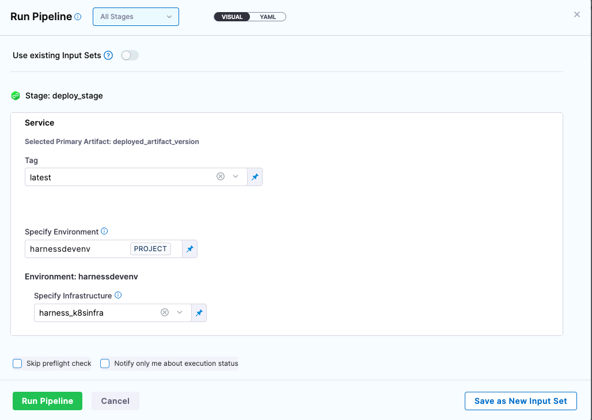
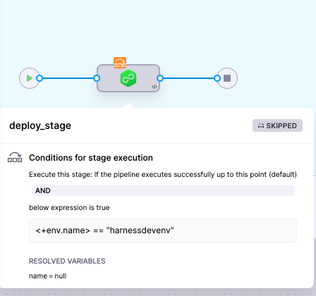
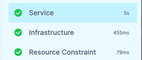
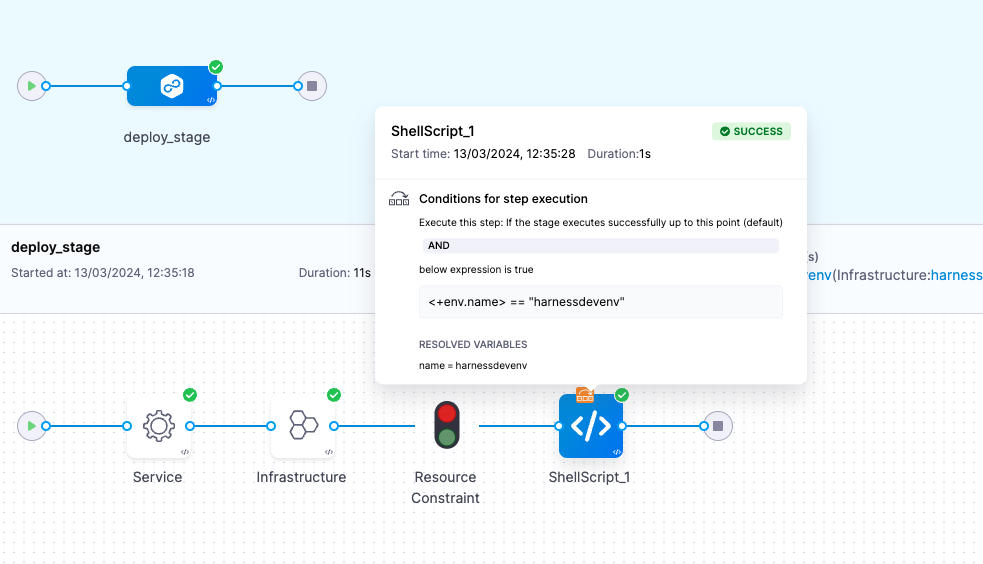

This topic describes pipeline stage and step **Conditional Execution** settings.

## Important notes

### Failure strategy takes precedence over conditional execution

Harness pipeline stages and steps both include **Conditional Execution** and **Failure Strategy** settings:


Using these settings together in multiple stages requires some consideration.

Let's say you have a pipeline with two stages: **stage 1** followed by **stage 2**.

Stage 2's **Conditional Execution** is set to **Execute this step only if the prior stage or step failed**. Stage 1's **Failure Strategy** is set to **Rollback Stage on All Errors**.

If stage 1 has any error it is rolled back and so it is not considered a failure. Hence, stage 2's **Conditional Execution** is not executed.

In order to get stage 2 to execute, you can set the stage 1 **Failure Strategy** to **Ignore Failure**. Rollback will not occur and stage 2's **Conditional Execution** is executed.

To ensure a step executes even if the rollback fails, include it in the Rollback stage, configure **Conditional Execution** to **Always execute this stage** for your step, and then set the previous step's **Failure Strategy** to **Mark as failure** for all errors. Because we wouldn't usually want the rollback to continue when there are errors, you must make these two changes to ensure the execution.

### Stage and step priority

The stage conditional execution applies to all steps that do not have their own conditional execution. A step's conditional execution overrides its stage's conditional execution.

### Conditional execution settings do not apply to child entities

A stage or step group failure strategy automatically applies to its child entities (steps). However, **Conditional Execution** settings don’t work this way. 

Conditional execution settings are specific to the step/stage/step group where it's applied. Conditional execution settings don’t transmit to the to the step/stage/step group child entities.

## Stage conditional execution settings

### If the pipeline executes successfully up to this point

Select this option if you only want this stage to run when all previous stages were successful.

This is the default setting and used most of the time.

### If the previous pipeline or stage fails

Select this option if you always want this stage to run only if the prior Pipeline or stage failed.

### Always

Select this option if you always want this stage to run regardless of the success or failure of previous stages.

### And execute this stage only if the following JEXL condition evaluates to true

Only execute this stage is a [JEXL expression](http://commons.apache.org/proper/commons-jexl/reference/examples.html) is met (evaluates to **true**).

In the JEXL expression, you could use any of the Pipeline variables, including the output of any previous steps.

Examples:

* `<+pipeline.stages.cond.spec.execution.steps.echo.status> == "SUCCEEDED"`
* `<+environment.name> != “QA”`

For more information on variable expressions, go to [built-in custom Harness variables reference](/docs/platform/variables-and-expressions/harness-variables/).

## Step conditional execution settings

### If the stage executes successfully up to this point

Select this option if you only want this step to run when all previous steps were successful.

This is the default setting and used most of the time.

### If the previous step fails

Select this option if you always want this step to run only if the prior step failed.

### Always

Select this option if you always want this step to run regardless of the success or failure of previous steps.

### And execute this step only if the following JEXL condition evaluates to true

Only execute this step if a [JEXL expression](http://commons.apache.org/proper/commons-jexl/reference/examples.html) is met (evaluates to **true**).

In the JEXL expression, you could use any of the Pipeline variables, including the output of any previous steps.

Example:

* `<+pipeline.stages.cond.spec.execution.steps.echo.status> == "SUCCEEDED"`
* `<+environment.name> != “QA”`

For more information on variable expressions, go to [built-in and custom Harness variables reference](/docs/platform/variables-and-expressions/harness-variables/).

## Variable expressions in conditional execution settings

Stages and steps support variable expressions in the JEXL conditions of their **Conditional Execution** settings.

You can only use variable expressions in the JEXL conditions that can be resolved before the stage.

Since **Conditional Execution** settings are used to determine if the stage should be run, you cannot use variable expressions that can't be resolved until the stage is run.

## Deployment status

Deployment status values are a Java enum. The list of values can be seen in the deployments **Status** filter:


You can use any status value in a JEXL condition. For example, `<+pipeline.stages.cond.spec.execution.steps.echo.status> == "FAILED"`.

## Unresolved Expressions during Conditional Execution

This topic explains why some expressions in Conditional Execution goes unresolved during execution. Let's try to understand this scenario with an example:-

Consider this pipeline yaml:

```yaml
  tags: {}
  stages:
    - stage:
        name: deploy_stage
        identifier: deploy_stage
        description: ""
        type: Deployment
        spec:
          deploymentType: Kubernetes
          service:
            serviceRef: harnessguestbook
            serviceInputs:
              serviceDefinition:
                type: Kubernetes
                spec:
                  artifacts:
                    primary:
                      sources:
                        - identifier: deployed_artifact_version
                          type: DockerRegistry
                          spec:
                            tag: <+input>
          environment:
            environmentRef: <+input>
            deployToAll: false
            environmentInputs: <+input>
            serviceOverrideInputs: <+input>
            infrastructureDefinitions: <+input>
          execution:
            steps:
              - step:
                  name: Rollout Deployment
                  identifier: rolloutDeployment
                  type: K8sRollingDeploy
                  timeout: 10m
                  spec:
                    skipDryRun: false
                    pruningEnabled: false
            rollbackSteps:
              - step:
                  name: Rollback Rollout Deployment
                  identifier: rollbackRolloutDeployment
                  type: K8sRollingRollback
                  timeout: 10m
                  spec:
                    pruningEnabled: false
        tags: {}
        failureStrategies:
          - onFailure:
              errors:
                - AllErrors
              action:
                type: StageRollback
        when:
          pipelineStatus: Success
          condition: <+env.name> == "harnessdevenv"
```
Here, the above pipeline's stage will execute only if the environment name is ``harnessdevenv``.
When you click ``Run`` you will be prompted to provide a value for your environment during runtime. In this case, suppose you select the value as ``harnessdevenv``.


Now if you click on ``Run Pipeline`` and check the execution the stage ``deploy_stage`` will be skipped as the conditional execution resolved to ``null``.





Let's try to understand why this happened even though we provided the environment name as ``harnessdevenv``:

1. When you run a deploy stage, it first check a 

it first starts the ``Service`` step and then fetches the ``Environment and Infrastructure`` information.


2. In this case, when the pipeline ran, it first checked whether the environment name is ``harnessdevenv`` and it resolved to null because at that time the stage had not proceeded with fetching environment information and got skipped as the environment name was ``null`` at that time.

Now, let's discuss an example where above scenario will work.

Consider the below pipeline yaml:
```yaml
  tags: {}
  stages:
    - stage:
        name: deploy_stage
        identifier: deploy_stage
        description: ""
        type: Deployment
        spec:
          deploymentType: Kubernetes
          service:
            serviceRef: harnessguestbook
            serviceInputs:
              serviceDefinition:
                type: Kubernetes
                spec:
                  artifacts:
                    primary:
                      sources:
                        - identifier: deployed_artifact_version
                          type: DockerRegistry
                          spec:
                            tag: <+input>
          environment:
            environmentRef: <+input>
            deployToAll: false
            environmentInputs: <+input>
            serviceOverrideInputs: <+input>
            infrastructureDefinitions: <+input>
          execution:
            steps:
              - step:
                  type: ShellScript
                  name: ShellScript_1
                  identifier: ShellScript_1
                  spec:
                    shell: Bash
                    executionTarget: {}
                    source:
                      type: Inline
                      spec:
                        script: echo hello
                    environmentVariables: []
                    outputVariables: []
                  timeout: 10m
                  when:
                    stageStatus: Success
                    condition: <+env.name> == "harnessdevenv"
              - step:
                  name: Rollout Deployment
                  identifier: rolloutDeployment
                  type: K8sRollingDeploy
                  timeout: 10m
                  spec:
                    skipDryRun: false
                    pruningEnabled: false
            rollbackSteps:
              - step:
                  name: Rollback Rollout Deployment
                  identifier: rollbackRolloutDeployment
                  type: K8sRollingRollback
                  timeout: 10m
                  spec:
                    pruningEnabled: false
        tags: {}
        failureStrategies:
          - onFailure:
              errors:
                - AllErrors
              action:
                type: StageRollback
        when:
          pipelineStatus: Success
```


Here, the above pipeline's step ``ShellScript_1``  will execute only if the environment name is ``harnessdevenv``.
When you click ``Run`` you will be prompted to provide a value for your environment during runtime. In this case, suppose you select the value as ``harnessdevenv``.


In this case, the the step conditional execution will not get skipped and the variable will get resloved to true. 


In this case, the deploy stage first started the ``Service`` step and then fetched the ``Environment and Infrastructure`` information. Afterward, it proceeded with the execution of step ``ShellScript_1 ``. Therefore, before the execution of this step, the pipeline had information about the environment, and it checked if the environment name is ``harnessdevenv``. In this case, it was true, so the step got executed. Even if it were false, the step would have been skipped, but the variable would still have been resolved.

