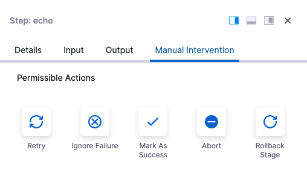
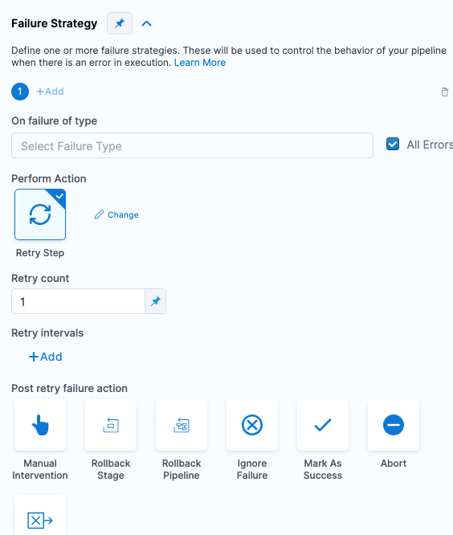

Currently, only the **All Errors** Failure Type is supported.A failure strategy defines how your stages and steps handle different failure conditions.

The failure strategy contains error conditions that must occur for the strategy to apply, and actions to take when the conditions occur.

Failure strategies are a critical pipeline design component that determine what fails a step or stage and what to do when the failure occurs.

You can apply a failure strategy to the following:

* Step
* Step Group
* Stage

For details on strategy options and how strategies work, see [step and stage failure strategy settings](/docs/continuous-delivery/x-platform-cd-features/executions/step-failure-strategy-settings).

[Add a stage](/docs/platform/Pipelines/add-a-stage) before you define a failure strategy for stages and steps.

## Visual Summary

Here's a quick video of how to set up failure strategies:

<!-- Video:
https://www.youtube.com/watch?v=4KYGllvJ42U-->
<docvideo src="https://www.youtube.com/watch?v=4KYGllvJ42U" />

Here is what a Manual Intervention action looks like when a failure occurs:

<figure>

  

<figcaption>Figure 1: Manual intervention.</figcaption>
</figure>

You can select an option or, if the Manual Intervention exceeds its Timeout setting, select the Post Timeout Action that will happen automatically.

## Failure strategy takes precedence over conditional execution

Harness pipeline stages and steps both include **Conditional Execution** and **Failure Strategy** settings:

<figure>

<docimage path={require('./static/define-a-failure-strategy-on-stages-and-steps-12.png')} width="80%" height="80%" title="Click to view full size image" />

<figcaption>Figure 2: Conditional execution and failure strategy settings.</figcaption>
</figure>


Using these settings together in multiple stages requires some consideration.

Let's say you have a Pipeline with two stages: **stage 1** followed by **stage 2**. 

Stage 2's **Conditional Execution** is set to **Execute this step only if prior stage or step failed**. Stage 1's **Failure Strategy** is set to **Rollback Stage on All Errors**.

If stage 1 has any error it is rolled back and so it is not considered a failure. Hence, the stage 2's **Conditional Execution** is not executed.

In order to get stage 2 to execute, you can set the stage 1 **Failure Strategy** to **Ignore Failure**. Rollback will not occur and stage 2's **Conditional Execution** is executed.

In general, if you want to run particular steps on a stage failure, you should add them to stage's **Rollback** section.

## Add a stage failure strategy

The stage failure strategy applies to all steps in the stage that do not have their own failure strategy configured.

In a stage, click **Advanced**.

In **Failure Strategy**, you can see the default stage strategy:

**On all errors other than those specified in failure strategies defined here, perform action**

This default cannot be removed, but it can be edited. You can choose a new Action, Timeout, and Post timeout action.

To add an additional stage failure strategy, click **Add**.

Select the following:

* **On failure of type:** select one or more of the error types. For more information, go to [step and stage failure strategy settings](/docs/continuous-delivery/x-platform-cd-features/executions/step-failure-strategy-settings).

Currently, only **All Errors** is supported. **Action:** select one of the available actions.
* **Timeout** and **Post timeout action:** these are available if you selected **Manual Intervention** in Action. Enter the timeout for the failure strategy and the subsequent action to perform.
* **Retry Count** and **Retry Intervals:** these are available if you selected **Retry** in Action. Enter the number of times to retry the step, and the retries intervals.

## Add a step failure strategy

By default, steps do not have a failure strategy. Steps follow the stage failure strategy.

When you add a step failure strategy, you are overriding the stage failure strategy.

In a step, click **Advanced**.

Click **Failure Strategy** and click **Add**.

Select the following:

* **On failure of type:** select one or more of the error types. For more information, go to [step and stage failure strategy settings](/docs/continuous-delivery/x-platform-cd-features/executions/step-failure-strategy-settings).

Currently, only **All Errors** is supported.* **Action:** select one of the available actions.
* **Timeout** and **Post timeout action:** these are available if you selected **Manual Intervention** in Action. Enter the timeout for the failure strategy and the subsequent action to perform.
* **Retry Count** and **Retry Intervals:** these are available if you selected **Retry** in Action. Enter the number of times to retry the step, and the retries intervals.

## Retry count expression

When you set the failure strategy to **Retry Step**, you can specify the retry count for a step or all steps in the stage.

<figure>

  

<figcaption>Figure 3: Retry count.</figcaption>
</figure>

Harness includes a `retryCount` built-in expression that resolves to the total number of times a step was retried:

```
<+execution.steps.STEP_ID.retryCount>
```

You can use this expression in a Shell Script step script anywhere after the step that you identify in the expression. 

For example, here is a script that resolves the retry count for the step with the Id `ShellScript_1`:

```
echo "retry count of ShellScript_1: <+execution.steps.ShellScript_1.retryCount>"
```

During pipeline execution, the expression would resolve to something like this:

```
retry count of ShellScript_1: 2
```


## Reference material

* [Stage and step conditional execution settings](/docs/continuous-delivery/x-platform-cd-features/executions/step-and-stage-conditional-execution-settings)

