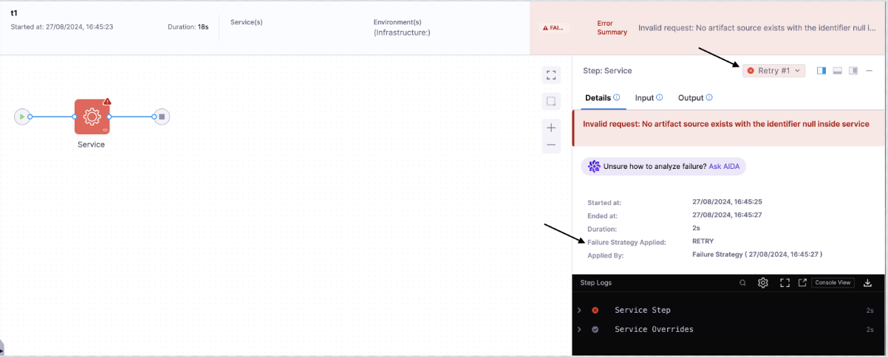
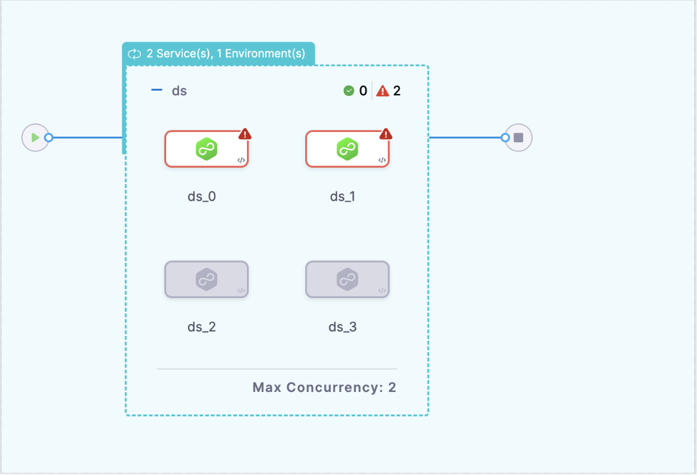

:::info
Currently, this feature is behind the feature flag, `CDS_SERVICE_INFRA_FAILURE_STRATEGY`. Contact [Harness Support](mailto:support@harness.io) to enable the feature.
:::

[Failure strategies](/docs/platform/pipelines/failure-handling/define-a-failure-strategy-for-pipelines.md) can be applied to [Service](./services/services-overview.md) and [Environment](./environments/environment-overview.md) steps, allowing users to define failure actions like retries, abort etc. in case of failure. This approach helps maintain deployment stability by allowing the system to handle unexpected issues gracefully. By default, the failure strategy for Service and Environment steps is inherited from the stage configuration.

## Supported Failure Strategies

The following failure strategies will be supported for Service and Environment steps:

### Services

1. Rollback Pipeline
2. Retry
3. Abort
4. Mark as Failure

### Environment and Infrastructure

1. Rollback Pipeline
2. Retry
3. Abort
4. Mark as Failure
5. Rollback Stage

## Examples covering failure strategy for Service and Infrastructure

:::info note
The Service and Infrastructure step does not have its own specific failure strategy. Instead, it inherits the failure strategy defined at the stage level. This means that any failure actions configured for the stage will apply to the Service step as well.
:::

### Retry Service Step

<details>
<summary>YAML configuration demonstrating the Retry strategy for a service step</summary>


```yaml
pipeline:
  projectIdentifier: testServiceInfraRetry
  orgIdentifier: default
  tags: {}
  stages:
    - stage:
        name: t1
        identifier: t1
        description: ""
        type: Deployment
        spec:
          deploymentType: Kubernetes
          service:
            serviceRef: ser1
            serviceInputs:
              serviceDefinition:
                type: Kubernetes
                spec:
                  artifacts:
                    primary:
                      primaryArtifactRef: <+invalidRef>
                      sources: <+input>
          environment:
            environmentRef: env1
            deployToAll: false
            infrastructureDefinitions:
              - identifier: infra1
                inputs:
                  identifier: infra1
                  type: KubernetesDirect
                  spec:
                    connectorRef: <+input>
          execution:
            steps:
              - step:
                  type: ShellScript
                  name: ShellScript_1
                  identifier: ShellScript_1
                  spec:
                    shell: Bash
                    executionTarget: {}
                    source:
                      type: Inline
                      spec:
                        script: echo "forward"
                    environmentVariables: []
                    outputVariables: []
                  timeout: 10m
            rollbackSteps:
              - step:
                  type: ShellScript
                  name: ShellScript_1
                  identifier: ShellScript_1
                  spec:
                    shell: Bash
                    executionTarget: {}
                    source:
                      type: Inline
                      spec:
                        script: echo "rollback"
                    environmentVariables: []
                    outputVariables: []
                  timeout: 10m
        tags: {}
        failureStrategies:
          - onFailure:
              errors:
                - AllErrors
              action:
                type: Retry
                spec:
                  retryCount: 2
                  retryIntervals:
                    - 10s
                  onRetryFailure:
                    action:
                      type: MarkAsFailure
  identifier: serviceRetryWithoutPostAction
  name: serviceRetryWithMarkASFailure
```
</details>

This pipeline YAML demonstrates a service step that references an invalid artifact (`primaryArtifactRef`). As a result, the step will fail. The failure strategy is configured to `retry` the step twice, waiting 10 seconds between retries. If the issue persists, the pipeline will be marked as failed.



### Pipeline Rollback on Infra Failure


<details>
<summary>YAML configuration where an incorrect infrastructure configuration triggers a pipeline rollback</summary>

```yaml
pipeline:
  identifier: infraPipelineRollback
  projectIdentifier: testServiceInfraRetry
  orgIdentifier: default
  tags: {}
  stages:
    - stage:
        identifier: t1
        type: Deployment
        name: t1
        description: ""
        spec:
          deploymentType: Kubernetes
          service:
            serviceRef: ser1
            serviceInputs:
              serviceDefinition:
                type: Kubernetes
                spec:
                  artifacts:
                    primary:
                      primaryArtifactRef: testArtifact
                      sources: <+input>
          environment:
            environmentRef: env1
            deployToAll: false
            infrastructureDefinitions:
              - identifier: infra1
                inputs:
                  identifier: infra1
                  type: KubernetesDirect
                  spec:
                    connectorRef: account.KubernetesAccLvl
          execution:
            steps:
              - step:
                  identifier: ShellScript_1
                  type: ShellScript
                  name: ShellScript_1
                  spec:
                    shell: Bash
                    executionTarget: {}
                    source:
                      type: Inline
                      spec:
                        script: echo "forward"
                    environmentVariables: []
                    outputVariables: []
                  timeout: 10m
            rollbackSteps:
              - step:
                  identifier: ShellScript_1
                  type: ShellScript
                  name: ShellScript_1
                  spec:
                    shell: Bash
                    executionTarget: {}
                    source:
                      type: Inline
                      spec:
                        script: echo "rollback"
                    environmentVariables: []
                    outputVariables: []
                  timeout: 10m
        tags: {}
        failureStrategies:
          - onFailure:
              errors:
                - AllErrors
              action:
                type: Abort
    - stage:
        identifier: t2
        type: Deployment
        name: t2
        description: ""
        spec:
          deploymentType: Kubernetes
          service:
            serviceRef: ser1
            serviceInputs:
              serviceDefinition:
                type: Kubernetes
                spec:
                  artifacts:
                    primary:
                      primaryArtifactRef: testArtifact
                      sources: <+input>
          environment:
            environmentRef: env1
            deployToAll: false
            provisioner:
              steps:
                - step:
                    identifier: dc
                    type: ShellScriptProvision
                    name: dc
                    spec:
                      source:
                        type: Inline
                        spec:
                          script: echo "DC"
                      environmentVariables: []
                    timeout: 10m
              rollbackSteps:
                - step:
                    identifier: ShellScriptProvision_1
                    type: ShellScriptProvision
                    name: ShellScriptProvision_1
                    spec:
                      source:
                        type: Inline
                        spec:
                          script: echo "pRol"
                      environmentVariables: []
                    timeout: 10m
            infrastructureDefinitions:
              - identifier: infra1
                inputs:
                  identifier: infra1
                  type: KubernetesDirect
                  spec:
                    connectorRef: <+cds>
          execution:
            steps:
              - step:
                  identifier: ShellScript_1
                  type: ShellScript
                  name: ShellScript_1
                  spec:
                    shell: Bash
                    executionTarget: {}
                    source:
                      type: Inline
                      spec:
                        script: exit 1
                    environmentVariables: []
                    outputVariables: []
                  timeout: 10m
            rollbackSteps:
              - step:
                  identifier: ShellScript_1
                  type: ShellScript
                  name: ShellScript_1
                  spec:
                    shell: Bash
                    executionTarget: {}
                    source:
                      type: Inline
                      spec:
                        script: echo "rollback"
                    environmentVariables: []
                    outputVariables: []
                  timeout: 10m
        tags: {}
        failureStrategies:
          - onFailure:
              errors:
                - AllErrors
              action:
                type: PipelineRollback
  name: infraPipelineRollback
```
</details>

This pipeline defines an infrastructure step with an incorrect `connectorRef`. The failure strategy is configured to trigger a `PipelineRollback` on failure. This means that if the infrastructure setup fails, the entire pipeline will revert to its previous state.


The infrastructure step will fail due to the incorrect connector reference, causing the pipeline to roll back both `t2` and `t1` stages.

## Failure Strategy Support for Multiservice, Multi-Infrastructure, and Matrix Deployment

:::info
Currently, this feature is behind the feature flag, `CDS_MULTI_DEPLOYMENT_ON_FAILURE`. Contact [Harness Support](mailto:support@harness.io) to enable the feature.
:::

Multiservice deployments can be achieved using either the native multiservice configuration or the matrix configuration.

### Applying Failure strategy during Multi-Deployment

In the example below, two services (ser_1, ser_2) are deployed across two infrastructures (infra2, infra1). The infrastructures are configured to deploy in parallel, and a failure strategy is defined to ensure resilient handling of any errors during deployment.

<details>
<summary>Failure strategy during Multi-Deployment</summary>

```yaml
pipeline:
  identifier: testMultiService
  name: testMultiService
  projectIdentifier: testServiceInfraRetry
  orgIdentifier: default
  tags: {}
  stages:
    - stage:
        identifier: ds
        type: Deployment
        name: ds
        description: ""
        spec:
          deploymentType: Kubernetes
          multiDeploymentConfig:
            onFailure: RunAll
          services:
            values:
              - serviceRef: ser1
                serviceInputs:
                  serviceDefinition:
                    type: Kubernetes
                    spec:
                      artifacts:
                        primary:
                          primaryArtifactRef: <+invalid>
              - serviceRef: ser2
                serviceInputs:
                  serviceDefinition:
                    type: Kubernetes
                    spec:
                      artifacts:
                        primary:
                          primaryArtifactRef: testArtifact
            metadata:
              parallel: false
          environments:
            metadata:
              parallel: true
            values:
              - environmentRef: env1
                deployToAll: false
                infrastructureDefinitions:
                  - identifier: infra2
                    inputs:
                      identifier: infra2
                      type: KubernetesDirect
                      spec:
                        connectorRef: <+WCD>
                  - identifier: infra1
                    inputs:
                      identifier: infra1
                      type: KubernetesDirect
                      spec:
                        connectorRef: account.KubernetesAccLvlConnectorForAutomationTest
          execution:
            steps:
              - step:
                  identifier: ShellScript_1
                  type: ShellScript
                  name: ShellScript_1
                  spec:
                    shell: Bash
                    executionTarget: {}
                    source:
                      type: Inline
                      spec:
                        script: echo "CD"
                    environmentVariables: []
                    outputVariables: []
                  timeout: 10m
            rollbackSteps: []
        tags: {}
        failureStrategies:
          - onFailure:
              errors:
                - AllErrors
              action:
                type: Retry
                spec:
                  retryCount: 1
                  retryIntervals:
                    - 10s
                  onRetryFailure:
                    action:
                      type: MarkAsFailure
```
</details>

In this deployment will proceed as follow:-

(ser_1 and infra_2) and ( ser_2 and infra_2 ) will be deployed in parallel (different services within the same infrastructure).
(ser_1 and infra_1) and 4 (ser_2 and infra_1) will be deployed in parallel (different services within the same infrastructure)

You need to add the following field in the YAML configuration to handle failure scenarios in multi-deployment setups:-

```yaml
multiDeploymentConfig:
  onFailure: <value>
```

The `onFailure` field supports two values:

1. `RunAll`:
This value ensures that if one deployment fails, the system will continue executing all remaining deployments.


```yaml
multiDeploymentConfig:
  onFailure: RunAll
```


In the example above, we have given given failure srategy for multideployment as RunAll, for example there is an issue with ser_1 and both the stages in series fails as well as there is an issue with infra_2 due to invalid configuration of artifact and connectors. In this case stage with (ser_1 infra_2), (ser_2 and infra_2) and (ser_1 and infra_1) will fail. The RunAll failure strategy ensures that even though these stages are failing (ser_2 and infra_1) proceeds with the deployment.


2. `SkipQueued`

When this value is used, if any deployment fails, all queued deployments that haven’t yet started will be skipped. 


```yaml
multiDeploymentConfig:
  onFailure: SkipQueued
```

If a failure occurs during the deployment of ser_1 on infra2, all subsequent deployments, such as ser_2 on infra1, will be skipped, halting the pipeline for queued tasks.



:::important note
In a parallel deployment, any deployments that have already started cannot be stopped, even if a failure occurs. Only queued deployments that haven’t begun execution will be skipped.
:::

### Applying Failure strategy during Matrix

<details>
<summary>Adding Failure strategy using Matrix for Multi-Deployment</summary>

```yaml
pipeline:
  identifier: testMatrixP0
  name: testMatrixPO
  projectIdentifier: defaultProject
  orgIdentifier: default
  tags: {}

  stages:
    - stage:
        identifier: service
        type: Deployment
        name: service
        description: ""
        spec:
          deploymentType: Kubernetes
          service:
            serviceRef: <+matrix.service>
            serviceInputs:
              serviceDefinition:
                type: Kubernetes
                spec:
                  artifacts:
                    primary:
                      primaryArtifactRef: artifactIden
                      sources:
                        - identifier: artifactIden
                          type: Gcr
                          spec:
                            tag: "49"
          environment:
            environmentRef: env
            deployToAll: false
          infrastructureDefinitions:
            - identifier: <+matrix.infra>
              inputs:
                identifier: <+matrix.infra>
                type: Kubernetes
                spec:
                  connectorRef: <+invalid>
          execution:
            steps:
              - step:
                  identifier: ShellScript_1
                  type: ShellScript
                  name: ShellScript_1
                  spec:
                    shell: Bash
                    executionTarget: {}
                    source:
                      type: Inline
                      spec:
                        script: echo "deploy"
                        environmentVariables: []
                        outputVariables: []
                    timeout: 10m
            rollbackSteps:
              - step:
                  identifier: ShellScript_1
                  type: ShellScript
                  name: ShellScript_1
                  spec:
                    shell: Bash
                    executionTarget: {}
                    source:
                      type: Inline
                      spec:
                        script: echo "rollback"
                        environmentVariables: []
                        outputVariables: []
                    timeout: 10m
          failureStrategies:
            - onFailure:
                errors:
                  - AllErrors
                action:
                  type: Retry
                  spec:
                    retryCount: 1
                    retryIntervals:
                      - 10s
                onRetryFailure:
                  action:
                    type: StageRollback
          strategy:
            onFailure: SkipQueued
            matrix:
              service:
                - rollingDeploy2
                - rollingDeploy1
              infra:
                - infral
                - infra2
            maxConcurrency: 2
```
</details>

The matrix strategy defines two variables—service and infra with each service `rollingDeploy2` and `rollingDeploy1` deployed across both `infra1` and `infra2`.

The `onFailure` field needs to be added inside the matrix configuration to define how the system should handle failures.


The `onFailure` field supports two values:

```yaml
strategy:
  onFailure: <value>
```

1. `RunAll`

This ensures that even if one or more infrastructure-service combinations fail, the remaining ones will continue to execute. For instance, if infra1 encounters issues, the system will continue deploying to infra2.

```yaml
strategy:
  onFailure: RunAll
```

If infra1 encounters connector issues and fails during the deployment, the remaining combination will still proceed to deployment. This allows the other deployments to continue without interruption

2. `SkipQueued`

When this value is applied, any failures that occur will cause the system to skip the remaining queued deployments that haven’t started yet.

```yaml
strategy:
  onFailure: SkipQueued
```

In this case, if infra1 fails during deployment due to an issue (e.g., invalid connector reference), the remaining deployment will be skipped, stopping the execution for all pending or queued combinations.

