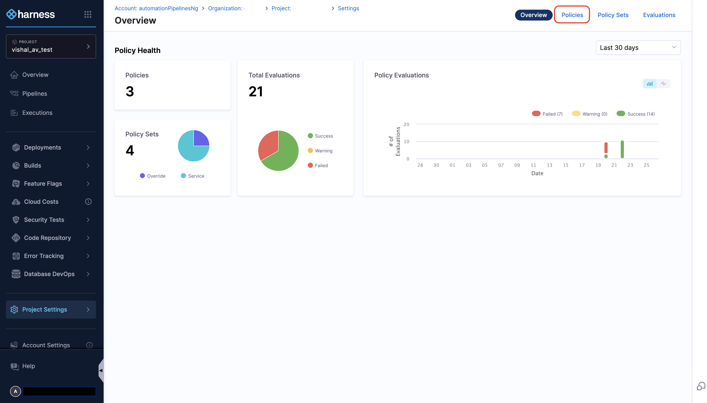
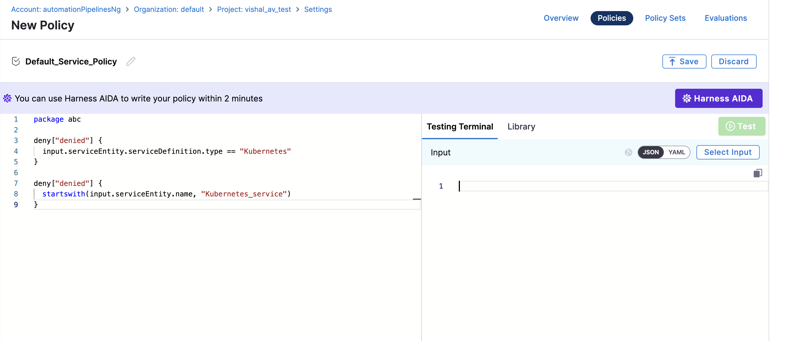
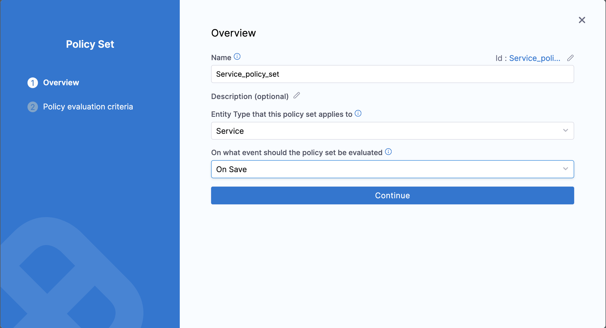
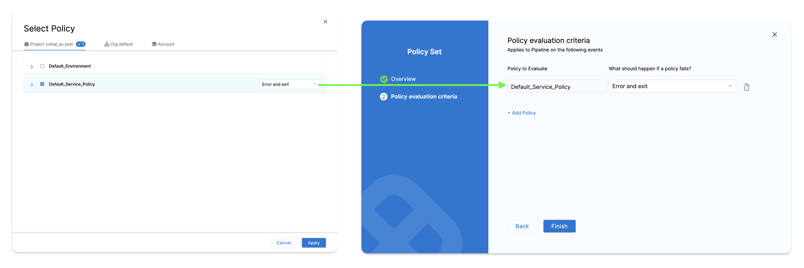
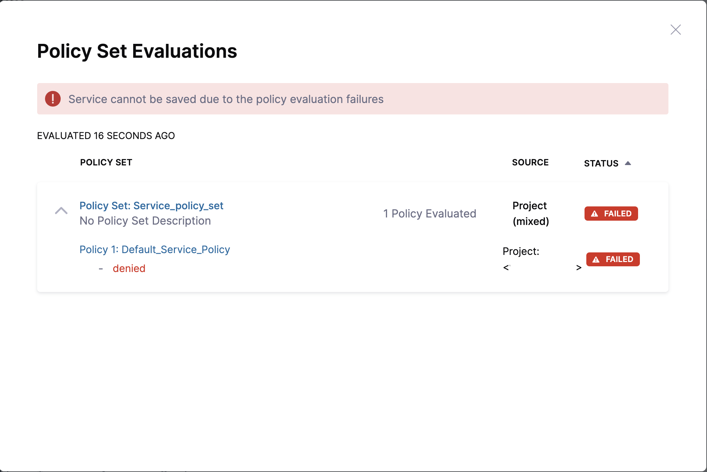

## Overview

Open Policy Agent (OPA) is an open-source policy engine that enables users to write declarative policies and integrate them into decision-making processes.

Harness now supports OPA policies for Continuous Delivery (CD) entities, such as **Services**, **Environments**, **Infrastructure Definitions**, and **Overrides**. These policies ensure governance by enforcing predefined rules during entity operations, such as creating or saving configurations.

:::note
Currently, this feature is behind the feature flag `OPA_CD_ENTITIES_GOVERNANCE`. Contact [Harness Support](mailto:support@harness.io) to enable the feature.
:::

### Key Features
- **Policy Creation**: Define custom policies for CD entities using the Harness UI or YAML.
- **OnSave Enforcement**: Evaluate policies during entity save operations to allow or deny actions.
- **Policy Testing**: Test policies against CD entities in the testing terminal.

## Policy Configuration

Follow these steps to create your policy through the Harness UI:

1. Go to **Settings** in Harness.
2. Under **Security and Governance**, click on **Policies**.

  

3. In the **Policies** tab, create a **New Policy**:
   - Define a name for your policy.
   - Under **How do you want to set up your Policy**, select either **Inline** or **Remote**.
   - Click **Apply**.
4. Define policies for the entities using the provided templates or create them manually.
  
5. Save the policy.


### Sample Policies

Here are some sample policies that you can refer to based on the entity type: 

<details>
<summary>Example: Service Policy</summary>

**Service Policies Example**

```rego
package abc

deny["denied"] {
  input.serviceEntity.serviceDefinition.type == "Kubernetes"
}

deny["denied"] {
  startswith(input.serviceEntity.name, "Kubernetes_service")
}
```

- This policy denies actions if the service type is `Kubernetes`.
- It also denies actions if the service name starts with `Kubernetes_service`.

</details>

<details>
<summary>Example: Environment Policy</summary>

**Service Environment Example**

```
package abc

deny {
  input.environmentEntity.type == "PreProduction"
}

deny {
  input.environmentEntity.variables[i].name == "variable"
}
```

- This policy denies actions if the environment type is `PreProduction`.
- It also denies actions if there is a variable named `variable`.

</details>

<details>
<summary>Example: Infrastructure Definition Policy</summary>

**Infrastructure Definition Policies Example**

```rego
package abc

deny["denied"]{
  input.infrastructureEntity.infrastructureDefinition.projectIdentifier == "k8s-Infrastructure"
  input.infrastructureEntity.infrastructureDefinition.deploymentType == "Kubernetes"
}
```

The policy denies an action if both of the following conditions are met:
- The projectIdentifier of the infrastructureEntity is equal to `k8s-Infrastructure`.
- The deploymentType of the infrastructureEntity is `Kubernetes`.

</details>

<details>
<summary>Example: Overrides Policy</summary>

**Overrides Policies Example**

```rego
package abc

deny["String variable type not allowed"]{
  input.overrideEntity.overrides.variables[i].type == "String"
}

deny["Variables have to be required"]{
  input.overrideEntity.overrides.variables[i].required == false
}
```

The policy denies an action if either of the following conditions is met:
- A variable in the overrideEntity.overrides.variables array has its type set to `String`.
- A variable in the overrideEntity.overrides.variables array has its required field set to `false`.


</details>

## Policy Set Configuration

Once you've created your policies, it's time to apply them with a Policy Set.

### UI Configuration to Create Policy Set

1. In the **Policy Sets** tab, click **+ New Policy Set**.
2. On the Overview page: 
   - Define the **Name** of the policy set.
   - Under **Entity Type that this policy set applies to**, choose the entities for which you want to apply the policy. The supported entities are:
     - Service
     - Environment
     - Infrastructure
     - Override
   - Under **On what event should the policy set be evaluated**, select **On Save**.
   
3. On the **Policy Evaluation Criteria** page:
   - Click **+ Add Policy**.
   - Select the policy you created earlier for the entity. You can also select policies created at the project, organization, and account levels.
   - Under **What should happen if a policy fails?**, you can choose one of the following options:
     - **Warn & continue**: Displays a warning message if the policy evaluation fails but allows the entity to be saved.
     - **Error and exit**: Displays an error message and prevents the entity from being saved.
     

Now the policy set is enabled and the policy will be enforced while saving the entity.

For example, you have a policy that does not allow the creation of a Kubernetes service. Now, when you try to create a Kubernetes service, you receive the following error while attempting to save the service.



## Limitation:

The policy is applicable on **ON SAVE**. If the entity is already created, the policy will not be enforced during the deployment.
