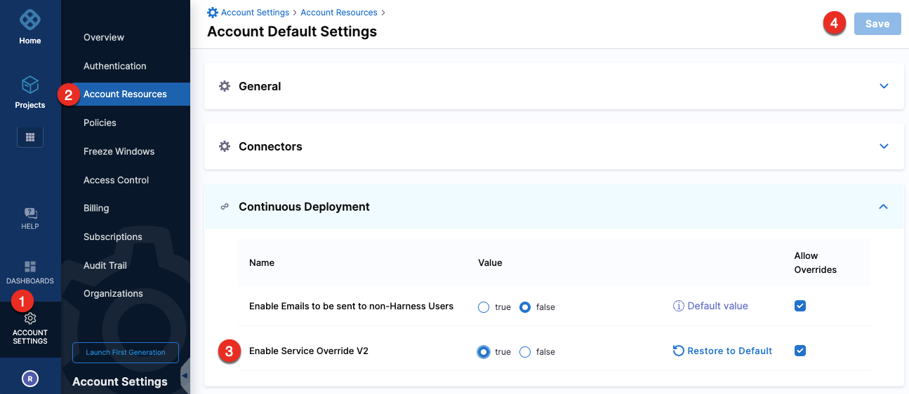
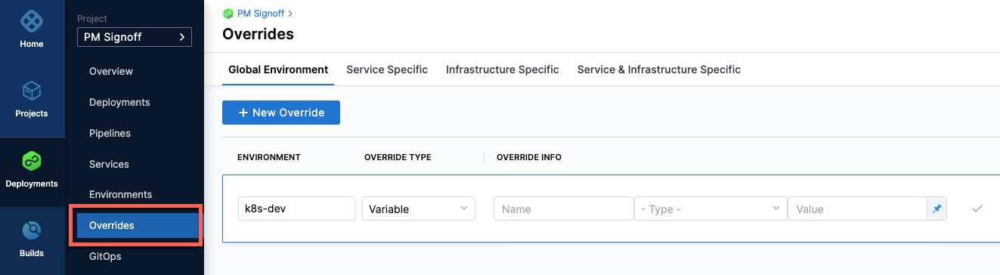
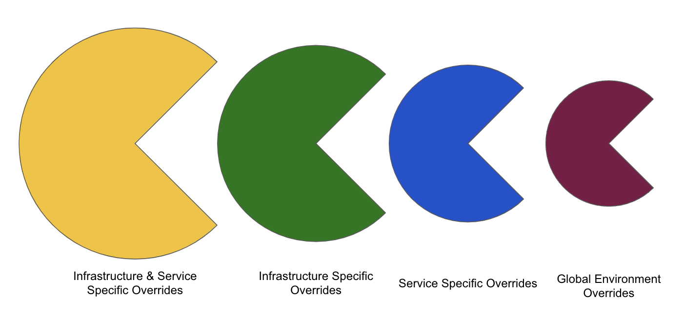

:::info

Currently, this is a beta feature and is behind the feature flag, `CDS_SERVICE_OVERRIDES_2_0`. Contact [Harness Support](mailto:support@harness.io) to enable the feature.

:::  

Harness has introduced an enhanced experience for service, environment, and infrastructure overrides in Continuous Delivery (CD). A new panel, **Overrides** is added in the **Deployments** section where you can override services, environments, and infrastructures.

Overrides can be defined at project, organization, and account levels.

In **Account Settings > Account Resources > Continuous Deployment**, set the **Enable Service Override V2** to `true` for the enhanced overrides experience. 

:::info

Make sure that the `NG_SETTINGS` feature flag is enabled to view this setting.

:::



## Limitations

* Runtime inputs are not supported for **Infrastructure Specific** and **Service & Infrastructure Specific** variables.

## Migrating to overrides V2

Currently, Harness migrates the existing override configuration to the new version using back-end APIs. The existing override scope or scope with all child scopes are migrated based on the requirement. 

Harness anticipates adding a Migrate button in the UI to migrate to the new override configuration in the future. 

## Video demo

<docvideo src="https://www.loom.com/share/a93bd67458784583b4e509c5b30e887a?sid=49124b81-4909-4079-859c-64e8950fffaa" />

## Override types

```mdx-code-block
import Tabs from '@theme/Tabs';
import TabItem from '@theme/TabItem';
```
```mdx-code-block
<Tabs>
  <TabItem value="Manifests" label="Manifests" default>
```
You can override the following manifest types:

- Values YAML
- OpenShift Param
- Kustomize
- Helm Repo
- Tanzu Application Service (TAS) manifest
- TAS vars
- TAS AutoScalar

```mdx-code-block
  </TabItem>
  <TabItem value="Config Files" label="Config Files">
```

Config files are completely overridden.

Config files are a black box that can contain multiple formats and content, such as YAML, JSON, plain text, etc. Consequently, they cannot be overridden like values YAML files.

```mdx-code-block
  </TabItem>
  <TabItem value="Variables" label="Variables">
```
Like config files, variables are completely overridden.

You can use expressions to reference infrastructure variables. For example, `<+serviceVariables.VAR_NAME>`. 

You can reference service variables in your pipeline steps, values YAML, JIRA steps, and so on. 

```mdx-code-block
  </TabItem>
  <TabItem value="Application Settings and Connection Strings" label="Application Settings and Connection Strings">
```
In [Azure App Service configuration](/docs/continuous-delivery/deploy-srv-diff-platforms/azure/azure-web-apps-tutorial/#app-services-configuration), App settings like Application Settings and Connection Strings can be passed as environment variables to the application code. 

You can override Application Settings and Connection Strings from **Global Environment** overrides. 

```mdx-code-block
  </TabItem>
</Tabs>
```

## Override service, environment, and infrastructure settings

You can override one or more settings for all services, environments, and infrastructures at project, organization, and account levels. 

1. In **Deployments**, select your project, and then select **Overrides**.
   
2. Select an override method:  
   - **Global Environment** 
   - **Service Specific** 
   - **Infrastructure Specific** 
   - **Service & Infrastructure Specific** 
3. Select **New Override**.
4. Select a project, organization, or account-level override.
5. In **Override Type**, select one of the following override types:  
   - Variable
   - Manifest
   - Config File
   - Application Settings (applicable to **Global Environment** override method only)
   - Connection Strings (applicable to **Global Environment** override method only)
3. Override the setting.

## Override priority

The override priority from top to bottom is:  

- **Infrastructure & Service Specific** overrides
- **Infrastructure Specific** overrides
- **Service Specific** overrides
- **Global Environment** overrides



Overrides defined at project/organization/account levels have the following override priority:  

- Project
- Organization
- Account


