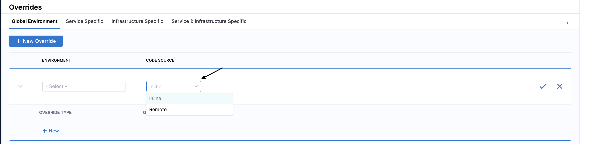

:::info

Currently, this is a beta feature and is behind the feature flag, `CDS_SERVICE_OVERRIDES_2_0`. Contact [Harness Support](mailto:support@harness.io) to enable the feature.

:::

Harness has introduced an enhanced experience for service, environment, and infrastructure overrides in Continuous Delivery (CD). A new page, named **Overrides**, is added in **Deployments**. In **Overrides**, you can define overrides for services, environments, and infrastructures.

Overrides can be defined at project, organization, and account levels.

:::info note
For information on overrides V1, go to [Services and environments basics](/docs/continuous-delivery/get-started/services-and-environments-overview).
:::

## Permissions

Here are the override types and the permissions you require for each type:

- **Service & Infrastructure Specific**:
  - `Service: Create/Edit`
- **Infrastructure Specific**: `Environment: Create/Edit`
- **Service Specific**:
  - `Service: Create/Edit`
- **Global Environment**: `Environment: Create/Edit`

## Limitations

- Runtime inputs are not supported for **Infrastructure Specific** and **Service & Infrastructure Specific** variables.

## Important notes

- Overrides V2 are supported for infrastructure entities, infrastructure and services combinations additionally, and can be visualized in a separate Overrides V2 section under Project, Org, and Account scopes.
- With the new Overrides V2 experience, environment variables can be created only in the **Global Environment** variables section. It cannot be done in the **Environment** section anymore.
  - Service and Infrastructure are unaffected and will behave as before the change.
- If you continue to use Terraform scripts with Overrides V1 (without migrating to V2 scripts) but with Overrides V2 feature flag enabled, there will be changes in the Terraform plan and you may encounter errors while executing the V1 Terraform scripts.
- When overrides as part of remote environments are migrated, the overrides are created as inline overrides with Overrides V2. Inline overrides can be moved as remote entities using [APIs](https://apidocs.harness.io/tag/ServiceOverrides/#operation/serviceOverrideMoveConfigs).

## Migration notice for existing Harness customers: Overrides V2

Dear valued customers,

We are excited to announce an upcoming Overrides V2 migration aimed at enhancing your experience with Harness. Here's what you need to know.

### Migration details

- **New Experience Awaits: Starting September 7th, 2023**, Harness is transitioning from the current service and environment overrides experience to the much anticipated Override V2 experience.
- **Seamless Migration:** The migration process has been designed to be as smooth as possible. It will occur in phases, referred to as _rings_.
  - The best part? No active engagement is required on your part. Harness will handle the migration in the background. We will notify each customer a week prior to their scheduled migration date, based on the ring they're allocated to.
- **Continuity Assured:** We don't anticipate any disruptions or failures during this process. Rest assured, your existing pipelines will remain compatible with the service and environment override V1 experience. Automation and existing APIs will still work.

### Why Overrides V2?

- **Greater Flexibility:** With Overrides V2, you can now manage overrides for any CD entity. This includes service-specific environment overrides and **Global Environment** override variables.
- **Enhanced Infrastructure Variable Management:** Beyond the current capabilities, users can now manage infrastructure overrides and service-specific infrastructure overrides.
- **Independent Management:** Overrides will be represented as their own YAML object, allowing for more streamlined and independent management.
- **More Granular Configuration:** You can now set up overrides at both the account and organizational level for service and environment entities within a project context.

### Further Reading

For those keen to delve deeper and understand more about Overrides V2, we've got you covered. Here are some additional resources:

- Read the rest of the current document.
- [API Management of Overrides](https://apidocs.harness.io/tag/ServiceOverrides#operation/createServiceOverride)
- [Terraform Management of Overrides](https://registry.terraform.io/providers/harness/harness/latest/docs/resources/platform_environment_service_overrides)

Your trust is our top priority, and we're always here to support you. Thank you for being a valued Harness customer. We look forward to continuing our journey together, with an ever-improving platform and service.

Warm regards,

Harness CD Product and Engineering Team

## Demo Video

<DocVideo src="https://www.loom.com/share/a93bd67458784583b4e509c5b30e887a?sid=49124b81-4909-4079-859c-64e8950fffaa" />

### Updated experience since the demo video on 11.26.2023

Now, if Overrides V2 is enabled on your account, it is globally enabled on the account. Harness has removed the per-project opt-in experience because it is in the process of making Overrides V2 the default experience in Harness. If the Overrides V2 experience is enabled on your account, make sure that Harness migrates your existing overrides to the Overrides V2 experience. After the migration, the overrides user interface becomes available on the Overrides tab instead of the Environments tab.

Your existing automation continues to work and the APIs are backward compatible with the V1 experience.

You can now search, filter, and sort overrides on the listing page.

The YAML view for Overrides V2 is enabled now.

## Override types

import Tabs from '@theme/Tabs';
import TabItem from '@theme/TabItem';

<Tabs>
  <TabItem value="Manifests" label="Manifests" default>

You can override the following manifest types:

- Values YAML
- OpenShift Param
- Kustomize
- Helm Repo
- Tanzu Application Service (TAS) manifest
- TAS vars
- TAS AutoScalar

</TabItem>
  <TabItem value="Config Files" label="Config Files">

Config files are completely overridden.

Config files are a black box that can contain multiple formats and content, such as YAML, JSON, plain text, etc. Consequently, they cannot be overridden like values YAML files.

</TabItem>
  <TabItem value="Variables" label="Variables">

Like config files, variables are completely overridden.

You can use expressions to reference service variables. For example, `<+serviceVariables.VAR_NAME>`.

You can reference service variables in your pipeline steps, values YAML, JIRA steps, and so on.

For more information on variables, go to [Use Harness expressions](/docs/platform/variables-and-expressions/harness-variables).

</TabItem>
  <TabItem value="Application Settings and Connection Strings" label="Application Settings and Connection Strings">

In [Azure App Service configuration](/docs/continuous-delivery/deploy-srv-diff-platforms/azure/azure-web-apps-tutorial/#app-services-configuration), Web App settings **Application Settings** and **Connection Strings** can be passed as environment variables to the application code.

You can override **Application Settings** and **Connection Strings** from **Global Environment** overrides.

</TabItem>
</Tabs>

## Override service, environment, and infrastructure settings

To override one or more settings for all services, environments, and infrastructures at the project, organization, or account level, do the following. 

1. In **Deployments**, select your project, and then select **Overrides**.

   

2. Select an override method:
   - **Global Environment** 
   - **Service Specific**
   - **Infrastructure Specific**
   - **Service & Infrastructure Specific**
3. Select **New Override**.
4. Select a project, organization, or account-level override.
5. In **Override Type**, select one of the following override types:
   - Variable
   - Manifest
   - Config File
   - Application Settings (applicable to **Global Environment** override method only)
   - Connection Strings (applicable to **Global Environment** override method only)
6. Override the setting.

## Override priority

The override priority from top to bottom is:

1. **Service & Infrastructure Specific** overrides
2. **Infrastructure Specific** overrides
3. **Service Specific** overrides
4. **Global Environment** overrides

Overrides defined at project/organization/account levels have the following override priority:

1. Project
2. Organization
3. Account

## Manage Overrides using Git Experience

:::info note
Currently, Git Experience support for overrides is behind the feature flag `CDS_OVERRIDES_GITX`. Contact [Harness Support](mailto:support@harness.io) to enable the feature.
:::

When you create overrides, you can store them remotely or inline.

- **Inline**: Overrides are stored in the Harness Platform.

- **Remote**: Overrides are stored in a repository based on users choice.

### Moving overrides from Inline to Remote

You can store overrides remotely in a repository. The steps below explains how to store overrides in GitHub. You can choose a source code repository of your choice.

1. Select **Overrides**.

   
2. Under the **Global Environment** tab, select your **Environment**. 

   You have the option to select **Inline** or **Remote** code source under all override methods.
3. Select **Remote**.
4. In **Git Connector**, select or create a Git connector to the repository for your environment.​ For more information, go to [Code Repo Connectors](/docs/category/code-repo-connectors).
5. In **Repository**, select your repository. If your repository isn't listed, enter its name. 

   Create the repository in Github before entering it in **Repository**. Harness does not create the repository for you.
6. Select **Git Branch**. Currently only default branch of the repository is supported for overrides.
7. Harness Git Experience auto-populates the **YAML Path** based on the scope where overrides are configured, for example, ``{scope}/overrides/harnessdevenv.yaml``.
9. Select **Save**.

:::info note
1. Overrides also support [Bidirectional Sync](/docs/platform/git-experience/gitexp-bidir-sync-setup.md).
2. When moving overrides to Git, the corresponding Environment must also be in Git.
3. Similar to environments, for Service-specific remote overrides, the Service must be remote.
4. For infrastructure specific overrides the Infrastructure must be remote for the overrides to be moved to Git successfully.
:::
