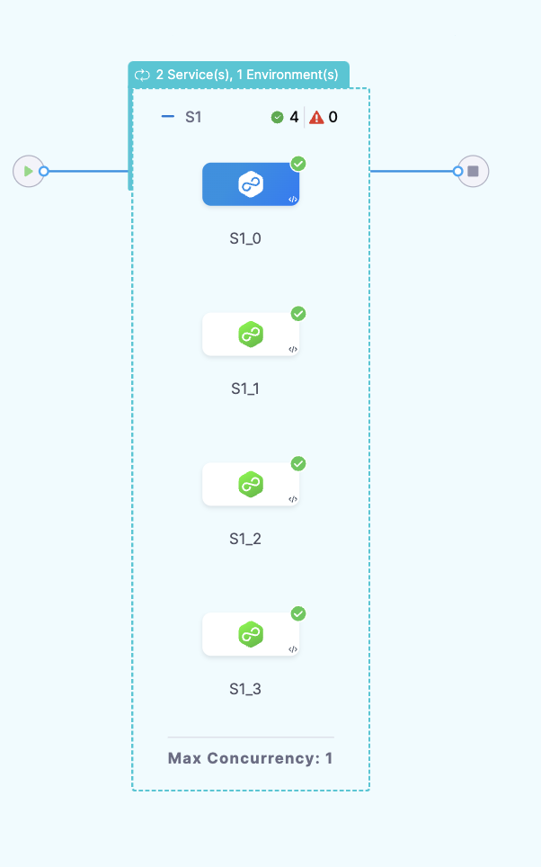
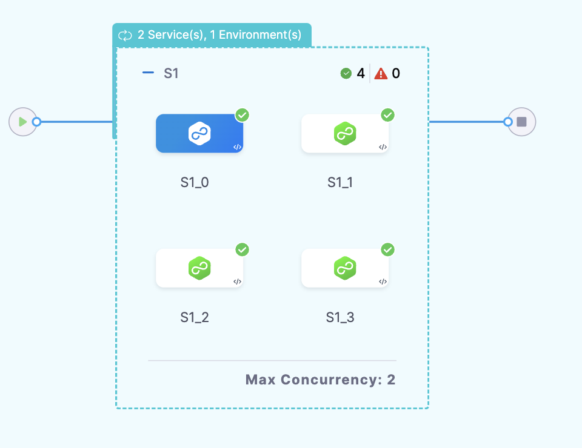
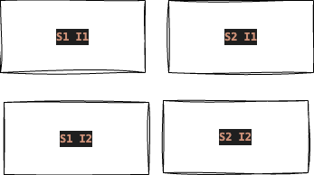
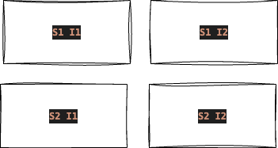
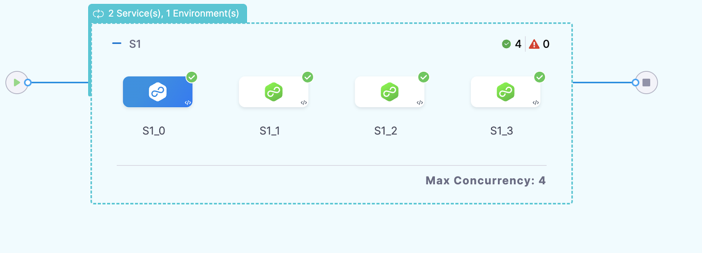
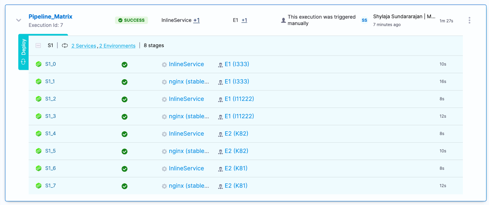
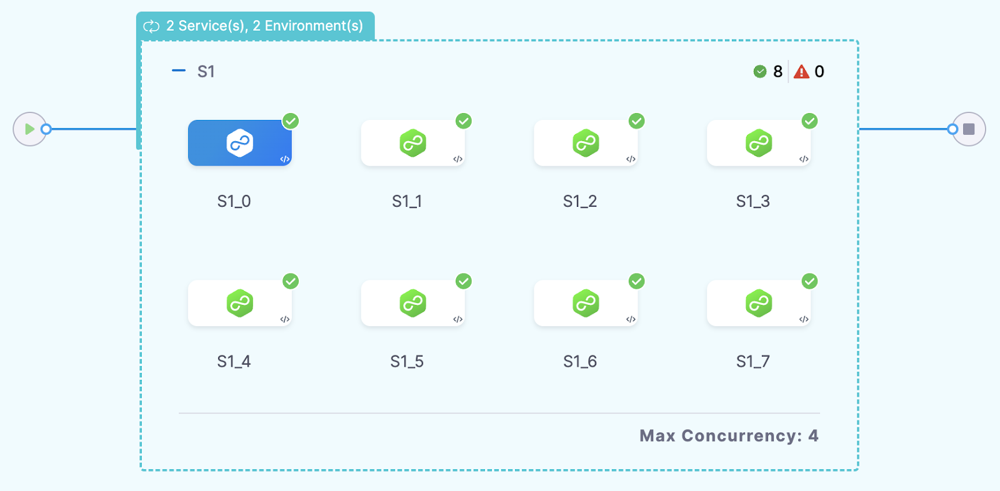

Pipelines can be executed with multiple Services and Environments. These Services and Environments are combined into a Service & Environment (infrastructure) in a stage for execution.

### Execution Sequence

Users can configure the sequence of deployment as Sequential or Parallel.

When you click on **Deploy multiple Services** you see an option for **Deploy Services in Parallel?**. When you check that it will allow you to deploy your services parallelly.

:::important note
By default, the execution sequence is the parallel deployment for Services.
:::

When you click on **Deploy to multiple Environments or Infrastructures** you see an option for **Deploy to Environments or Infrastructures in parallel?**. When you check that it will allow you to deploy your infrastructure and environment parallelly.

### Expected Scenario

1. Sequential Deployment in Multi Services and Sequential Multi-Infrastructure

For example:

- **Services**: S1, S2
- **Environment**: E1
- **Infrastructure**: I1, I2

Each service is sequentially deployed in collection of Infrastructure ordered in the YAML.

Each service is deployed in one infrastructure first and then followed by the second infrastructure.

The deployment sequence is as follows:
**`S1 I1, S2 I1, S1 I2, S2 I2`**

2. Parallel Deployment in Multi-Services and Sequential Multi-Infrastructure

For example:

- **Services**: S1, S2
- **Environment**: E1
- **Infrastructure**: I1, I2

Each service will be deployed parallelly in different infrastructure.

The deployment sequence is as follows:

Here, 1 and 2 will be deployed parallelly and 3 and 4 will be deployed parallelly i.e same services are deployed parallelly in the different infrastructure. 1 and 3 will deployed sequentially and 2 and 4 will be deployed sequentially i.e different service in same infrastructure will deployed sequentially.

3. Sequential Deployment in Multi-Services and Parallel Multi-Infrastructure

For example:

- **Services**: S1, S2
- **Environment**: E1
- **Infrastructure**: I1, I2

Each service is deployed sequentially, but the infrastructures are deployed in parallel.

The deployment sequence is as follows:

Here, 1 and 2 will be deployed parallelly and 3 and 4 will be deployed parallelly i.e different services are deployed parallelly in the same infrastructure. 1 and 3 will deployed sequentially and 2 and 4 will be deployed sequentially i.e same service will be deployed in different infrastructure sequentially.

4. Multi Service in Parallel and Multi Infrastructure in Parallel

- **Services**: S1, S2
- **Environment**: E1
- **Infrastructure**: I1, I2

Both services and infrastructure are deployed in parallel.

The deployment sequence is as follows:
**`S1 I1, S2 I1, S1 I2, S2 I2`**

5. Multi service in parallel and multi environment and multi Infrastructure in sequential 

- **Services**: S1, S2
- **Environment_1_Infrastructure_1**: I1, I2
- **Environment_2_Infrastructure_2**: K82, K81

Services are deployed in parallel, but the environments and infrastructures are deployed sequentially.

The deployment sequence is as follows:
**`S1 I1, S2 I1, S1 I2, S2 I2, S1 K82, S2 K81, S2 K82, S2 K81`**

6. Multi service in sequential and multi environment and multi Infrastructure in parallel

- **Services**: S1, S2
- **Environment_1_Infrastructure_1**: I1, I2
- **Environment_2_Infrastructure_2**: K82, K81

Services are deployed sequentially, but the environments and infrastructures are deployed in parallel.

The deployment sequence is as follows:
**`S1 I1 ,S1 I2 , S1 K82 , S1 K81, S2 I1 ,S2 I2 , S2 K82 , S2 K81`**

Infrastructure takes precedence, and all Infrastructure gets one Service followed by other Services.

### Deployment and Concurrency

Concurrency is set based on the parallel deployment configuration, either based on the Infrastructure.