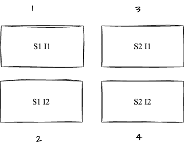

Pipelines can be executed with multiple services and environments. These services and environments are combined into a service & environment (infrastructure) in a stage for execution.

## Execution Sequence

Users can configure the sequence of deployment as Sequential or Parallel.

When you click on **Deploy multiple Services** you see an option for **Deploy Services in Parallel?**. When you check that it will allow you to deploy your services in parallel.

:::important note
By default, the execution sequence is parallel deployment for services.
:::

When you click on **Deploy to multiple Environments or Infrastructures** you see an option for **Deploy to Environments or Infrastructures in parallel?**. When you check that it will allow you to deploy your infrastructure and environment in parallel.

## Expected Scenarios

### Sequential Deployment in Multi Services and Sequential Multi-Infrastructure

For example:

- **Services**: S1, S2
- **Environment**: E1
- **Infrastructure**: I1, I2

Each service is sequentially deployed in a collection of Infrastructure instructed by the YAML.

Each service is deployed in one infrastructure first and then followed by the second infrastructure.

The deployment sequence is as follows:
**`S1 I1, S2 I1, S1 I2, S2 I2`**

### Parallel Deployment in Multi-Services and Sequential Multi-Infrastructure

For example:

- **Services**: S1, S2
- **Environment**: E1
- **Infrastructure**: I1, I2

Each service will be deployed parallelly in different infrastructure.

The deployment sequence is as follows:

Here, 1 and 2 will be deployed in parallel and 3 and 4 will be deployed in parallel i.e the same services are deployed in parallel in each infrastructure. 1 and 3 will deployed sequentially and 2 and 4 will be deployed sequentially i.e different service in same infrastructure will deployed sequentially.

### Sequential Deployment in Multi-Services and Parallel Multi-Infrastructure

For example:

- **Services**: S1, S2
- **Environment**: E1
- **Infrastructure**: I1, I2

Each service is deployed sequentially, but the infrastructures are deployed in parallel.

The deployment sequence is as follows:

Here, 1 and 2 will be deployed parallelly and 3 and 4 will be deployed parallelly i.e different services are deployed parallelly in the same infrastructure. 1 and 3 will deployed sequentially and 2 and 4 will be deployed sequentially i.e same service will be deployed in different infrastructure sequentially.

### Multi Service in Parallel and Multi Infrastructure in Parallel

- **Services**: S1, S2
- **Environment**: E1
- **Infrastructure**: I1, I2

Both services and infrastructure are deployed in parallel.

The deployment sequence is as follows:
**`S1 I1, S2 I1, S1 I2, S2 I2`**

### Multi service in parallel and multi environment and multi Infrastructure in sequential 

- **Services**: S1, S2
- **Environment_1_Infrastructure_1**: I1, I2
- **Environment_2_Infrastructure_2**: K82, K81

Services are deployed in parallel, but the environments and infrastructures are deployed sequentially.

The deployment sequence is as follows:
**`S1 I1, S2 I1, S1 I2, S2 I2, S1 K82, S2 K81, S2 K82, S2 K81`**

### Multi service in sequential and multi environment and multi Infrastructure in parallel

- **Services**: S1, S2
- **Environment_1_Infrastructure_1**: I1, I2
- **Environment_2_Infrastructure_2**: K82, K81

Services are deployed sequentially, but the environments and infrastructures are deployed in parallel.

The deployment sequence is as follows:
**`S1 I1 ,S1 I2 , S1 K82 , S1 K81, S2 I1 ,S2 I2 , S2 K82 , S2 K81`**

Infrastructure takes precedence, and all Infrastructure gets one Service followed by other Services.

### Deployment and Concurrency

Concurrency is set based on the parallel deployment configuration, either based on the Infrastructure.

* If you select **Deploy services in parallel**, Max concurrency is equal to the number of services.
* If you select **Deploy to Environments or Infrastructures in parallel**, Max concurrency is equal to the number of environments or infrastructures.
* If you select **Deploy services in parallel** and **Deploy to Environments or Infrastructures in parallel**, Max concurrency is equal to the number of services multiplied by the number of environments.