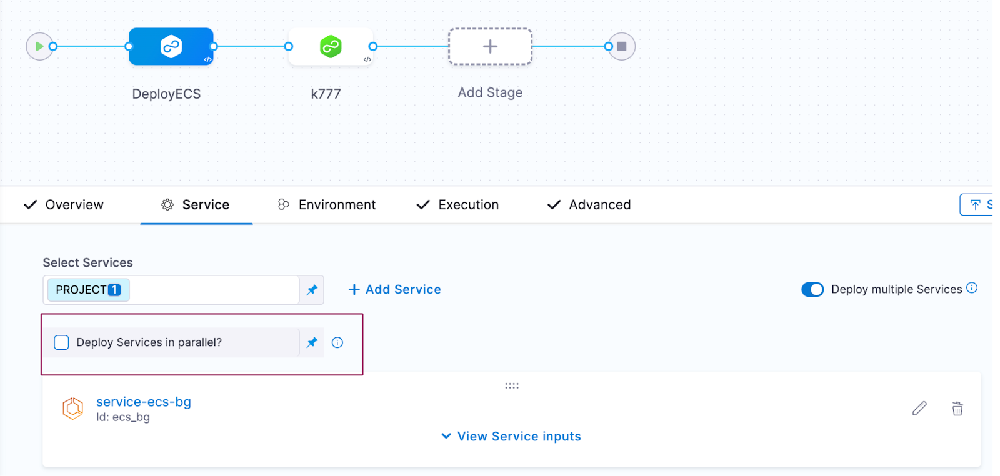
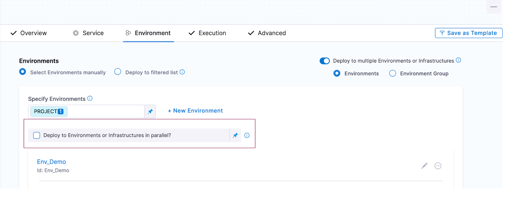
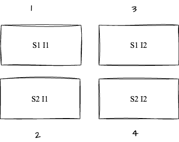

Pipelines can be executed with multiple Services and Environments. These Services and Environments are combined into a Service & Environment (infrastructure) in a stage for execution.

### Execution Sequence

Users can configure the sequence of deployment as Sequential or Parallel.

When you click on **Deploy multiple Services** you see an option for **Deploy Services in Parallel?**. When you check that it will allow you to deploy your services parallelly.

:::important note
By default, the execution sequence is the parallel deployment for Services.
:::

When you click on **Deploy to multiple Environments or Infrastructures** you see an option for **Deploy to Environments or Infrastructures in parallel?**. When you check that it will allow you to deploy your infrastructure and environment parallelly.

### Expected Scenario

#### Sequential Deployment in Multi Services and Sequential Multi-Infrastructure

For example:

- **Services**: S1, S2
- **Environment**: E1
- **Infrastructure**: I1, I2

Each service is sequentially deployed in collection of Infrastructure ordered in the YAML.

Each service is deployed in one infrastructure first and then followed by the second infrastructure.

**`S1 I1, S2 I1, S1 I2, S2 I2`**

#### Parallel Deployment in Multi-Services and Sequential Multi-Infrastructure

For example:

- **Services**: S1, S2
- **Environment**: E1
- **Infrastructure**: I1, I2

Each service is deployed in parallel in the Infrastructure. Infrastructure takes precedence.

#### Sequential Deployment in Multi-Services and Parallel Multi-Infrastructure

For example:

- **Services**: S1, S2
- **Environment**: E1
- **Infrastructure**: I1, I2

#### Multi Service in Parallel and Multi Infrastructure in Parallel

- **Services**: S1, S2
- **Environment**: E1
- **Infrastructure**: I1, I2

**`S1 I1, S2 I1, S1 I2, S2 I2`**

#### Multi service in parallel and multi environment and multi Infrastructure in sequential 

- **Services**: S1, S2
- **Environment_1_Infrastructure_1**: I1, I2
- **Environment_2_Infrastructure_2**: K82, K81

**`S1 I1, S2 I1, S1 I2, S2 I2, S1 K82, S2 K81, S2 K82, S2 K81`**

#### Multi service in sequential and multi environment and multi Infrastructure in parallel

- **Services**: S1, S2
- **Environment_1_Infrastructure_1**: I1, I2
- **Environment_2_Infrastructure_2**: K82, K81

**`S1 I1 ,S1 I2 , S1 K82 , S1 K81, S2 I1 ,S2 I2 , S2 K82 , S2 K81`**

Infrastructure takes precedence, and all Infrastructure gets one Service followed by other Services.

### Deployment and Concurrency

Concurrency is set based on the parallel deployment configuration, either based on the Infrastructure.