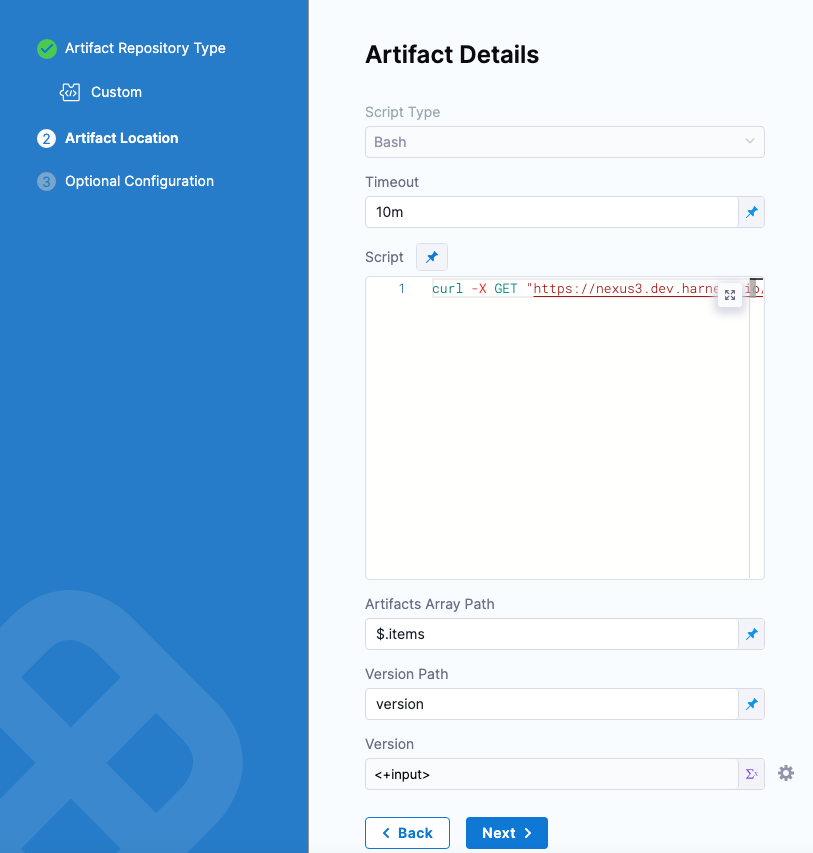
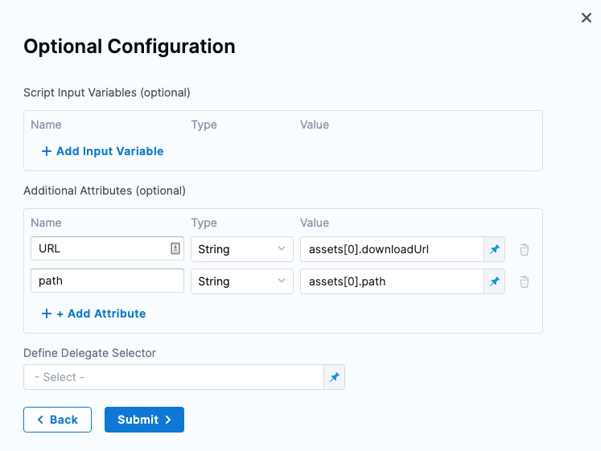

:::info

Currently, this feature is behind the feature flag `CUSTOM_ARTIFACT_NG`. Contact [Harness Support](mailto:support@harness.io) to enable the feature.Harness includes artifact sources for the most common repositories, such as GCR, ECR, Nexus, Artifactory, and any Docker registry such as Docker Hub.

:::

For cases where you are using a custom artifact repo, you can use the **Custom Artifact** repository type. The custom artifact uses a shell script to fetch a JSON payload of the artifacts from your repository, and then you can reference the artifact version to use in your deployment. You can also reference any metadata in the payload.

This topic described how to use the custom artifact repository type in your Harness service and how to reference its artifact information from the JSON payload.

## Important notes

* Currently, custom artifact is supported in the [Kubernetes](/docs/continuous-delivery/deploy-srv-diff-platforms/kubernetes/kubernetes-cd-quickstart), [SSH](/docs/continuous-delivery/deploy-srv-diff-platforms/traditional/ssh-ng), and [WinRM](/docs/continuous-delivery/deploy-srv-diff-platforms/traditional/win-rm-tutorial) deployment types only.
* The payload returned from your repo must be a JSON formatted array.

## Create a service

Create a new service in Harness.

For **Deployment Type**, select **Kubernetes**. Custom Artifact is supported in the Kubernetes deployment type.

You can now see the **Manifests** and **Artifacts** sections.

We'll focus on **Artifacts** to demonstrate custom artifact, but you can find information on manifests in [Kubernetes Services](/docs/continuous-delivery/deploy-srv-diff-platforms/kubernetes/kubernetes-services).

## Add a custom artifact source

In **Artifacts**, select **Add Primary Artifact**.

Custom artifact is also supported in **Sidecar**. In **Specify Artifact Repository Type**, select **Custom** and select **Continue**.

In the **Custom Artifact** source, enter a script to fetch a JSON payload and add it to the Harness variable `$HARNESS_ARTIFACT_RESULT_PATH`. Here's an example:

```
curl -X GET "https://nexus3.dev.harness.io/service/rest/v1/components?repository=cdp-qa-automation-1" -H "accept: application/json" > $HARNESS_ARTIFACT_RESULT_PATH
```

Here's an example of the JSON payload returned from the cURL command:

```json
{  
  "items" : [ {  
    "id" : "Y2RwLXFhLWF1dG9tYXRpb24tMTo5M2I5YjllYjlhN2VjYjA2NWJlYjdkNWUxNDgyMDFjOQ",  
    "repository" : "cdp-qa-automation-1",  
    "format" : "docker",  
    "group" : null,  
    "name" : "nginx",  
    "version" : "latest",  
    "assets" : [ {  
      "downloadUrl" : "https://nexus3.dev.harness.io/repository/cdp-qa-automation-1/v2/nginx/manifests/latest",  
      "path" : "v2/nginx/manifests/latest",  
      "id" : "Y2RwLXFhLWF1dG9tYXRpb24tMTo5MTJkMGZlN2I4MTkyMzkyODc0NTUyYTgyZWVmYzhkZQ",  
      "repository" : "cdp-qa-automation-1",  
      "format" : "docker",  
      "checksum" : {  
        "sha1" : "33acb567b9635e73ae566691eb22a89c84138c0b",  
        "sha256" : "bb129a712c2431ecce4af8dde831e980373b26368233ef0f3b2bae9e9ec515ee"  
      }  
    } ]  
...
```

Next, in **Artifacts Array Path**, define where to find each artifact in the array (`$.items`).

Next, in **Versions Path**, define where to find the artifact versions in your payload (`version`).

Once done, the artifact details will look something like this:


Enter the following settings.

* **Timeout**: Enter a time limit for the script to execute before failing the artifact JSON retrieval.
* **Script**: Enter a script to fetch a JSON payload and add it to the Harness variable `$HARNESS_ARTIFACT_RESULT_PATH`. 

  Here's an example:

  ```
  curl -X GET "https://nexus3.dev.harness.io/service/rest/v1/components?repository=cdp-qa-automation-1" -H "accept: application/json" > $HARNESS_ARTIFACT_RESULT_PATH
  ```

  The shell script you enter will query the Custom Artifact repository and output the JSON payload to a file on the Harness Delegate host using the environment variable `HARNESS_ARTIFACT_RESULT_PATH`, initialized by Harness. 

  `HARNESS_ARTIFACT_RESULT_PATH` is a random, unique file path created on the Delegate by Harness.

  You can use [Harness text secrets](/docs/platform/Secrets/add-use-text-secrets) in the script. For example:

  ```
  curl -u 'harness' <+secrets.getValue("repo_password")> https://myrepo.example.io/todolist/json/ > $HARNESS_ARTIFACT_RESULT_PATH
  ```

  You must delete the Artifact Source and re-add it to re-collect the artifacts if the Artifact Source or its script information has been changed.

* **Artifacts Array Path**: Enter the path in the payload array to the artifacts listing. For example, in the following payload the artifacts are listed using `items`, so in Artifacts Array Path you reference the path with `$.items`.

  ```json
  {  
    "items" : [ {  
      "id" : "Y2RwLXFhLWF1dG9tYXRpb24tMTo5M2I5YjllYjlhN2VjYjA2NWJlYjdkNWUxNDgyMDFjOQ",  
      "repository" : "cdp-qa-automation-1",  
      "format" : "docker",  
      "group" : null,  
      "name" : "nginx",  
      "version" : "latest",  
      "assets" : [ {  
        "downloadUrl" : "https://nexus3.dev.harness.io/repository/cdp-qa-automation-1/v2/nginx/manifests/latest",  
        "path" : "v2/nginx/manifests/latest",  
        "id" : "Y2RwLXFhLWF1dG9tYXRpb24tMTo5MTJkMGZlN2I4MTkyMzkyODc0NTUyYTgyZWVmYzhkZQ",  
        "repository" : "cdp-qa-automation-1",  
        "format" : "docker",  
        "checksum" : {  
          "sha1" : "33acb567b96xxx9c84138c0b",  
          "sha256" : "bb129a712cxxx33ef0f3b2bae9e9ec515ee"  
        }  
      } ]  
  ...
  ```

* **Version Path**: Enter the path in the payload array to the version. Using the above payload example, the path is `version`.

* **Version**: Enter the version number for this deployment, or select Runtime Input or Expression to select the version dynamically.

  For more information on Fixed Value, Runtime Input, and Expression got to [Fixed Values, Runtime Inputs, and Expressions](/docs/platform/References/runtime-inputs).

  When you done Artifact Details will look something like this:

  

  Later, you can reference the Version using this expression format, which will resolve to the version pulled from the array at runtime:

  `<+pipeline.stages.[stage_Id].spec.serviceConfig.output.artifactResults.primary.version>`

## Script input variables

While you can simply declare a variable in your script using a Harness expression or string for its value, using **Script Input Variables** provides some additional benefits:

* You can more easily identify and manage the Harness expressions used in your script.
* You can template your script.

You can declare the variable using **Name** and **Value** in **Script Input Variables** and then reference the variable in the script just as you would any other variable: `$var_name`.

## Additional attributes (metadata)

In **Additional Attributes**, you can map any additional values from your JSON array.

For example, the following payload has `downloadUrl` and `path` in its `assets`:

```json
{  
  "items" : [ {  
    "id" : "Y2RwLXFhLWF1dG9tYXRpb24tMTo5M2I5YjllYjlhN2VjYjA2NWJlYjdkNWUxNDgyMDFjOQ",  
    "repository" : "cdp-qa-automation-1",  
    "format" : "docker",  
    "group" : null,  
    "name" : "nginx",  
    "version" : "latest",  
    "assets" : [ {  
      "downloadUrl" : "https://nexus3.dev.harness.io/repository/cdp-qa-automation-1/v2/nginx/manifests/latest",  
      "path" : "v2/nginx/manifests/latest",  
      "id" : "Y2RwLXFhLWF1dG9tYXRpb24tMTo5MTJkMGZlN2I4MTkyMzkyODc0NTUyYTgyZWVmYzhkZQ",  
      "repository" : "cdp-qa-automation-1",  
      "format" : "docker",  
      "checksum" : {  
        "sha1" : "33acb567b96xxx9c84138c0b",  
        "sha256" : "bb129a712cxxx33ef0f3b2bae9e9ec515ee"  
      }  
    } ]  
...
```

You can assign these items to variables. In **Name**, enter the variable name and in **Value** enter the path to the item.

For example, to reference `downloadUrl` and `path` in the first item in the array:

* `assets[0].downloadUrl`
* `assets[0].path`

Here's an example:



Later, in a **Shell Script** step, you can reference these attributes using the expression format:

`<+pipeline.stages.[stage_Id].spec.serviceConfig.output.artifactResults.primary.metadata.[attribute_name]>`

For example:

```
echo "URL: <+pipeline.stages.Kube.spec.serviceConfig.output.artifactResults.primary.metadata.URL>"  
echo "Path: <+pipeline.stages.Kube.spec.serviceConfig.output.artifactResults.primary.metadata.path>"
```

At runtime, these expressions will resolve to the data from the array.

## Reference custom artifact

You can reference the custom artifact in your *values.yaml* file and in a Shell Script step.

#### Values YAML in manifests

You add a *values.yaml* file along with your manifests in the **Manifests** section of the Service.

The *values.yaml* file can use Harness expressions to reference artifacts in the **Artifacts** section of the service.

To reference the artifact, use the expression `<+artifact.image>` in your *values.yaml* file. 

For example:

```yaml
name: example  
replicas: 2  
  
image: <+artifact.image>  
# dockercfg: <+artifact.imagePullSecret>  
  
createNamespace: true  
namespace: <+infra.namespace>  
  
...
```

For details on using *values.yaml* in Harness, go to [Kubernetes Services](/docs/continuous-delivery/deploy-srv-diff-platforms/kubernetes/kubernetes-services).

[Harness Variables and Expressions](/docs/platform/Variables-and-Expressions/harness-variables) can be added to Values files (for example values.yaml), not the manifests themselves. This provides more flexibility.

## Shell script step

In the stage **Execution** section, add a [Shell Script](/docs/continuous-delivery/x-platform-cd-features/cd-steps/cd-general-steps/using-shell-scripts) step.

In **Script**, reference the artifact and any additional attributes you configured. Here's an example where the stage is named Kube:

```
echo "Version: <+pipeline.stages.Kube.spec.serviceConfig.output.artifactResults.primary.version>"  
echo "URL: <+pipeline.stages.Kube.spec.serviceConfig.output.artifactResults.primary.metadata.URL>"  
echo "Path: <+pipeline.stages.Kube.spec.serviceConfig.output.artifactResults.primary.metadata.path>"
```
