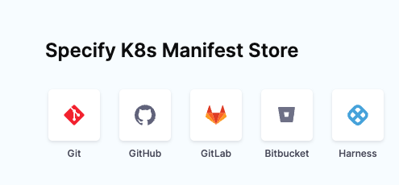
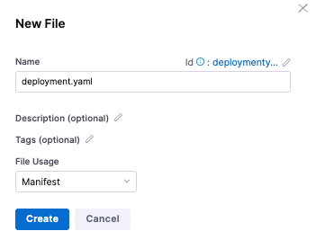
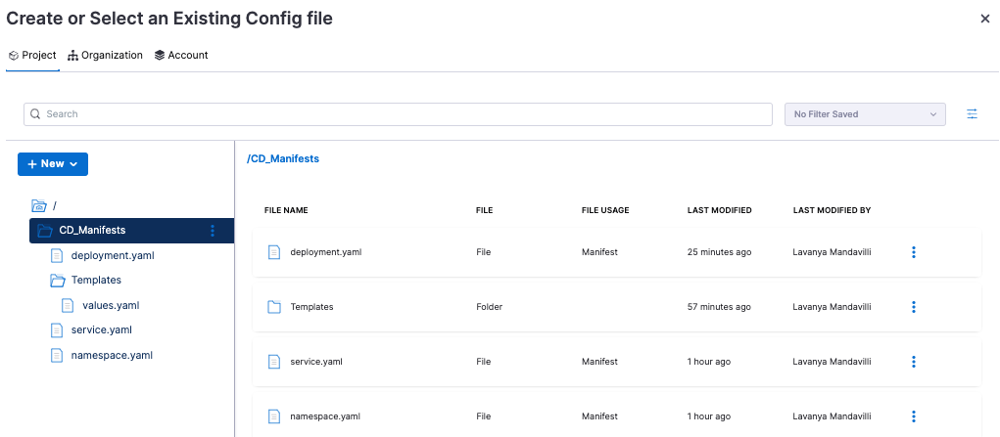
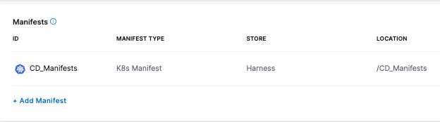

File store is a hierarchical file manager in Harness for managing configuration files used in pipelines.

With file store, you can perform all of the standard file manager tasks:

* Create and edit folders and files at the account, organization, or project level.
* Upload existing configuration files from your machine to a folder in file store.
* Select configuration files or folders for deployments.

You can use a combination of file store and remote repos for your configuration files. You aren't limited to one method. 

If you use the Harness file store, you can store files in Harness and select them in your services. At deployment runtime, Harness uses the files from the Harness file store.

File store lets you share files with your team without managing remote repositories.

You can use [Kubernetes manifests](/docs/continuous-delivery/deploy-srv-diff-platforms/kubernetes/cd-kubernetes-category/define-kubernetes-manifests) and other configuration files in Git repositories or in the Harness file store. If you use a Git repository, Harness fetches files from the remote repo during deployment runtime.

For Kubernetes, the following configuration files are supported for file store:

* Kubernetes manifest
* Helm chart
* OpenShift template and OpenShift parameters
* Kustomize and Kustomize patches

For more information about Kubernetes deployments, review the following sections.
* [Kubernetes CD quickstart](/docs/continuous-delivery/deploy-srv-diff-platforms/kubernetes/kubernetes-cd-quickstart)
* [Kubernetes deployments overview](/docs/continuous-delivery/deploy-srv-diff-platforms/kubernetes/kubernetes-deployments-overview)
* [Add container images as artifacts for Kubernetes deployments](/docs/continuous-delivery/deploy-srv-diff-platforms/kubernetes/cd-kubernetes-category/add-artifacts-for-kubernetes-deployments)

Other configuration files for other integrations, such as Azure Web Apps, etc, are supported as those integrations are released. You can access File Store from **Project Setup** in Harness or using the **Add Manifest** step during pipeline creation.

## Important notes

* File store requires that you have the Account Admin role for Read/Write access to modify folders and files. The Account Viewer role allows you to only view folders and files.
* You can upload only a single file into the file store folder. Support for uploading multiple configuration files concurrently is not available.
* The maximum file size cannot exceed 100MB.

## Start a pipeline

This topic assumes that you have a Harness Project set up. Go to [create organizations and projects](/docs/platform/organizations-and-projects/create-an-organization.md) for more information.

1. In Harness Manager, select **Pipelines** and select **New Pipeline**.
2. Enter a name in **Create new Pipeline** and select **Start**.

## Add a deploy stage

For steps on adding a stage, go to [add a stage](/docs/platform/8_Pipelines/add-a-stage.md).

1. Click **Add Stage** and select **Deploy**.
2. Name the stage, and select what you’d like to deploy. For example, select **Service**.
3. Select **Set Up Stage**. The new stage settings appear.

## Create the Harness service

In **Service**, you can define or select the service and service definition.

1. In **Specify Service**, select **New Service**, and enter a name for this service, and select **Save**.
2. Select a **K8s** service, or create a new service for **K8s**.
3. For **Service Definition**, select **Kubernetes**.

To add your manifests, go to **Manifests** in **Service Definition**.

## Add Kubernetes manifests and values YAML to file store

You can create folders in file store, add manifests to those folder, and Harness will use them at runtime. 

Let’s create a new folder called *CD\_Manifests* for three manifests (*deployment.yaml*, *service.yaml*, and *namespace.yaml*) and a folder named *Templates* for the *values.yaml* file. In the blank file that appears for each of these manifests in file store, you can copy the contents of a sample manifest file into each of these blank files and save them in file store.

:::note
You can create a single folder and save all of the manifest files in that folder. Or you can store the *values.yaml* file in a folder that is separate from a *Templates* folder where the *deployment.yaml*, *service.yaml*, and *namespace.yaml* files are stored.
:::

To access sample manifest files:

1. In **Manifests**, select **Add Manifest**.
2. In **Specify Manifest Type**, select **K8s Manifest** and then select **Continue**.
3. In **Specify K8s Manifest Store**, select **Harness** and select **Continue**.

   

4. In the **Manifest Details** dialog, enter a name for this manifest. For example, *CD\_Manifests*.
5. In the field under **File Store**, click the down arrow.
6. In the **Create or Select an Existing Config File** dialog, select **Project**.
7. Select **New**, select **New Folder**, then enter a name for the folder (for example, *Templates*), and select **Save**.
8. With this new folder selected, select **New File**.
9. Enter the file name *deployment.yaml*, select **Manifest for File Usage**, and select **Create**.
   
   
10. When Harness displays the blank *deployment.yaml* manifest, copy the contents of the sample *deployment.yaml* manifest, and paste it in the blank file. Select **Save**.
11. Create the *namespace.yaml* and *service.yaml* manifests by copying, pasting, and saving the manifests in file store.
12. Select **New**, then select **New Folder**, name the new folder (for example, *Files*) and select **Create**.
13. With the *Templates* folder selected, select **New** and select **New File**.
14. In **New File**, enter *values.yaml* as the manifest name, select **Manifest for File Usage**, and select **Create**.
15. When the blank *values.yaml* manifest appears, copy the contents of the *values.yaml* file, and paste it in the blank file. Select **Save**.



You have now completed adding folders and manifests to file store.

## Select Kubernetes manifests and the *values.yaml* file from file store

You can select and apply the file store folder with the Kubernetes manifests and the *values.yaml* file to your pipeline.

1. In **File Store**, select the *CD\_Manifests* folder that contains the manifests, and select **Apply Selected**. File store in **Manifest Details** is populated with the */CD\_Manifests* folder and the manifests within that folder.
2. In **Manifest Details**, select *values.yaml*.
3. In **Create or Select an Existing Config file**, select **Project**, and navigate to the *CD\_Manifests/Templates* folder. Select *values.yaml* and select **Apply Selected**.

**Manifest Details** is now populated with the *values.yaml* file. 
4. Select **Submit**. The manifests that you created for this service are now applied to the service.



## Example manifests

Manifests can use hardcoded values or a value YAML file and templating. Harness supports Go templating. For more information, go to [example Kubernetes manifests using Go templating](/docs/continuous-delivery/deploy-srv-diff-platforms/kubernetes/cd-k8s-ref/example-kubernetes-manifests-using-go-templating).

Use the following manifests to copy into your blank manifest files in file store and save them. Then, customize them for your environment, and apply them to your pipelines.

<details>
   <summary>values.yaml</summary>

```yaml
name: example  
replicas: 2  
  
image: <+artifact.image>  
# dockercfg: <+artifact.imagePullSecret>  
  
createNamespace: true  
namespace: <+infra.namespace>  
  
# Service Type allow you to specify what kind of service you want.  
# Possible values for ServiceType are:  
# ClusterIP | NodePort | LoadBalancer | ExternalName  
serviceType: LoadBalancer  
  
# A Service can map an incoming port to any targetPort.  
# targetPort is where application is listening on inside the container.  
servicePort: 80  
serviceTargetPort: 80  
  
# Specify all environment variables to be added to the container.  
# The following two maps, config and secrets, are put into a ConfigMap  
# and a Secret, respectively.  
# Both are added to the container environment in podSpec as envFrom source.  
env:  
  config:  
    key1: value10  
  secrets:  
    key2: value2
```
</details>

<details>
   <summary>deployment.yaml</summary>

```yaml
{{- if .Values.env.config}}  
apiVersion: v1  
kind: ConfigMap  
metadata:  
  name: {{.Values.name}}  
data:  
{{.Values.env.config | toYaml | indent 2}}  
---  
{{- end}}  
  
{{- if .Values.env.secrets}}  
apiVersion: v1  
kind: Secret  
metadata:  
  name: {{.Values.name}}  
stringData:  
{{.Values.env.secrets | toYaml | indent 2}}  
---  
{{- end}}  
  
{{- if .Values.dockercfg}}  
apiVersion: v1  
kind: Secret  
metadata:  
  name: {{.Values.name}}-dockercfg  
  annotations:  
    harness.io/skip-versioning: true  
data:  
  .dockercfg: {{.Values.dockercfg}}  
type: kubernetes.io/dockercfg  
---  
{{- end}}  
  
apiVersion: apps/v1  
kind: Deployment  
metadata:  
  name: {{.Values.name}}-deployment  
spec:  
  replicas: {{int .Values.replicas}}  
  selector:  
    matchLabels:  
      app: {{.Values.name}}  
  template:  
    metadata:  
      labels:  
        app: {{.Values.name}}  
    spec:  
      {{- if .Values.dockercfg}}  
      imagePullSecrets:  
      - name: {{.Values.name}}-dockercfg  
      {{- end}}  
      containers:  
      - name: {{.Values.name}}  
        image: {{.Values.image}}  
        {{- if or .Values.env.config .Values.env.secrets}}  
        envFrom:  
        {{- if .Values.env.config}}  
        - configMapRef:  
            name: {{.Values.name}}  
        {{- end}}  
        {{- if .Values.env.secrets}}  
        - secretRef:  
            name: {{.Values.name}}  
        {{- end}}  
        {{- end}}
```
</details>

<details>
   <summary>service.yaml</summary>

```yaml
apiVersion: v1  
kind: Service  
metadata:  
  name: {{.Values.name}}-svc  
spec:  
  type: {{.Values.serviceType}}  
  ports:  
  - port: {{.Values.servicePort}}  
    targetPort: {{.Values.serviceTargetPort}}  
    protocol: TCP  
  selector:  
    app: {{.Values.name}}
```
</details>

<details>
   <summary>namespace.yaml</summary>

```yaml
{{- if .Values.createNamespace}}  
apiVersion: v1  
kind: Namespace  
metadata:  
  name: {{.Values.namespace}}  
{{- end}}
```
</details>

## Reference files in the file store using an expression

The expression `fileStore.getAsString()` can be used to fetch files in the File Store in a script or runtime input.

For example:

- Project-level File Store: `fileStore.getAsString("/folder1/myfile.yaml")`.
- Org-level File Store: `fileStore.getAsString("org:/folder1/myfile.yaml")`. 
- Account-level File Store: `fileStore.getAsString("account:/folder1/myfile.yaml")`.
- Base64 encoded: `fileStore.getAsBase64("account:/folder1/folder2/myfile")`.


