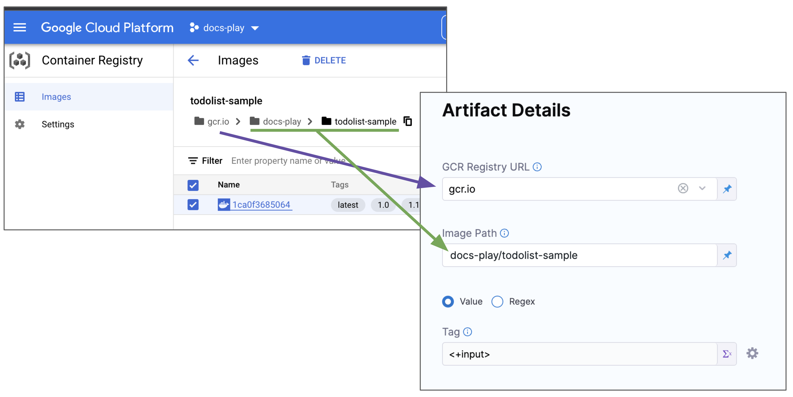
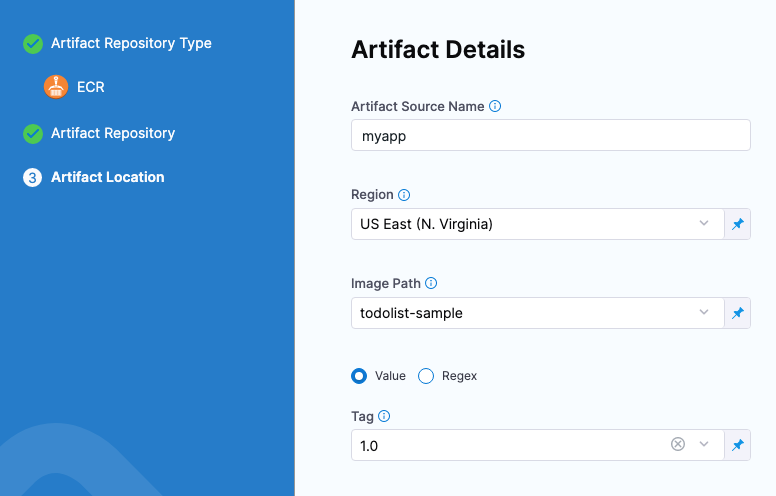

```mdx-code-block
import Tabs from '@theme/Tabs';
import TabItem from '@theme/TabItem';
```

In DevOps, an artifact source is a location where the compiled, tested, and ready-to-deploy software artifacts are stored. These artifacts could be container images, compiled binary files, executables, or any other software components that are part of the application.

To add an artifact source, you add a Harness connector to the artifact platform (DockerHub, GCR, Artifactory, etc.) and then add an artifact source to a Harness service that defines the artifact source name, path, tags, and so on.

This topic lists the artifact sources you can use in your Harness services. 

## Using artifacts in manifests

You have two options when referencing the artifacts you want to deploy:

- Add an artifact source to the Harness service and reference it using the Harness expression `<+artifacts.primary.image>` in the values YAML file.
- Hardcode the artifact into the manifests or values YAML file.

<details>
<summary>Use the artifact expression</summary>

Add the image location to Harness as an artifact in the **Artifacts** section of the service.


This allows you to reference the image in your values YAML files using the Harness expression `<+artifacts.primary.image>`.

```yaml
...  
image: <+artifacts.primary.image>  
...
```

You cannot use Harness variables expressions in your Kubernetes object manifest files. You can only use Harness variables expressions in values YAML files, or Kustomize Patch file.

When you select the artifact repo for the artifact, like a Docker Hub repo, you specify the artifact and tag/version to use. 

You can select a specific tag/version, use a [runtime input](https://developer.harness.io/docs/platform/references/runtime-inputs/) so that you are prompted for the tag/version when you run the pipeline, or you can use an Harness variable expression to pass in the tag/version at execution.

Here's an example where a runtime input is used and you select which image version/tag to deploy.


With a Harness artifact, you can template your manifests, detaching them from a hardcoded location. This makes your manifests reusable and dynamic.

</details>

<details>
<summary>Hardcode the artifact</summary>

If a Docker image location is hardcoded in your Kubernetes manifest (for example, `image: nginx:1.14.2`), then you can simply add the manifest to Harness in **Manifests** and Kubernetes will pull the image during deployment.

When you hardcode the artifact in your manifests, any artifacts added to your Harness service are ignored.
</details>


### Docker

<details>
<summary>Use artifacts in any Docker registry</summary>


```mdx-code-block
<Tabs>
  <TabItem value="YAML" label="YAML" default>
```

To use a Docker artifact, you create or use a Harness connector to connect to your Docker repo and then use that connector in your Harness service and reference the artifact to use.

<details>
<summary>Docker connector YAML</summary>

```yaml
connector:
  name: Docker Hub with Pwd
  identifier: Docker_Hub_with_Pwd
  description: ""
  orgIdentifier: default
  projectIdentifier: CD_Docs
  type: DockerRegistry
  spec:
    dockerRegistryUrl: https://index.docker.io/v2/
    providerType: DockerHub
    auth:
      type: UsernamePassword
      spec:
        username: johndoe
        passwordRef: Docker_Hub_Pwd
    executeOnDelegate: false
```

</details>

<details>
<summary>Service using Docker artifact YAML</summary>

```yaml
service:
  name: Example K8s2
  identifier: Example_K8s2
  serviceDefinition:
    type: Kubernetes
    spec:
      manifests:
        - manifest:
            identifier: myapp
            type: K8sManifest
            spec:
              store:
                type: Harness
                spec:
                  files:
                    - /Templates/deployment.yaml
              valuesPaths:
                - /values.yaml
              skipResourceVersioning: false
      artifacts:
        primary:
          primaryArtifactRef: <+input>
          sources:
            - spec:
                connectorRef: Docker_Hub_with_Pwd
                imagePath: library/nginx
                tag: stable-perl
              identifier: myimage
              type: DockerRegistry
  gitOpsEnabled: false

```
</details>


```mdx-code-block
  </TabItem>
  <TabItem value="API" label="API">
```

Create the Docker connector using the [Create a Connector](https://apidocs.harness.io/tag/Connectors#operation/createConnector) API.

<details>
<summary>Docker connector example</summary>

```yaml
curl --location --request POST 'https://app.harness.io/gateway/ng/api/connectors?accountIdentifier=123456' \
--header 'Content-Type: text/yaml' \
--header 'x-api-key: pat.123456.123456' \
--data-raw 'connector:
  name: dockerhub
  identifier: dockerhub
  description: ""
  tags: {}
  orgIdentifier: default
  projectIdentifier: APISample
  type: DockerRegistry
  spec:
    dockerRegistryUrl: https://index.docker.io/v2/
    providerType: DockerHub
    auth:
      type: Anonymous'
```
</details>

Create a service with an artifact source that uses the connector using the [Create Services](https://apidocs.harness.io/tag/Services#operation/createServicesV2) API.


```mdx-code-block
  </TabItem>
  <TabItem value="Terraform Provider" label="Terraform Provider">
```

For the Terraform Provider Docker connector resource, go to [harness_platform_connector_docker](https://registry.terraform.io/providers/harness/harness/latest/docs/resources/platform_connector_docker).

<details>
<summary>Docker connector example</summary>

```json
# credentials anonymous
resource "harness_platform_connector_docker" "test" {
  identifier  = "identifer"
  name        = "name"
  description = "test"
  tags        = ["foo:bar"]

  type               = "DockerHub"
  url                = "https://hub.docker.com"
  delegate_selectors = ["harness-delegate"]
}

# credentials username password
resource "harness_platform_connector_docker" "test" {
  identifier  = "identifer"
  name        = "name"
  description = "test"
  tags        = ["foo:bar"]

  type               = "DockerHub"
  url                = "https://hub.docker.com"
  delegate_selectors = ["harness-delegate"]
  credentials {
    username     = "admin"
    password_ref = "account.secret_id"
  }
}
```
</details>

For the Terraform Provider service resource, go to [harness_platform_service](https://registry.terraform.io/providers/harness/harness/latest/docs/resources/platform_service).

<details>
<summary>Service example</summary>

```json
resource "harness_platform_service" "example" {
  identifier  = "identifier"
  name        = "name"
  description = "test"
  org_id      = "org_id"
  project_id  = "project_id"

  ## SERVICE V2 UPDATE
  ## We now take in a YAML that can define the service definition for a given Service
  ## It isn't mandatory for Service creation 
  ## It is mandatory for Service use in a pipeline

 yaml = <<-EOT
              service:
                name: Example K8s2
                identifier: Example_K8s2
                serviceDefinition:
                  type: Kubernetes
                  spec:
                    manifests:
                      - manifest:
                          identifier: myapp
                          type: K8sManifest
                          spec:
                            store:
                              type: Harness
                              spec:
                                files:
                                  - /Templates/deployment.yaml
                            valuesPaths:
                              - /values.yaml
                            skipResourceVersioning: false
                    artifacts:
                      primary:
                        primaryArtifactRef: <+input>
                        sources:
                          - spec:
                              connectorRef: Docker_Hub_with_Pwd
                              imagePath: library/nginx
                              tag: stable-perl
                            identifier: myimage
                            type: DockerRegistry
                gitOpsEnabled: false
              EOT
}
```
</details>

```mdx-code-block
  </TabItem>
  <TabItem value="Harness Manager" label="Harness Manager">
```

To add an artifact from a Docker registry, do the following:

1. In your project, in CD (Deployments), select **Services**.
2. Select **Manage Services**, and then select **New Service**.
3. Enter a name for the service and select **Save**.
4. Select **Configuration**.
5. In **Service Definition**, select **Kubernetes**.
6. In **Artifacts**, select **Add Artifact Source**.
7. In **Select Artifact Repository Type**, select the registry where your Docker artifact is hosted. For this example, we'll select **Docker Registry**, and then click **Continue**.
8. Select or create a [Docker Registry Connector](https://developer.harness.io/docs/platform/connectors/cloud-providers/ref-cloud-providers/docker-registry-connector-settings-reference/).
9.  Select **Continue**.
10. In **Artifact Source Name**, enter a name that identifies your artifact.
11. In **Image path**, enter the name of the artifact you want to deploy, such as `library/nginx` or `jsmtih/privateimage`.

    Official images in public repos often need the label `library`, e.g. `library/tomcat`.

    Wildcards are not supported.
12. In **Tag**, enter or select the [Docker image tag](https://docs.docker.com/engine/reference/commandline/tag/) for the image.
    
    
<!-- CDS-71711 -->
13. To specify an image digest, use **Digest** and the unique identifier for the image you want to use.  Specifying an image by tag and digest (rather than tag alone) is useful when you want to deploy an image with a fixed digest/SHA for your service. 

  :::note 

  This option is behind the feature flag `CD_NG_DOCKER_ARTIFACT_DIGEST`. Contact [Harness Support](mailto:support@harness.io) to enable the feature. 

  If an image with the specified tag/digest combination does not exist in the artifact registry, the pipeline will fail.

  :::
14. Select **Submit**. The Artifact is added to the Service Definition.
 <!-- CDS-71711 -->


```mdx-code-block
  </TabItem>
</Tabs>
```

#### Important notes

- For pulling Docker images from Docker repos, Harness is restricted by the limits of the Docker repo. For example, [Docker Hub limits](https://docs.docker.com/docker-hub/download-rate-limit/).
- The maximum number of artifact image tags fetched by Harness that is 10000.

</details>


### Google Container Registry (GCR)

<details>
<summary>Use GCR artifacts</summary>

You connect to GCR using a Harness GCP Connector. For details on all the GCR requirements for the GCP Connector, see [Google Cloud Platform (GCP) Connector Settings Reference](https://developer.harness.io/docs/platform/Connectors/Cloud-providers/ref-cloud-providers/gcs-connector-settings-reference).


```mdx-code-block
<Tabs>
  <TabItem value="YAML" label="YAML" default>
```

To use a GCR artifact, you create or use a Harness GCP Connector to connect to GCR repo and then use that connector in your Harness service and reference the artifact to use.

<details>
<summary>GCP connector YAML</summary>

This example uses a Harness delegate installed in GCP for credentials.

```yaml
connector:
  name: GCR
  identifier: GCR
  description: ""
  orgIdentifier: default
  projectIdentifier: CD_Docs
  type: Gcp
  spec:
    credential:
      type: InheritFromDelegate
    delegateSelectors:
      - gcpdocplay
    executeOnDelegate: true
```

</details>

<details>
<summary>Service using GCR artifact YAML</summary>

```yaml
service:
  name: Google Artifact
  identifier: Google_Artifact
  serviceDefinition:
    type: Kubernetes
    spec:
      manifests:
        - manifest:
            identifier: manifests
            type: K8sManifest
            spec:
              store:
                type: Harness
                spec:
                  files:
                    - account:/Templates
              valuesPaths:
                - account:/values.yaml
              skipResourceVersioning: false
      artifacts:
        primary:
          primaryArtifactRef: <+input>
          sources:
            - spec:
                connectorRef: GCR
                imagePath: docs-play/todolist-sample
                tag: <+input>
                registryHostname: gcr.io
              identifier: myapp
              type: Gcr
  gitOpsEnabled: false
```
</details>

```mdx-code-block
  </TabItem>
  <TabItem value="API" label="API">
```
Create the GCR connector using the [Create a Connector](https://apidocs.harness.io/tag/Connectors#operation/createConnector) API.

<details>
<summary>GCR connector example</summary>

```curl
curl --location --request POST 'https://app.harness.io/gateway/ng/api/connectors?accountIdentifier=12345' \
--header 'Content-Type: text/yaml' \
--header 'x-api-key: pat.12345.6789' \
--data-raw 'connector:
  name: GCRexample
  identifier: GCRexample
  description: ""
  orgIdentifier: default
  projectIdentifier: CD_Docs
  type: Gcp
  spec:
    credential:
      type: InheritFromDelegate
    delegateSelectors:
      - gcpdocplay
    executeOnDelegate: true'
```
</details>

Create a service with an artifact source that uses the connector using the [Create Services](https://apidocs.harness.io/tag/Services#operation/createServicesV2) API.

```mdx-code-block
  </TabItem>
  <TabItem value="Terraform Provider" label="Terraform Provider">
```

For the Terraform Provider GCP connector resource, go to [harness_platform_connector_gcp](https://registry.terraform.io/providers/harness/harness/latest/docs/resources/platform_connector_gcp).

<details>
<summary>GCP connector example</summary>

```json
# Credential manual
resource "harness_platform_connector_gcp" "test" {
  identifier  = "identifier"
  name        = "name"
  description = "test"
  tags        = ["foo:bar"]

  manual {
    secret_key_ref     = "account.secret_id"
    delegate_selectors = ["harness-delegate"]
  }
}

# Credentials inherit_from_delegate
resource "harness_platform_connector_gcp" "test" {
  identifier  = "identifier"
  name        = "name"
  description = "test"
  tags        = ["foo:bar"]

  inherit_from_delegate {
    delegate_selectors = ["harness-delegate"]
  }
}
```
</details>

For the Terraform Provider service resource, go to [harness_platform_service](https://registry.terraform.io/providers/harness/harness/latest/docs/resources/platform_service).

```mdx-code-block
  </TabItem>
  <TabItem value="Harness Manager" label="Harness Manager">
```

You connect to GCR using a Harness GCP Connector. For details on all the GCR requirements for the GCP Connector, see [Google Cloud Platform (GCP) Connector Settings Reference](https://developer.harness.io/docs/platform/connectors/cloud-providers/connect-to-google-cloud-platform-gcp/).

To add an artifact from GCR, do the following:

1. In your project, in CD (Deployments), select **Services**.
2. Select **Manage Services**, and then select **New Service**.
3. Enter a name for the service and select **Save**.
4. Select **Configuration**.
5. In **Service Definition**, select **Kubernetes**.
6. In **Artifacts**, select **Add Artifact Source**.
7. In **Select Artifact Repository Type**, click **GCR**, and then click **Continue**.
8. In **GCR Repository**, select or create a [Google Cloud Platform (GCP) Connector](https://developer.harness.io/docs/platform/connectors/cloud-providers/connect-to-google-cloud-platform-gcp/) that connects to the GCP account where the GCR registry is located.
9. Click **Continue**.
10. In **Artifact Source Name**, enter a name for the artifact.
11. In **GCR Registry URL**, select the GCR registry host name, for example `gcr.io`.
12. In **Image Path**, enter the name of the artifact you want to deploy.

    Images in repos need to reference a path starting with the project Id that the artifact is in, for example: `myproject-id/image-name`.
13. In **Tag**, enter or select the [Docker image tag](https://docs.docker.com/engine/reference/commandline/tag/) for the image or select a [runtime input or expression](https://developer.harness.io/docs/platform/references/runtime-inputs/).
    
    
    
    If you use runtime input, when you deploy the pipeline, Harness will pull the list of tags from the repo and prompt you to select one.
 <!-- CDS-71711 -->
14. To specify an image digest, use **Digest** and the unique identifier for the image you want to use.  Specifying an image by tag and digest (rather than tag alone) is useful when you want to deploy an image with a fixed digest/SHA for your service. 

  :::note 

  This option is behind the feature flag `CD_NG_DOCKER_ARTIFACT_DIGEST`. Contact [Harness Support](mailto:support@harness.io) to enable the feature. 

  If an image with the specified tag/digest combination does not exist in the artifact registry, the pipeline will fail.

  :::
14. Select **Submit**. 
 <!-- CDS-71711 -->
    
    The Artifact is added to the **Service Definition**.

```mdx-code-block
  </TabItem>
</Tabs>
```

#### Permissions

For Google Container Registry (GCR), the following roles are required:

- Storage Object Viewer (roles/storage.objectViewer)
- Storage Object Admin (roles/storage.objectAdmin)

For more information, go to the GCP documentation about [Cloud IAM roles for Cloud Storage](https://cloud.google.com/storage/docs/access-control/iam-roles).

Ensure the Harness delegate you have installed can reach `storage.cloud.google.com` and your GCR registry host name, for example `gcr.io`. 

</details>

<details>
<summary>Use Docker Registry for GCR</summary>

If you do not want to use the GCP connector for GCR, you can use the platform-agnostic Docker Registry connector.

Use the following settings:

- **Provider Type:** select **Other (Docker V2 compliant)**.
- **URL:** Enter the GCR URL for your GCP account.
  - Example: `https://gcr.io/my-account`.
- **Authentication:**
  - **Username:** Enter `_token`. 
    - The usage of `_token` as a username for GCP authentication typically occurs when using certain command-line utilities or API clients that require an access token instead of a traditional username and password.
  - **Password:** Enter the output of the `gcloud auth print-access-token` command using a Harness secret.

Ensure that the GCP IAM user you use has the correct permissions for pulling from GCR.

#### Permissions

For Google Container Registry (GCR), the following roles are required:

- Storage Object Viewer (roles/storage.objectViewer)
- Storage Object Admin (roles/storage.objectAdmin)

For more information, go to the GCP documentation about [Cloud IAM roles for Cloud Storage](https://cloud.google.com/storage/docs/access-control/iam-roles).

Ensure the Harness delegate you have installed can reach `storage.cloud.google.com` and your GCR registry host name, for example `gcr.io`. 

</details>


### Google Cloud Storage (GCS)

<details>
<summary>Use GCS artifacts</summary>

You connect to GCS using a Harness GCP Connector. For details on all the GCS requirements for the GCP Connector, see [Google Cloud Platform (GCP) Connector Settings Reference](https://developer.harness.io/docs/platform/Connectors/Cloud-providers/ref-cloud-providers/gcs-connector-settings-reference).


```mdx-code-block
<Tabs>
  <TabItem value="YAML" label="YAML" default>
```

To use a GCS artifact, you create or use a Harness GCP Connector to connect to GCS bucket and then use that connector in your Harness service and reference the artifact to use.

<details>
<summary>GCP connector YAML</summary>

This example uses a Harness delegate installed in GCP for credentials.

```yaml
connector:
  name: GCS
  identifier: GCS
  description: ""
  orgIdentifier: default
  projectIdentifier: CD_Docs
  type: 
  spec:
    credential:
      type: InheritFromDelegate
    delegateSelectors:
      - gcpdocplay
    executeOnDelegate: true
```

</details>

<details>
<summary>Service using GCS artifact YAML</summary>

```yaml
service:
  name: GCS
  identifier: GCS
  tags: {}
  serviceDefinition:
    spec:
      artifacts:
        primary:
          primaryArtifactRef: <+input>
          sources:
            - spec:
                connectorRef: GCP_Connector
                project: myapp
                bucket: functions
                artifactPath: myfunction.zip
              identifier: myfunction
              type: GoogleCloudStorage
      manifests:
        - manifest:
            identifier: myfunction
            type: GoogleCloudFunctionDefinition
            spec:
              store:
                type: Harness
                spec:
                  files:
                    - /google-cloud-function/myfunction
    type: GoogleCloudFunctions
```
</details>

```mdx-code-block
  </TabItem>
  <TabItem value="API" label="API">
```
Create the GCP connector using the [Create a Connector](https://apidocs.harness.io/tag/Connectors#operation/createConnector) API.

<details>
<summary>GCP connector example</summary>

```curl
--header 'Content-Type: text/yaml' \
--header 'x-api-key: pat.12345.6789' \
--data-raw 'connector:
  name: GCXexample
  identifier: GCSexample
  description: ""
  orgIdentifier: default
  projectIdentifier: CD_Docs
  type: Gcp
  spec:
    credential:
      type: InheritFromDelegate
    delegateSelectors:
      - gcpdocplay
    executeOnDelegate: true'
```
</details>

Create a service with an artifact source that uses the connector using the [Create Services](https://apidocs.harness.io/tag/Services#operation/createServicesV2) API.

```mdx-code-block
  </TabItem>
  <TabItem value="Terraform Provider" label="Terraform Provider">
```

For the Terraform Provider GCP connector resource, go to [harness_platform_connector_gcp](https://registry.terraform.io/providers/harness/harness/latest/docs/resources/platform_connector_gcp).

<details>
<summary>GCP connector example</summary>

```json
# Credential manual
resource "harness_platform_connector_gcp" "test" {
  identifier  = "identifier"
  name        = "name"
  description = "test"
  tags        = ["foo:bar"]

  manual {
    secret_key_ref     = "account.secret_id"
    delegate_selectors = ["harness-delegate"]
  }
}

# Credentials inherit_from_delegate
resource "harness_platform_connector_gcp" "test" {
  identifier  = "identifier"
  name        = "name"
  description = "test"
  tags        = ["foo:bar"]

  inherit_from_delegate {
    delegate_selectors = ["harness-delegate"]
  }
}
```
</details>

For the Terraform Provider service resource, go to [harness_platform_service](https://registry.terraform.io/providers/harness/harness/latest/docs/resources/platform_service).

```mdx-code-block
  </TabItem>
  <TabItem value="Harness Manager" label="Harness Manager">
```


You connect to GCS using a Harness GCP Connector. For details on all the GCS requirements for the GCP Connector, see [Google Cloud Platform (GCP) Connector Settings Reference](https://developer.harness.io/docs/platform/connectors/cloud-providers/connect-to-google-cloud-platform-gcp/).

To add an artifact from GCS, do the following:

1. In your project, in CD (Deployments), select **Services**.
2. Select **Manage Services**, and then select **New Service**.
3. Enter a name for the service and select **Save**.
4. Select **Configuration**.
5. In **Service Definition**, select **Google Cloud Functions**.
6. In **Artifacts**, select **Add Artifact Source**.
7. In **Select Artifact Repository Type**, click **Google Cloud Storage**, and then click **Continue**.
8. In **Google Cloud Storage Repository**, select or create a [Google Cloud Platform (GCP) Connector](https://developer.harness.io/docs/platform/connectors/cloud-providers/connect-to-google-cloud-platform-gcp/) that connects to the GCP account where the GCS bucket is located.
9. Click **Continue**.
10. In **Project**, select the GCP project where the bucket is located.
11. In **Bucket**, select the GCS bucket.
12. In **Artifact Path**, select the name of the artifact you want to deploy.
13. Click **Submit**.
    
    The Artifact is added to the **Service Definition**.

```mdx-code-block
  </TabItem>
</Tabs>
```

#### Permissions

For Google Cloud Storage (GCS), the following roles are required:

- Storage Object Viewer (roles/storage.objectViewer)
- Storage Object Admin (roles/storage.objectAdmin)

For more information, go to the GCP documentation about [Cloud IAM roles for Cloud Storage](https://cloud.google.com/storage/docs/access-control/iam-roles).

</details>

<!-- GAR START -->

### Google Artifact Registry

<details>
<summary>Use Google Artifact Registry artifacts</summary>

You connect to Google Artifact Registry using a Harness GCP Connector. 

For details on all the Google Artifact Registry requirements for the GCP Connector, see [Google Cloud Platform (GCP) Connector Settings Reference](https://developer.harness.io/docs/platform/connectors/cloud-providers/connect-to-google-cloud-platform-gcp/).


```mdx-code-block
<Tabs>
  <TabItem value="YAML" label="YAML" default>
```

This example uses a Harness delegate installed in GCP for credentials.

<details>
<summary>Google Artifact Registry connector YAML</summary>

```yaml
connector:
  name: Google Artifact Registry
  identifier: Google_Artifact_Registry
  description: ""
  orgIdentifier: default
  projectIdentifier: CD_Docs
  type: Gcp
  spec:
    credential:
      type: InheritFromDelegate
    delegateSelectors:
      - gcpdocplay
    executeOnDelegate: true
```
</details>

<details>
<summary>Service using Google Artifact Registry artifact YAML</summary>

```yaml
service:
  name: Google Artifact Registry
  identifier: Google_Artifact_Registry
  tags: {}
  serviceDefinition:
    spec:
      manifests:
        - manifest:
            identifier: myapp
            type: K8sManifest
            spec:
              store:
                type: Harness
                spec:
                  files:
                    - /Templates
              valuesPaths:
                - /values.yaml
              skipResourceVersioning: false
              enableDeclarativeRollback: false
      artifacts:
        primary:
          primaryArtifactRef: <+input>
          sources:
            - identifier: myapp
              spec:
                connectorRef: Google_Artifact_Registry
                repositoryType: docker
                project: docs-play
                region: us-central1
                repositoryName: quickstart-docker-repo
                package: quickstart-docker-repo
                version: <+input>
              type: GoogleArtifactRegistry
    type: Kubernetes

```
</details>

```mdx-code-block
  </TabItem>
  <TabItem value="API" label="API">
```

Create the Google Artifact Registry connector using the [Create a Connector](https://apidocs.harness.io/tag/Connectors#operation/createConnector) API.

<details>
<summary>GCR connector example</summary>

```curl
curl --location --request POST 'https://app.harness.io/gateway/ng/api/connectors?accountIdentifier=12345' \
--header 'Content-Type: text/yaml' \
--header 'x-api-key: pat.12345.6789' \
--data-raw 'connector:
  name: Google Artifact Registry
  identifier: Google_Artifact_Registry
  description: ""
  orgIdentifier: default
  projectIdentifier: CD_Docs
  type: Gcp
  spec:
    credential:
      type: InheritFromDelegate
    delegateSelectors:
      - gcpdocplay
    executeOnDelegate: true'
```
</details>

Create a service with an artifact source that uses the connector using the [Create Services](https://apidocs.harness.io/tag/Services#operation/createServicesV2) API.


```mdx-code-block
  </TabItem>
  <TabItem value="Terraform Provider" label="Terraform Provider">
```

For the Terraform Provider GCP connector resource, go to [harness_platform_connector_gcp](https://registry.terraform.io/providers/harness/harness/latest/docs/resources/platform_connector_gcp).

<details>
<summary>GCP connector example</summary>

```json
# Credential manual
resource "harness_platform_connector_gcp" "test" {
  identifier  = "identifier"
  name        = "name"
  description = "test"
  tags        = ["foo:bar"]

  manual {
    secret_key_ref     = "account.secret_id"
    delegate_selectors = ["harness-delegate"]
  }
}

# Credentials inherit_from_delegate
resource "harness_platform_connector_gcp" "test" {
  identifier  = "identifier"
  name        = "name"
  description = "test"
  tags        = ["foo:bar"]

  inherit_from_delegate {
    delegate_selectors = ["harness-delegate"]
  }
}
```
</details>

For the Terraform Provider service resource, go to [harness_platform_service](https://registry.terraform.io/providers/harness/harness/latest/docs/resources/platform_service).

```mdx-code-block
  </TabItem>
  <TabItem value="Harness Manager" label="Harness Manager">
```

You connect to Google Artifact Registry using a Harness GCP Connector. 

For details on all the Google Artifact Registry requirements for the GCP Connector, see [Google Cloud Platform (GCP) Connector Settings Reference](https://developer.harness.io/docs/platform/connectors/cloud-providers/connect-to-google-cloud-platform-gcp/).

To add an artifact from Google Artifact Registry, do the following:


1. In your project, in CD (Deployments), select **Services**.
2. Select **Manage Services**, and then select **New Service**.
3. Enter a name for the service and select **Save**.
4. Select **Configuration**.
5. In **Service Definition**, select **Kubernetes**.
6. In **Artifacts**, select **Add Artifact Source**.
7. In **Artifact Repository Type**, select **Google Artifact Registry**, and then select **Continue**.
8. In **GCP Connector**, select or create a [Google Cloud Platform (GCP) Connector](https://developer.harness.io/docs/platform/connectors/cloud-providers/connect-to-google-cloud-platform-gcp/) that connects to the GCP account where the Google Artifact Registry is located. 
9. Select **Continue**.
10. In **Artifact Details**, you are basically creating the pull command. For example:
    
    ```
    docker pull us-central1-docker.pkg.dev/docs-play/quickstart-docker-repo/quickstart-image:v1.0
    ```
12. In **Artifact Source Name**, enter a name for the artifact.
13. In **Repository Type**, select the format of the artifact.
14. In **Project**, enter the Id of the GCP project.
15. In **Region**, select the region where the repo is located.
16. In **Repository Name**, enter the name of the repo.
17. In **Package**, enter the artifact name.
18. In **Version Details**, select **Value** or **Regex**.
19. In **Version**, enter or select the [Docker image tag](https://docs.docker.com/engine/reference/commandline/tag/).

    :::note 

    If you used Fixed Value in **Version** and Harness is not able to fetch the image tags, ensure that the GCP service account key used in the GCP connector credentials, or in the service account used to install the Harness delegate, has the required permissions. See the **Permissions** tab in this documentation. 
   
    :::

    If you use runtime input, when you deploy the pipeline, Harness will pull the list of tags from the repo and prompt you to select one.

    

 <!-- CDS-71711 -->
20. To specify an image digest, use **Digest** and the unique identifier for the image you want to use.  Specifying an image by tag and digest (rather than tag alone) is useful when you want to deploy an image with a fixed digest/SHA for your service. 

    :::note 

    This option is behind the feature flag `CD_NG_DOCKER_ARTIFACT_DIGEST`. Contact [Harness Support](mailto:support@harness.io) to enable the feature. 

    If an image with the specified tag/digest combination does not exist in the artifact registry, the pipeline will fail.

    :::
21. Select **Submit**. The Artifact is added to the Service Definition.
 <!-- CDS-71711 -->


```mdx-code-block
  </TabItem>
</Tabs>
```

#### Permissions

For Google Artifact Registry, the following roles are required:

- Artifact Registry Reader
- Artifact Registry Writer

For more information, go to the GCP documentation [Configure roles and permissions](https://cloud.google.com/artifact-registry/docs/access-control).

Ensure the Harness delegate you have installed can reach your Google Artifact Registry region, for example `us-central1`. 

</details>

<!-- GAR END -->


### Azure DevOps Artifacts

<details>
<summary>Use Azure Artifacts</summary>

You connect to your Azure DevOps artifacts using a Harness Azure Artifacts connector.


```mdx-code-block
<Tabs>
  <TabItem value="YAML" label="YAML" default>
```

<details>
<summary>Azure Artifacts connector YAML</summary>

```yaml
connector:
  name: Azure Artifacts
  identifier: Azure_Artifacts
  description: ""
  orgIdentifier: default
  projectIdentifier: CD_Docs
  type: AzureArtifacts
  spec:
    azureArtifactsUrl: https://dev.azure.com/garvit-test
    auth:
      spec:
        type: PersonalAccessToken
        spec:
          tokenRef: azureartifactspat
    delegateSelectors:
      - gcpdocplay
    executeOnDelegate: true
```

</details>


<details>
<summary>Service using Azure Artifacts artifact YAML</summary>

```yaml
service:
  name: Azure Artifacts
  identifier: Azure_Artifacts
  tags: {}
  serviceDefinition:
    spec:
      artifacts:
        primary:
          primaryArtifactRef: <+input>
          sources:
            - identifier: mypackage
              spec:
                connectorRef: Azure_Artifacts
                scope: org
                feed: garvit-test
                packageType: maven
                package: com.mycompany.app:my-app
                version: 1.1-SNAPSHOT
              type: AzureArtifacts
    type: Ssh
```

</details>

```mdx-code-block
  </TabItem>
  <TabItem value="API" label="API">
```

<details>
<summary>Azure Artifact connector example</summary>

Create the Azure Artifact connector using the [Create a Connector](https://apidocs.harness.io/tag/Connectors#operation/createConnector) API.


```yaml
curl --location --request POST 'https://app.harness.io/gateway/ng/api/connectors?accountIdentifier=12345' \
--header 'Content-Type: text/yaml' \
--header 'x-api-key: pat.12345.6789' \
--data-raw 'connector:
  name: Azure Artifacts
  identifier: Azure_Artifacts
  description: ""
  orgIdentifier: default
  projectIdentifier: CD_Docs
  type: AzureArtifacts
  spec:
    azureArtifactsUrl: https://dev.azure.com/garvit-test
    auth:
      spec:
        type: PersonalAccessToken
        spec:
          tokenRef: azureartifactspat
    delegateSelectors:
      - gcpdocplay
    executeOnDelegate: true'
```

</details>

Create a service with an artifact source that uses the connector using the [Create Services](https://apidocs.harness.io/tag/Services#operation/createServicesV2) API.

```mdx-code-block
  </TabItem>
  <TabItem value="Harness Manager" label="Harness Manager">
```

<details>
<summary>Azure Artifact connector</summary>

1. In your Harness project, in **Connectors**, select **New Connector**, and then select **Azure Artifacts**.
2. Enter a name for the connector, and select **Continue**.
3. In **Azure Artifacts URL**, enter the Azure DevOps organization URL, for example, `https://dev.azure.com/my-org`.
4. In **Personal Access Token**, enter a PAT token for the Azure DevOps organization, and select **Continue**.
5. In **Delegates Setup**, select a delegate that has network connectivity to the Azure Cloud.
6. Save the connector.

</details>


<details>
<summary>Add an Azure Artifact artifact</summary>

1. In a Harness service, select **Configuration**.
2. In **Deployment Type**, select one of the [supported deployment types](#deployment-type-support).
3. In **Artifacts**, select **Add Artifact Source**.
4. In **Specify Artifact Repository Type**, select **Azure Artifacts**, and select **Continue**.
5. In **Azure Artifacts Repository**, select or create an Azure Artifacts connector that connects to your Azure DevOps organization, and then select **Continue**.
6. In **Artifact Details**, enter the following:
   1. **Artifact Source Identifier:** Enter the name for the artifact in Harness.
   2. **Scope:** Select **Org** or **Project**.
   3. **Feed:** Select the artifact feed.
   4. **Package Name:** Select the name of the package on Azure Artifacts.
   5. **Version:** Select the artifact version to use or set the option as a runtime input or expression.
7. Select **Submit**.

<docimage path={require('./static/c5a9e07628ab8f1c79c71ba7f19750797af1321378f1008563e8d58595c70d74.png')} width="60%" height="60%" title="Click to view full size image" />

</details>


```mdx-code-block
  </TabItem>
</Tabs>
```


#### Deployment type support

Azure DevOps Artifacts are can be used with the following Harness deployment types:

- SSH
- WinRM
- Azure Web Apps
- Tanzu

#### Package type support

Currently, Harness supports Maven and Nuget package types only.

#### Azure DevOps URL

This is the URL in your browser when you are in the Azure DevOps organization containing the projects and feed(s) you want to use.

For example, in this URL, `https://dev.azure.com/garvit-test/sample-project/_packaging?_a=feed&feed=other-feed`, you only need to use `https://dev.azure.com/garvit-test` in Harness connector **Azure DevOps URL** setting.

#### Permissions

You use an Azure DevOps Personal Access Token (PAT) to authenticate with Azure.

Create a Personal Access token as described in [Authenticate access with personal access tokens](https://docs.microsoft.com/en-us/azure/devops/organizations/accounts/use-personal-access-tokens-to-authenticate?view=azure-devops&tabs=preview-page) from Azure.

Next, copy the token and paste it in the Harness Encrypted Text secret you use for the PAT in the Harness Azure Artifacts connector.

The PAT must have the **Read** permission in **Packaging**.

<docimage path={require('./static/ee464a7fb77650d47cc1c64d752f917cda4343824ba02ce64885894b5d506739.png')} width="60%" height="60%" title="Click to view full size image" />


</details>


### Azure Container Registry (ACR)

<details>
<summary>Use ACR artifacts</summary>

You connect to ACR using a Harness Azure Connector. For details on all the Azure requirements for the Azure Connector, see [Add a Microsoft Azure cloud connector](https://developer.harness.io/docs/platform/Connectors/Cloud-providers/add-a-microsoft-azure-connector).


```mdx-code-block
<Tabs>
  <TabItem value="YAML" label="YAML" default>
```

This example uses a Harness delegate installed in Azure for credentials.

<details>
<summary>Azure connector for ACR YAML</summary>

```yaml
connector:
  name: ACR-docs
  identifier: ACRdocs
  description: ""
  orgIdentifier: default
  projectIdentifier: CD_Docs
  type: Azure
  spec:
    credential:
      type: ManualConfig
      spec:
        applicationId: xxxxx-xxxx-xxxx-xxxx-xxxxx
        tenantId: xxxxx-xxxx-xxxx-xxxx-xxxxx
        auth:
          type: Secret
          spec:
            secretRef: acrvalue
    azureEnvironmentType: AZURE
    executeOnDelegate: false
```
</details>

<details>
<summary>Service using ACR artifact YAML</summary>

```yaml
service:
  name: Azure with ACR
  identifier: Azure
  tags: {}
  serviceDefinition:
    spec:
      manifests:
        - manifest:
            identifier: myapp
            type: K8sManifest
            spec:
              store:
                type: Harness
                spec:
                  files:
                    - /Templates
              valuesPaths:
                - /values.yaml
              skipResourceVersioning: false
              enableDeclarativeRollback: false
      artifacts:
        primary:
          primaryArtifactRef: <+input>
          sources:
            - spec:
                connectorRef: ACRdocs
                tag: <+input>
                subscriptionId: <+input>
                registry: <+input>
                repository: <+input>
              identifier: myapp
              type: Acr
    type: Kubernetes
```
</details>

```mdx-code-block
  </TabItem>
  <TabItem value="API" label="API">
```

Create the ACR connector using the [Create a Connector](https://apidocs.harness.io/tag/Connectors#operation/createConnector) API.

<details>
<summary>ACR connector example</summary>

```curl
curl --location --request POST 'https://app.harness.io/gateway/ng/api/connectors?accountIdentifier=12345' \
--header 'Content-Type: text/yaml' \
--header 'x-api-key: pat.12345.6789' \
--data-raw 'connector:
  name: ACR-docs
  identifier: ACRdocs
  description: ""
  orgIdentifier: default
  projectIdentifier: CD_Docs
  type: Azure
  spec:
    credential:
      type: ManualConfig
      spec:
        applicationId: xxxxx-xxxx-xxxx-xxxx-xxxxx
        tenantId: xxxxx-xxxx-xxxx-xxxx-xxxxx
        auth:
          type: Secret
          spec:
            secretRef: acrvalue
    azureEnvironmentType: AZURE
    executeOnDelegate: false'
```
</details>

Create a service with an artifact source that uses the connector using the [Create Services](https://apidocs.harness.io/tag/Services#operation/createServicesV2) API.


```mdx-code-block
  </TabItem>
  <TabItem value="Terraform Provider" label="Terraform Provider">
```

For the Terraform Provider ACR connector resource, go to [harness_platform_connector_azure_cloud_provider](https://registry.terraform.io/providers/harness/harness/latest/docs/resources/platform_connector_azure_cloud_provider).

<details>
<summary>ACR connector example</summary>

```json
resource "harness_platform_connector_azure_cloud_provider" "manual_config_secret" {
  identifier  = "identifier"
  name        = "name"
  description = "example"
  tags        = ["foo:bar"]

  credentials {
    type = "ManualConfig"
    azure_manual_details {
      application_id = "application_id"
      tenant_id      = "tenant_id"
      auth {
        type = "Secret"
        azure_client_secret_key {
          secret_ref = "account.${harness_platform_secret_text.test.id}"
        }
      }
    }
  }

  azure_environment_type = "AZURE"
  delegate_selectors     = ["harness-delegate"]
}

resource "harness_platform_connector_azure_cloud_provider" "manual_config_certificate" {
  identifier  = "identifier"
  name        = "name"
  description = "example"
  tags        = ["foo:bar"]

  credentials {
    type = "ManualConfig"
    azure_manual_details {
      application_id = "application_id"
      tenant_id      = "tenant_id"
      auth {
        type = "Certificate"
        azure_client_key_cert {
          certificate_ref = "account.${harness_platform_secret_text.test.id}"
        }
      }
    }
  }

  azure_environment_type = "AZURE"
  delegate_selectors     = ["harness-delegate"]
}

resource "harness_platform_connector_azure_cloud_provider" "inherit_from_delegate_user_assigned_managed_identity" {
  identifier  = "identifier"
  name        = "name"
  description = "example"
  tags        = ["foo:bar"]

  credentials {
    type = "InheritFromDelegate"
    azure_inherit_from_delegate_details {
      auth {
        azure_msi_auth_ua {
          client_id = "client_id"
        }
        type = "UserAssignedManagedIdentity"
      }
    }
  }

  azure_environment_type = "AZURE"
  delegate_selectors     = ["harness-delegate"]
}

resource "harness_platform_connector_azure_cloud_provider" "inherit_from_delegate_system_assigned_managed_identity" {
  identifier  = "identifier"
  name        = "name"
  description = "example"
  tags        = ["foo:bar"]

  credentials {
    type = "InheritFromDelegate"
    azure_inherit_from_delegate_details {
      auth {
        type = "SystemAssignedManagedIdentity"
      }
    }
  }

  azure_environment_type = "AZURE"
  delegate_selectors     = ["harness-delegate"]
}
```
</details>

For the Terraform Provider service resource, go to [harness_platform_service](https://registry.terraform.io/providers/harness/harness/latest/docs/resources/platform_service).

```mdx-code-block
  </TabItem>
  <TabItem value="Harness Manager" label="Harness Manager">
```

You connect to ACR using a Harness Azure Connector. For details on all the Azure requirements for the Azure Connector, see [Add a Microsoft Azure Cloud Connector](https://developer.harness.io/docs/platform/Connectors/Cloud-providers/add-a-microsoft-azure-connector).

To add an artifact from ACR, do the following:


1. In your project, in CD (Deployments), select **Services**.
2. Select **Manage Services**, and then select **New Service**.
3. Enter a name for the service and select **Save**.
4. Select **Configuration**.
5. In **Service Definition**, select **Kubernetes**.
6. In **Artifacts**, select **Add Artifact Source**.
7. In **Artifact Repository Type**, click **ACR**, and then select **Continue**.
8. In **ACR Repository**, select or create an [Azure Connector](https://developer.harness.io/docs/platform/Connectors/Cloud-providers/add-a-microsoft-azure-connector) that connects to the Azure account where the ACR registry is located.
9. Select **Continue**.
10. In **Artifact Details**, in **Subscription Id**, select the Subscription Id where the artifact source is located.
11. In **Registry**, select the ACR registry to use.
12. In **Repository**, select the repo to use.
13. In **Tag**, enter or select the tag for the image.
    
    
    
    If you use runtime input, when you deploy the pipeline, Harness will pull the list of tags from the repo and prompt you to select one.
14. Click **Submit**.
    The artifact is added to the Service Definition.


```mdx-code-block
  </TabItem>
</Tabs>
```

#### Permissions

The Harness Azure connectors that you'll use to connect Harness to ACR must have the **Reader** role, at minimum. You can also use a custom role that includes the permissions of the Reader role.

<details>
<summary>Reader role information</summary>


The Reader role must be assigned at the Subscription or Resource Group level that is used by the Application (Client) Id that you'll use in the Azure connector's settings. The application must have permission to list all container registries.

:::tip

Make sure you:

- Don't put the Reader role in a different IAM section of Azure.
- Don't provide only the **AcrPull** role, instead of Reader. It might appear that the AcrPull role gives access to a specific registry, but Harness needs to list all registries.

:::

</details>

<details>
<summary>Custom role information</summary>

The following permissions (actions) are necessary for any Service Principal and/or Managed Identity user, regardless of whether you are using Kubernetes RBAC or Azure RBAC:
* `Microsoft.ContainerRegistry/registries/read`
* `Microsoft.ContainerRegistry/registries/builds/read`
* `Microsoft.ContainerRegistry/registries/metadata/read`
* `Microsoft.ContainerRegistry/registries/pull/read`
* `Microsoft.ContainerService/managedClusters/read`
* `Microsoft.ContainerService/managedClusters/listClusterUserCredential/action`
* `Microsoft.Resource/subscriptions/resourceGroup/read`

For Helm deployments, the version of Helm must be >= 3.2.0. The Harness `HELM_VERSION_3_8_0` feature flag must be activated.

You can't use Pod Assigned Managed Identity and System Assigned Managed Identity for the same cluster.

The following JSON sample creates a custom role with the required permissions. To use this sample, replace `xxxx` with the role name, subscription Id, and resource group Id.

```json
{
    "id": "/subscriptions/xxxx/providers/Microsoft.Authorization/roleDefinitions/xxxx",
    "properties": {
        "roleName": "xxxx",
        "description": "",
        "assignableScopes": [
            "/subscriptions/xxxx/resourceGroups/xxxx"
        ],
        "permissions": [
            {
                "actions": [],
                "notActions": [],
                "dataActions": [
                    "Microsoft.ContainerService/managedClusters/configmaps/read",
                    "Microsoft.ContainerService/managedClusters/configmaps/write",
                    "Microsoft.ContainerService/managedClusters/configmaps/delete",
                    "Microsoft.ContainerService/managedClusters/secrets/read",
                    "Microsoft.ContainerService/managedClusters/secrets/write",
                    "Microsoft.ContainerService/managedClusters/secrets/delete",
                    "Microsoft.ContainerService/managedClusters/apps/deployments/read",
                    "Microsoft.ContainerService/managedClusters/apps/deployments/write",
                    "Microsoft.ContainerService/managedClusters/apps/deployments/delete",
                    "Microsoft.ContainerService/managedClusters/events/read",
                    "Microsoft.ContainerService/managedClusters/events/write",
                    "Microsoft.ContainerService/managedClusters/events/delete",
                    "Microsoft.ContainerService/managedClusters/namespaces/read",
                    "Microsoft.ContainerService/managedClusters/nodes/read",
                    "Microsoft.ContainerService/managedClusters/pods/read",
                    "Microsoft.ContainerService/managedClusters/pods/write",
                    "Microsoft.ContainerService/managedClusters/pods/delete",
                    "Microsoft.ContainerService/managedClusters/services/read",
                    "Microsoft.ContainerService/managedClusters/services/write",
                    "Microsoft.ContainerService/managedClusters/services/delete",
                    "Microsoft.ContainerService/managedClusters/apps/statefulsets/read",
                    "Microsoft.ContainerService/managedClusters/apps/statefulsets/write",
                    "Microsoft.ContainerService/managedClusters/apps/statefulsets/delete",
                    "Microsoft.ContainerService/managedClusters/apps/replicasets/read",
                    "Microsoft.ContainerService/managedClusters/apps/replicasets/write",
                    "Microsoft.ContainerService/managedClusters/apps/replicasets/delete"
                ],
                "notDataActions": []
            }
        ]
    }
}
```
</details>

#### Important notes

- Harness supports 500 images from an ACR repo. If you don't see some of your images, then you might have exceeded this limit. This is the result of an Azure API limitation.
- If you connect to an ACR repo via the platform-agnostic Docker Connector, the limit is 100.

</details>

<details>
<summary>Use Docker Registry connector for ACR</summary>

If you do not want to centrally manage service principles for access to ACR, you can use the platform-agnostic Docker Registry connector and [repository-scoped permissions](https://learn.microsoft.com/en-us/azure/container-registry/container-registry-repository-scoped-permissions) to connect Harness to ACR.

To use the Docker Registry connector to connect to ACR, do the following:

1. In Azure ACR, in **Repository permissions**, select **Tokens**.
   
  <docimage path={require('./static/cfe33a0df139ae4c13d3b191c3fe1b160a0d79dd337fc16dac88be1cbdf582a4.png')} width="30%" height="30%" title="Click to view full size image" />  

2. Create a new token and scope map.
   
  <docimage path={require('./static/6eacbefee02319d23d749a69a7adcd66666c6e7036efb267bfc37454cea6c6a6.png')} width="60%" height="60%" title="Click to view full size image" />  

3.  Generate the password for the token.
   
  <docimage path={require('./static/feacb89196f0649e37019b63020dc2faab70f04b135a872f21599b07b42b7cf5.png')} width="60%" height="60%" title="Click to view full size image" />  

3.  In Harness, create a new Docker Registry connector. 
4.  For **Provider Type**, select **Other**.
5.  Select **Username and Password** for **Authentication**, and use the username and password for the ACR token.
   
  <docimage path={require('./static/f9b3efd13ddb3f9bd25f1686d4154bfc281501be9b9c75e5c8660858a64284ed.png')} width="60%" height="60%" title="Click to view full size image" />

</details>


### Amazon Elastic Container Registry (ECR)

<details>
<summary>Use ECR artifacts</summary>

You connect to ECR using a Harness AWS connector. For details on all the ECR requirements for the AWS connector, see [AWS Connector Settings Reference](https://developer.harness.io/docs/platform/Connectors/Cloud-providers/add-aws-connector).


```mdx-code-block
<Tabs>
  <TabItem value="YAML" label="YAML" default>
```

This example uses a Harness delegate installed in AWS for credentials.

<details>
<summary>ECR connector YAML</summary>

```yaml
connector:
  name: ECR
  identifier: ECR
  orgIdentifier: default
  projectIdentifier: CD_Docs
  type: Aws
  spec:
    credential:
      type: ManualConfig
      spec:
        accessKey: xxxxx
        secretKeyRef: secretaccesskey
      region: us-east-1
    delegateSelectors:
      - doc-immut
    executeOnDelegate: true
```
</details>

<details>
<summary>Service using ECR artifact YAML</summary>

```yaml
service:
  name: ECR
  identifier: ECR
  tags: {}
  serviceDefinition:
    spec:
      manifests:
        - manifest:
            identifier: myapp
            type: K8sManifest
            spec:
              store:
                type: Harness
                spec:
                  files:
                    - /values.yaml
              valuesPaths:
                - /Templates
              skipResourceVersioning: false
              enableDeclarativeRollback: false
      artifacts:
        primary:
          primaryArtifactRef: <+input>
          sources:
            - spec:
                connectorRef: ECR
                imagePath: todolist-sample
                tag: "1.0"
                region: us-east-1
              identifier: myapp
              type: Ecr
    type: Kubernetes
```
</details>

```mdx-code-block
  </TabItem>
  <TabItem value="API" label="API">
```

Create the ECR connector using the [Create a Connector](https://apidocs.harness.io/tag/Connectors#operation/createConnector) API.

<details>
<summary>ECR connector example</summary>

```curl
curl --location --request POST 'https://app.harness.io/gateway/ng/api/connectors?accountIdentifier=12345' \
--header 'Content-Type: text/yaml' \
--header 'x-api-key: pat.12345.6789' \
--data-raw 'connector:
  name: ECR
  identifier: ECR
  orgIdentifier: default
  projectIdentifier: CD_Docs
  type: Aws
  spec:
    credential:
      type: ManualConfig
      spec:
        accessKey: xxxxx
        secretKeyRef: secretaccesskey
      region: us-east-1
    delegateSelectors:
      - doc-immut
    executeOnDelegate: true'
```
</details>

Create a service with an artifact source that uses the connector using the [Create Services](https://apidocs.harness.io/tag/Services#operation/createServicesV2) API.


```mdx-code-block
  </TabItem>
  <TabItem value="Terraform Provider" label="Terraform Provider">
```

For the Terraform Provider ECR connector resource, go to [harness_platform_connector_aws](https://registry.terraform.io/providers/harness/harness/latest/docs/resources/platform_connector_aws).

<details>
<summary>ECR connector example</summary>

```json
# Credential manual
resource "harness_platform_connector_aws" "test" {
  identifier  = "identifier"
  name        = "name"
  description = "test"
  tags        = ["foo:bar"]

  manual {
    secret_key_ref     = "account.secret_id"
    delegate_selectors = ["harness-delegate"]
  }
}

# Credentials inherit_from_delegate
resource "harness_platform_connector_aws" "test" {
  identifier  = "identifier"
  name        = "name"
  description = "test"
  tags        = ["foo:bar"]

  inherit_from_delegate {
    delegate_selectors = ["harness-delegate"]
  }
}
```
</details>

For the Terraform Provider service resource, go to [harness_platform_service](https://registry.terraform.io/providers/harness/harness/latest/docs/resources/platform_service).

```mdx-code-block
  </TabItem>
  <TabItem value="Harness Manager" label="Harness Manager">
```

You connect to ECR using a Harness AWS Connector. For details on all the ECR requirements for the AWS Connector, see [AWS Connector Settings Reference](https://developer.harness.io/docs/platform/Connectors/Cloud-providers/add-aws-connector).

To add an artifact from ECR, do the following:

1. In your project, in CD (Deployments), select **Services**.
2. Select **Manage Services**, and then select **New Service**.
3. Enter a name for the service and select **Save**.
4. Select **Configuration**.
5. In **Service Definition**, select **Kubernetes**.
6. In **Artifacts**, select **Add Artifact Source**.
7. In **Artifact Repository Type**, click **ECR**, and then select **Continue**.
8. In **ECR Repository**, select or create an [AWS connector](https://developer.harness.io/docs/platform/Connectors/Cloud-providers/add-aws-connector) that connects to the AWS account where the ECR registry is located.
9. Select **Continue**.
10. In **Artifact Details**, in **Region**, select the region where the artifact source is located.
11. In **Image Path**, enter the name of the artifact you want to deploy.
12. In **Tag**, enter or select the [Docker image tag](https://docs.docker.com/engine/reference/commandline/tag/) for the image.
    
    
    
    If you use runtime input, when you deploy the pipeline, Harness will pull the list of tags from the repo and prompt you to select one.
 <!-- CDS-71711 -->
13. To specify an image digest, use **Digest** and the unique identifier for the image you want to use. Specifying an image by tag and digest (rather than tag alone) is useful when you want to deploy an image with a fixed digest/SHA for your service. 

  :::note 

  This option is behind the feature flag `CD_NG_DOCKER_ARTIFACT_DIGEST`. Contact [Harness Support](mailto:support@harness.io) to enable the feature. 

  If an image with the specified tag/digest combination does not exist in the artifact registry, the pipeline will fail.

  :::
14. Select **Submit**. The Artifact is added to the Service Definition.
 <!-- CDS-71711 -->
    
 


```mdx-code-block
  </TabItem>
</Tabs>
```

#### Permissions

Ensure that the AWS IAM user account you use in the AWS Connector has the following policy.

<details>
<summary>Pull from ECR policy</summary>

* **Policy Name:** `AmazonEC2ContainerRegistryReadOnly`
* **Policy ARN:** `arn:aws:iam::aws:policy/AmazonEC2ContainerRegistryReadOnly`
* **Description:** `Provides read-only access to Amazon EC2 Container Registry repositories.`
* **Policy JSON:**

```
{
  "Version": "2012-10-17",
  "Statement": [
      {
              "Effect": "Allow",
              "Action": [
                  "ecr:GetAuthorizationToken",
                  "ecr:BatchCheckLayerAvailability",
                  "ecr:GetDownloadUrlForLayer",
                  "ecr:GetRepositoryPolicy",
                  "ecr:DescribeRepositories",
                  "ecr:ListImages",
                  "ecr:DescribeImages",
                  "ecr:BatchGetImage"
              ],
              "Resource": "*"
      }
  ]
}
```

</details>

</details>


<details>
<summary>Use Docker Registry for ECR</summary>

If you do not want to use the AWS connector for ECR, you can use the platform-agnostic Docker Registry connector.

Use the following settings:
- **Provider Type:** select **Other (Docker V2 compliant)**.
- **URL:** Enter the same URL you would use in your push command. 
  - For example, here is an ECR push command example: 
  
    `docker push 1234567890.dkr.ecr.us-east-2.amazonaws.com/my-private-repo:123`. 
  - Include the `https://` scheme when you add the URL in **URL**.
  - Your URL will look something like this: `https://1234567890.dkr.ecr.us-east-2.amazonaws.com`.
- **Authentication:** 
  - **Username:** Enter `AWS`. Do not enter an access key or user name.
  - **Password:** Enter the password returned from the following command (replace `us-east-2` with your region):
  
    ```
    aws ecr get-login-password --region us-east-2
    ```

Ensure that the AWS IAM user you use has the correct policies for pulling from ECR:

<details>
<summary>Pull from ECR policy</summary>

* **Policy Name:** `AmazonEC2ContainerRegistryReadOnly`
* **Policy ARN:** `arn:aws:iam::aws:policy/AmazonEC2ContainerRegistryReadOnly`
* **Description:** `Provides read-only access to Amazon EC2 Container Registry repositories.`
* **Policy JSON:**

```
{
  "Version": "2012-10-17",
  "Statement": [
      {
              "Effect": "Allow",
              "Action": [
                  "ecr:GetAuthorizationToken",
                  "ecr:BatchCheckLayerAvailability",
                  "ecr:GetDownloadUrlForLayer",
                  "ecr:GetRepositoryPolicy",
                  "ecr:DescribeRepositories",
                  "ecr:ListImages",
                  "ecr:DescribeImages",
                  "ecr:BatchGetImage"
              ],
              "Resource": "*"
      }
  ]
}
```

</details>


</details>


<!-- AWS S3 START -->

### Amazon S3 Cloud Storage

<details>
<summary>Use AWS artifacts</summary>

You connect to AWS using a Harness AWS connector. For details on all the AWS requirements for the connector, see [AWS Connector Settings Reference](https://developer.harness.io/docs/platform/Connectors/Cloud-providers/add-aws-connector).

<!-- AWS S3 -->

```mdx-code-block
<Tabs>
  <TabItem value="YAML" label="YAML" default>
```

This example uses a Harness delegate installed in AWS for credentials.

<details>
<summary>AWS connector YAML</summary>

```yaml
connector:
  name: jsmith-aws
  identifier: jsmithaws
  description: ""
  orgIdentifier: default
  projectIdentifier: jsmith_project
  type: Aws
  spec:
    credential:
      type: ManualConfig
      spec:
        accessKeyRef: jsmithawsaccesskeyid
        secretKeyRef: jsmithawssecretaccesskey
      region: us-east-1
    executeOnDelegate: false
```
</details>

<details>
<summary>Service using S3 artifact YAML</summary>

```yaml
service:
  name: jsmith-aws-s3-test
  identifier: jsmithawss3test
  tags: {}
  serviceDefinition:
    spec:
      artifacts:
        primary:
          primaryArtifactRef: <+input>
          sources:
            - spec:
                connectorRef: jsmithaws
                bucketName: jsmith-bucket
                filePath: login-service.sh
              identifier: jsmith_login_service_test_sh
              type: AmazonS3
    type: Ssh

```

<!-- AWS S3 -->
</details>

```mdx-code-block
  </TabItem>
  <TabItem value="API" label="API">
```

Create the AWS connector using the [Create a Connector](https://apidocs.harness.io/tag/Connectors#operation/createConnector) API.

<details>
<summary>AWS connector example</summary>

```curl
curl --location --request POST 'https://app.harness.io/gateway/ng/api/connectors?accountIdentifier=12345' \
--header 'Content-Type: text/yaml' \
--header 'x-api-key: pat.12345.6789' \
--data-raw 'connector:
  name: jsmith-aws
  identifier: jsmithaws
  description: ""
  orgIdentifier: default
  projectIdentifier: jsmith_project
  type: Aws
  spec:
    credential:
      type: ManualConfig
      spec:
        accessKeyRef: jsmithawsaccesskeyid
        secretKeyRef: jsmithawssecretaccesskey
      region: us-east-1
    executeOnDelegate: false'
```
</details>

<!-- AWS S3 -->

Create a service with an artifact source that uses the connector using the [Create Services](https://apidocs.harness.io/tag/Services#operation/createServicesV2) API.


```mdx-code-block
  </TabItem>
  <TabItem value="Terraform Provider" label="Terraform Provider">
```

For the Terraform Provider AWS connector resource, go to [harness_platform_connector_aws](https://registry.terraform.io/providers/harness/harness/latest/docs/resources/platform_connector_aws).

<details>

<!-- AWS S3  -->

<summary>AWS connector example</summary>

```json
# Credential manual
resource "harness_platform_connector_aws" "test" {
  identifier  = "identifier"
  name        = "name"
  description = "test"
  tags        = ["foo:bar"]

  manual {
    secret_key_ref     = "account.secret_id"
    delegate_selectors = ["harness-delegate"]
  }
}

# Credentials inherit_from_delegate
resource "harness_platform_connector_aws" "test" {
  identifier  = "identifier"
  name        = "name"
  description = "test"
  tags        = ["foo:bar"]

  inherit_from_delegate {
    delegate_selectors = ["harness-delegate"]
  }
}
```
</details>

For the Terraform Provider service resource, go to [harness_platform_service](https://registry.terraform.io/providers/harness/harness/latest/docs/resources/platform_service).

```mdx-code-block
  </TabItem>
  <TabItem value="Harness Manager" label="Harness Manager">
```

You connect to AWS using a Harness AWS Connector. For details on all the AWS requirements for this Connector, see [AWS Connector Settings Reference](https://developer.harness.io/docs/platform/Connectors/Cloud-providers/add-aws-connector).

To add an artifact from an S3 bucket, do the following:

1. In your project, in CD (Deployments), select **Services**.
2. Select **Manage Services**, and then select **New Service**.
3. Enter a name for the service and select **Save**.
4. Select **Configuration**.
5. In **Service Definition**, select **Secure Shell**.
6. In **Artifacts**, select **Add Artifact Source**.
7. In **Artifact Repository Type**, click **Amazon S3**, and then select **Continue**.
8. In **AWS Connector**, select or create an [AWS connector](https://developer.harness.io/docs/platform/Connectors/Cloud-providers/add-aws-connector) that connects to the AWS account where the S3 bucket is located.
9. Select **Continue**.
10. In **Artifact Details**, specify the following:
    1. In **Artifact Source Identifier**, add a unique identifier. You can use the Harness expression `<+artifact.primary.identifier>` to reference this setting in your pipelines.
    2. in **Region**, select the region where the artifact source is located.
    3. In **Bucket Name**, select the bucket where the artifact is located
    4. In **File path**, enter the path (from the bucket root) and name of the artifact you want to deploy.
11. Select **Submit**.
    
    
    
    If you use runtime input, when you deploy the pipeline, Harness will pull the list of tags from the repo and prompt you to select one.
12. Select **Submit**. The Artifact is added to the Service Definition.


```mdx-code-block
  </TabItem>
</Tabs>
```

#### Permissions

You need a dedicated S3 bucket for your artifacts and an AWS connector with read/write access to this bucket.

<details><summary>Sample S3 Cache Bucket Policy</summary>

```json
{
    "Version": "2012-10-17",
    "Statement": [
        {
            "Sid": "AllowS3BucketAccess",
            "Effect": "Allow",
            "Action": [
                "s3:PutObject",
                "s3:GetObject",
                "s3:ListBucket",
                "s3:DeleteObject"
            ],
            "Resource": [
                "arn:aws:s3:::your-s3-bucket/*",
                "arn:aws:s3:::your-s3-bucket"
            ]
        },
        {
            "Sid": "AllowDescribeRegions",
            "Effect": "Allow",
            "Action": "ec2:DescribeRegions",
            "Resource": "*"
        }
    ]
}
```

</details>

For more information on configuring an S3 connector and S3 bucket policies, go to [Add an AWS connector](/docs/platform/Connectors/Cloud-providers/add-aws-connector) and the [AWS connector settings reference](/docs/platform/Connectors/Cloud-providers/ref-cloud-providers/aws-connector-settings-reference).


</details>

<!-- AWS S3 END -->

<!-- AWS AMI START -->

### Amazon EC2 AMIs

<details>
<summary>Use Amazon EC2 AMI artifacts</summary>

You connect to Amazon AWS account using a Harness AWS connector. For details on all the AWS requirements for the connector, see [AWS Connector Settings Reference](https://developer.harness.io/docs/platform/Connectors/Cloud-providers/add-aws-connector).

For AWS AMI artifacts, a version number represents the name of AMI. You can filter names by using tags/filter values.

<!-- AWS AMI  -->

```mdx-code-block
<Tabs>
  <TabItem value="YAML" label="YAML" default>
```

This example uses a Harness delegate installed in AWS for credentials.

<details>
<summary>AWS connector YAML</summary>

```yaml
connector:
  name: jsmith-aws
  identifier: jsmithaws
  description: ""
  orgIdentifier: default
  projectIdentifier: jsmith_project
  type: Aws
  spec:
    credential:
      type: ManualConfig
      spec:
        accessKeyRef: jsmithawsaccesskeyid
        secretKeyRef: jsmithawssecretaccesskey
      region: us-east-1
    executeOnDelegate: false
```
</details>

<details>
<summary>Service using EC2 AMI YAML</summary>

```yaml

service:
  name: jsmith-delegate-ami-test
  identifier: jsmithdelegateamitest
  tags: {}
  serviceDefinition:
    spec:
      artifacts:
        primary:
          primaryArtifactRef: <+input>
          sources:
            - identifier: macos_build_farm_for_ci
              spec:
                connectorRef: jsmithaws
                region: us-east-1
                tags:
                  - name: Version
                    value: ""
                filters:
                  - name: ami-image-id
                    value: ami-xxxxxxxxxxxxxxxxx
                version: macos-build-farm-for-ci  
              type: AmazonMachineImage
    type: Asg

```

<!-- AWS AMI -->
</details>

```mdx-code-block
  </TabItem>
  <TabItem value="API" label="API">
```

Create the AWS connector using the [Create a Connector](https://apidocs.harness.io/tag/Connectors#operation/createConnector) API.

<details>
<summary>AWS connector example</summary>

```curl
curl --location --request POST 'https://app.harness.io/gateway/ng/api/connectors?accountIdentifier=12345' \
--header 'Content-Type: text/yaml' \
--header 'x-api-key: pat.12345.6789' \
--data-raw 'connector:
  name: jsmith-aws
  identifier: jsmithaws
  description: ""
  orgIdentifier: default
  projectIdentifier: jsmith_project
  type: Aws
  spec:
    credential:
      type: ManualConfig
      spec:
        accessKeyRef: jsmithawsaccesskeyid
        secretKeyRef: jsmithawssecretaccesskey
      region: us-east-1
    executeOnDelegate: false'
```
</details>

<!-- AWS S3 -->

Create a service with an artifact source that uses the connector using the [Create Services](https://apidocs.harness.io/tag/Services#operation/createServicesV2) API.


```mdx-code-block
  </TabItem>
  <TabItem value="Terraform Provider" label="Terraform Provider">
```

For the Terraform Provider AWS connector resource, go to [harness_platform_connector_aws](https://registry.terraform.io/providers/harness/harness/latest/docs/resources/platform_connector_aws).

<details>

<!-- AWS AMI  -->

<summary>AWS connector example</summary>

```json
# Credential manual
resource "harness_platform_connector_aws" "test" {
  identifier  = "identifier"
  name        = "name"
  description = "test"
  tags        = ["foo:bar"]

  manual {
    secret_key_ref     = "account.secret_id"
    delegate_selectors = ["harness-delegate"]
  }
}

# Credentials inherit_from_delegate
resource "harness_platform_connector_aws" "test" {
  identifier  = "identifier"
  name        = "name"
  description = "test"
  tags        = ["foo:bar"]

  inherit_from_delegate {
    delegate_selectors = ["harness-delegate"]
  }
}
```
</details>

For the Terraform Provider service resource, go to [harness_platform_service](https://registry.terraform.io/providers/harness/harness/latest/docs/resources/platform_service).

```mdx-code-block
  </TabItem>
  <TabItem value="Harness Manager" label="Harness Manager">
```

You connect to AWS using a Harness AWS Connector. For details on all the AWS requirements for this Connector, see [AWS Connector Settings Reference](https://developer.harness.io/docs/platform/Connectors/Cloud-providers/add-aws-connector).

To add an artifact from an S3 bucket, do the following:

1. In your project, in CD (Deployments), select **Services**.
2. Select **Manage Services**, and then select **New Service**.
3. Enter a name for the service and select **Save**.
4. Select **Configuration**.
5. In **Service Definition**, select **AWS Auto Scaling Group**.
6. In **Artifacts**, select **Add Artifact Source**.
7. In **Artifact Repository Type**, click **Amazon Machine Image**, and then select **Continue**.
8. In **AWS Connector**, select or create an [AWS connector](https://developer.harness.io/docs/platform/Connectors/Cloud-providers/add-aws-connector) that connects to the AWS account where the AMI is located.
9. Select **Continue**.
10. In **Artifact Details**, specify the following:
    1. In **Artifact Source Identifier**, add a unique identifier. You can use the Harness expression `<+artifact.primary.identifier>` to reference this setting in your pipelines.
    2. in **Region**, select the region where the AMI is located.
    3. Set the **AMI Tags** and/or **AMI Filters** to specify the AMI you want to use for the service artifact.
    4. In **Version**, select the AMI you want to deploy. The pull-down list is populated based on the specified region, tags, and filters.

11. Select **Submit**.
    
    The Artifact is added to the Service Definition.


```mdx-code-block
  </TabItem>
</Tabs>


</details>


### Nexus

<details>
<summary>Use Nexus artifacts</summary>

You connect to Nexus using a Harness Nexus Connector. For details on all the requirements for the Nexus Connector, see [Nexus Connector Settings Reference](https://developer.harness.io/docs/platform/pipelines/w_pipeline-steps-reference/nexus-connector-settings-reference/).


```mdx-code-block
<Tabs>
  <TabItem value="YAML" label="YAML" default>
```

<details>
<summary>Nexus connector YAML</summary>

```yaml
connector:
  name: Harness Nexus
  identifier: Harness_Nexus
  description: ""
  orgIdentifier: default
  projectIdentifier: CD_Docs
  type: HttpHelmRepo
  spec:
    helmRepoUrl: https://nexus3.dev.harness.io/repository/test-helm/
    auth:
      type: UsernamePassword
      spec:
        username: harnessadmin
        passwordRef: nexus3pwd
    delegateSelectors:
      - gcpdocplay
```
</details>

<details>
<summary>Service using Nexus artifact YAML</summary>

```yaml
service:
  name: Nexus Example
  identifier: Nexus_Example
  tags: {}
  serviceDefinition:
    spec:
      manifests:
        - manifest:
            identifier: myapp
            type: K8sManifest
            spec:
              store:
                type: Harness
                spec:
                  files:
                    - /Templates
              valuesPaths:
                - /values.yaml
              skipResourceVersioning: false
              enableDeclarativeRollback: false
      artifacts:
        primary:
          primaryArtifactRef: <+input>
          sources:
            - spec:
                connectorRef: account.Harness_Nexus
                repository: todolist
                repositoryFormat: docker
                tag: "4.0"
                spec:
                  artifactPath: nginx
                  repositoryPort: "6661"
              identifier: myapp
              type: Nexus3Registry
    type: Kubernetes
```
</details>


```mdx-code-block
  </TabItem>
  <TabItem value="API" label="API">
```

Create the Nexus connector using the [Create a Connector](https://apidocs.harness.io/tag/Connectors#operation/createConnector) API.

<details>
<summary>Nexus connector example</summary>

```curl
curl --location --request POST 'https://app.harness.io/gateway/ng/api/connectors?accountIdentifier=12345' \
--header 'Content-Type: text/yaml' \
--header 'x-api-key: pat.12345.6789' \
--data-raw 'connector:
  name: Harness Nexus
  identifier: Harness_Nexus
  description: ""
  orgIdentifier: default
  projectIdentifier: CD_Docs
  type: HttpHelmRepo
  spec:
    helmRepoUrl: https://nexus3.dev.harness.io/repository/test-helm/
    auth:
      type: UsernamePassword
      spec:
        username: harnessadmin
        passwordRef: nexus3pwd
    delegateSelectors:
      - gcpdocplay'
```
</details>

Create a service with an artifact source that uses the connector using the [Create Services](https://apidocs.harness.io/tag/Services#operation/createServicesV2) API.


```mdx-code-block
  </TabItem>
  <TabItem value="Terraform Provider" label="Terraform Provider">
```

For the Terraform Provider Nexus connector resource, go to [harness_platform_connector_nexus](https://registry.terraform.io/providers/harness/harness/latest/docs/resources/platform_connector_nexus).

<details>
<summary>Nexus connector example</summary>

```json
# Credentials username password
resource "harness_platform_connector_nexus" "test" {
  identifier  = "identifier"
  name        = "name"
  description = "test"
  tags        = ["foo:bar"]

  url                = "https://nexus.example.com"
  delegate_selectors = ["harness-delegate"]
  version            = "3.x"
  credentials {
    username     = "admin"
    password_ref = "account.secret_id"
  }
}

# Credentials anonymous
resource "harness_platform_connector_nexus" "test" {
  identifier  = "identifier"
  name        = "name"
  description = "test"
  tags        = ["foo:bar"]

  url                = "https://nexus.example.com"
  version            = "version"
  delegate_selectors = ["harness-delegate"]
}
```
</details>

For the Terraform Provider service resource, go to [harness_platform_service](https://registry.terraform.io/providers/harness/harness/latest/docs/resources/platform_service).


```mdx-code-block
  </TabItem>
  <TabItem value="Harness Manager" label="Harness Manager">
```

You connect to Nexus using a Harness Nexus Connector. For details on all the requirements for the Nexus Connector, see [Nexus Connector Settings Reference](https://developer.harness.io/docs/platform/Connectors/Artifact-Repositories/connect-to-an-artifact-repo).

To add an artifact from Nexus, do the following:

1. In your project, in CD (Deployments), select **Services**.
2. Select **Manage Services**, and then select **New Service**.
3. Enter a name for the service and select **Save**.
4. Select **Configuration**.
5. In **Service Definition**, select **Kubernetes**.
6. In **Artifacts**, click **Add Artifact Source**.
7. In **Artifact Repository Type**, click **Nexus**, and then select **Continue**.
8. In **Nexus Repository**, select of create a Nexus Connector that connects to the Nexus account where the repo is located. 
9. Select **Continue**.
10. Select **Repository URL** or **Repository Port**.
    
    + **Repository Port** is more commonly used and can be taken from the repo settings. Each repo uses its own port.
    + **Repository URL** is typically used for a custom infrastructure (for example, when Nexus is hosted behind a reverse proxy).
11. In **Repository**, enter the name of the repo.
12. In **Artifact Path**, enter the path to the artifact you want.
13. In **Tag**, enter or select the [Docker image tag](https://docs.docker.com/engine/reference/commandline/tag/) for the image.
    
    
    
    If you use runtime input, when you deploy the pipeline, Harness will pull the list of tags from the repo and prompt you to select one.

 <!-- CDS-71711 -->
14. To specify an image digest, use **Digest** and the unique identifier for the image you want to use.  Specifying an image by tag and digest (rather than tag alone) is useful when you want to deploy an image with a fixed digest/SHA for your service. 

  :::note 

  This option is behind the feature flag `CD_NG_DOCKER_ARTIFACT_DIGEST`. Contact [Harness Support](mailto:support@harness.io) to enable the feature. 

  If an image with the specified tag/digest combination does not exist in the artifact registry, the pipeline will fail.

  :::
14. Select **Submit**. The Artifact is added to the Service Definition.


```mdx-code-block
  </TabItem>
</Tabs>
```

#### Permissions

Ensure the connected user account has the following permissions in the Nexus Server.

* Repo: All repositories (Read)
* Nexus UI: Repository Browser


See [Nexus Managing Security](https://help.sonatype.com/display/NXRM2/Managing+Security).

For Nexus 3, when used as a **Docker** repo, the user needs:

- A role with the `nx-repository-view-*_*_*` privilege.

</details>

### Artifactory

<details>
<summary>Use Artifactory artifacts</summary>

You connect to Artifactory (JFrog) using a Harness Artifactory Connector. For details on all the requirements for the Artifactory Connector, see [Artifactory Connector Settings Reference](https://developer.harness.io/docs/platform/Connectors/Artifact-Repositories/connect-to-an-artifact-repo).


```mdx-code-block
<Tabs>
  <TabItem value="YAML" label="YAML" default>
```

<details>
<summary>Artifactory connector YAML</summary>

```yaml
connector:
  name: artifactory-tutorial-connector
  identifier: artifactorytutorialconnector
  orgIdentifier: default
  projectIdentifier: CD_Docs
  type: Artifactory
  spec:
    artifactoryServerUrl: https://harness.jfrog.io/artifactory/
    auth:
      type: Anonymous
    executeOnDelegate: false
```
</details>


<details>
<summary>Service using Artifactory artifact YAML</summary>

```yaml
service:
  name: Artifactory Example
  identifier: Artifactory_Example
  tags: {}
  serviceDefinition:
    spec:
      manifests:
        - manifest:
            identifier: myapp
            type: K8sManifest
            spec:
              store:
                type: Harness
                spec:
                  files:
                    - /Templates
              valuesPaths:
                - /values.yaml
              skipResourceVersioning: false
              enableDeclarativeRollback: false
      artifacts:
        primary:
          primaryArtifactRef: <+input>
          sources:
            - spec:
                connectorRef: artifactorytutorialconnector
                artifactPath: alpine
                tag: 3.14.2
                digest: sha256:xxxxxxxxxxxxxxxxxxxxxxxxxxxxxxxxxxxxxxxxxxxxxxxxxxxxxxxxxxxxxxxx
                repository: bintray-docker-remote
                repositoryUrl: harness-docker.jfrog.io
                repositoryFormat: docker
              identifier: myapp
              type: ArtifactoryRegistry
    type: Kubernetes
```
</details>


```mdx-code-block
  </TabItem>
  <TabItem value="API" label="API">
```

Create the Artifactory connector using the [Create a Connector](https://apidocs.harness.io/tag/Connectors#operation/createConnector) API.

<details>
<summary>Artifactory connector example</summary>

```curl
curl --location --request POST 'https://app.harness.io/gateway/ng/api/connectors?accountIdentifier=12345' \
--header 'Content-Type: text/yaml' \
--header 'x-api-key: pat.12345.6789' \
--data-raw 'connector:
  name: artifactory-tutorial-connector
  identifier: artifactorytutorialconnector
  orgIdentifier: default
  projectIdentifier: CD_Docs
  type: Artifactory
  spec:
    artifactoryServerUrl: https://harness.jfrog.io/artifactory/
    auth:
      type: Anonymous
    executeOnDelegate: false'
```
</details>

Create a service with an artifact source that uses the connector using the [Create Services](https://apidocs.harness.io/tag/Services#operation/createServicesV2) API.


```mdx-code-block
  </TabItem>
  <TabItem value="Terraform Provider" label="Terraform Provider">
```

For the Terraform Provider Artifactory connector resource, go to [harness_platform_connector_artifactory](https://registry.terraform.io/providers/harness/harness/latest/docs/resources/platform_connector_artifactory).

<details>
<summary>Artifactory connector example</summary>

```json
# Authentication mechanism as username and password
resource "harness_platform_connector_artifactory" "example" {
  identifier  = "identifier"
  name        = "name"
  description = "test"
  tags        = ["foo:bar"]
  org_id      = harness_platform_project.test.org_id
  project_id  = harness_platform_project.test.id

  url                = "https://artifactory.example.com"
  delegate_selectors = ["harness-delegate"]
  credentials {
    username     = "admin"
    password_ref = "account.secret_id"
  }
}

# Authentication mechanism as anonymous
resource "harness_platform_connector_artifactory" "test" {
  identifier  = "identifier"
  name        = "name"
  description = "test"
  tags        = ["foo:bar"]
  org_id      = harness_platform_project.test.org_id
  project_id  = harness_platform_project.test.id

  url                = "https://artifactory.example.com"
  delegate_selectors = ["harness-delegate"]
}
```
</details>

For the Terraform Provider service resource, go to [harness_platform_service](https://registry.terraform.io/providers/harness/harness/latest/docs/resources/platform_service).

```mdx-code-block
  </TabItem>
  <TabItem value="Harness Manager" label="Harness Manager">
```

You connect to Artifactory (JFrog) using a Harness Artifactory Connector. For details on all the requirements for the Artifactory Connector, go to [Artifactory Connector Settings Reference](https://developer.harness.io/docs/platform/Connectors/Artifact-Repositories/connect-to-an-artifact-repo).

To add an artifact from Artifactory, do the following:

1. In your project, in CD (Deployments), select **Services**.
2. Select **Manage Services**, and then select **New Service**.
3. Enter a name for the service and select **Save**.
4. Select **Configuration**.
5. In **Service Definition**, select **Kubernetes**.
6. In **Artifacts**, select **Add Artifact Source**.
7. In **Artifact Repository Type**, select **Artifactory**, and then select **Continue**.
8. In **Artifactory Repository**, select of create an Artifactory Connector that connects to the Artifactory account where the repo is located. Click **Continue**.
9. The **Artifact Details** settings appear.
10. In **Repository URL**, enter the URL from the `docker login` command in Artifactory's **Set Me Up** settings.
    
    
11. In **Repository**, enter the repo name. If the full path is `docker-remote/library/mongo/3.6.2`, you would enter `docker-remote`.
12. In **Artifact Path**, enter the path to the artifact. If the full path is `docker-remote/library/mongo/3.6.2`, you would enter `library/mongo`.
13. In **Tag**, enter or select the [Docker image tag](https://docs.docker.com/engine/reference/commandline/tag/) for the image.
    
    
14. If you use runtime input, when you deploy the pipeline, Harness will pull the list of tags from the repo and prompt you to select one.
 <!-- CDS-71711 -->
15. To specify an image digest, use **Digest** and the unique identifier for the image you want to use.  Specifying an image by tag and digest (rather than tag alone) is useful when you want to deploy an image with a fixed digest/SHA for your service. 

  :::note 

  This option is behind the feature flag `CD_NG_DOCKER_ARTIFACT_DIGEST`. Contact [Harness Support](mailto:support@harness.io) to enable the feature. 

  If an image with the specified tag/digest combination does not exist in the artifact registry, the pipeline will fail.

  :::
16. Select **Submit**. The Artifact is added to the Service Definition.
 <!-- CDS-71711 -->


```mdx-code-block
  </TabItem>
</Tabs>
```

#### Permissions

Make sure the following permissions are granted to the user:

* Privileged User is required to access API, whether Anonymous or a specific username (username and passwords are not mandatory).
* Read permission to all Repositories.

If used as a Docker Repo, user needs:

* List images and tags
* Pull images

See [Managing Permissions: JFrog Artifactory User Guide](https://www.jfrog.com/confluence/display/RTF/Managing+Permissions).

</details>

### Bamboo

:::note

Currently, Bamboo support is behind the feature flag `BAMBOO_ARTIFACT_NG`. Contact [Harness Support](mailto:support@harness.io) to enable the feature.

:::

<details>
<summary>Use Bamboo build plans as artifacts</summary>

You can use Bamboo for build plans when performing deployments using the SSH/WinRM, Serverless.com Framework, and Deployment Templates deployment types. You can also trigger deployments based on new build plans in Bamboo.

You connect to Bamboo using a Harness Bamboo connector.


```mdx-code-block
<Tabs>
  <TabItem value="YAML" label="YAML" default>
```

<details>
<summary>Bamboo connector YAML</summary>

```yaml
connector:
  name: Bamboo
  identifier: Bamboo
  description: ""
  orgIdentifier: default
  projectIdentifier: Docs
  type: Bamboo
  spec:
    bambooUrl: https://bamboo.dev.example.io
    auth:
      type: UsernamePassword
      spec:
        username: admin
        passwordRef: bamboo
    delegateSelectors:
      - mydelegate
```
</details>

<details>
<summary>Service using Bamboo plans YAML</summary>

```yaml
service:
  name: Bamboo
  identifier: Bamboo
  tags: {}
  serviceDefinition:
    spec:
      artifacts:
        primary:
          primaryArtifactRef: myplan
          sources:
            - identifier: myplan
              spec:
                connectorRef: Bamboo
                artifactPaths: artifacts
                build: 133
                planKey: PLAN1
              type: Bamboo
    type: Ssh
```
</details>


```mdx-code-block
  </TabItem>
  <TabItem value="API" label="API">
```

Create the Bamboo connector using the [Create a Connector](https://apidocs.harness.io/tag/Connectors#operation/createConnector) API.

<details>
<summary>Bamboo connector example</summary>

```sh
curl --location --request POST 'https://app.harness.io/gateway/ng/api/connectors?accountIdentifier=12345' \
--header 'Content-Type: text/yaml' \
--header 'x-api-key: pat.12345.6789' \
--data-raw 'connector:
  name: Bamboo
  identifier: Bamboo
  description: ""
  orgIdentifier: default
  projectIdentifier: Docs
  type: Bamboo
  spec:
    bambooUrl: https://bamboo.dev.example.io
    auth:
      type: UsernamePassword
      spec:
        username: admin
        passwordRef: bamboo
    delegateSelectors:
      - mydelegate'
```

</details>


Create a service with an artifact source that uses the connector using the [Create Services](https://apidocs.harness.io/tag/Services#operation/createServicesV2) API.

```mdx-code-block
  </TabItem>
  <TabItem value="Terraform Provider" label="Terraform Provider">
```

The Terraform Provider Bamboo connector resource is coming soon.

```mdx-code-block
  </TabItem>
  <TabItem value="Harness Manager" label="Harness Manager">
```

To add a plan from Bamboo, do the following:

1. In your project, in CD (Deployments), select **Services**.
2. Select **Manage Services**, and then select **New Service**.
3. Enter a name for the service and select **Save**.
4. Select **Configuration**.
5. In **Service Definition**, select **Secure Shell** or one of the other deployment types that support Bamboo.
6. In **Artifacts**, select **Add Artifact Source**.
7. In **Artifact Repository Type**, select **Bamboo**, and then select **Continue**.
8. In **Bamboo Repository**, select of create a Bamboo connector that connects to the Bamboo account where the plan is located. Click **Continue**.
   The **Artifact Details** settings appear.
9. In **Artifact Source Identifier**, enter a name for this artifact.
10. In **Plan Name**, select the name of the plan.
11. In **Artifact Paths**, select the artifact path for the plan.
12. In **Bamboo Builds**, select the plan to use.
13. Select **Submit**. The artifact is added to the service definition.


```mdx-code-block
  </TabItem>
</Tabs>
```

#### Build plan permissions

Make sure the connected user account has the following required permissions to the Bamboo Server.

- View plan.
- Build plan (if you plan to trigger a build as part of your pipeline).

For more information, go to [Bamboo Permissions](https://confluence.atlassian.com/bamboo/bamboo-permissions-369296034.html).

</details>


### Github packages

<details>
<summary>Use Github packages as artifacts</summary>

You can use Github Packages as artifacts for deployments.

Package type (`packageType`) support:

- Docker 
- NPM
- Maven
- Nuget

:::note

Currently, support for NPM, Maven, and Nuget are behind the feature flag `CDS_GITHUB_PACKAGES`. Contact [Harness Support](mailto:support@harness.io) to enable the feature.

:::

You connect to GitHub using a Harness [GitHub connector](/docs/platform/Connectors/Code-Repositories/ref-source-repo-provider/git-hub-connector-settings-reference), username, and personal access token (PAT).

:::tip

**New to Github Packages?** This [quick video](https://www.youtube.com/watch?v=gqseP_wTZsk) will get you up to speed in minutes.

:::


```mdx-code-block
<Tabs>
  <TabItem value="YAML" label="YAML" default>
```

<details>
<summary>GitHub Packages connector YAML</summary>

```yaml
connector:
  name: GitHub Packages
  identifier: GitHub_Packages
  orgIdentifier: default
  projectIdentifier: CD_Docs
  type: Github
  spec:
    url: https://github.com/johndoe/myapp.git
    validationRepo: https://github.com/johndoe/test.git
    authentication:
      type: Http
      spec:
        type: UsernameToken
        spec:
          username: johndoe
          tokenRef: githubpackages
    apiAccess:
      type: Token
      spec:
        tokenRef: githubpackages
    delegateSelectors:
      - gcpdocplay
    executeOnDelegate: true
    type: Repo
```
</details>

<details>
<summary>Service using Github Packages artifact YAML</summary>

```yaml
service:
  name: Github Packages
  identifier: Github_Packages
  tags: {}
  serviceDefinition:
    spec:
      manifests:
        - manifest:
            identifier: myapp
            type: K8sManifest
            spec:
              store:
                type: Harness
                spec:
                  files:
                    - /Templates
              valuesPaths:
                - /values.yaml
              skipResourceVersioning: false
              enableDeclarativeRollback: false
      artifacts:
        primary:
          primaryArtifactRef: <+input>
          sources:
            - identifier: myapp
              spec:
                connectorRef: GitHub_Packages
                org: ""
                packageName: tweetapp
                packageType: container
                version: latest
              type: GithubPackageRegistry
    type: Kubernetes
```
</details>


```mdx-code-block
  </TabItem>
  <TabItem value="API" label="API">
```

Create the Github connector using the [Create a Connector](https://apidocs.harness.io/tag/Connectors#operation/createConnector) API.

<details>
<summary>Github connector example</summary>

```curl
curl --location --request POST 'https://app.harness.io/gateway/ng/api/connectors?accountIdentifier=12345' \
--header 'Content-Type: text/yaml' \
--header 'x-api-key: pat.12345.6789' \
--data-raw 'connector:
  name: GitHub Packages
  identifier: GitHub_Packages
  orgIdentifier: default
  projectIdentifier: CD_Docs
  type: Github
  spec:
    url: https://github.com/johndoe/myapp.git
    validationRepo: https://github.com/johndoe/test.git
    authentication:
      type: Http
      spec:
        type: UsernameToken
        spec:
          username: johndoe
          tokenRef: githubpackages
    apiAccess:
      type: Token
      spec:
        tokenRef: githubpackages
    delegateSelectors:
      - gcpdocplay
    executeOnDelegate: true
    type: Repo'
```
</details>

Create a service with an artifact source that uses the connector using the [Create Services](https://apidocs.harness.io/tag/Services#operation/createServicesV2) API.

```mdx-code-block
  </TabItem>
  <TabItem value="Terraform Provider" label="Terraform Provider">
```

For the Terraform Provider Github connector resource, go to [harness_platform_connector_github](https://registry.terraform.io/providers/harness/harness/latest/docs/resources/platform_connector_github).

<details>
<summary>Github connector example</summary>

```json
resource "harness_platform_connector_github" "test" {
  identifier  = "identifier"
  name        = "name"
  description = "test"
  tags        = ["foo:bar"]

  url                = "https://github.com/account"
  connection_type    = "Account"
  validation_repo    = "some_repo"
  delegate_selectors = ["harness-delegate"]
  credentials {
    http {
      username  = "username"
      token_ref = "account.secret_id"
    }
  }
}

resource "harness_platform_connector_github" "test" {
  identifier  = "identifier"
  name        = "name"
  description = "test"
  tags        = ["foo:bar"]

  url                = "https://github.com/account"
  connection_type    = "Account"
  validation_repo    = "some_repo"
  delegate_selectors = ["harness-delegate"]
  credentials {
    http {
      username  = "username"
      token_ref = "account.secret_id"
    }
  }
  api_authentication {
    token_ref = "account.secret_id"
  }
}

resource "harness_platform_connector_github" "test" {
  identifier  = "identifier"
  name        = "name"
  description = "test"
  tags        = ["foo:bar"]

  url                = "https://github.com/account"
  connection_type    = "Account"
  validation_repo    = "some_repo"
  delegate_selectors = ["harness-delegate"]
  credentials {
    http {
      username  = "username"
      token_ref = "account.secret_id"
    }
  }
  api_authentication {
    github_app {
      installation_id = "installation_id"
      application_id  = "application_id"
      private_key_ref = "account.secret_id"
    }
  }
}
```
</details>

For the Terraform Provider service resource, go to [harness_platform_service](https://registry.terraform.io/providers/harness/harness/latest/docs/resources/platform_service).

```mdx-code-block
  </TabItem>
  <TabItem value="Harness Manager" label="Harness Manager">
```

You connect to Github using a Harness Github Connector, username, and Personal Access Token (PAT).

To add an artifact from Github Packages, do the following:

1. In your project, in CD (Deployments), select **Services**.
2. Select **Manage Services**, and then select **New Service**.
3. Enter a name for the service and select **Save**.
4. Select **Configuration**.
5. In **Service Definition**, select **Kubernetes**.
6. In **Artifacts**, select **Add Artifact Source**.
7. In **Artifact Repository Type**, select **Github Package Registry**, and then select **Continue**.
8. In **Github Package Registry Repository**, select or create a Github Connector that connects to the Github account where the package repo is located. 

    Ensure that you enable **API Access** in the Github connector, and use a Personal Access Token (PAT) that meets the requirements listed in **Permissions**.
9. Select **Continue**.
10. The **Artifact Details** settings appear.
11. In **Artifact Source Name**, enter a name for this artifact source.
12. In **Package Type**, select the type of package you are using.
13. In **Package Name**, select the name of the package.
14. In **Version**, select the version to use. 
<!-- CDS-71711 -->
15. To specify an image digest, use **Digest** and the unique identifier for the image you want to use. Specifying an image by digest is useful when you want to deploy an image with a fixed digest/SHA for your service. 

  :::note 

  This option is behind the feature flag `CD_NG_DOCKER_ARTIFACT_DIGEST`. Contact [Harness Support](mailto:support@harness.io) to enable the feature. 

  If an image with the specified tag/digest combination does not exist in the Github Package registry repository, the pipeline will fail.

  :::
15. Select **Submit**. The Artifact is added to the Service Definition.

```mdx-code-block
  </TabItem>
</Tabs>
```

#### Permissions

The Github Personal Access Token (PAT) must have the `write:packages` and `read:packages` permissions.

Ensure that you enable **API access** in the Harness Github connector. In the Github connector YAML, the setting is `apiAccess`:

<details>
<summary>GitHub Packages connector YAML</summary>

```yaml
connector:
  name: GitHub Packages
  identifier: GitHub_Packages
  orgIdentifier: default
  projectIdentifier: CD_Docs
  type: Github
  spec:
    url: https://github.com/johndoe/myapp.git
    validationRepo: https://github.com/johndoe/test.git
    authentication:
      type: Http
      spec:
        type: UsernameToken
        spec:
          username: johndoe
          tokenRef: githubpackages
    apiAccess:
      type: Token
      spec:
        tokenRef: githubpackages
    delegateSelectors:
      - gcpdocplay
    executeOnDelegate: true
    type: Repo
```
</details>

You can use the same Harness secret that you used for user authentication.

</details>


### Custom artifact source

<details>
<summary>Use artifacts from a custom artifact source</summary>

For enterprises that use a custom repository, Harness provides the Custom Artifact Source.

To use this artifact source, you provide a script to query your artifact server via its API (for example, REST) and then Harness stores the output on the Harness Delegate in the Harness-initialized variable `$HARNESS_ARTIFACT_RESULT_PATH`.

The output must be a JSON array, with a mandatory key for a Build Number/Version. You then map a key from your JSON output to the Build Number/Version variable.

For steps on adding a Custom Artifact source, go to [Add a custom artifact source for CD](/docs/continuous-delivery/x-platform-cd-features/services/add-a-custom-artifact-source-for-cd).

</details>


## Pull an image from a private registry

Typically, if the Docker image you are deploying is in a private registry, Harness has access to that registry using the credentials set up in the Harness connector you use with your service **Artifacts**.

<details>
<summary>Pull an image from a private registry</summary>

If some cases, your Kubernetes cluster might not have the permissions needed to access a private Docker registry. 

For these cases, the values YAML file in Service Definition **Manifests** section must use the `dockercfg` parameter.

If the Docker image is added in the Service Definition **Artifacts** section, then you reference it like this: `dockercfg: <+artifacts.primary.imagePullSecret>`.

This key will import the credentials from the Docker credentials file in the artifact.

Open the values.yaml file you are using for deployment.

Verify that `dockercfg` key exists, and uses the `<+artifacts.primary.imagePullSecret>` expression to obtain the credentials:

```yaml
name: <+stage.variables.name>  
replicas: 2  
  
image: <+artifacts.primary.image>  
dockercfg: <+artifacts.primary.imagePullSecret>  
  
createNamespace: true  
namespace: <+infra.namespace>  
...
```

</details>


<details>
<summary>Reference dockercfg in Kubernetes objects</summary>

Next, verify that the Deployment and Secret objects reference `dockercfg: {{.Values.dockercfg}}`.

<details>
<summary>Reference dockercfg in Kubernetes objects</summary>

```yaml
...  
{{- if .Values.dockercfg}}  
apiVersion: v1  
kind: Secret  
metadata:  
  name: {{.Values.name}}-dockercfg  
  annotations:  
    harness.io/skip-versioning: true  
data:  
  .dockercfg: {{.Values.dockercfg}}  
type: kubernetes.io/dockercfg  
---  
{{- end}}  
  
apiVersion: apps/v1  
kind: Deployment  
metadata:  
  name: {{.Values.name}}-deployment  
spec:  
  replicas: {{int .Values.replicas}}  
  selector:  
    matchLabels:  
      app: {{.Values.name}}  
  template:  
    metadata:  
      labels:  
        app: {{.Values.name}}  
    spec:  
      {{- if .Values.dockercfg}}  
      imagePullSecrets:  
      - name: {{.Values.name}}-dockercfg  
      {{- end}}  
      containers:  
      - name: {{.Values.name}}  
        image: {{.Values.image}}  
...
```
With these requirements met, the cluster imports the credentials from the Docker credentials file in the artifact.
</details>

</details>


## Sidecar workloads

You can use Harness to deploy both primary and sidecar Kubernetes workloads.

<details>
<summary>Sidecar workloads</summary>

Kubernetes sidecar workloads are a powerful way to modularize and encapsulate application functionality while keeping the overall architecture simple and easy to manage.

Sidecars are commonly used to implement cross-cutting concerns like logging, monitoring, and security. By separating these concerns into separate containers, it's possible to add or modify them without affecting the primary container or the application running inside it.

For example, a logging sidecar can be used to capture and store application logs, metrics, and other data, without requiring the primary container to implement any logging code.

Sidecars can also be used to implement advanced features like load balancing, service discovery, and circuit breaking. By using a sidecar container for these features, it's possible to keep the primary container simple and focused on its core functionality, while still providing advanced capabilities to the application.

For more information, go to [Add a Kubernetes sidecar container](/docs/continuous-delivery/deploy-srv-diff-platforms/kubernetes/cd-kubernetes-category/add-a-kubernetes-sidecar-container).

</details>


### Propagate and override artifacts, manifests, and service variables

You can propagate services between stages and override service settings by using multiple values YAML files and/or **Environment Overrides**. 

For more information, go to:

- [Propagating CD services](/docs/continuous-delivery/x-platform-cd-features/services/propagate-and-override-cd-services)
- [Add and override values YAML files](/docs/continuous-delivery/deploy-srv-diff-platforms/kubernetes/cd-kubernetes-category/add-and-override-values-yaml-files)

## Viewing SHA values and labels

Harness provides expressions you can use to output the SHA values and labels of the Docker images for the following artifact providers:

- Docker Registry (platform agnostic)
- Artifactory
- ECR
- GCR
- Google Artifact Registry
- Nexus 3 Docker
- ACR
- Github Packages

<details>
<summary>Viewing SHA values and labels</summary>

SHA values and labels for the artifact are now visible in the Harness service **Output** section of a pipeline execution.

<docimage path={require('./static/726cd79347c2dabba5bd47f2264f91b0b2618f872663c90048453719e87ff634.png')} width="60%" height="60%" title="Click to view full size image" />


Labels are visible if the artifact manifest supports `schemaVersion1`.

Labels can be referenced using the expression: `<+pipeline.stages.[stage Id].spec.artifacts.primary.label.get("labelKey")>`.

Since manifests can support two schema versions, `schemaVersion1` and `schemaVersion2`, there could be SHA values for each schema version.

Here are the expressions for referencing each version:
- SHA value of `schemaVersion1`: `<+artifacts.primary.metadata.SHA>` (same stage) or `<+pipeline.stages.[stage Id].spec.artifacts.primary.metadata.SHA>`.
- SHA value of `schemaVersion2`: `<+artifacts.primary.metadata.SHAV2>` (same stage) or `<+pipeline.stages.[stage Id].spec.artifacts.primary.metadata.SHAV2>`.

If the service is configured to use an image with a specific digest, you can access the digest using 
`<+pipeline.stages.STAGE_ID.spec.artifacts.primary.digest>`.

</details>
