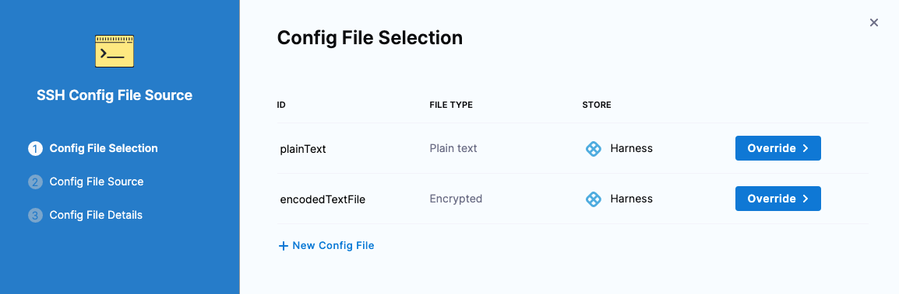
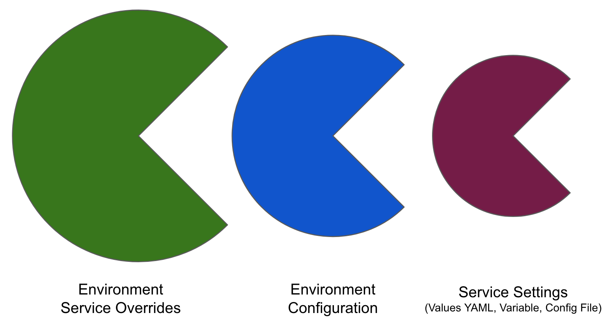

You can add files to your Harness services and then reference and use the files in your service manifests/specifications and pipelines.

Files are added to the **Config Files** section in your Harness services.

Files can be stored in the following locations.

- **Harness file store:** All platform [integrations](/docs/continuous-delivery/cd-integrations) (Kubernetes, etc.) support config files stored in the Harness [file store](/docs/continuous-delivery/x-platform-cd-features/services/add-inline-manifests-using-file-store).
- **Git providers:** You can use config files in any Git provider, including GitHub, GitLab, and Bitbucket. You connect to these providers using Harness connectors. Ensure that the connector credentials have read permissions on the target repository.

## Important notes on config files

- Files must be 1MB or less.
- Only JSON, YAML, and text files are supported.
- You cannot use Harness variables in an encrypted text config file.
- You cannot reference other config files within a config file.
- Config files cannot be binaries. 

### Expressions are not allowed in references

Config files are referenced using the `<+configFile.getAsString("CONFIG_FILE_ID")>` format, as described in [Referencing and encoding config files](#referencing-and-encoding-config-files).

You cannot use Harness expressions in the parameter field of the `getAsString()` and `getAsBase64()` functions. For example, this expression will fail: `<+configFile.getAsString(“<+serviceVariable.var_name>”)>`.


## Config file capabilities

You can add plain or encrypted text files. Both types can be referenced using a Harness expression, discussed below.

With a plain text config file, Harness renders the contents of the file. 

With an encrypted text config file, you need to base64 decode it before you can reference it within the deployment.

## Add config files to a service

You can add config files to any Harness service deployment type (Kubernetes, ECS, etc.).

```mdx-code-block
import Tabs from '@theme/Tabs';
import TabItem from '@theme/TabItem';
```
```mdx-code-block
<Tabs>
  <TabItem value="YAML" label="YAML" default>
```

Here's an example of a service with both a plain text and encoded config file added from the Harness file store. 

```yaml
service:
  name: Config files
  identifier: Config_files
  tags: {}
  serviceDefinition:
    spec:
      configFiles:
        - configFile:
            identifier: plainText
            spec:
              store:
                type: Harness
                spec:
                  files:
                    - /Config files/my-plain-text-file.txt
        - configFile:
            identifier: encodedTextFile
            spec:
              store:
                type: Harness
                spec:
                  secretFiles:
                    - sshnov7
    type: Ssh
```

The encoded file is added as a [Harness secret](/docs/platform/tecrets/tecrets-management/harness-secret-manager-overview/). The secret must be created separately if you are using YAML.

You will use the `configFile.identifier` value to reference the config file.

You can attach multiple files in a config file. Simply add a new line:

```yaml
                  files:
                    - /Config files/file1.json
                    - /dev/file2.json
```

```mdx-code-block
  </TabItem>
  <TabItem value="Pipeline Studio" label="Pipeline Studio">
```

1. In the Harness service, in **Config Files**, select **Add Config File**.
2. In **Config File Source**, select **Harness**, and select **Continue**.
3. In **Config File Identifier**, enter a name for the file.
4. In **Select file type**, select **File Store** or **Encrypted**. Encrypted files are stored as [Harness secrets](/docs/platform/tecrets/tecrets-management/harness-secret-manager-overview/).
5. Select **Add** to attach multiple files as a single config file.
6. Select **Submit**.

You will use the value you entered in **Config File Identifier** to reference the config file as an expression in the format `<+configFile.getAsString("CONFIG_FILE_ID")>`.

```mdx-code-block
  </TabItem>
</Tabs>
```

## Multiple files can be added to one config file

You can attach multiple files to one config file. All the files must be either plain text or encoded. You cannot mix types.

## Referencing and encoding config files

Files added in the **Config Files** section of a service are referenced using the following Harness expressions.

* Plain text file contents: `<+configFile.getAsString("CONFIG_FILE_ID")>`
* Base64-encoded file contents: `<+configFile.getAsBase64("CONFIG_FILE_ID")>`

If the config file has multiple text or encrypted files attached, you must use fileStore or secrets variables expressions: 

- `<+fileStore.getAsString("SCOPED_FILEPATH")>`  
- `<+fileStore.getAsBase64("SCOPED_FILEPATH")>`
- `<+secrets.getValue("SCOPED_SECRET_ID")>`

Here are some examples:

- `<+configFile.getAsString("cf_file")>`
- `<+configFile.getAsBase64("cf_file")>`
- `<+fileStore.getAsString("/folder1/configFile")>`
- `<+fileStore.getAsBase64("account:/folder1/folder2/configFile")>`
- `<+secrets.getValue("account.MySecretFileIdentifier")>`

### Use Base64 to avoid new lines

If you are going to use a config file in a manifest or shell script, be aware that `<+configFile.getAsString()>` can cause problems by adding new lines to your manifest (unless you have formatted the file very carefully).

Instead, use `<+configFile.getAsBase64()>`. This ensures that the contents of the file are rendered as a single line.

In a Shell Script step or service command it would look like this:

```sh
echo <+configFile.getAsBase64("myFile")>
```

## Decoding a config file in a manifest

In a Kubernetes manifest (in our example, a ConfigMap), you decode the base64 config file and indent it for the YAML syntax.

Here's the values.yaml:

```yaml
my_file:`my_file:<+configFile.getAsBase64("myFile")>`
```

Here's the ConfigMap:

```yaml
data:  
  keyname: |  
{{.Values.my_file | b64dec | indent 4}}
```
  
At runtime, the config file is decoded and used as plaintext.


## Using Harness variables in config files

:::note

Currently, this feature is behind the feature flag `CDS_NG_CONFIG_FILE_EXPRESSION`. Contact [Harness Support](mailto:support@harness.io) to enable the feature.

:::

Plain text config files support the following [Harness variables](/docs/platform/Variables-and-Expressions/harness-variables):

- Pipeline variables
- Service variables
- Environment variables
  - Environment override variables
- Secrets

:::note

You cannot use Harness variables in an encrypted text config file.

:::

## Override service config files at the environment level

You can override service config files at the environment level. When the service is deployed to that environment, the environment's config files will override the service's config files.

### Override config files for all services

To override the config files for all services used with an environment, do the following.

```mdx-code-block
import Tabs1 from '@theme/Tabs';
import TabItem1 from '@theme/TabItem';
```

<Tabs1>
  <TabItem1 value="YAML" label="YAML" default>

Here's an example of an environment with config file overrides in its **overrides**.

```yaml
environment:
  name: Config Files
  identifier: Config_Files
  tags: {}
  type: PreProduction
  orgIdentifier: default
  projectIdentifier: CD_Docs
  variables: []
  overrides:
    configFiles:
      - configFile:
          identifier: EnvironmentPlainText
          spec:
            store:
              type: Harness
              spec:
                files:
                  - /Config files/my-plain-text-file.txt
      - configFile:
          identifier: EnvironmentEncodedFile
          spec:
            store:
              type: Harness
              spec:
                secretFiles:
                  - account.Dpk
```

```mdx-code-block
  </TabItem1>
  <TabItem1 value="Pipeline Studio" label="Pipeline Studio">
```

1. In **Environments**, select an environment.
2. In the environment's **Configuration**, in **Config Files**, select **New Config File Override**.
3. Follow the same steps as you would when adding a config file in a service and then select **Submit**.

```mdx-code-block
  </TabItem1>
</Tabs1>
```

### Override config files for specific services

You can override the config files of specific services' deployed to an environment.

1. In **Environments**, select an environment.
2. In the environment's **Service Overrides**, select **New configuration overrides**.
3. In **Service**, select the service to override.
4. In **Override Type**, select **Config file**, and then select **New Config File Override**.
5. In **Config File Selection**, select the config file to override, and select **Override**.
   
    

6. Follow the steps to select the override file, and then select **Submit**. 

When the selected service is deployed to this environment, the environment's config files will override that service's config files.

### Fully overriding config files and variables

Harness supports [overriding service](/docs/continuous-delivery/x-platform-cd-features/environments/create-environments) config files at the environment level. 

Config files are a black box that can contain multiple formats and content, such as YAML, JSON, plain text, etc. Consequently, they cannot be overridden like Values YAML files.

When you have config files at two or more of the environment Service Overrides, Configuration, and the service itself, the standard override priority is applied.

The priority from top to bottom is:

1. Environment service overrides
2. Environment configuration
3. Service settings

  

When you have Variables with the same name at two or more of the environment Service Overrides, Configuration, and the service itself, the standard override priority is applied.

## Use the Copy Configs command

In most cases, you can use the Copy command to copy the config files to your target hosts. 

```mdx-code-block
import Tabs2 from '@theme/Tabs';
import TabItem2 from '@theme/TabItem';
```

<Tabs2>
  <TabItem2 value="YAML" label="YAML" default>

Here's an example of a Command step copying a config file to all target hosts. 

```yaml
              - step:
                  type: Command
                  name: Copy
                  identifier: Copy
                  spec:
                    onDelegate: false
                    environmentVariables: []
                    outputVariables: []
                    commandUnits:
                      - identifier: Copy
                        name: Copy
                        type: Copy
                        spec:
                          sourceType: Config
                          destinationPath: /
                  timeout: 10m
                  failureStrategies: []
                  strategy:
                    repeat:
                      items: <+stage.output.hosts>
```

Note the use of `strategy.repeat.items: <+stage.output.hosts>`. This runs the command on all target hosts.

```mdx-code-block
  </TabItem2>
  <TabItem2 value="Pipeline Studio" label="Pipeline Studio">
```

1. In your CD stage, add a **Command** step.
2. In the Command step, in **Run the following commands**, select **Add Command**.
3. In **Add Command**, in **Command Type**, select **Copy**.
4. In **Select file type to copy**, select **Config**.
5. In **Destination Path**, enter the path on the target host where you want the config file copied.
6. Select **Add**.
7. In the Command step **Advanced** settings, select **Looping Strategy**.
8. Select the **Repeat** strategy and enter the following:

```yaml
repeat:
  items: <+stage.output.hosts>
```

This runs the command on all target hosts.

```mdx-code-block
  </TabItem2>
</Tabs2>
```


