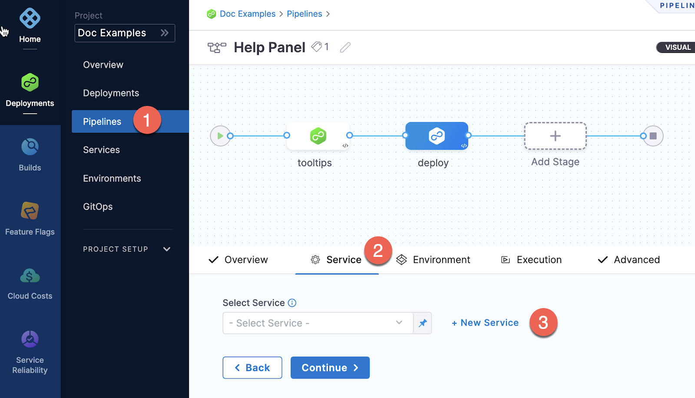

Services represent your microservices and other workloads. Each service contains a **Service Definition** that defines your deployment artifacts, manifests or specifications, configuration files, and service-specific variables.

## Create a service

You can create services from: 
* Within a pipeline
* Outside a pipeline 
* An account
* An Organization

If you are new to Harness, review [Harness key concepts](/docs/get-started/key-concepts.md) and [create your first CD pipeline](/tutorials/cd-pipelines/kubernetes/manifest).

```mdx-code-block
import Tabs from '@theme/Tabs';
import TabItem from '@theme/TabItem';
```
```mdx-code-block
<Tabs>
  <TabItem value="Within a pipeline" label="Within a pipeline">
```

To create a service from inside of a pipeline, select the **Services** tab of a new CD stage, then select **New Service**.



Once the service and its service definition are saved, you can select it in any pipeline.

When you select the service in a pipeline, you can select **Edit Service** to edit its **Service Definition**.

When you create the new service you define its **Service Definition**. For example, a Kubernetes **Service Definition** with a Kubernetes manifest and Docker artifact.

```mdx-code-block
  </TabItem>
  <TabItem value="Outside a pipeline" label="Outside a pipeline">
```

To create a service from outside of a pipeline, you use **Services** in the navigation pane.


```mdx-code-block
  </TabItem>
  <TabItem value="From organization or account" label="From organization or account">
```

You can create a service at an account or organization level from the Pipeline Studio, APIs, or Terraform.

```mdx-code-block
import Tabs2 from '@theme/Tabs';
import TabItem2 from '@theme/TabItem';
```
```mdx-code-block
<Tabs2>
  <TabItem2 value="Pipeline Studio" label="Pipeline Studio">
```
To create a service at an account or organization level, go to **Organization Resources** **>Services**.

Creating an account level service enables you to manage the service globally across the organizations and projects within the account. 

An account level service can only reference connectors for the manifests and artifacts within the account. These services are global and cannot have dependencies at a lower hierarchy level.

Shared services can also be created and managed at account or organization levels.


:::note
When using an account level deployment stage template, you can referencing an account level service only. Similarly, for organization level stage templates, you can reference organization level services only. 

However, when using a deployment stage in a pipeline that has service configured as a runtime input, you can pick services from project, organization, or account levels to pass them as runtime inputs based on your RBAC. 

Go to [add a stage template](/docs/platform/templates/add-a-stage-template.md) for more information.
:::

Expand the section below to see a sample account level service YAML.

<details>
   <summary>Account level service YAML</summary>

```
service:
  name: nginx
  identifier: nginx
  tags: {}
  serviceDefinition:
    spec:
      manifests:
        - manifest:
            identifier: nginx-base
            type: K8sManifest
            spec:
              store:
                type: Github
                spec:
                  connectorRef: account.Harness_K8sManifest
                  gitFetchType: Branch
                  paths:
                    - cdng/
                  repoName: <+input>
                  branch: main
              skipResourceVersioning: false
      artifacts:
        primary:
          primaryArtifactRef: <+input>
          sources:
            - spec:
                connectorRef: account.Harness_DockerHub
                imagePath: library/nginx
                tag: <+input>
                digest: <+input>
              identifier: harness dockerhub
              type: DockerRegistry
    type: Kubernetes
```
</details>

Expand the section below to see a sample organization level service YAML.

<details>
   <summary>Organization level service YAML</summary>

```
service:
  name: redis
  identifier: redis
  tags: {}
  serviceDefinition:
    spec:
      manifests:
        - manifest:
            identifier: redis
            type: HelmChart
            spec:
              store:
                type: Http
                spec:
                  connectorRef: org.bitnami
              chartName: redis
              chartVersion: ""
              subChartName: ""
              helmVersion: V3
              skipResourceVersioning: false
              enableDeclarativeRollback: false
        - manifest:
            identifier: Redis Values
            type: Values
            spec:
              store:
                type: Github
                spec:
                  connectorRef: account.Rohan_Github
                  gitFetchType: Branch
                  paths:
                    - redis/values.yaml
                  repoName: Product-Management
                  branch: main
      variables:
        - name: namespace
          type: String
          description: "namespace for the redis service"
          value: redis
    type: Kubernetes
  description: sample redis service
```
</details>

```mdx-code-block
  </TabItem2>
  <TabItem2 value="API" label="API">
```
For information about creating a service API, go to [create a service](https://apidocs.harness.io/tag/Services#operation/createServiceV2).

The `orgIdentifier` and `projectIdentifier` field definitions are optional, and depend on where you want to create the service. For example, if you create a service at an account level, you will not need org or project identifiers in the post API call payload.

```mdx-code-block
  </TabItem2>
  <TabItem2 value="Terraform" label="Terraform">
```
For information about creating a Harness platform service, go to [harness_platform_service (Resource)](https://registry.terraform.io/providers/harness/harness/latest/docs/resources/platform_service).

The `org_id` and `project_id` field definitions are optional, and depend on where you want to create the service. For example, if you create a service at an account level, you will not need org or project identifiers.

Expand the section below to see a sample platform service in Terraform. 

<details>
   <summary>Harness platform service</summary>

```
resource "harness_platform_service" "example" {
  identifier  = "identifier"
  name        = "name"
  description = "test"
  org_id      = "org_id"
  project_id  = "project_id"

  ## SERVICE V2 UPDATE
  ## We now take in a YAML that can define the service definition for a given Service
  ## It isn't mandatory for Service creation 
  ## It is mandatory for Service use in a pipeline

  yaml = <<-EOT
                service:
                  name: name
                  identifier: identifier
                  serviceDefinition:
                    spec:
                      manifests:
                        - manifest:
                            identifier: manifest1
                            type: K8sManifest
                            spec:
                              store:
                                type: Github
                                spec:
                                  connectorRef: <+input>
                                  gitFetchType: Branch
                                  paths:
                                    - files1
                                  repoName: <+input>
                                  branch: master
                              skipResourceVersioning: false
                      configFiles:
                        - configFile:
                            identifier: configFile1
                            spec:
                              store:
                                type: Harness
                                spec:
                                  files:
                                    - <+org.description>
                      variables:
                        - name: var1
                          type: String
                          value: val1
                        - name: var2
                          type: String
                          value: val2
                    type: Kubernetes
                  gitOpsEnabled: false
              EOT
}
```
</details>

```mdx-code-block
  </TabItem2>    
</Tabs2>
```
```mdx-code-block
  </TabItem>    
</Tabs>
```

## Using runtime input services with inputs and expressions

Services are often configured using runtime inputs or expressions so you can change service settings for different deployment scenarios at pipeline runtime. 

:::note

For more information on runtime inputs and expressions, go to [Fixed Values, Runtime Inputs, and Expressions](/docs/platform/variables-and-expressions/runtime-inputs).

:::


Often, the service option in a pipeline is also set as a runtime input so you can select which service to use when you deploy the pipeline. 

Also, the pipeline that deploys the service might be triggered in response to changes in a service's artifact or manifest.

There are a few things to note when using services with or as runtime inputs:
- Service runtime inputs are not configurable in the pipeline that deploys the service.
- Service runtime inputs are not configurable in the trigger.

### Why are service inputs not configurable?

Many Harness settings and options are dependent on the specific values set in a service. When a value is set as runtime input, Harness can't identify what configurations to render in the user interface.


### Selecting settings when the service is an expression

If you use an expression in a service setting, Harness must be able to resolve the expressions when you run the pipeline using the service.

There are a few options you can use to support expressions when a service is set as a runtime input in a pipeline, or when the service itself uses runtime inputs. These options are covered in the following sections.

### Use trigger payload data to configure the service at runtime

You can pass in this data when the pipeline execution is triggered using a custom cURL trigger.

For more information, go to [Passing data in Custom triggers](/docs/platform/triggers/custom-trigger-passing-data).

Here's the YAML for a service in a pipeline that uses trigger payload data for the service reference, primary artifact, and tag:

```yaml
spec:
  service:
    serviceRef: <+trigger.payload.serviceId>
    serviceInputs:
      serviceDefinition:
        type: TAS
        spec:
          artifacts:
            primary:
              primaryArtifactRef: <+trigger.payload.artifactId>
              sources:
                - identifier: <+trigger.payload.artifactId>
                  type: Nexus2Registry
                  spec:
                    tag: <+trigger.payload.tag>
```

To supply the data you simply provide the payload key-value pairs in the cURL command you use to execute the pipeline:

```
curl -X POST -H 'Content-Type: application/json' --url 'webhook_url' -d '{"serviceId": "Kubernetes", "artifactId": "nginx", "tag": "abc"}'
```

### Use pipeline variables and trigger payload data to configure the service at runtime

You can create pipeline variables and map those to service settings. When you run the pipeline, you can provide values for the variables to define the service.

For example, here are pipeline variables for a service's artifact and tags.

  

Next, you map the pipeline variables to the services' artifact settings using expressions:

  

You can also map a pipeline variable for the service name as an expression:

  

When you run the pipeline, you are prompted to provide values for the pipeline variables.

  


You can also map these same pipeline variables to trigger payload data expressions. 

  

When you initiate the trigger using the cURL command, the key-value pairs in the command are used for the pipeline variables. Finally, those pipeline variable values are used to define the service.


## Next steps

* [Add inline service files using file store](./add-inline-manifests-using-file-store.md)
* [Add a custom artifact source for CD](./add-a-custom-artifact-source-for-cd.md)
* [Propagate CD services](./propagate-and-override-cd-services.md)