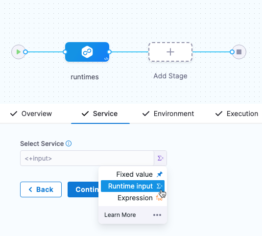
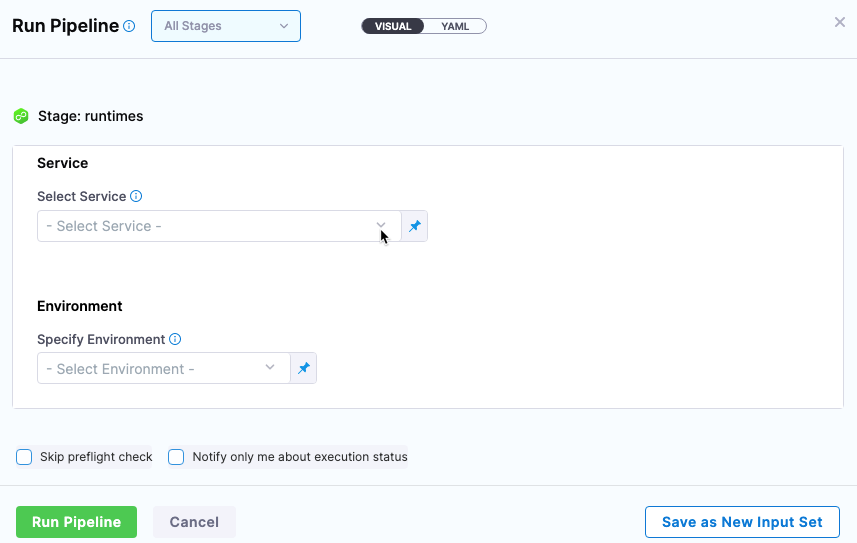

Services represent your microservices and other workloads. Each service contains a **Service Definition** that defines your deployment artifacts, manifests or specifications, configuration files, and service-specific variables.

## Create a service

You can create services from: 
* Within a pipeline
* Outside a pipeline 
* An account
* An Organization

If you are new to Harness, review [Harness key concepts](/docs/getting-started/learn-harness-key-concepts.md) and [create your first CD pipeline](../../get-started/create-first-pipeline.md).

```mdx-code-block
import Tabs from '@theme/Tabs';
import TabItem from '@theme/TabItem';
```
```mdx-code-block
<Tabs>
  <TabItem value="Within a pipeline" label="Within a pipeline">
```

To create a service from inside of a pipeline, select the **Services** tab of a new CD stage, then select **New Service**.


Once the service and its service definition are saved, you can select it in any pipeline.

When you select the service in a pipeline, you can select **Edit Service** to edit its **Service Definition**.

When you create the new service you define its **Service Definition**. For example, a Kubernetes **Service Definition** with a Kubernetes manifest and Docker artifact.

```mdx-code-block
  </TabItem>
  <TabItem value="Outside a pipeline" label="Outside a pipeline">
```

To create a service from outside of a pipeline, you use **Services** in the navigation pane.


```mdx-code-block
  </TabItem>
  <TabItem value="From organization or account" label="From organization or account">
```

You can create a service at an account or organization level from the Pipeline Studio, APIs, or Terraform.

```mdx-code-block
import Tabs2 from '@theme/Tabs';
import TabItem2 from '@theme/TabItem';
```
```mdx-code-block
<Tabs2>
  <TabItem2 value="Pipeline Studio" label="Pipeline Studio">
```
To create a service at an account or organization level, go to **Organization Resources** **>Services**.

Creating an account level service enables you to manage the service globally across the organizations and projects within the account. 

An account level service can only reference connectors for the manifests and artifacts within the account. These services are global and cannot have dependencies at a lower hierarchy level.

Shared services can also be created and managed at account or organization levels.


:::note
When using an account level deployment stage template, you can referencing an account level service only. Similarly, for organization level stage templates, you can reference organization level services only. 

However, when using a deployment stage in a pipeline that has service configured as a runtime input, you can pick services from project, organization, or account levels to pass them as runtime inputs based on your RBAC. 

Go to [add a stage template](/docs/platform/13_Templates/add-a-stage-template.md) for more information.
:::

Expand the section below to see a sample account level service YAML.

<details>
   <summary>Account level service YAML</summary>

```
service:
  name: nginx
  identifier: nginx
  tags: {}
  serviceDefinition:
    spec:
      manifests:
        - manifest:
            identifier: nginx-base
            type: K8sManifest
            spec:
              store:
                type: Github
                spec:
                  connectorRef: account.Harness_K8sManifest
                  gitFetchType: Branch
                  paths:
                    - cdng/
                  repoName: <+input>
                  branch: main
              skipResourceVersioning: false
      artifacts:
        primary:
          primaryArtifactRef: <+input>
          sources:
            - spec:
                connectorRef: account.Harness_DockerHub
                imagePath: library/nginx
                tag: <+input>
                digest: <+input>
              identifier: harness dockerhub
              type: DockerRegistry
    type: Kubernetes
```
</details>

Expand the section below to see a sample organization level service YAML.

<details>
   <summary>Organization level service YAML</summary>

```
service:
  name: redis
  identifier: redis
  tags: {}
  serviceDefinition:
    spec:
      manifests:
        - manifest:
            identifier: redis
            type: HelmChart
            spec:
              store:
                type: Http
                spec:
                  connectorRef: org.bitnami
              chartName: redis
              chartVersion: ""
              subChartName: ""
              helmVersion: V3
              skipResourceVersioning: false
              enableDeclarativeRollback: false
        - manifest:
            identifier: Redis Values
            type: Values
            spec:
              store:
                type: Github
                spec:
                  connectorRef: account.Rohan_Github
                  gitFetchType: Branch
                  paths:
                    - redis/values.yaml
                  repoName: Product-Management
                  branch: main
      variables:
        - name: namespace
          type: String
          description: "namespace for the redis service"
          value: redis
    type: Kubernetes
  description: sample redis service
```
</details>

```mdx-code-block
  </TabItem2>
  <TabItem2 value="API" label="API">
```
For information about creating a service API, go to [create a service](https://apidocs.harness.io/tag/Services#operation/createServiceV2).

The `orgIdentifier` and `projectIdentifier` field definitions are optional, and depend on where you want to create the service. For example, if you create a service at an account level, you will not need org or project identifiers in the post API call payload.

```mdx-code-block
  </TabItem2>
  <TabItem2 value="Terraform" label="Terraform">
```
For information about creating a Harness platform service, go to [harness_platform_service (Resource)](https://registry.terraform.io/providers/harness/harness/latest/docs/resources/platform_service).

The `org_id` and `project_id` field definitions are optional, and depend on where you want to create the service. For example, if you create a service at an account level, you will not need org or project identifiers.

Expand the section below to see a sample platform service in Terraform. 

<details>
   <summary>Harness platform service</summary>

```
resource "harness_platform_service" "example" {
  identifier  = "identifier"
  name        = "name"
  description = "test"
  org_id      = "org_id"
  project_id  = "project_id"

  ## SERVICE V2 UPDATE
  ## We now take in a YAML that can define the service definition for a given Service
  ## It isn't mandatory for Service creation 
  ## It is mandatory for Service use in a pipeline

  yaml = <<-EOT
                service:
                  name: name
                  identifier: identifier
                  serviceDefinition:
                    spec:
                      manifests:
                        - manifest:
                            identifier: manifest1
                            type: K8sManifest
                            spec:
                              store:
                                type: Github
                                spec:
                                  connectorRef: <+input>
                                  gitFetchType: Branch
                                  paths:
                                    - files1
                                  repoName: <+input>
                                  branch: master
                              skipResourceVersioning: false
                      configFiles:
                        - configFile:
                            identifier: configFile1
                            spec:
                              store:
                                type: Harness
                                spec:
                                  files:
                                    - <+org.description>
                      variables:
                        - name: var1
                          type: String
                          value: val1
                        - name: var2
                          type: String
                          value: val2
                    type: Kubernetes
                  gitOpsEnabled: false
              EOT
}
```
</details>

```mdx-code-block
  </TabItem2>    
</Tabs2>
```
```mdx-code-block
  </TabItem>    
</Tabs>
```

## Runtime inputs and expressions in services

If you use runtime inputs for settings in a service, you will need to provide values for these inputs when you run the pipeline using the service.

If you use expressions in a service, Harness must be able to resolve these expressions when users run the pipeline using the service.

Let's look at an example.

1. In a Harness Deploy stage, in **Service**, select **Runtime input** for the service.
   
   
2. When you run the pipeline, you can select the service to use.
   
   

Now you can provide values for any runtime inputs in the service. Let's go into more detail in the next section.

:::note

For more information on runtime inputs and expressions, go to [Fixed Values, Runtime Inputs, and Expressions](/docs/platform/20_References/runtime-inputs.md).

:::

### Selecting settings when the service is an expression

If you are using a runtime input for the service in a stage, and the service you are going to select has runtime inputs for some of its own settings, you can select inputs for these settings when you select the service in **Run Pipeline**.

Let's look at an example.

Here is a service with an artifact that has runtime inputs for its artifact **Tag** and **Digest** settings.

  

Next, when you run a pipeline that has the **Service** setting as a runtime input, you select the service that has runtime inputs for its artifact **Tag** and **Digest** settings.

As you can see, you can now select the artifact **Tag** and **Digest** settings.

  


## Next steps

* [Add inline service files using file store](./add-inline-manifests-using-file-store.md)
* [Add a custom artifact source for CD](./add-a-custom-artifact-source-for-cd.md)
* [Propagate CD services](./propagate-and-override-cd-services.md)