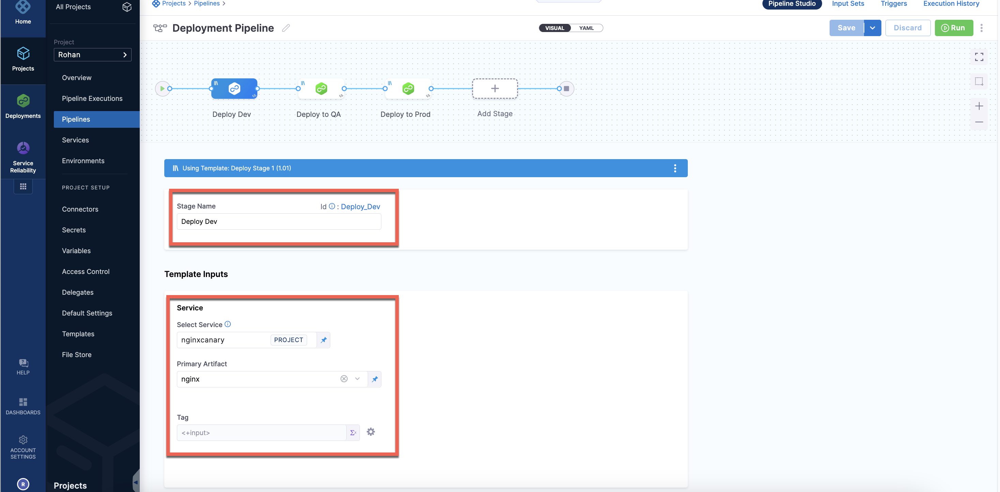
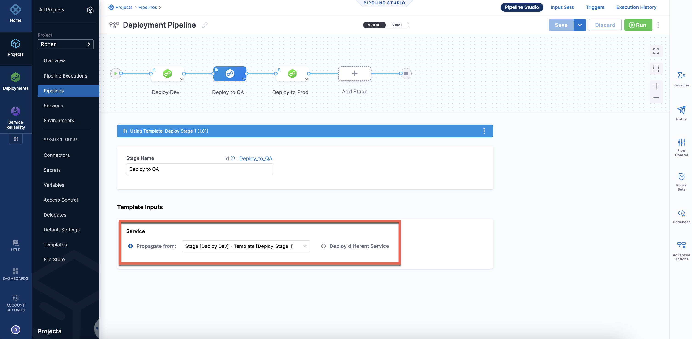

This topic describes how to propagate CD services between stages.

You can use the same CD stage services across your pipeline stages. Once you have [added a stage](/docs/platform/8_Pipelines/add-a-stage.md) with a service, you can select the same service in subsequent stages by using the **Propagate from** option.

  

You can also use Harness input sets and overlays to select from different collections of settings at runtime. See [input sets and overlays](/docs/platform/8_Pipelines/input-sets.md) and [run pipelines using input sets and overlays](../../../platform/8_Pipelines/run-pipelines-using-input-sets-and-overlays.md).

## Important notes

* Service propagation is not supported when using multiple services in a single stage (multi service deployments).
  * For details on using multiple services, go to [use multiple services and multiple environments in a deployment](/docs/continuous-delivery/x-platform-cd-features/advanced/multiserv-multienv).
* Service propagation is progressive: you can only propagate services from stage to stage in a forward direction in your pipeline. For example, Stage 2 cannot propagate a service from a subsequent Stage 3.
* In a pipeline's **Advanced Options**, in **Stage Execution Settings**, you can set up selective stage executions. This allows you to select which stages to deploy at runtime.
  * If you select a stage that uses a propagated service (a child service), that stage will not work.
  * This is because the parent service's settings must be resolved as part of the deployment. Additionally, if the child service is overriding the parent service's settings, Harness cannot ensure that the settings can be overridden correctly without deploying the parent service.
* When propagation is set up between a parent stage and child stage, moving the parent or child stage out of sequence resets any propagated settings to their defaults.
  * If you do this, you are prompted to confirm. If you confirm, the stages are reset to their defaults.
  


* When you propagate a service from one stage to another, the stages must use the same input set. For example, if you have Stage 1 using Input Set A, and you propagate its service to Stage 2, Stage 2 must use Input Set A. If Stage 2 uses a different input set, the service cannot propagate from Stage 1 to Stage 2.

## Propagate a service

1. Open or create a pipeline with at least one stage.
2. To add another stage to the pipeline, select the plus sign (+) or select **Add Stage** after the first stage, and then select **Deploy**.
   
   
3. Enter a stage name and select **Set Up Stage**.
   
   The new stage is added to the Pipeline.
4. Select the **Service** tab if it is not already selected.
   
   The propagation option appears.
   
   
5. Select **Propagate from** and then select the stage with the service you want to use.
   
   
   
   You can see the stage name and service name.

This stage now uses the exact same Service as the stage you selected.

## Propagating services through multiple stages

:::info

This feature is currently behind the feature flag, `CDS_PROPAGATE_STAGE_TEMPLATE`. Contact [Harness Support](mailto:support@harness.io) to enable the feature.

:::

When defining a pipeline, you can pass the service, its variables, artifact, and manifest inputs through multiple stages. You can propagate a service from a previous templated or non-templated stage. You can also propagate a service from one templated stage to another stage referring to a different template. 

### Limitations

You cannot propagate services between different deployment types. For example, you cannot propagate a Kubernetes service between a Kubernetes deployment stage and a Native Helm deployment stage.

### Requirements

Make sure that the service is configured as a runtime input in the stage template or stage.

### Video

<!-- Video:
https://www.loom.com/embed/79b0d4c9c4634d2e95da1a832ef8060f%22-->
<docvideo src="https://www.loom.com/share/79b0d4c9c4634d2e95da1a832ef8060f" />

### Propagate services from one stage template to another

1. Open or create a pipeline with two stage templates. For more information, go to [create a stage template](/docs/continuous-delivery/x-platform-cd-features/templates/create-a-remote-stage-template).
2. Select the **Service** tab if it is not already selected.
   
   The propagation option appears.

   
3. Select **Propagate from** and then select the stage with the service you want to use.
   
   You can see the stage name and service name.

   

   You can also propagate a service from one template stage to another if it is a runtime input. 

Here is a sample service propagation YAML:

```
pipeline:
  name: Deployment Pipeline
  identifier: Deployment_Pipeline
  projectIdentifier: Rohan
  orgIdentifier: default
  tags: {}
  stages:
    - stage:
        name: Deploy Dev
        identifier: Deploy_Dev
        template:
          templateRef: Deploy_Stage_1
          versionLabel: "1.01"
          templateInputs:
            type: Deployment
            spec:
              service:
                serviceInputs:
                  serviceDefinition:
                    type: Kubernetes
                    spec:
                      artifacts:
                        primary:
                          primaryArtifactRef: nginx
                          sources:
                            - identifier: nginx
                              type: DockerRegistry
                              spec:
                                tag: <+input>
                serviceRef: nginxcanary
    - stage:
        name: Deploy to QA
        identifier: Deploy_to_QA
        template:
          templateRef: Deploy_Stage_1
          versionLabel: "1.01"
          templateInputs:
            type: Deployment
            spec:
              service:
                useFromStage:
                  stage: Deploy_Dev
    - stage:
        name: Deploy to Prod
        identifier: Deploy_to_Prod
        template:
          templateRef: Deploy_Stage_1
          versionLabel: "1.01"
          templateInputs:
            type: Deployment
            spec:
              service:
                useFromStage:
                  stage: Deploy_Dev

```

## Multiple service deployment

A multiple service deployment is when you deploy multiple services in the same stage. Multiple service deployments do not support service propagation.

If you select multiple services in a stage, you cannot propagate them to subsequent stages.

For information on multiple service deployments, go to [use multiple services and multiple environments in a deployment](/docs/continuous-delivery/x-platform-cd-features/advanced/multiserv-multienv).


## Override service settings

 You can override a service's setting by using **Environment Overrides** and by overlaying values YAML files.
 
For details on **Environment Overrides**, go to [overriding service settings in environments](/docs/continuous-delivery/x-platform-cd-features/environments/create-environments). The following information covers overriding services in services and environments v1 only.

A common method for overriding values YAML files is to use the `<+env.name>` Harness expression in the **File Path** of the *values.yaml* file and then name your Harness environments with the same names as your values YAML files.

<!--  -->

<docimage path={require('./static/6cffc4e7fc1159c37eece2bb6cc2a7e76a115652155fe93c91a3f80a68328112.png')} />

There are other ways to override the *values.yaml* files without using environments.

You can overlay values files in Harness by adding multiple files or you can replace file paths dynamically at runtime.


Go to [add and override values YAML files](/docs/continuous-delivery/deploy-srv-diff-platforms/kubernetes/cd-kubernetes-category/add-and-override-values-yaml-files) for more information.


