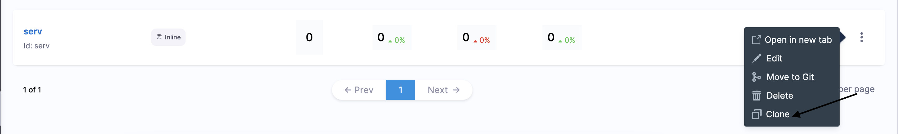
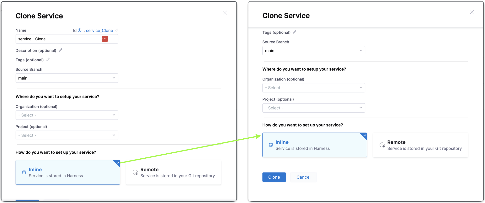
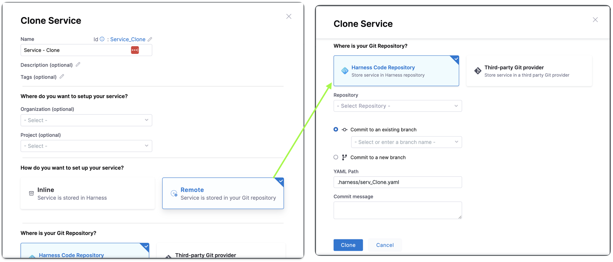
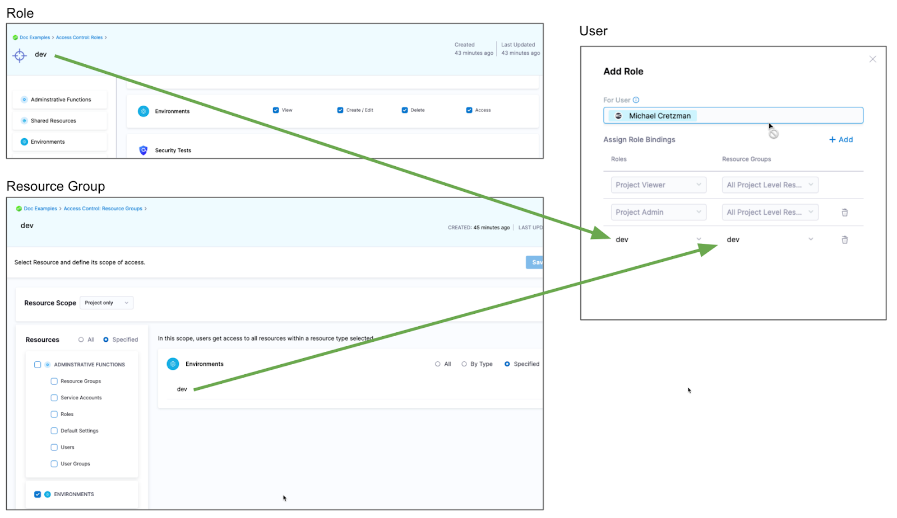

A Harness service represents what you're deploying. 

Harness services are deployed to Harness environments. Select **Environments** to see the environments in this project.

In **Manage Services**, you can create, update, and delete your services' settings. For example, a service's variables and its manifest and artifact details.

In **Dashboard**, you can view service statistics such as deployment frequency, failure rate, and so on.

## Creating services

You can create services in **Services**, when you're building your pipelines, or at an account or organization levels. 

When you create a service in a pipeline, it's automatically added to **Services**. You can add the same service to as many pipelines as you need. 

For more information, go to [create services](/docs/continuous-delivery/x-platform-cd-features/services/create-services).

## Clone Services

:::info note
Currently, this feature is behind the feature flag `CDS_SERVICE_ENV_CLONING`. Contact [Harness Support](mailto:support@harness.io) to enable the feature.
:::

You can clone services across scopes i.e from one project to another, project to organization, account to project etc.

Select **More Options** (&vellip;).
Select **Clone**.

Once you click on **Clone**, you will see **Clone Service** setting:-

You can change the **Name** add tags and description as well for this clone service.

You can change the **Organization** and **Project** as well where you want to clone the service.

You can choose between **Inline** and **Remote** to set up your service. Choose **Inline** when you want your service to be stored in Harness. Choose **Remote** when storing your service in a Third-party Git repository or Harness Code Repository.

To close a remote service to an inline service, you have to specify the source branch where the remote service is stored.

To Clone an inline service or remote service to a remote service, you must specify the target repository, Harness Code Repository, to store the service in the Harness repository or Third-party Git provider, to store the service in a third party Git provider, define the Git Connector if Third-party Git provider. Specify the Repository name, the YAML path, and the commit message.

:::info note
When you clone a service from a different organization or project, the connector referenced in the service doesn't get cloned and must be explicitly created.
:::

## Services RBAC

Go to [RBAC in Harness](/docs/platform/role-based-access-control/rbac-in-harness) for examples of RBAC use cases for services.

## Access permission to deploy to a service

One of the most important advantages of services is the ability to define roles that determines who can deploy them.

In order for a role to allow deployments using services, the role must have the access permission enabled for services.

The **View**, **Create**, **Edit**, **Delete**, and **Manage** permissions enable you to deploy a service.

If a role does not have the **Access** permission for **Services**, a user or user group assigned that role cannot deploy any service.

## Restrict access to specific services for a user or user group

You can restrict a user or user group to using specific services only. The process is the same for services and environments. 

Let's look at an example using environments.

If you want to restrict a user or user group to deploy to a specific environment only, do the following:

1. Create a resource group and select the environment.
2. Create a role and give the user or user group permissions. The **Access** permission is needed for deployments.
3. Assign the role and resource group to the user or user group.

## Deleting a Service in Harness

For information on deleting services in Harness, go to **Deleting a Service in Harness** in [Service-based licensing and usage for CD](/docs/continuous-delivery/get-started/service-licensing-for-cd/).
