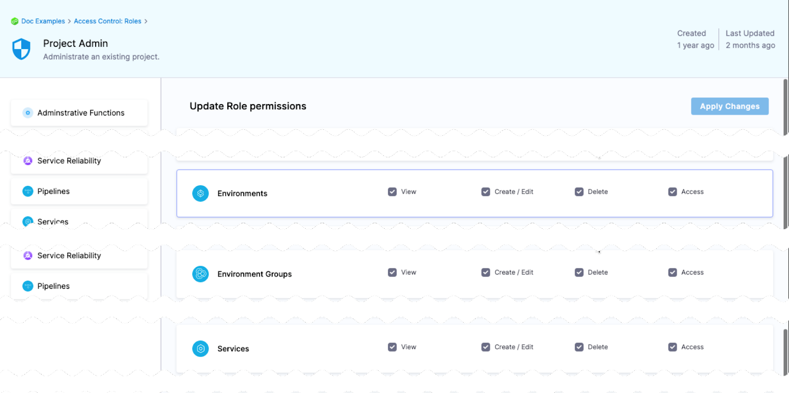

A Harness service represents what you're deploying. 

Harness services are deployed to Harness environments. Select **Environments** to see the environments in this project.

In **Manage Services**, you can create, update, and delete your services' settings. For example, a service's variables and its manifest and artifact details.

In **Dashboard**, you can view service statistics such as deployment frequency, failure rate, and so on.

## Creating services

You can create services in **Services**, when you're building your pipelines, or at an account or organization levels. 

When you create a service in a pipeline, it's automatically added to **Services**. You can add the same service to as many pipelines as you need. 

For more information, go to [create services](/docs/continuous-delivery/x-platform-cd-features/services/create-services).

## Services RBAC

Go to [RBAC in Harness](/docs/platform/role-based-access-control/rbac-in-harness) for examples of RBAC use cases for services.

## Access permission to deploy to a service

One of the most important advantages of services is the ability to define roles that determines who can deploy them.

In order for a role to allow deployments using services, the role must have the access permission enabled for services.

The **View**, **Create**, **Edit**, **Delete**, and **Manage** permissions enable you to deploy a service.

If a role does not have the **Access** permission for **Services**, a user or user group assigned that role cannot deploy any service.

## Restrict access to specific services for a user or user group

You can restrict a user or user group to using specific services only. The process is the same for services and environments. 

Let's look at an example using environments.

If you want to restrict a user or user group to deploy to a specific environment only, do the following:

1. Create a resource group and select the environment.
2. Create a role and give the user or user group permissions. The **Access** permission is needed for deployments.
3. Assign the role and resource group to the user or user group.

## Deleting a Service in Harness

Harness allows users to delete services that have not been deployed by a pipeline. However, deleting a service that was previously deployed carries licensing implications in Harness. By default, Harness does not permit you to delete such a service.

When a user deletes a service in Harness, it means the Harness service object will be deleted. However, the manifests, resources, etc., that were deployed will not be cleaned up automatically. It is the user's responsibility to clean up those resources in the respective infrastructures.

### Key Points

- Services are used by Harness to calculate service licenses.
- Once a user deploys a service, regardless of the pipeline outcome (i.e., success or failure), the service is considered active.
- By default, Harness does not allow users to delete an active service because it is used in license calculations.
- Users can delete active services if they have enabled Force Delete on their account.

### Enabling Force Delete for Services

To enable Force Delete for services, navigate to `Account Resources > Default Settings > General`. Here, you will find an option labeled `Enable Force Delete of Harness Resources`. Please enable it by checking the checkbox. Once enabled, you can delete services that have been deployed. Harness will no longer manage the resources or track the deployed instances associated with the service. This will affect your Service Dashboard view, which provides information about tracked instances for a given service.

