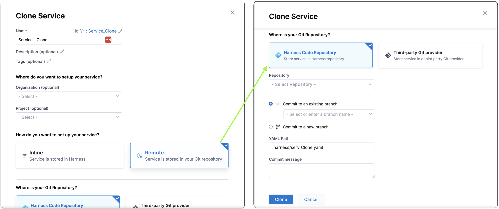

A Harness service represents what you're deploying. Services represent your microservices and other workloads. Each service contains a **Service Definition** that defines your deployment artifacts, manifests or specifications, configuration files, and service-specific variables.

Harness services are deployed to Harness environments. Select **Environments** to see the environments in this project.

Select **Services** to see the service list for your project. From this dashboard, you can create new services and monitor your existing ones.

## Video: Services

<DocVideo src="https://youtu.be/MVuzJjAzsQs" />

### Video: Services and environments at the account and org level

<DocVideo src="https://youtu.be/qU00SaLH78Q" />

## Creating services

You can create services from:

- An account
- An organization
- Within a pipeline
- Outside a pipeline

When you create a service in a pipeline, it's automatically added to **Services**. You can add the same service to as many pipelines as you need.

For more information, go to [create services](/docs/continuous-delivery/x-platform-cd-features/services/create-services).

### Creating services at an account or organization level

You can create a service at an account or organization level from the Harness UI using APIs or Terraform.

import Tabs from '@theme/Tabs';
import TabItem from '@theme/TabItem';

<Tabs>
  <TabItem value="Pipeline Studio" label="Pipeline Studio">

To create a service at an account or organization level, go to **Organization Resources** **>Services**.

Creating an account level service enables you to manage the service globally across the organizations and projects within the account.

An account level service can only reference connectors for the manifests and artifacts within the account. These services are global and cannot have dependencies at a lower hierarchy level.

Shared services can also be created and managed at account or organization levels.


:::note
When using an account level deployment stage template, you can reference an account level service only. Similarly, for organization level stage templates, you can reference organization level services only.

However, when using a deployment stage in a pipeline that has service configured as a runtime input, you can pick services from project, organization, or account levels to pass them as runtime inputs based on your RBAC.

Go to [add a stage template](/docs/platform/templates/add-a-stage-template.md) for more information.
:::

Expand the section below to see a sample account level service YAML.

<details>
<summary>Account level service YAML</summary>

```yaml
service:
  name: nginx
  identifier: nginx
  tags: {}
  serviceDefinition:
    spec:
      manifests:
        - manifest:
            identifier: nginx-base
            type: K8sManifest
            spec:
              store:
                type: Github
                spec:
                  connectorRef: account.Harness_K8sManifest
                  gitFetchType: Branch
                  paths:
                    - cdng/
                  repoName: <+input>
                  branch: main
              skipResourceVersioning: false
      artifacts:
        primary:
          primaryArtifactRef: <+input>
          sources:
            - spec:
                connectorRef: account.Harness_DockerHub
                imagePath: library/nginx
                tag: <+input>
                digest: <+input>
              identifier: harness dockerhub
              type: DockerRegistry
    type: Kubernetes
```

</details>

Expand the section below to see a sample organization level service YAML.

<details>
<summary>Organization level service YAML</summary>

```yaml
service:
  name: redis
  identifier: redis
  tags: {}
  serviceDefinition:
    spec:
      manifests:
        - manifest:
            identifier: redis
            type: HelmChart
            spec:
              store:
                type: Http
                spec:
                  connectorRef: org.bitnami
              chartName: redis
              chartVersion: ""
              subChartName: ""
              helmVersion: V3
              skipResourceVersioning: false
              enableDeclarativeRollback: false
        - manifest:
            identifier: Redis Values
            type: Values
            spec:
              store:
                type: Github
                spec:
                  connectorRef: account.Rohan_Github
                  gitFetchType: Branch
                  paths:
                    - redis/values.yaml
                  repoName: Product-Management
                  branch: main
      variables:
        - name: namespace
          type: String
          description: "namespace for the redis service"
          value: redis
    type: Kubernetes
  description: sample redis service
```

</details>

</TabItem>
  <TabItem value="API" label="API">

For information about creating a service API, go to [create a service](https://apidocs.harness.io/tag/Services#operation/createServiceV2).

The `orgIdentifier` and `projectIdentifier` field definitions are optional, and depend on where you want to create the service. For example, if you create a service at an account level, you will not need org or project identifiers in the post API call payload.

</TabItem>
  <TabItem value="Terraform" label="Terraform">

For information about creating a Harness platform service, go to [harness_platform_service (Resource)](https://registry.terraform.io/providers/harness/harness/latest/docs/resources/platform_service).

The `org_id` and `project_id` field definitions are optional, and depend on where you want to create the service. For example, if you create a service at an account level, you will not need org or project identifiers.

Expand the section below to see a sample platform service in Terraform.

<details>
<summary>Harness platform service</summary>

```hcl
resource "harness_platform_service" "example" {
  identifier  = "identifier"
  name        = "name"
  description = "test"
  org_id      = "org_id"
  project_id  = "project_id"

  ## SERVICE V2 UPDATE
  ## We now take in a YAML that can define the service definition for a given Service
  ## It isn't mandatory for Service creation
  ## It is mandatory for Service use in a pipeline

  yaml = <<-EOT
                service:
                  name: name
                  identifier: identifier
                  serviceDefinition:
                    spec:
                      manifests:
                        - manifest:
                            identifier: manifest1
                            type: K8sManifest
                            spec:
                              store:
                                type: Github
                                spec:
                                  connectorRef: <+input>
                                  gitFetchType: Branch
                                  paths:
                                    - files1
                                  repoName: <+input>
                                  branch: master
                              skipResourceVersioning: false
                      configFiles:
                        - configFile:
                            identifier: configFile1
                            spec:
                              store:
                                type: Harness
                                spec:
                                  files:
                                    - <+org.description>
                      variables:
                        - name: var1
                          type: String
                          value: val1
                        - name: var2
                          type: String
                          value: val2
                    type: Kubernetes
                  gitOpsEnabled: false
              EOT
}
```

</details>

</TabItem>
</Tabs>

### Creating services outside a pipeline

To create a service from outside of a pipeline, you use **Services** in the navigation pane.


### Creating services inside a pipeline

To create a service from inside of a pipeline, select the **Services** tab of a new CD stage, then select **New Service**.


Once the service and its service definition are saved, you can select it in any pipeline.

When you select the service in a pipeline, you can select **Edit Service** to edit its **Service Definition**.

When you create the new service you define its **Service Definition**. For example, a Kubernetes **Service Definition** with a Kubernetes manifest and Docker artifact.

## Clone Services

You can clone services across scopes i.e from one project to another, project to organization, account to project etc.

Select **More Options** (&vellip;), then select **Clone**.


Once you click on **Clone**, you will see **Clone Service** settings:

You can change the **Name**, add tags and description for this clone service.

You can change the **Organization** and **Project** where you want to clone the service.

You can choose between **Inline** and **Remote** to set up your service. Choose **Inline** when you want your service to be stored in Harness. Choose **Remote** when storing your service in a Third-party Git repository or Harness Code Repository.

To clone a remote service to an inline service, you have to specify the source branch where the remote service is stored.


To clone an inline service or remote service to a remote service, you must specify the target repository, Harness Code Repository to store the service in the Harness repository or Third-party Git provider to store the service in a third party Git provider, define the Git Connector if Third-party Git provider. Specify the Repository name, the YAML path, and the commit message.



:::info note
When you clone a service from a different organization or project, the connector referenced in the service doesn't get cloned and must be explicitly created.
:::

## Runtime inputs and expressions in services

If you use runtime inputs in your services, users will need to provide values for these when they run pipelines using these services.

If you use expressions in your services, Harness must be able to resolve these expressions when users run pipelines using these services.

Select **Runtime input** for the service.


When you run the pipeline, you can select the service for runtime inputs.


For more information on runtime inputs and expressions, go to [Fixed Values, Runtime Inputs, and Expressions](/docs/platform/variables-and-expressions/runtime-inputs/).

## Services RBAC

Go to [RBAC in Harness](/docs/platform/role-based-access-control/rbac-in-harness) for examples of RBAC use cases for services.

### Access permission is needed to deploy to a service

One of the most important advantages of services is the ability to define roles that determines who can deploy them.

In order for a role to allow deployments using services, the role must have the access permission enabled for services.


The **View**, **Create**, **Edit**, **Delete**, and **Manage** permissions enable you to deploy a service.

If a role does not have the **Access** permission for **Services**, a user or user group assigned that role cannot deploy any service.

### Restrict access to specific services for a user or user group

You can restrict a user or user group to using specific services only.

If you want to restrict a user or user group to deploy using a specific service only, do the following:

1. Create a resource group and select the service.
2. Create a role and give the user or user group permissions. The **Access** permission is needed for deployments.
3. Assign the role and resource group to the user or user group.


## Deleting a Service in Harness

For information on deleting services in Harness, go to **Deleting a Service in Harness** in [Service-based licensing and usage for CD](/docs/continuous-delivery/cd-onboarding/service-licensing-for-cd/).
