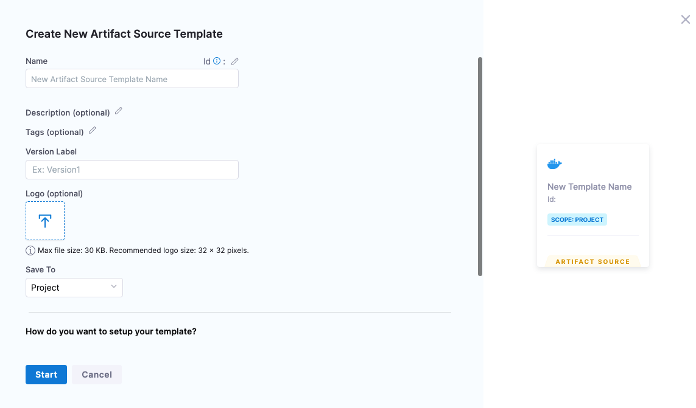
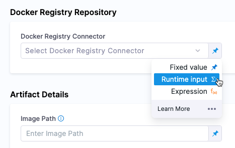
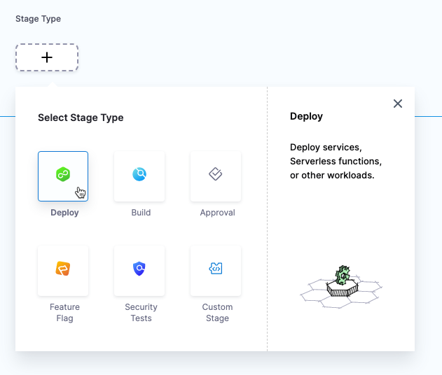
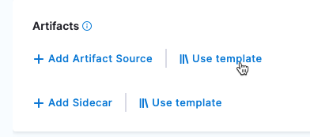
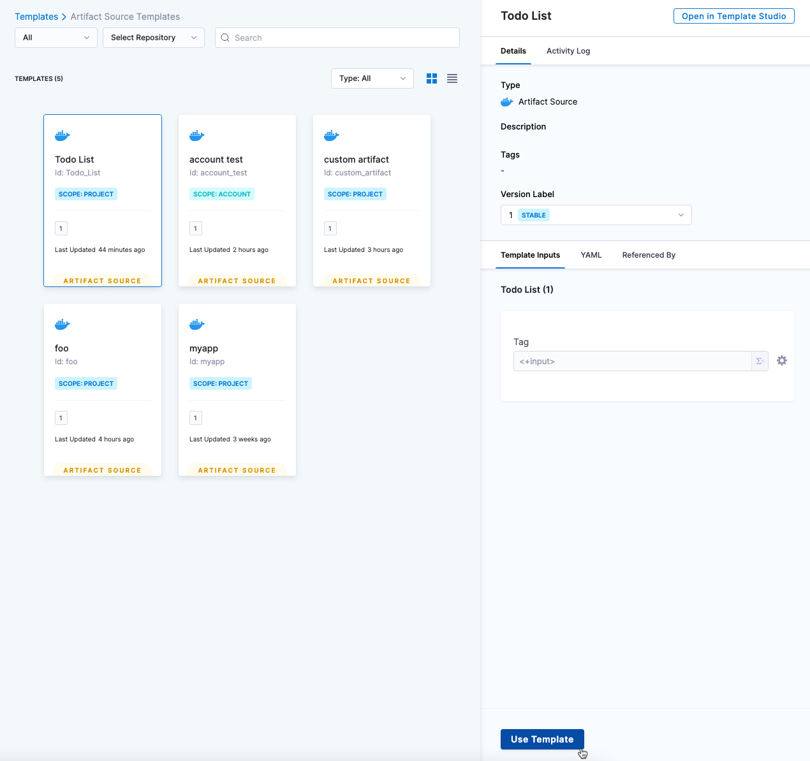

Harness templates help you standardize your pipelines for your DevOps teams. Team members can select stage, step, and other templates instead of having to create them.

An artifact source template helps you define the repositories, paths, and tags for an artifact that your team can use in Harness CD services. You can define the artifact source template and your team members can select them when they use services in their pipelines.

This topic describes how to create an artifact source template and use it in a stage template and a Harness service.


## Visual summary

<!-- Video:
https://harness-1.wistia.com/medias/yzbue8fg96-->
<docvideo src="https://harness-1.wistia.com/medias/yzbue8fg96" />


## Important notes

- Artifact source templates are not supported in pipeline triggers at this time. Support for using artifact source templates in pipeline triggers will be added soon.
- Artifact source templates cannot be stored in a remote Git repo at this time. They are stored in your Harness account.


## Artifact source template scope

You can create artifact source templates at the Harness account, org, and project levels.

Create the artifact source template at the level you want to share it. For example, if you want to share it across all services in all projects in an org, create it at the org level.

## Create an artifact source template

To create an artifact source template, do the following:

```mdx-code-block
import Tabs from '@theme/Tabs';
import TabItem from '@theme/TabItem';
```
```mdx-code-block
<Tabs>
  <TabItem value="Visual" label="Visual" default>
```
1. In a Harness project, org, or account settings, select **Templates**.
   1. Project:
      1. Select a module, such as **Deployments**.
      2. In **Project Setup**, click **Templates**.
   2. Org:
      1. Select an org.
      2. In **Organization Resources**, select **Templates**.
   3. Account:
      1. Select **Account Resources**.
      2. Select **Templates**.
2. Select **New Template**, and then select **Artifact Source**.

    The artifact source template appears.

    
3. Enter a name for the artifact source template. Use a name that describes the artifact source so that team members understand what artifact is represents.
4. In **Version Label**, enter a version for the template. You can update the version each time you change and save a template.
5. In **Logo**, upload an icon image for the template.
6. If you are creating this template at the Harness project level, in **Save To**, select where you want to save the template. For more information, go to [saving templates to project, org, or account level](#saving-templates-to-project-org-or-account-level).
7. Select **Start**.

### Artifact registry type

Harness support multiple artifact registry providers, including Google Container Registry (GCR), AWS Elastic Container Registry (ECR), and Azure Container Registry (ACR).

Harness includes a platform-agnostic artifact registry type named Docker Registry. Use Docker Registry for images on any registry, including Docker Hub.

1. Select the artifact repo provider where your images are stored.

### Repository

1. In the repository setting, select or create the Harness registry connector. For example, if you selected **Docker Registry** in **Artifact Repository Type**, the repository setting is named **Docker Registry Repository**.

For information on registry connectors, go to [connect to an artifact repo](/docs/platform/Connectors/Artifact-Repositories/connect-to-an-artifact-repo).

You can also select **Runtime input** or **Expression** for this setting.




### Artifact details

Different repository types have different **Artifact Details** settings.

For information on how to configure each repository's settings, see the examples in [Harness Kubernetes services](/docs/continuous-delivery/deploy-srv-diff-platforms/kubernetes/kubernetes-services).

### Tags

The **Value** setting in **Tags** is a runtime input. You can select the tag to use when the pipeline using this artifact source template executes.

You can also use **Regex**.

For example, if the build is `todolist-v2.0`, the regex `todolist-v\d.\d` will match.

If the regex expression does not result in a match, Harness ignores the value.

Harness supports standard Java regex. For example, if you enable **Regex** with the intent is to match a filename, the wildcard must be `.*` instead of only `*`. Similarly, if you want to match all files ending in `-DEV.tgz`, your wildcard regex phrase would be: `.*-DEV\.tgz`

```mdx-code-block
  </TabItem>
  <TabItem value="YAML" label="YAML">
```

1. In your template, select **YAML**
2. Paste the following YAML example and select **Save**:

```yaml
template:
  name: Todo List
  identifier: Todo_List
  versionLabel: "1"
  type: ArtifactSource
  projectIdentifier: CD_Docs
  orgIdentifier: default
  tags: {}
  spec:
    type: DockerRegistry
    spec:
      imagePath: harness/todolist-sample
      tag: <+input>
      connectorRef: Docker_Hub_with_Pwd

```

Note that `connectorRef` refers to the Id of a Harness connector.

```mdx-code-block
  </TabItem>
</Tabs>
```

## Saving templates to project, org, or account level

If you are creating a template at the Harness project level, in **Save To**, you can select where you want to save the template:

- **Project**: The template is saved to this project. You will see it in the **Templates** list in all of the modules in this project that support templates (Deployments, Builds, Security Tests, etc).
- **Organization**: The template is saved to the org where this project is located. The template will only appear in the **Templates** list at the org level, but the template can be selected in any project in that org.
- **Account**: The template is saved at the account level. The template will only appear in the **Templates** list at the account level, but the template can be selected in any project in the account.

If you create the template at the project level but select **Organization** or **Account** in **Save To**, the template will not appear in the **Templates** list of the project. Navigate to the **Templates** list in the org or account where you saved it to see the template.

This can be a little confusing the first time you create a template because you saved the template in a project but it doesn't appear in that project's **Templates** list. 

You will still be able to select the template in services in this project.

## Runtime inputs and expressions in template settings

**Artifact Repository Type** is the only setting in the template that must be a fixed value. The remaining settings can be runtime inputs and expressions also. 

For information on runtime inputs and expressions, go to [fixed values runtime inputs and expressions](/docs/platform/references/runtime-inputs/).

Runtime inputs can be useful in artifact source templates because they let your team members select the repository, path, and tags to use when they run pipelines using artifact source templates.

Expressions can be useful in artifact source templates because you can use default Harness expressions, like `<+stage.name>`, and service variables, like `<+serviceVariables.myapp>`, in place of the connector name and/or image path. When the pipeline using the artifact source template runs, those expressions are resolved and their related connector and/or image path is selected.


## Use artifact templates in stage templates

After creating an artifact source template, you can add it as the artifact source in stage templates.

Using stage templates with artifact source templates is useful for getting your team onboarded quickly.

Artifact sources are used in CD stages. Ensure you are using a CD stage template (**Deploy**).



To add an artifact source template to a stage template, do the following:

1. Open the stage template in Template Studio.
2. In **Service**, in **Select Service**, select **Add Service**.
3. In the new service, in **Artifacts**, select **Use template**.
   
   ![use template](./static/8818bc80c6c74f021eb456676680d3c2bb05208b033c045a8adce177ef93af55.png

4. Select the artifact source template you want to use, and then select **Use Template**.
   
   ![template selected](./static/d18f8cfaf6ad2a4e5f61e78d9d9eddff4df602507c8748463eb31c9e2339cb30.png

5. In **Configure Artifact Source**, enter a name for the artifact.
6. In **Tag**, you can change the setting to **Fixed Value**, and then select the tag to use. Or you can use a runtime input or expression.
7. Select **Apply Changes**.
   
   The artifact source template is added to the stage template.

   ![added template](./static/6d8ee2d4dc0820635512c5112bf5bb6f2ec9f806c1abedf75a71c2a869decbe9.png


## Use artifact templates in CD services

After creating an artifact source template, you can add it as the artifact source of a Harness service.

To add an artifact source template to a service, do the following:

```mdx-code-block
import Tabs2 from '@theme/Tabs';
import TabItem2 from '@theme/TabItem';
```
```mdx-code-block
<Tabs2>
  <TabItem2 value="Visual" label="Visual" default>
```

1. Select the **Deployments** module.
2. Select **Services**.
3. Select **Manage Services**.
4. Select a service.
5. Select **Configuration**.
6. In **Service Definition**, in **Artifacts**, select **Use template**.
   
   

7. Select the artifact source template you want to use, and then select **Use Template**.
   
     

8. Enter a name for template.
9.  In **Tag**, you can change the setting to **Fixed Value**, and then select the tag to use. Or you can use a runtime input or expression.
10. Select **Apply Changes**. The template is added to the service.


```mdx-code-block
  </TabItem2>
  <TabItem2 value="YAML" label="YAML">
```

1. Select the **Deployments** module.
2. Select **Services**.
3. Select **Manage Services**.
4. Select a service.
5. Select **Configuration**.
6. Select **YAML**.
7. Paste the following YAML example and select **Save**:

```yaml
service:
  name: Example K8s
  identifier: Example_K8s
  serviceDefinition:
    type: Kubernetes
    spec:
      artifacts:
        primary:
          primaryArtifactRef: <+input>
          sources:
            - name: todolist
              identifier: todolist
              template:
                templateRef: Todo_List
                versionLabel: "1"
                templateInputs:
                  type: DockerRegistry
                  spec:
                    tag: <+input>
      manifests:
        - manifest:
            identifier: manifest
            type: K8sManifest
            spec:
              store:
                type: Harness
                spec:
                  files:
                    - /Templates/deployment.yaml
              skipResourceVersioning: false
  gitOpsEnabled: false

```

You can see the artifact source template in the `artifacts` section:

```
...
            - name: todolist
              identifier: todolist
              template:
                templateRef: Todo_List
                versionLabel: "1"
                templateInputs:
                  type: DockerRegistry
                  spec:
                    tag: <+input>
...
```

```mdx-code-block
  </TabItem2>
</Tabs2>
```

## Reconcile artifact source template changes in a service

When changes are made to an artifact source template the service using the template is not automatically updated in the Harness Manager.

You can reconcile these changes by using the **Reconcile** option in the service (next to **Save**).

Once the reconcile action is initiated, the changes are available in the service.

