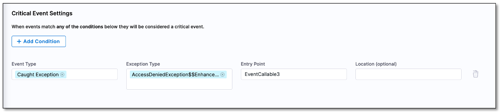

You can add a condition that specifies when an event should be marked as critical. When an event occurs and matches the condition that you set, it will be labeled as **CRITICAL** in the Events page.

## Add a condition

To add a condition:

1. In your Harness project, navigate to **Continuous Error Tracking**, expand **PROJECT SETUP**, and then select either **Tokens** or **Agents**.

2. In the top right corner of the Project Code Error Settings page, select **Critical Events**.
   
3. On the Critical Event Settings page, **+ Add Condition**.

4. Select an **event type**, **entry point**, and optional **location**.  
   
   You can choose multiple events. If you select caught exception, uncaught exception, or swallowed exception as event type, then you must also select an **exception type**.

5. Select the check mark (✔️) to save the condition. The condition is added to the conditions list on the Critical Event Settings page.

   

When an event occurs that meets the condition you specified, it is labeled as **CRITICAL** on the Events page.

   

## Delete a condition

To delete a condition:

1. On the Critical Events Settings page, locate the condition that you want to delete and select the delete icon.
