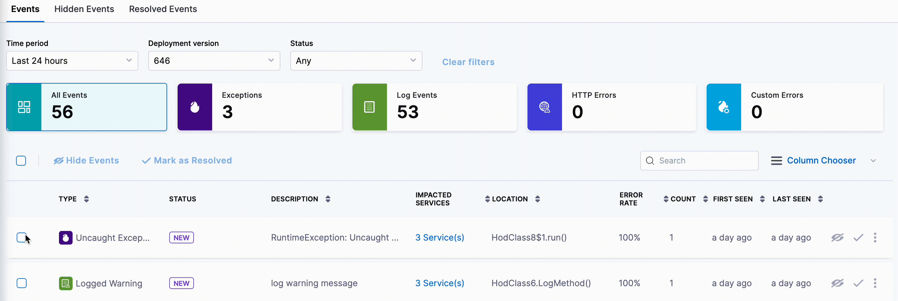

You can mark fixed issues as resolved. The resolved issues are moved from **Events** page to the **Resolved Events** page. This leaves only issues that need attention on the **Events** page.

## Mark an event as resolved

To mark an event as resolved:

1. In your Harness project, navigate to **Continuous Error Tracking** and select **Events Summary**.    
   A list of all the services monitored by Continuous Error Tracking is displayed.

2. Select a monitored service for which you want to view the events.

3. On the **Events** page, select the events that you want to mark as resolved and then select **Mark as Resolved**.  
   
   The selected events are marked as resolved and moved to the **Resolved Events** page.

   

## Resurfaced events

When an issue is marked as resolved, it only applies to that specific combination of service, environment, and deployment. If an event that was previously marked as resolved occurs again in the same service and environment, but with the same or a newer deployment, it is moved back to the **Events** page and labelled as **Resurfaced**.

The following are examples of when an event is considered resurfaced or a new one:

- Suppose an error occurred in the production environment of a particular service, it was fixed in version 1.2.0 of that service, and marked as resolved. If the error occurs again in the same production environment, but with a different version (say, 1.3.0), it will be considered as a new event and not a resolved event because it occurred in a different deployment/version. Similarly, if the same error occurs in a different environment (for example, a staging environment), it is considered as a new event and not a resolved event because it occurred in a different environment.

- Suppose the same error from the previous example (error in the production environment of a service, fixed in version 1.2.0) occurs again in the same production environment, but with a newer version of the service (for example, version 1.4.0). In this case, the error is labelled as **Resurfaced** because it occurred in the same situation as before (that is, the same service and same environment), but with a newer version.

