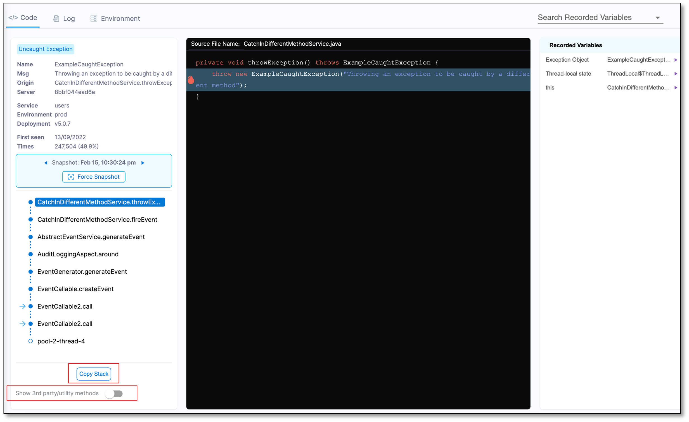

The Automated Root Cause (ARC) screen provides a powerful mechanism to get to the root of events in production and staging environments. 

To view the ARC screen, do the following:

1. On the Events List, select an event. The ARC screen for that event appears.

The ARC screen is divided into following tabs to help you create a complete picture of the event.

* Code
* Log
* Environment

## Code tab

Information displayed in the **Code** tab is divided into following categories:

### Event description

ARC displays the following information related to an event:

* Origin of the error and the error message it throws.
* Date on which the error was first identified and the number of times it appeared.
* Type of event.
* Number of times the event occurred. 
* Source code, which is a decompiled Java version of the bytecode, being executed in the JVM when the event occurred.

### Snapshot

Continuous Error Tracking captures snapshots when events, application errors (exceptions), and logs (warnings and errors) occur according to a defined algorithm.

A Continuous Error Tracking snapshot contains valuable information about events in the monitored application. This includes:

* Date and time of the snapshot
* The server and application where the event occurred
* The deployment where the event was captured
* The full call stack
* The source code

### Forced snapshot

You can use the **Force Snapshot** option to take a snapshot the next time the same event occurs.

### Call stack

To understand and resolve errors, it is important to be able to trace their path through the code. The ARC screen provides a comprehensive call stack trace, covering the entry point to the method in which the event occurred, even if the source code spans across multiple machines.

Continuous Error Tracking enables tracing of the code and variable state associated with the event all the way back to the initiation point, where the parameters were passed. If the event involves calls across multiple machines, ARC displays a unified call stack. 

Select a method in the call stack to see its source code.

The call stack displays the chain of methods within the environment leading up to the event. The first method in the line is the last method on a non-third party code within your application.

When an exception is caught and re-thrown once or multiple times within the thread, the **Related Errors** dropdown displays the error analysis. This feature is available only when such exceptions exist.

### Third party utilities and methods

At the bottom of the stack, the machine name and the environment thread name in which the error occurred are displayed. By default, the third party code is hidden. To display the third party code, turn on the **Show 3rd party/utility methods** option. To copy the full stack to the clipboard, select **Copy Stack**.

### Source code

The source code pane displays a decompiled Java version of the bytecode being executed within the JVM when the event occurred. The row in which the event occurred is highlighted.

### Object and variable state

The **Recorded Variables** section displays the variable values and objects accessible from the method. It displays all the local variables and parameters including `this` in the non-static methods. The first method also contains thread-local variables defined for this thread as well as SLF4J and Log4J Mapped Diagnostics Context (MDC) values. The MDC objects are often too large for the full set of data to be available in the log. However, the Error Tracking Agent is capable of capturing and recording the entire object.

In some scenarios, such as asynchronous message passing, the MDC objects contain a key-value map of the recorded requests, initial servlet information, and much more. However, back tracing the source of a bad request in an asynchronous environment is a known challenge. Continuous Error Tracking helps you overcome this challenge by providing extended visibility into MDC.

The choice of the collected variables most relevant within an allocated timeframe is determined by the Error Tracking Agent using an adaptive machine learning algorithm. The selection process is based on which and how many variables to collect, the number of items to collect, the length of string to capture, and so on.

## Log tab

The **Log** tab displays the last 250 log statements leading up to the event. The log statements are collected directly from the JVM/CLR memory. This ensures that the DEBUG, TRACE, and INFO statements are visible even when they are not logged to a file.  

In the **Log** tab, the error or exception lines are displayed first, followed by the stack trace. It also displays the context of the event, by highlighting the beginning of the relevant transaction in which the event occurred.

### Log level

* Logback: TRACE level and up
* Log4j/Log4j2: According to the user's config

:::info note
Log4j2 allows you to create custom log levels and names. However, Continuous Error Tracking reports only on log levels that are less than or equal to 300.
:::

### Missing log statements

The table below describes the various missing log statements you may come across in the **Log** tab.

| Message                                                                                                                                                                                | Cause                                    |
| :------------------------------------------------------------------------------------------------------------------------------------------------------------------------------------- | :--------------------------------------- |
| This snapshot was taken before log views were introduced. Please try viewing a more recent snapshot.                                                                                   | The snapshot is out-of-date.             |
| No log messages have been recorded for this snapshot.                                                                                                                                  | No Log messages were detected.           |
| Log view is not available due to Storage Server error at the time of this snapshot. Please check storage server connectivity and status                                                | Storage server error.                    |
| No supported Logging framework was detected. Check out our documentation for supported frameworks list                                                                                 | Supported log provider was not detected. |
| Ooops, something went wrong… An error has occurred while recording log messages for this snapshot. Please try viewing another snapshot.                                                | Cerebro exception or Unknown error.      |
| No log messages were detected for current entry point. This might also occur during new event initialization - in this case log messages will be captured starting from next snapshot. | Context or transaction data is missing.  |

## Agent & Host Environment tab

The **Agent & Host Environment** tab displays the internal environment state when the event occurred. This includes memory usage (heap and non-heap), basic system information, CPU usage, and so on.

