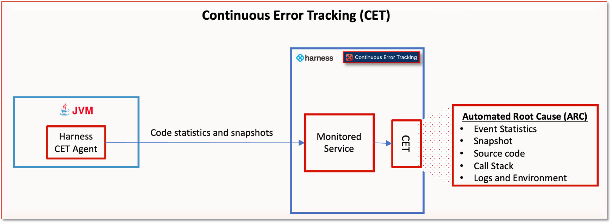

# Continuous Error Tracking overview

Harness Continuous Error Tracking (CET) is a developer first observability solution that enables developers to identify, triage, and resolve errors in applications. This helps in implementing rapid code changes by ensuring that the code is always in a deployable state.

With the increase in release velocity, the risk to code quality also increases. Using Harness Error Tracking, as a developer, you can:

* Quickly identify and address any critical issues during each release with real-time notifications sent to email and Slack channels - ensuring that the right people can make the right decisions fast.
* Deepen understanding of your Java applications in all environments, from production to development, testing, and staging, through code level visibility.
* Automate issue root cause analysis at runtime, eliminating the need for manual log analysis to identify critical errors.
* Quickly and accurately identify and fix detected issues with Automated Root Cause Analysis (ARC) screen, leveraging source code, variable values, environment state of the host/container, and DEBUG level logs to get the full context.
* Integrate the ARC screen with existing tools including APMs, log analyzers, and issue tracking software.

CET consists of an Error Tracking Agent that runs on a Java Virtual Machine (JVM). It monitors the Java applications for run-time exceptions, log events, and the custom events that you set up. When an exception or an event occurs, the Agent sends the statistics and snapshots to a monitored service on Harness CET. CET analyzes the data using Machine Learning (ML) and provides deep insights via comprehensive dashboards such as the Event List and ARC.

## Further reading

- [Tutorials](https://developer.harness.io/tutorials/error-tracking)
- [Supported platforms and technologies](https://developer.harness.io/docs/getting-started/supported-platforms-and-technologies/#service-reliability-management)

## Next steps

[Install and setup Continuous Error Tracking](./cet-setup.md).
