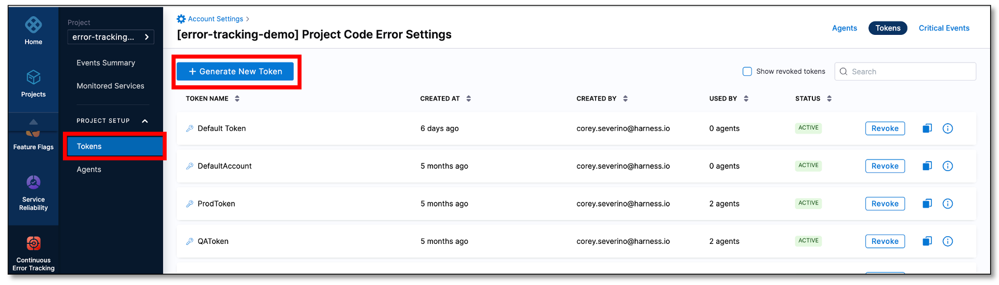
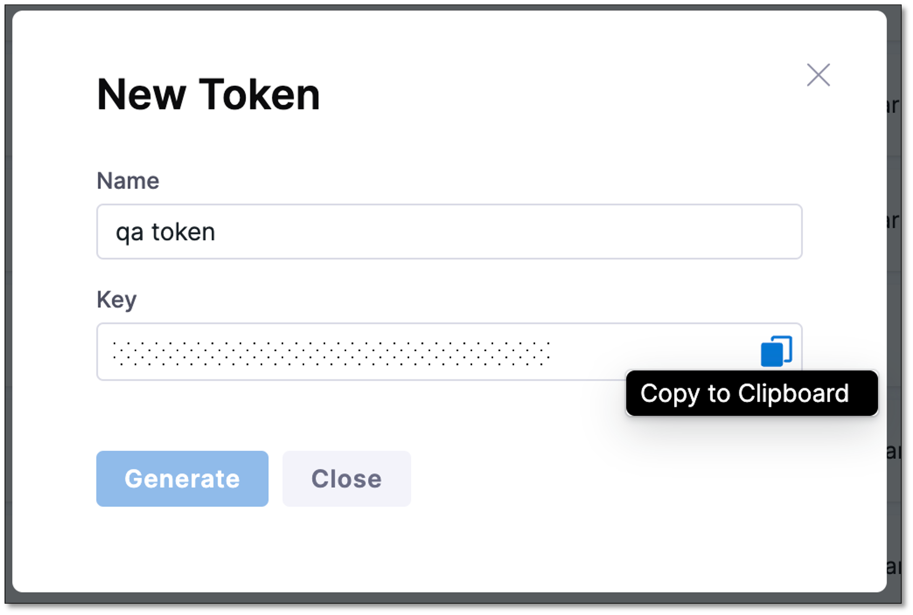

# Set up Continuous Error Tracking (CET)


This topic describes how to add a monitored service in Harness and install an Error Tracking Agent on a JVM to identify and troubleshoot faults and exceptions in your code.


## Add a monitored service

A Harness Monitored Service is a combination of service and environment. Harness monitors the following via a monitored service:

* Code-level exceptions and errors from the data collected by the Error Tracking Agent.
* Changes such as deployments, incidents such as PagerDuty, and infrastructure changes such as Kubernetes events and auditing.
* Health trend deviations using logs and metrics obtained from the APM and logging tools.

The following steps explain how to create a monitored service, and define service and environments for tracking code errors and exceptions:

1. In your Harness project, navigate to the **Continuous Error Tracking** module, and then select **Monitored Services**.

2. Select **+ New Monitored Service**.

   The Create New Monitored Service page appears.

3. Select a service. A Service represents your microservices and other workloads. To add a new service:

    1. Select **+ Add New**.
    2. In the New Service dialog, enter a **name** for the service, optional **tag**, and optional **description**, and then select **Save**.

4. Select an environment where the Harness Service is deployed (QA, prod, and so on). To create a new environment:
    1. Select + Add New.
    2. In the Create Environment dialog, enter a name for the new environment, select an environment type such as production or pre-production, and then select **Save**.

   Harness auto creates the monitored service name by combining the service and environment names that you have entered.

5. Select **Save**.

   The new monitored service appears on the Monitored Services page.


## Create a token for the Error Tracking Agent

To create a token, do the following:

1. Expand **PROJECT SETUP** and then select **Tokens**.

2. On the Code Error Settings page, select **Generate New Token**.

     

3. In the New Token dialog, enter a name for the token and select **Generate**.

   A new authentication token is generated and displayed in the **Key** field.

4. Copy the token to clipboard. This token is used in the Error Tracking Agent configuration file.

    

5. Select **Close**.

   The newly created token is added to the list of tokens.

:::info note
You can copy the token anytime by selecting the clipboard icon.
:::


## Install an Error Tracking Agent

The Harness Error Tracking Agent must be installed on a Java application to capture application code and variables. This native agent library is attached to the Java Virtual Machine (JVM)/Common Language Runtime (CLR) during runtime. It can be deployed into any Kubernetes container without altering the image. The Agent fingerprints the program code loaded into the JVM/CLR and captures the complete state of the code and the host/container in order to identify anomalies.

This topic provides details about:

* Compatibility and requirements to install an Error Tracking Agent.
* Steps to install an Error Tracking Agent on a Java Application.


### Compatibility and Requirements

To learn about supported operating systems, Java Virtual Machine (JVM), and JVM containers, go to [Continuous Error Tracking Agent compatibility](/docs/continuous-error-tracking/whats-supported).


### Install an Error Tracking Agent

Depending on your setup and needs, there are multiple ways to install and deploy an Error Tracking Agent on a Java application. You can install the Agent to monitor your application in the following ways:

* As a standalone installation outside Harness.
* By modifying your Docker image.
* Using an init container.

If you have additional agents running on your application, the Error Tracking Agent should appear at the end of the VM arguments list before specifying the main class or jar.


import Tabs from '@theme/Tabs';
import TabItem from '@theme/TabItem';

<Tabs>
  <TabItem value="Standalone" label="Standalone" default>

This option lets you install the Error Tracking Agent as a standalone. Perform the following steps to install the Agent:

1. [Download](https://get.et.harness.io/releases/latest/nix/harness-et-agent.tar.gz) the latest version of the Agent for Linux.

2. Extract this version to a folder of your choice. For example`/home/user`. The contents of the archive will be inside a folder named Harness. You'll require the path to the Agent when starting your application. An example for the Agent path would be, `/home/user/harness/lib/libETAgent.so`.

3. Add JVM arguments which instruct the JVM to load the Agent.

  This is done by adding `-agentpath:/home/user/harness/lib/libETAgent.so` to the application startup. For example:

    `java -agentpath:/home/user/harness/lib/libETAgent.so -jar yourapp.jar`.

  This parameter can also be specified using `JAVA_TOOL_OPTIONS`. For example:

    `export JAVA_TOOL_OPTIONS=-agentpath:/home/user/harness/lib/libETAgent.so`.

4. Set the Agent environment variables so that your application can map to a Harness Service.

  | **Required Environment Variable** | **Description** | **Example** |
| --- | --- | --- |
| `ET_COLLECTOR_URL` | URL to the Error Tracking collector. | `https://collector.et.harness.io/prod1`|
| `ET_APPLICATION_NAME` | Name of your application or Service. | `myapp` |
| `ET_DEPLOYMENT_NAME` | Deployment or version number of your application or Service. When your application or Service is updated to a new version, it's recommended that you update this variable as well, so that the Error Tracking Agent can identify when new errors are introduced. | `1` |
| `ET_ENV_ID` | ID of your Harness Environment. | `production` |
| `ET_TOKEN` | ET Agent Token created on Harness. | `b34*****-****-****-****-***********42a` |

  For example:

```
ENV ET_COLLECTOR_URL=https://collector.et.harness.io/prod1/
ENV ET_APPLICATION_NAME=yourapp
ENV ET_DEPLOYMENT_NAME=1
ENV ET_ENV_ID=env1
ENV ET_TOKEN=b34*****-****-****-****-***********42a
```

5. Restart your application after installing the Error Tracking Agent.


</TabItem>
<TabItem value="Docker image" label="Docker image">

This option uses a Dockerfile to copy an Error Tracking Agent to the Docker image at build time. When your Java application is running using Docker, perform the following steps to install the Agent:

1. Download and extract the Agent in your Dockerfile. For example:
```
RUN wget -qO- https://get.et.harness.io/releases/latest/nix/harness-et-agent.tar.gz | tar -xz
```
2. Set the Agent environment variables in the Dockerfile.

  | **Required Environment Variable** | **Description** | **Example** |
| --- | --- | --- |
| `ET_COLLECTOR_URL` | URL to the Error Tracking collector. | `https://collector.et.harness.io/prod1` |
| `ET_APPLICATION_NAME` | Name of your application or Service. | `myapp` |
| `ET_DEPLOYMENT_NAME` | Deployment or version number of your application or Service. When your application or Service is updated to a new version, it's recommended that you update this variable as well, so that the Error Tracking Agent can identify when new errors are introduced. | `1` |
| `ET_ENV_ID` | ID of your Harness Environment. | `production` |
| `ET_TOKEN` | ET Agent Token created on Harness. | `b34*****-****-****-****-***********42a` |

  For example:
```
ENV ET_COLLECTOR_URL=https://collector.et.harness.io/prod1
ENV ET_APPLICATION_NAME=yourapp
ENV ET_DEPLOYMENT_NAME=1
ENV ET_ENV_ID=env1
ENV ET_TOKEN=b34*****-****-****-****-***********42a
```
1. Add JVM arguments to the Docker image, which instructs the JVM to load the Agent. This is done by adding `agentpath:/harness/lib/libETAgent.so`to the application `ENTRYPOINT`. For example, `ENTRYPOINT java -agentpath:/harness/lib/libETAgent.so -jar yourapp.jar`. This parameter can also be specified using `JAVA_TOOL_OPTIONS`, for example `ENV JAVA_TOOL_OPTIONS="-agentpath:/harness/lib/libETAgent.so"`.
2. Once the Dockerfile is updated, rebuild the Docker image and restart any containers running on it to start monitoring using Error Tracking.

```
 FROM openjdk:8-jre
ENV JAVA_TOOL_OPTIONS="-agentpath:/harness/lib/libETAgent.so"
ENV ET_COLLECTOR_URL=https://collector.et.harness.io/prod1/
ENV ET_APPLICATION_NAME=yourapp
ENV ET_DEPLOYMENT_NAME=1
ENV ET_ENV_ID=env1
ENV ET_TOKEN=b34*****-****-****-****-***********42a
RUN wget -qO- <https://get.et.harness.io/releases/latest/nix/harness-et-agent.tar.gz> | tar -xz
ENTRYPOINT java -jar yourapp.jar
```

</TabItem>
<TabItem value="Init container" label="Init container">

When your Java application is running on Kubernetes, you can use an init container to automatically install the Agent at runtime without changing the existing images. The image is publicly hosted in [Docker Hub](https://hub.docker.com/r/harness/et-agent-sidecar).

Consider the following Kubernetes deployment example for a Java application:

```
kind: Deployment
spec:
  template:
    spec:
      volumes:
        - name: et-agent
          emptyDir: {}
      initContainers:
        - name: init-et-agent
          image: harness/et-agent-sidecar
          imagePullPolicy: Always
          volumeMounts:
            - name: et-agent
              mountPath: /opt/harness-et-agent

      containers:
        - name: my-javaapp-container
          image: my-javaapp-image
          env:
            - name: JAVA_TOOL_OPTIONS
              value: "-agentpath:/opt/harness-et-agent/harness/lib/libETAgent.so"
            - name: ET_COLLECTOR_URL
              value: "https://collector.et.harness.io/prod1/"
            - name: ET_APPLICATION_NAME
              value: my-javaapp
            - name: ET_DEPLOYMENT_NAME
              value: 1
            - name: ET_ENV_ID
              value: production
            - name: ET_TOKEN
              value: b34*****-****-****-****-***********42a
          volumeMounts:
            - name: et-agent
              mountPath: /opt/harness-et-agent
```

By using a shared volume, the init-container executes and installs the harness-et-agent in the path `/opt/harness-et-agent`. This installation is then mounted into the target container `my-javaapp-container` using the volume mount. To properly configure and optimize the functionality of the Agent, ensure to set the variables listed in the following table:

| **Required Environment Variable** | **Description** | **Example** |
| --- | --- | --- |
| `JAVA_TOOL_OPTIONS` | JVM Option which instructs the JVM to load the Agent at the mounted volume location. | `-agentpath:/opt/harness-et-agent/harness/lib/libETAgent.so` |
| `ET_COLLECTOR_URL` | URL to the Error Tracking collector. | `https://collector.et.harness.io/prod1` |
| `ET_APPLICATION_NAME` | Name of your application or Service. | `my-javaapp` |
| `ET_DEPLOYMENT_NAME` | Deployment or version number of your application or Service. When your application or Service is updated to a new version, it's recommended that you update this variable as well, so that the Error Tracking Agent can identify when new errors are introduced. | `1` |
| `ET_ENV_ID` | ID of your Harness Environment. | `production` |
| `ET_TOKEN` | ET Agent Token created on Harness. | `b34*****-****-****-****-***********42a` |

If the agent is already installed as part of your docker image, simply set the corresponding environment variables without the need of an init container.

  </TabItem>
</Tabs>

:::info note

If you are using the Self-Managed Enterprise Edition, make sure to set the ET_COLLECTOR_URL to your Load Balancer URL. For instance, if your Helm value is `loadbalancerURL: https://example.harness.io/`, then set the `ET_COLLECTOR_URL` as `ET_COLLECTOR_URL=https://example.harness.io/et-collector`.

:::

## Verify Agent connection

After installing Error Tracking Agent, you should verify that it is connected to Harness. To verify the Error Tracking Agent connection, do the following:

1. Expand **PROJECT SETUP** and then select **Agents**.

    A comprehensive list of Error Tracking Agents is displayed along with the information such as service name, environment, deployment version, Agent version, Agent status, token name, and so on. Ensure that the Agent that you installed is listed, and the status is **CONNECTED**.


## Next steps

Identify and prioritize error events using [Events dashboard](./cet-event-dashboard.md).
