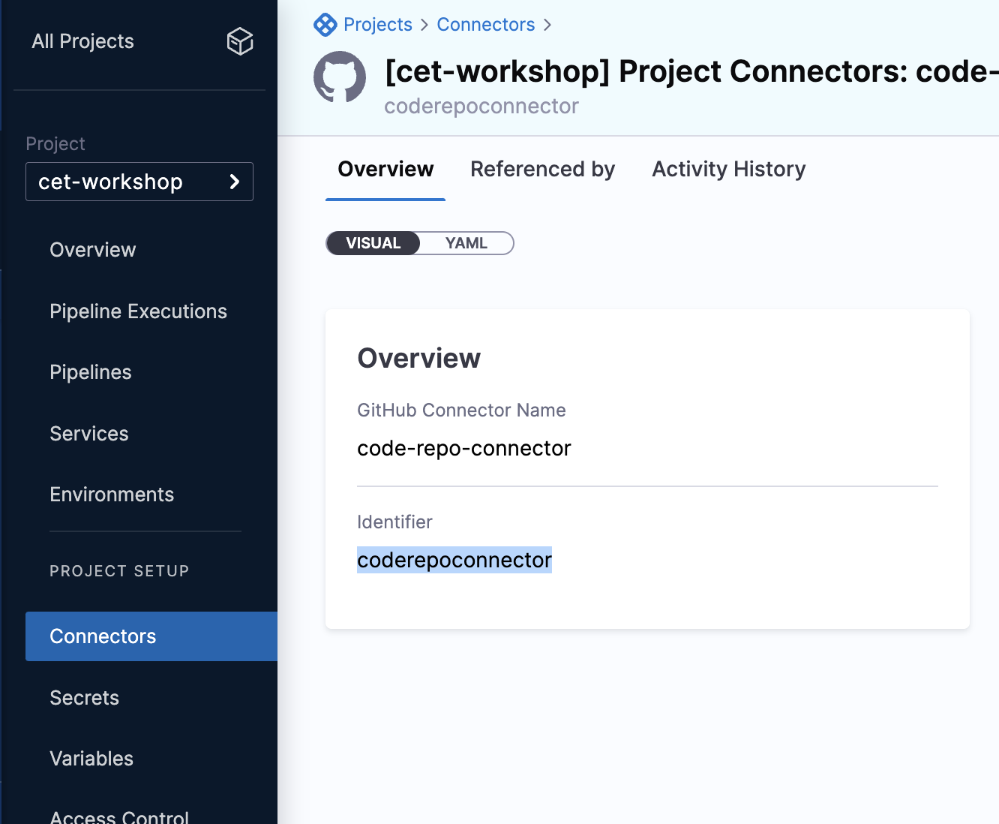
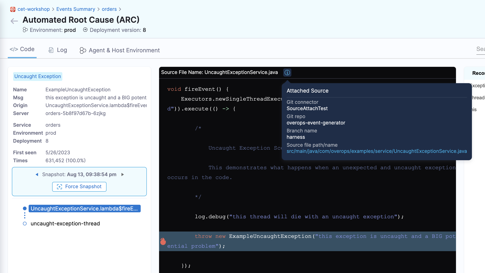

# Connect your source code


Learn how to connect your code repository to the monitored service. Help your developers access the code repository, branch, and commits corresponding to the errors for efficient code change tracing.


## Prerequisites

* You must have an agent configured. 
* Setup a **Connector** for the code repository you intend to track. If you do not have a code repository connector, then go to  [Setup Connector](/platform/7_Connectors/Code-Repositories/connect-to-code-repo.md).


## Set up Source Attach


1. Get the code connector id.
    
    1. Navigate to **Connectors** under the **Projects**.

    2. Select the connector you intend to use.

    3. Copy the identifier.

        


2. Add the following Agent environment variables so that your code repository can map to the service you want to track.

  | **Required Environment Variable** | **Description** | **Example** |
| --- | --- | --- |
| `ET_REPOSITORY_CONNECTOR_ID` | ID for the code repository conenctor you created | `coderepoconnector`|
| `ET_REPOSITORY_COMMIT` | CommitHashOrReleaseTag for the code you are want to track. Note that commit and branch both are not required. Only one of them is required. If both fields are provided, then commit takes a higher priority. | `12a69d4c668ce126fc104f4d58f3d7ed85403v1h`|
| `ET_REPOSITORY_BRANCH` | Name of the branch you are tracking | `pre-prod` |
| `ET_REPOSITORY_SOURCES_ROOT` | Requires a reference to the repository name; optionally, you can provide additional paths to prepend to the file you want to track | `event-generator/tree/harness/src/main/java` |

  For example:

```
ENV ET_COLLECTOR_URL=https://collector.et.harness.io/prod1/
ENV ET_APPLICATION_NAME=yourapp
ENV ET_DEPLOYMENT_NAME=1
ENV ET_ENV_ID=env1
ENV ET_TOKEN=b34*****-****-****-****-***********42a
ENV ET_REPOSITORY_CONNECTOR_ID=coderepoconnector
ENV ET_REPOSITORY_BRANCH=pre-prod
ENV ET_REPOSITORY_SOURCES_ROOT=event-generator/tree/harness/src/main/java
```

3. Restart your application after installing the Error Tracking Agent.

4. Navigate to the ARC Screen by selecting an event on the Event Summary page. Clicking on the repository URL takes you to the code repository.

    
