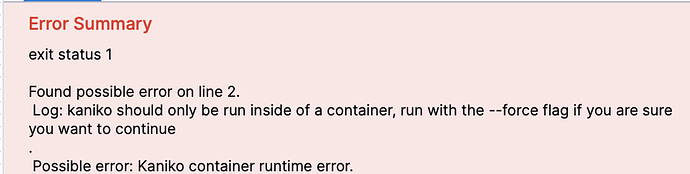
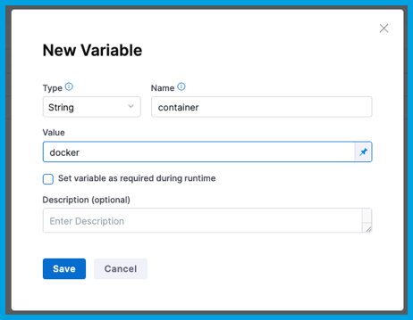

# Kaniko container runtime error when pushing to a Docker registry

## Conditions

* Module: Harness CI
* Environment:
   * Infrastructure: Kubernetes
   * OS: Linux
* Stage: Build
* Step: Build and Push

## Problem

While building and pushing an image to a Docker registry, you get a `kaniko container runtime error`, such as:

```
kaniko should only be run inside of a container, run with the --force flag if you are sure you want to continue
exit status 1
```



## Solution

This error can be resolved by adding a Docker container environment variable. To do this, add a [stage variable](/docs/continuous-integration/use-ci/set-up-build-infrastructure/ci-stage-settings#advanced-stage-variables) named `container` with the value `docker`.

You can [add stage variables](/docs/platform/pipelines/add-a-stage#stage-variables) in the Build stage settings, in the YAML editor, or in the pipeline's **Variables** list.

To add a variable to the pipeline's variables list:

1. Select **Variables** on the right side of the Pipeline Studio.

   

2. Locate the stage where you have the **Build and Push** step.
3. Next to **Stage Variables**, select **Add Variable**, and configure the variable as follows:

   * Type: String
   * Name: `container`
   * Value: `docker`

   

4. Select **Save**.
5. Select **Apply Changes**.
