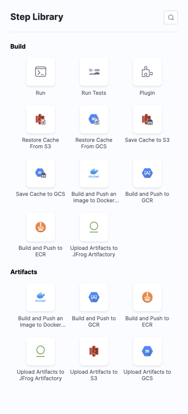

This topic covers basic terminology and concepts related to CI pipelines. For general Harness Platform terminology and concepts, go to [Harness key concepts](../../getting-started/learn-harness-key-concepts.md).

## Pipelines

A CI pipeline is an end-to-end integration workflow that, in its simplest form, pulls a codebase, builds an artifact, and then uploads the artifact to storage or a registry such as DockerHub, Google Cloud Registry, JFrog Artifactory, and many others.

You can run a pipeline manually or set up triggers to automatically run it on a schedule or when an event occurs, such as a Git merge in your codebase.

Pipelines are comprised of stages and steps.

### Stages

A CI stage is a subset of a pipeline that contains one major segment of the CI workflow. A **Build** stage includes steps for building, pushing, and testing your code. The codebase included in the first stage in a pipeline can be shared with later stages. This reduces redundancy and simplifies pipeline creation. For more information, go to [CI stage settings](../ci-technical-reference/ci-stage-settings.md).

All stages have a designated build infrastructure. For a comparison of build infrastructure options, go to [Which build infrastructure is right for me?](../use-ci/set-up-build-infrastructure/which-build-infrastructure-is-right-for-me.md)

### Steps

A stage contains one or more steps. Each step is a series of commands that perform a task. For example, A **Build and Push** step builds an image and pushes it to a cloud repo, a **Run** step runs a series of shell commands, and so on.

When a pipeline runs, it creates a temporary volume called a *workspace*. The **Build** stage clones your codebase to the root of the Workspace and runs steps inside the root. The workspace persists for the lifetime of the stage and enables individual steps to communicate and share state information.

Harness CI includes an extensive Step Library for common CI tasks: building artifacts, uploading to cloud repos, running tests, and so on.

## Shared Path

You can use shared paths (`sharedPaths`) in a stage to share data across steps. By default, all steps in a stage use the same workspace to share data. The default shared working directory for a stage is `/harness`. For example, the Maven `m2` repo is stored in `/root/.m2` by default, and you can specify this same path when using the Maven install in a later stage in the same pipeline.

If you need to share additional volumes, you can add shared paths.

## Dependent and background services

If you decide to split your pipeline into multiple stages, you need to make sure each stage has access to any dependencies. An example of a use case for background services is when your unit tests require a running Redis server. Background services can run in an isolated container or on the host. For information about configuring and calling background services, go to [Background step settings](../ci-technical-reference/background-step-settings.md).

## Plugins

Plugins perform predefined tasks, such as deploying code, publishing artifacts, sending notifications, and more. They are configured as steps in your CI pipelines.

Docker Plugins are Docker containers that perform predefined tasks and run in **Plugin** steps. The Drone community maintains an [extensive plugin library](https://plugins.drone.io/) for specific CI workflows. You can customize and extend your build processes using existing plugins or [write your own plugins](https://harness.io/blog/continuous-integration/write-first-plugin-for-cie/).

For more information, go to [Use Plugins](/docs/category/use-plugins/), [Plugin step settings](../ci-technical-reference/plugin-step-settings-reference.md), and [Run a Drone plugin in CI](../use-ci/use-drone-plugins/run-a-drone-plugin-in-ci.md).

If you're using Harness Cloud build infrastructure, you can also use the [GitHub Action plugin step](../ci-technical-reference/ci-github-action-step.md) and [Bitrise plugin step](../ci-technical-reference/ci-bitrise-plugin.md) to run GitHub Actions and Bitrise Integrations in your CI pipelines.

## Caching

Caching expedites job execution by reusing data from expensive fetch operations that ran in previous jobs. You can also use caching to share data across stages. For example, you can use **Save Cache** and **Restore Cache** steps to save a cache to a cloud storage bucket and restore it later. For more information, go to [Share and cache CI data](/docs/category/share-and-cache-ci-data).

### Remote Docker layer caching

Harness enables remote Docker layer caching where each Docker layer is uploaded as an image to a Docker repo you identify. If the same layer is used in subsequent builds, Harness downloads the layer from the Docker repo. You can also specify the same Docker repo for multiple **Build and Push** steps, enabling them to share the same remote cache. This can dramatically improve build time by sharing layers across pipelines, stages, and steps.

## Artifact repos

Harness CI offers popular object storage options such as JFrog, Amazon S3, and Google GCS where you can push your artifacts. Object storage repos are configured as **Upload Artifacts** steps in your pipelines.

## Services

A service represents your microservices, Serverless functions, and other workloads logically. You can deploy, monitor, or change each service independently.

## Service definition

When you add a service to a stage, the service definition represents the real artifacts, manifests, and variable settings of that service. You can propagate or override a service in later stages of the pipeline.

## Infrastructure definitions

Infrastructure definitions represent the build infrastructure used by a CI pipeline: the target clusters, hosts, and so on. Build infrastructure components and specifications depend on the build infrastructure you choose. For more information, go to [Which build infrastructure is right for me?](../use-ci/set-up-build-infrastructure/which-build-infrastructure-is-right-for-me.md)

## Connectors

Connectors contain the information necessary to integrate and work with third-party tools, such as Git providers and artifact repos. For example, a GitHub connector authenticates with a GitHub account and/or repo and fetches files as part of a deploy stage. Harness uses connectors at pipeline runtime to authenticate and run operations in external tools.

Connectors require different permissions depending on your build environment and the tasks your pipeline performs. For example, if your pipeline builds and pushes an image to Docker Hub, you need a connector that can connect to the Docker Hub repo and push images.

## Delegates

The Harness Delegate is a software service you install in an environment, such as a Kubernetes cluster, that connects to the Harness Manager and performs tasks using your container orchestration platforms, artifact repositories, monitoring systems, and so on.

The Delegate uses the credentials set up in the connectors used by the pipeline to perform deployment tasks. Additionally, the Delegate needs permissions in the target environment to execute build tasks. These permissions are granted in the Delegate config file or the environment account you use when installing the Delegate.

## Variables

You can add and reference custom variables in pipelines and stages. They're available across the pipeline. You can propagate and override their values in later stages.

## Triggers

You can run your pipelines manually or use triggers to initiate their execution. You can trigger a pipeline based on Git commits and pull requests, schedules, and so on.

## Tests

In a CI pipeline, you can run a variety of tests, such as integration tests, functional tests, and unit tests.

### Test Intelligence

Test Intelligence speeds up your test cycles by running only the unit tests required to confirm the quality of the code changes that triggered a build. You can easily see the code changes and gaps in your unit test plan. Test Intelligence also identifies negative trends and provides actionable insights to improve quality. For more information, go to [Test Intelligence overview](test-intelligence-concepts.md).

## CI Overview

The CI Overview provides a high level view of all your builds, regardless of status (successful, failed, cancelled, or expired) and the percentage of successful builds for individual codebases. You can easily see where your builds have failed and drill down into specific builds to troubleshoot and analyze the root causes.

## Advanced settings

Pipelines, stages, and steps have advanced settings to control the flow of operations.

### Inputs and Overlays

Harness Input Sets are collections of runtime inputs for a pipeline run. Overlays are groups of Input Sets. Use Overlays to provide multiple Input Sets when you run a pipeline.

With Input Sets and Overlays, you can use the same pipeline for multiple scenarios. You can define each scenario in an Input Set or Overlay, and then select the appropriate scenario at runtime.

### Conditional Executions

Use conditional execution settings to specify when a stage or step should run. For example, you can specify that a particular stage should run only if the prior pipeline or stage failed.

You can specify conditional execution settings for an entire stage and for individual steps. A stage's conditional execution settings apply to all steps in that stage that don't have their own step-level conditional execution settings. A step's conditional execution settings overrides the stage's conditional execution settings.

### Failure Strategies

Failure strategies define how your stages and steps handle different failure conditions.

Each failure strategy is comprised of the following:
* Error conditions that trigger the failure strategy.
* Actions to take when the specified error conditions occur.

Failure strategies are a critical pipeline design component that determine what causes a stage or step to fail and what to do when a failure occurs.
