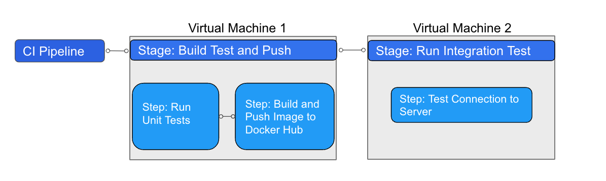

Harness offers hosted virtual machines (VMs) to run your builds. With Harness Cloud, you can build your code worry-free on infrastructure that Harness provides. You don't have to spend time and effort to maintain build infrastructure; you can focus on developing great software instead.

When executing a pipeline on the Harness Cloud, your builds run on VMs that contain an environment of tools, packages, and settings so you can start building and testing your applications in no time.

Hosted builds provide the following advantages:

* Get free monthly credits for up to 2,000 build minutes.
* Get started quickly with starter pipelines for different programming languages.
* Run blazing fast builds.
* Run anywhere. Use hosted runners to run your builds on Linux, Windows\*, or MacOS\*.  
\* Support for Windows and MacOS is coming soon.

[Sign up now](https://harness.io/products/continuous-integration) to get started.

When a pipeline is executed, Harness executes each of its CI stages in a new ephemeral VM.

All steps in the stage execute on the VM, allowing the steps in that job to share information using the underlying filesystem. You can run CI steps either directly on the VM or in a Docker container. When the job is finished, the VM is automatically terminated.

The following example YAML file shows a pipeline with one CI stage that contains a Run step executing an Echo command. The Platform property is used to define the target machine where the stage will be executed.


```
 pipeline:  
  projectIdentifier: Docs  
  orgIdentifier: default  
  identifier: Hello_World  
  name: Hello World  
  properties:  
    ci:  
      codebase: // The codebase section is needed if the stage is set to automatically clone the codebase.   
        connectorRef: account.Github // The git connector holds your Docker credentials. It's needed to pull the image from Docker.   
        repoName: keen-software/jhttp   
        build: <+input>  
  stages:  
    - stage:  
        name: Print welcome message  
        identifier: welcome_message  
        type: CI  
        spec:  
          cloneCodebase: true  
          platform: // Platform properties are used to describe the target machine that is needed for the execution of the CI stage.  
            os: Linux   
            arch: Amd64   
          runtime:  
            type: Cloud // To run the build on infrastructure provided by Harness.   
            spec: {}  
          execution:  
            steps:  
              - step:  
                  type: Run  
                  name: Welcome  
                  identifier: Welcome  
                  spec:  
                    connectorRef: my_dockerhub // (Optional) The Docker connectors hold your Docker credentials. It's needed to pull the image from Docker.   
                    image: alpine // (Optional) If the image isn't provided, the step will run directly on the host machine,   
                    shell: Sh  
                    command: Echo "Welcome to Harness CI"
```
