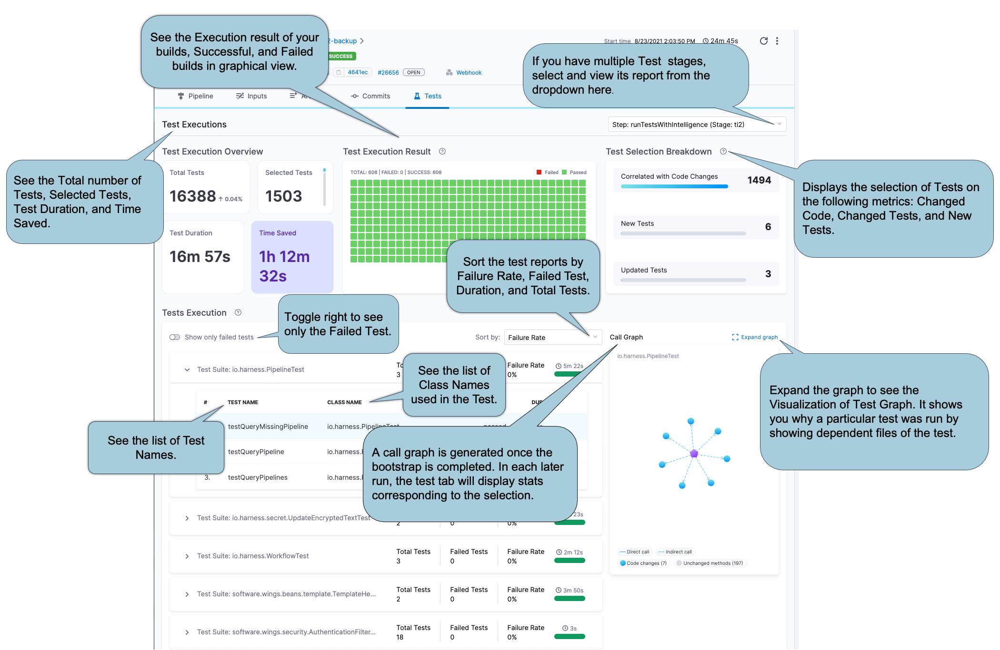
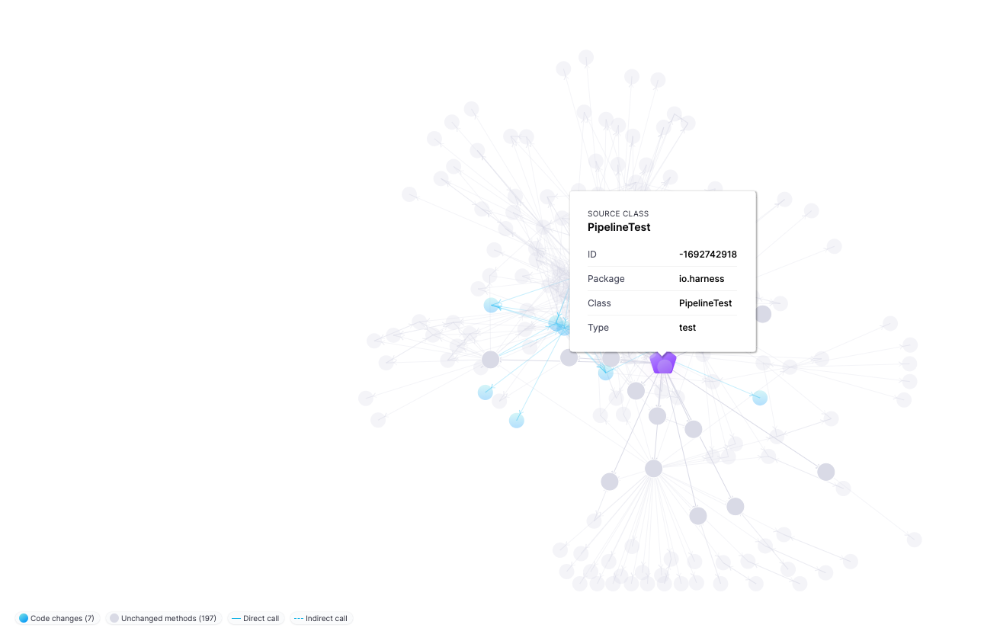
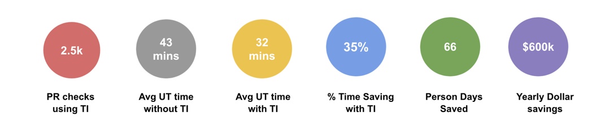

This topic describes Harness Test Intelligence (TI). TI dramatically improves test times by running only the tests required to confirm the quality of the code changes that triggered the CI Pipeline. 

Test Intelligence is supported for Java and .NET Core codebases only at this time.

### Before You Begin

Before learning about Test Intelligence, you should understand the following:

* [Harness Key Concepts](../../getting-started/learn-harness-key-concepts.md)
* [Run a script in CI Stage](../use-ci/run-ci-scripts/run-a-script-in-a-ci-stage.md)

### Visual Summary

The following video walks you through setting up Test Intelligence in the Harness CIE stage. The TI section starts after 11 min. mark in the video.

<!-- Video:
https://harness-1.wistia.com/medias/rpv5vwzpxz-->
<docvideo src="https://www.youtube.com/embed/eAtIO4bJ3No" />

<!-- div class="hd--embed" data-provider="YouTube" data-thumbnail="https://i.ytimg.com/vi/kZmOCLCpvmk/hqdefault.jpg"><iframe width=" 480" height="270" src="https://www.youtube.com/embed/eAtIO4bJ3No" frameborder="0" allowfullscreen="allowfullscreen"></iframe>

### Overview

Testing is an important part of Continuous Integration (CI). Testing safeguards the quality of your product before shipping. But testing can also take a lot of time because a test cycle involves multiple tests. Often, the tests run are irrelevant to the code changes that triggered the build.

Harness TI helps your test cycle move faster without compromising on quality. 

At runtime, TI selects only those tests you need to run. Instead of running all your tests, TI selects a subset of tests and skips the rest. 

You'll have full visibility on which tests were selected and why. TI doesn’t require you to update your source code or build and test process.

### How Does Test Intelligence Work?

Test Intelligence (TI) does the following:

* Prioritizes and runs only important tests. Running all unit tests every time the code changes is expensive and time-consuming.
* Identifies negative trends and provides actionable insights to improve quality.

### What Does Test Intelligence Do?

Test Intelligence builds software faster than a full build-and-test run by doing the following:

Test Selection: TI runs only the tests required to confirm the quality of the code changes that triggered the build. TI also includes any newly added or modified tests.

To ensure full accuracy, TI uses the call graph of the instrumented source code. 

### What are the Test Intelligence Components?

#### Test Intelligence Service

Test Intelligence (TI) runs as a service, agnostic to the CI solution. 

A TI service manages the data about repositories, git-commit graphs, test results, and call graphs. 

During the selection phase, a TI service uses the list of added/modified files with the call graph to identify which tests to run.

The TI service can also receive real-time webhook notifications from Git for any commit or merge. The TI service pulls the git commit-graph and other metadata from Git for test selection and ordering. When the TI test runner agent sends a call graph generated from a PR, the TI service keeps that data in a staging area in case the PR doesn’t get merged to the master. Once the TI receives the merge notification from Git, it updates and inserts the partial call graph with the master call graph.

#### Test Runner Agent

The Test Runner Agent runs on the build infrastructure. It's responsible for communicating with the TI service. Whenever a test step is about to execute, the Test Runner Agent communicates with the TI service providing the build number, commit-id, and other details. The TI service returns the ordered selected tests to run. The Test Runner Agent runs the tests with the instrumentation ON. After all the test completion, the agent parses the test results and uploads the results along with the newly generated call graph.

#### TI and the Test Step Packaging

The Test Step is similar to the Run Step, but it accepts additional information such as the programming language of the source code being tested, build tools, and other parameters. 

TI identifies the programming language and uses the Test step to run the selected tests in the Test step container. The Test step parses test results and returns the results to the TI service.

### How Does TI Sync with Tests?

TI is always up to date and syncs when you merge the code to the main branch.

When you perform a pull request, TI determines which tests should be run based on the following metrics:

* Changed Code: TI queries Git to learn exactly which code has changed in a specific build. TI uses this data to select all the tests that are associated directly, or indirectly, with the source code changes. TI selects these tests as part of the subset of the tests run in the Pipeline. Lastly, TI skips tests that aren't needed because there was no relevant code change.
* Changed Tests: When a specific test change is identified, TI chooses it even if the code it covers hasn't changed.
* New Tests: As soon as Harness identifies a new test, it's automatically selected. This ensures that the test is running successfully and also finds correlations between the test and new/existing code.

After each test cycle, you have full visibility into which tests were selected by TI and why. You can also see the visualization graph on your Pipeline Tests page.

### Viewing Tests Selected by TI

Here's an example of a specific PR. You can see the number of Selected Tests and Time Saved.  On the right, you can see a breakdown of the selection. 

We also provide full visualization of the test graph. It shows the reason behind every test selection. Click on any test (the purple node), and you can see all the classes and methods covered by this test. These are the changed classes and methods (denoted by the blue nodes), which led to the selection of that test.

### What Can You Achieve With Test Intelligence?

Here’s a summary of what we achieved running Test Intelligence on our biggest repository, Harness-Core.

Here’s how Harness Test Intelligence performed with some popular open-source repositories:

|  |  |  |
| --- | --- | --- |
| **Project Name** | **Avg Test Execution Time without TI** | **Avg Test Execution time****with TI** |
| Harness-Core | 43 mins | 32 mins |
| Incubator Pinot | 338 mins | 228 mins |
| Hudi | 58 mins | 43 mins |
| RocketMQ | 4.6 mins | 3.1 mins |
| Spring Cloud Alibaba | 0.744 mins | 0.59 mins |
| Incubator Shenyu | 1.16 min | 0.4 min |
| Sentinel | 1.90 min | 1 min |

### Try It Yourself

Interested in trying Test Intelligence yourself? Wait no more! It's available as part of the Harness CI free trial — [Sign up](https://harness.io/pricing/) and give it a spin! 

### See Also

[Set up Test Intelligence](../use-ci/set-up-test-intelligence/set-up-test-intelligence.md)

